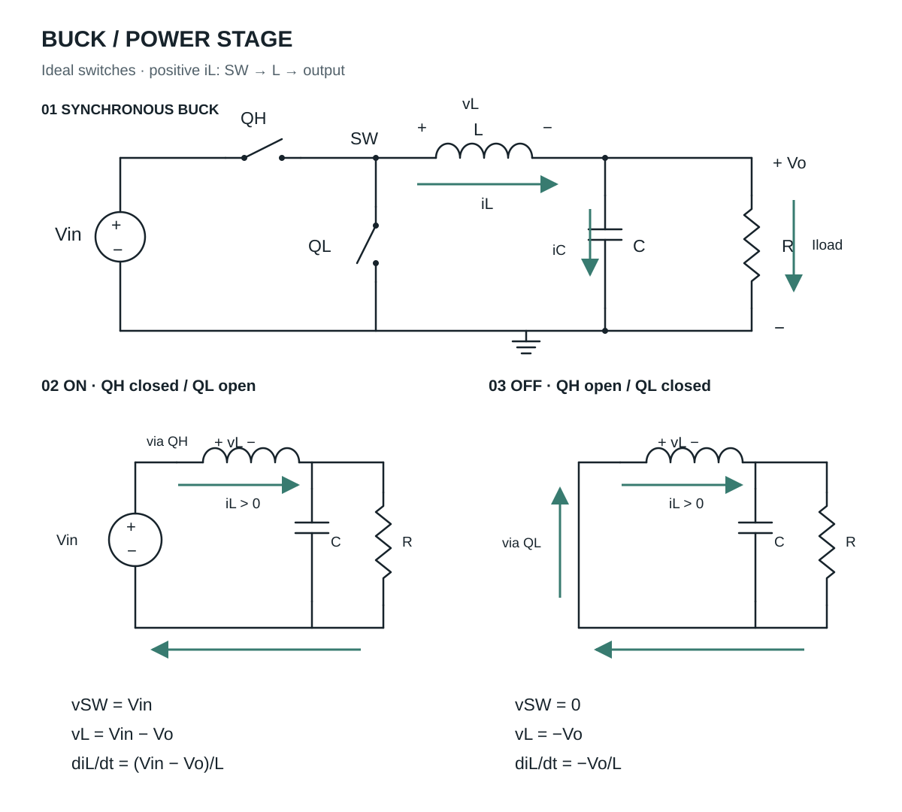
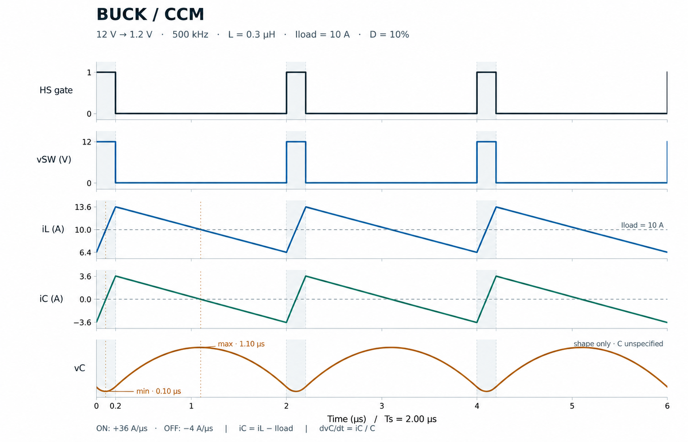
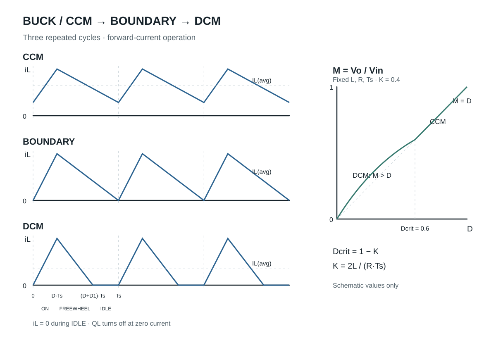
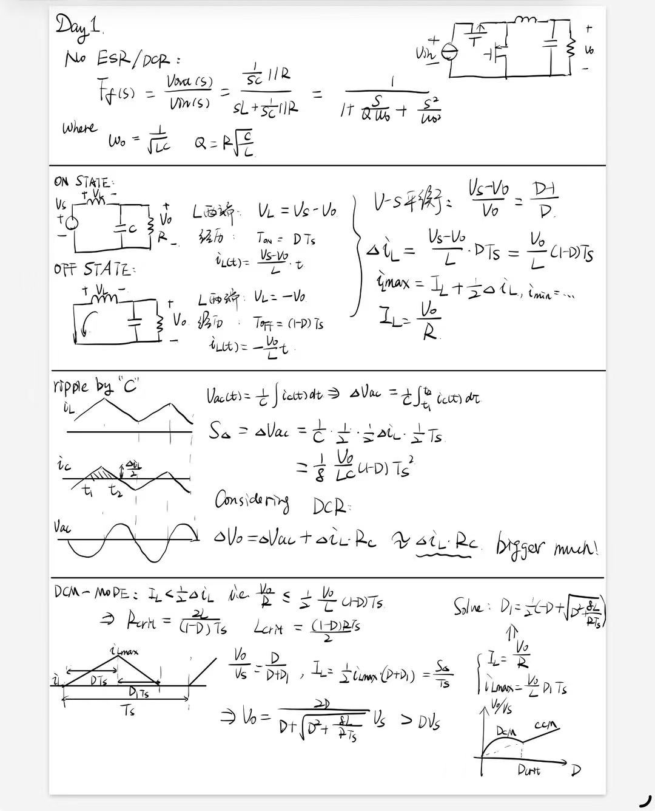

**10/8 · 第 1 / 21 个学习日。** 今天只整理功率级基础：读电路 → 写两状态 → 求电流 → 看纹波。保留手写笔记中的 LC 与 DCM 补充，不展开控制策略，不做仿真。

[返回学习地图](/zh/learn/#power) · [全部个人笔记](/zh/notes/)

## 1. 符号与方向

| 符号 | 含义 | 单位 / 约定 |
| --- | --- | --- |
| $V_{in}$（原稿 $V_s$）、$V_o$ | 输入电压、输出电压的直流值 | V；$0<V_o<V_{in}$ |
| $v_{SW}(t)$ | 开关节点对地电压 | V；SW 位于上下管与电感的交点 |
| $Q_H$、$Q_L$ | 上管、同步下管 | 理想开关，不能同时导通 |
| $L$、$C$、$R$ | 输出电感、电容、负载电阻 | H、F、Ω；$R=V_o/I_{load}$ |
| $i_L(t)$ | 瞬时电感电流（小写） | A；正方向从 SW 经 L 流向输出 |
| $I_L$、$I_{load}$ | 电感平均电流、负载电流（大写） | A；稳态 $I_L=I_{load}=V_o/R$ |
| $\Delta i_L$ | 电感电流峰峰值 | A；$I_{L,max}-I_{L,min}$，不是半幅值 |
| $i_C(t)$ | 流入电容正端的电流 | A；$i_C=i_L-I_{load}$，正值充电，负值放电 |
| $v_L(t)$ | 电感左端减右端的电压 | V；$v_L=v_{SW}-v_o(t)\approx v_{SW}-V_o$ |
| $v_C(t)$、$v_{C,ac}(t)$ | 理想电容电压及其交流分量 | V；无 ESR 时 $v_o(t)=v_C(t)$ |
| $f_s$、$T_s$ | 开关频率、周期 | Hz、s；$T_s=1/f_s$ |
| $D$、$D'=1-D$ | 上管导通占空比、其补数 | 无量纲；CCM 中 $T_{on}=DT_s$、$T_{off}=D'T_s$ |
| $D_1$、$D_0$ | DCM 续流、零电流阶段的周期占比 | 无量纲；$D+D_1+D_0=1$；TI 将这两项记为 $D_2,D_3$ |
| $R_C$、$R_L$ | 电容 ESR、电感 DCR | Ω；两者是不同的寄生电阻 |

分段计算采用周期稳态、小输出纹波近似：把一个周期内的 $v_o(t)$ 视作 $V_o$。忽略开关压降、二极管压降、死区及寄生参数，除非专门注明 ESR。

## 2. 电路与两状态表

ON 路径：$V_{in}^{+}\to Q_H\to SW\to L\to$ 输出节点 → 负载 → 地 → 输入负端。电容支路方向由 $i_C$ 的正负决定。

OFF 路径：地 $\to Q_L\to SW\to L\to$ 输出节点 → 负载 → 地。**正向电感电流正在下降，方向没有反转。** 非同步 Buck 用续流二极管替代 $Q_L$，阳极接地、阴极接 SW。

| 开关状态 | $v_{SW}$ | $v_L$（左正右负） | $di_L/dt$ 的符号 | $i_C=i_L-I_{load}$ |
| --- | --- | --- | --- | --- |
| 上管开、下管关 | $V_{in}$ | $V_{in}-V_o$ | 正；$(V_{in}-V_o)/L$ | 从负到正；在 $i_L=I_{load}$ 时过零 |
| 上管关、下管开 | $0$ | $-V_o$ | 负；$-V_o/L$ | 从正到负；在 $i_L=I_{load}$ 时过零 |

电容是否充电看 $i_L-I_{load}$，不能只看上管是否导通。

## 3. CCM：分段电流、平均值与峰谷值

基本关系：

$$
v_L=L\frac{di_L}{dt},\qquad
i_L(t_2)-i_L(t_1)=\frac{1}{L}\int_{t_1}^{t_2}v_L(t)\,dt
$$

有限电压可以阶跃；电感电流不能跳变。恒定电感电压对应恒定电流斜率。

**ON 段**，$0\le t\le DT_s$：

$$
v_L=V_{in}-V_o,\quad T_{on}=DT_s,\quad
i_L(t)=I_{L,min}+\frac{V_{in}-V_o}{L}t
$$

**OFF 段**，令 $\tau=t-DT_s$，$0\le\tau\le(1-D)T_s$：

$$
v_L=-V_o,\quad T_{off}=(1-D)T_s,\quad
i_L(t)=I_{L,max}-\frac{V_o}{L}\tau
$$

原稿的“斜率 × 时间”是该段的电流变化量；求瞬时电流时要加上段首电流。

伏秒平衡与电压变换比：

$$
(V_{in}-V_o)DT_s=V_o(1-D)T_s
$$

$$
\frac{V_{in}-V_o}{V_o}=\frac{D'}{D},\qquad
\frac{V_o}{V_{in}}=D
$$

纹波、平均值、最大 / 最小值：

$$
\Delta i_L=\frac{V_{in}-V_o}{L}DT_s
=\frac{V_o}{L}(1-D)T_s
$$

$$
I_L=\frac{1}{T_s}\int_0^{T_s}i_L(t)\,dt
=I_{load}=\frac{V_o}{R}
$$

$$
I_{L,max}=I_L+\frac{\Delta i_L}{2},\qquad
I_{L,min}=I_L-\frac{\Delta i_L}{2}
$$

本页 CCM 示例要求 $I_{L,min}>0$。以上峰谷值对称式用于完整周期的两段三角波；不能直接套到有零电流平台的 DCM。

## 4. 八格计算表

题设：理想同步 Buck，CCM；$V_{in}=12\,\mathrm V$、$V_o=1.2\,\mathrm V$、$f_s=500\,\mathrm{kHz}=5\times10^5\,\mathrm{Hz}$、$L=0.3\,\mathrm{\mu H}=3\times10^{-7}\,\mathrm H$、$I_{load}=10\,\mathrm A$。

| 待求量 | 公式 | 代入值（带单位） | 结果 |
| --- | --- | --- | --- |
| $D$ | $V_o/V_{in}$ | $1.2\,\mathrm V/12\,\mathrm V$ | $0.10=10\%$（无量纲） |
| $T_s$ | $1/f_s$ | $1/(5\times10^5\,\mathrm{Hz})$ | $2.0\,\mathrm{\mu s}$ |
| $T_{on}$ | $DT_s$ | $0.10\times2.0\,\mathrm{\mu s}$ | $0.20\,\mathrm{\mu s}=200\,\mathrm{ns}$ |
| $T_{off}$ | $(1-D)T_s$ | $0.90\times2.0\,\mathrm{\mu s}$ | $1.80\,\mathrm{\mu s}$ |
| 上升斜率 | $(V_{in}-V_o)/L$ | $(12-1.2)\,\mathrm V/(0.3\,\mathrm{\mu H})$ | $+36\,\mathrm{A/\mu s}=+3.6\times10^7\,\mathrm{A/s}$ |
| 下降斜率 | $-V_o/L$ | $-1.2\,\mathrm V/(0.3\,\mathrm{\mu H})$ | $-4\,\mathrm{A/\mu s}=-4\times10^6\,\mathrm{A/s}$ |
| $\Delta i_L$ 峰峰值 | $m_{on}T_{on}=|m_{off}|T_{off}$ | $36\,\mathrm{A/\mu s}\times0.20\,\mathrm{\mu s}=4\,\mathrm{A/\mu s}\times1.80\,\mathrm{\mu s}$ | $7.2\,\mathrm A_{pp}$；两段一致 |
| $I_{L,min}/I_{L,max}$ | $I_L\mp\Delta i_L/2$ | $10\,\mathrm A\mp7.2\,\mathrm A/2$ | $6.4\,\mathrm A/13.6\,\mathrm A$ |

辅助检查：$R=0.12\,\Omega$；$i_C$ 范围为 $-3.6\sim+3.6\,\mathrm A$；$I_{L,min}>0$，CCM 假设成立。

## 5. 五行波形：看连续三个周期

每个周期从 $t=nT_s$ 开始。局部时间 $\tau=t-nT_s$：

| $\tau$ | 事件 | $i_L$ | $i_C$ | $v_C$ 的变化 |
| --- | --- | --- | --- | --- |
| $0$ | 上管开，电感电流从谷值开始上升 | $6.4\,\mathrm A$ | $-3.6\,\mathrm A$ | 正在下降 |
| $0.10\,\mathrm{\mu s}$ | 上升段经过平均电流 | $10\,\mathrm A$ | $0\,\mathrm A$ | 极小值，随后上升 |
| $0.20\,\mathrm{\mu s}$ | 上管关、下管开 | $13.6\,\mathrm A$ | $+3.6\,\mathrm A$ | 仍在上升，斜率连续 |
| $1.10\,\mathrm{\mu s}$ | 下降段经过平均电流 | $10\,\mathrm A$ | $0\,\mathrm A$ | 极大值，随后下降 |
| $2.00\,\mathrm{\mu s}$ | 下一个周期开始 | $6.4\,\mathrm A$ | $-3.6\,\mathrm A$ | 回到周期起点的电压与斜率 |

$$
i_C=i_L-I_{load},\qquad \frac{dv_C}{dt}=\frac{i_C}{C}
$$

$i_L$、$i_C$ 为分段直线；$v_C$ 为分段抛物线，不能画成三角波或正弦波。题目没有给出 $C$，所以图中只画电容电压形状，不填电压纹波数值。

## 6. 输出纹波：C 与 ESR

理想电容电压的交流分量：

$$
v_{C,ac}(t)=v_{C,ac}(t_0)+\frac{1}{C}\int_{t_0}^{t}i_C(\tau)\,d\tau
$$

令 $t_1$ 为 $i_C$ 由负变正的时刻，$t_2$ 为由正变负的时刻。正电流三角形面积记为 $S_+$（单位 A·s，即电荷 C）：

$$
S_+=\int_{t_1}^{t_2}i_C(t)\,dt
=\frac12\cdot\frac{\Delta i_L}{2}\cdot\frac{T_s}{2}
=\frac{\Delta i_LT_s}{8}
$$

$$
\Delta v_{C,pp}=\frac{S_+}{C}
=\frac{\Delta i_LT_s}{8C}
=\frac{\Delta i_L}{8f_sC}
=\frac{V_o(1-D)T_s^2}{8LC}
$$

加入电容 ESR $R_C$，忽略 ESL：

$$
v_o(t)=v_C(t)+i_C(t)R_C,\qquad
\Delta v_{ESR,pp}=\Delta i_LR_C
$$

$$
\Delta v_{o,pp}\lesssim\Delta v_{C,pp}+\Delta i_LR_C
$$

这是常用的纹波估算上界；两个分量的极值时刻不同，峰峰值通常不能精确相加。只有 ESR 分量远大于电容充放电分量时，才有：

$$
\Delta v_{o,pp}\approx\Delta i_LR_C
$$

**原稿“Considering DCR”一行应为“Considering ESR”。** $\Delta i_LR_C$ 来自电容 ESR。电感 DCR $R_L$ 产生电压损耗，简化稳态关系为 $V_o\approx DV_{in}-I_LR_L$，不能替代这里的 $R_C$。

## 7. CCM / 临界 / DCM

本节 DCM 适用于非同步 Buck，或具有零电流关断 / 二极管仿真功能的同步 Buck。强制互补导通的理想同步 Buck 可以流过负电流，不会自动形成零电流平台。

临界点用 CCM 纹波计算：

$$
I_{L,crit}=\frac{\Delta i_{L,CCM}}{2}
=\frac{V_o(1-D)T_s}{2L}
$$

| 模式（正向供电） | 条件 | 波形 |
| --- | --- | --- |
| CCM | $I_L>\Delta i_{L,CCM}/2$ | 谷值大于零 |
| 临界 | $I_L=\Delta i_{L,CCM}/2$ | 谷值等于零，无零电流平台 |
| DCM | 负载低于临界值且禁止反向电流 | 谷值为零，有零电流平台 |

由 $V_o/R=V_o(1-D)T_s/(2L)$：

$$
R_{crit}=\frac{2L}{(1-D)T_s},\qquad
L_{crit}=\frac{(1-D)RT_s}{2}
$$

固定 $D,L,T_s$：$R>R_{crit}$ 为 DCM；固定 $D,R,T_s$：$L<L_{crit}$ 为 DCM。原稿 $2L/[(1-D)T_s]$ 的单位是 Ω，应记为 $R_{crit}$。

### DCM 的三段求解

令 $M=V_o/V_{in}$、$K=2L/(RT_s)$；$M,K$ 均无量纲。DCM 的 $D_1$ **不等于** $1-D$。

| 阶段 | 时长 | $v_L$ | $i_L$ |
| --- | --- | --- | --- |
| 上管导通 | $DT_s$ | $V_{in}-V_o$ | 从 0 上升至 $I_{L,max}$ |
| 续流 | $D_1T_s$ | $-V_o$ | 从 $I_{L,max}$ 下降至 0 |
| 零电流 | $D_0T_s=(1-D-D_1)T_s$ | 理想静止状态为 0 | 保持 0；电容供给负载 |

零电流段两管关断，理想情况下 $v_{SW}=V_o$；实际节点可能振铃，本页不展开。

$$
I_{L,max}=\frac{V_{in}-V_o}{L}DT_s
=\frac{V_o}{L}D_1T_s,\qquad I_{L,min}=0
$$

$$
(V_{in}-V_o)D=V_oD_1
\quad\Rightarrow\quad M=\frac{D}{D+D_1}
$$

对一个完整周期取三角形面积 $S_L$：

$$
I_L=I_{load}=\frac{V_o}{R}
=\frac{S_L}{T_s}
=\frac12I_{L,max}(D+D_1)
$$

联立后：

$$
D_1(D+D_1)=\frac{2L}{RT_s}=K
$$

$$
D_1=\frac{-D+\sqrt{D^2+\frac{8L}{RT_s}}}{2}
$$

$$
V_o=\frac{2D}{D+\sqrt{D^2+\frac{8L}{RT_s}}}V_{in}
$$

DCM 要求 $D+D_1<1$。此时 $M>D$，且变换比还取决于 $L,R,T_s$；不能继续用 $V_o=DV_{in}$。在固定 $K$ 的占空比扫描中，临界占空比为 $D_{crit}=1-K$（仅在 $0<K<1$ 时位于 $0<D<1$ 内）。

## 8. 手写补充：无 ESR / DCR 的 LC 滤波器

这行保留自手写笔记，今天只认清它表示哪个网络，不展开环路分析。

$$
Z_p=\frac{1}{sC}\parallel R
$$

$$
F(s)=\frac{V_o(s)}{V_{SW}(s)}
=\frac{Z_p}{sL+Z_p}
=\frac{1}{1+\frac{sL}{R}+s^2LC}
=\frac{1}{1+\frac{s}{Q\omega_0}+\frac{s^2}{\omega_0^2}}
$$

$$
\omega_0=\frac{1}{\sqrt{LC}},\qquad
f_0=\frac{\omega_0}{2\pi},\qquad
Q=R\sqrt{\frac{C}{L}}
$$

| 量 | 含义 |
| --- | --- |
| $s$ | 拉普拉斯复频率，单位 $\mathrm{s^{-1}}$ |
| $Z_p$ | 电容阻抗与负载电阻的并联等效，单位 Ω |
| $\omega_0$、$f_0$ | LC 固有角频率（rad/s）、频率（Hz） |
| $Q$ | 品质因数，无量纲 |
| $V_{SW}(s)$、$V_o(s)$ | LC 网络输入与输出的拉普拉斯变换 |

**这里输入是 SW，不是输入电源端 $V_{in}$。** 原稿的分压式是 LC 滤波网络的传递函数；开关 Buck 的电源到输出关系还包含占空比与工作模式。

## 9. 今日小测（不附答案）

1. 对理想 Buck，写出占空比与输入、输出电压的关系，并列出成立所需的工作模式和理想化条件。
2. 电感两端突然施加恒定正电压后，电感电流和电感电压中哪一个可以立即变化？说明原因，写出基本关系。
3. 对理想同步 Buck，分别描述上管、下管导通时的电流路径，以及 SW 电压、电感电压和电流变化方向。
4. 理想同步 Buck，CCM：$V_{in}=9\,\mathrm V$、$V_o=1.5\,\mathrm V$、$f_s=600\,\mathrm{kHz}$、$L=0.5\,\mathrm{\mu H}$、$I_{load}=5\,\mathrm A$。计算 $D$、$T_{on}$、$\Delta i_L$、$I_{L,max}/I_{L,min}$；有量纲的结果带单位。

第 1、2 题用于学前闭卷；第 3、4 题用于学后检查。按 1—4 编号写，标“独立 / 猜测 / 不会”，圈出最弱的一题。上面的 12 V 计算表是练习对照，不是第 4 题答案。

## 10. 三句复盘

- 今天纠正的一句话：〔填写〕
- 我能从〔开关状态〕推出〔电流斜率〕。
- 明早需要重算的一格：〔填写〕

最后圈一个具体问题，注明本页图号、公式或节点。不代填尚未记录的个人掌握情况。

学习安排：08:30–08:50 闭卷诊断；09:00–10:10 读图与两状态表（休息 10 分钟）；14:00–15:20 计算与波形（休息 10 分钟）；20:30–20:40 复盘。共 3 小时，已含 20 分钟休息。卡住超过 10 分钟，就保留两状态表、两条带单位的斜率与 $i_L$ 三角波，不延时。

## 11. 原稿与参考

- [TI SLVA057 · Understanding Buck Power Stages in Switchmode Power Supplies](https://www.ti.com/lit/an/slva057/slva057.pdf)：两状态与 CCM 参见 §2.1、Fig.2–3（文内第 4–5 页 / PDF 第 8–9 页）；同步电路参见 §4.1、Fig.15（文内第 20 页 / PDF 第 24 页）；DCM 补充参见 §2.2–2.3、Fig.4–6。
- [TI SLVA630A · Output Ripple Voltage for Buck Switching Regulator](https://www.ti.com/lit/an/slva630a/slva630a.pdf)：参考其电容 / ESR 纹波分量与波形排法。

图 1、3 为重新绘制的教学示意；图 2 为图像生成工具绘制并按解析关系核对的波形，不代表仿真或测量。波形采用理想器件与小纹波近似。
