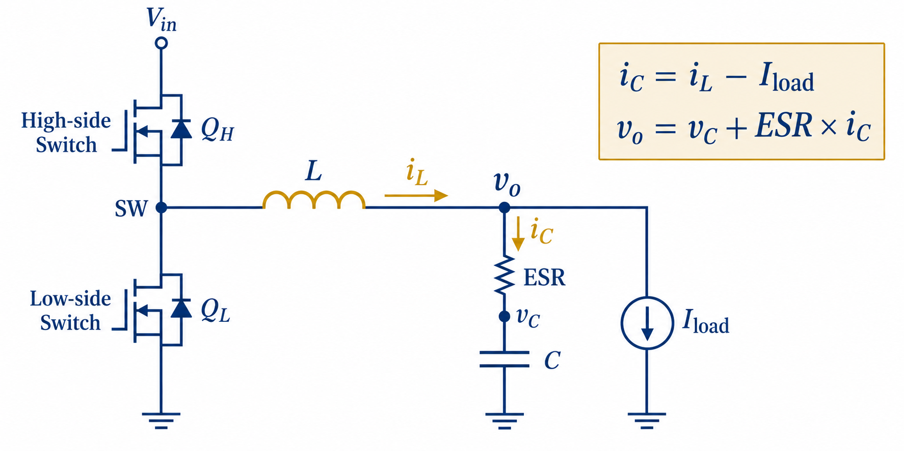
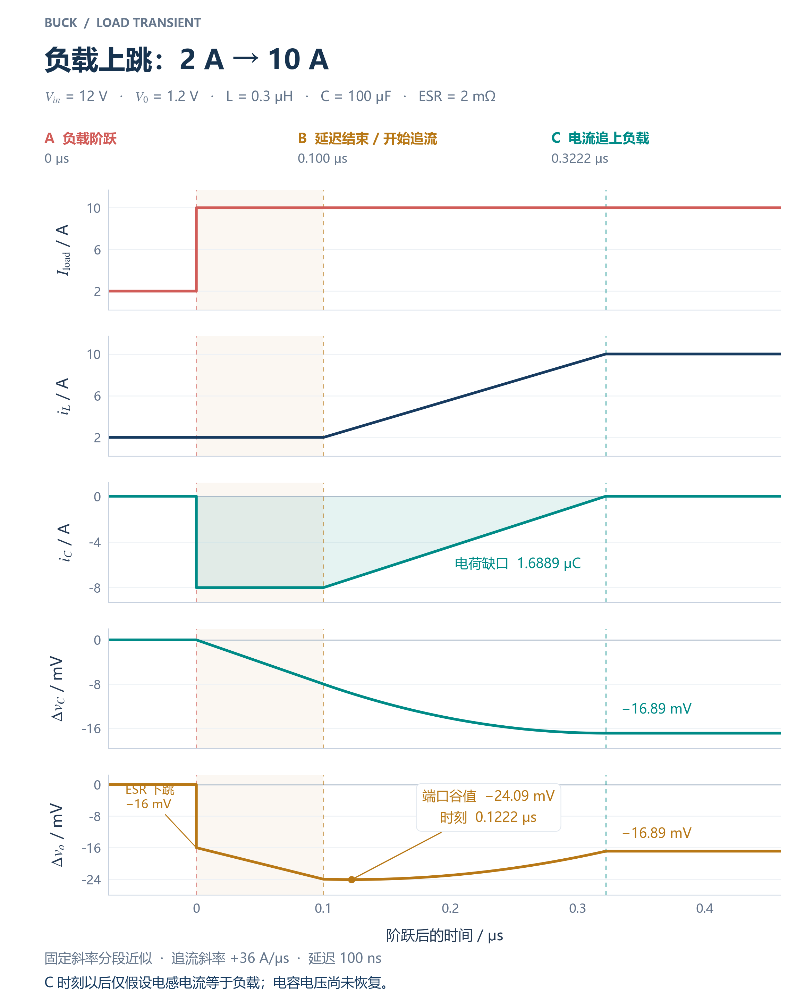
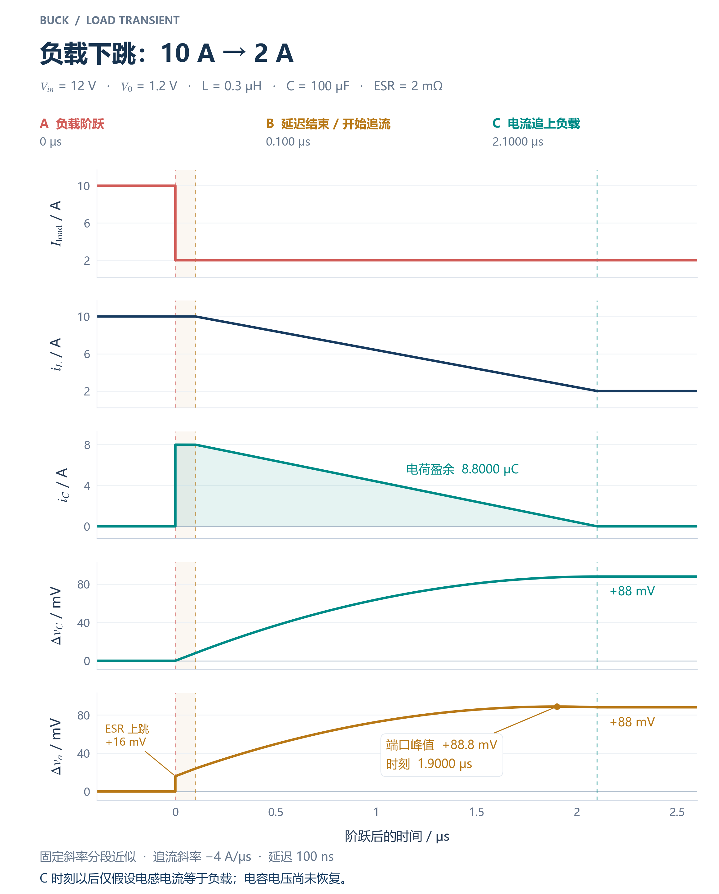
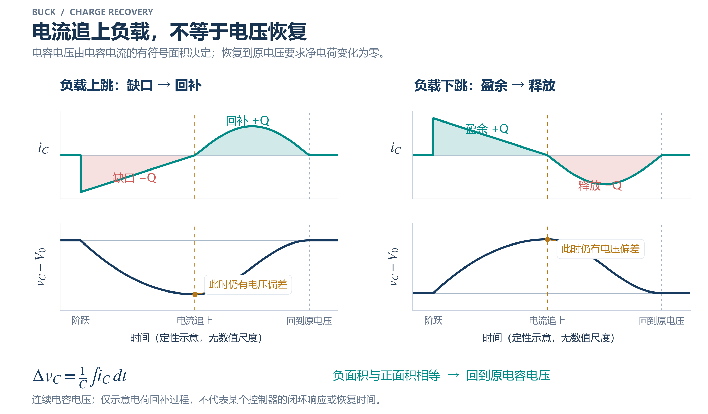
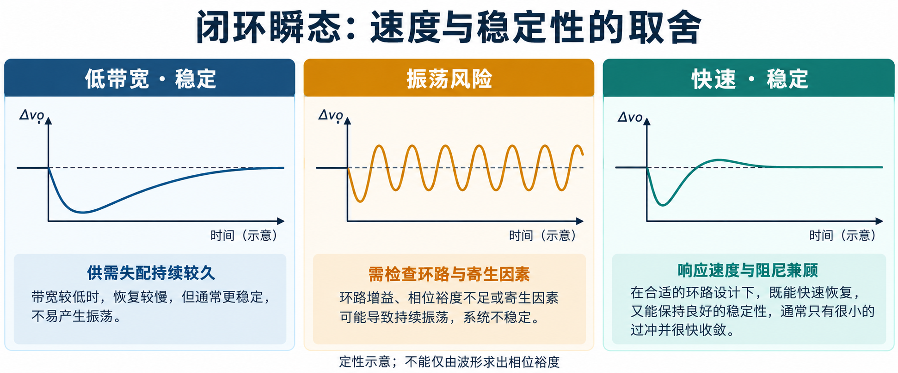

负载变化时，电感电流来不及立即跟随，电容先承担电流差。**ESR 决定端口的初始跳变，电容电流积分决定理想电容电压的后续变化，控制器则决定怎样追流与回补电荷。**

[学习地图：负载阶跃与大电流瞬态](/zh/learn/#buck-load-transients) · [全部个人笔记](/zh/notes/)

| 问题 | 关键结论 | 对应章节 |
| --- | --- | --- |
| 为什么输出电压可以跳变？ | 理想电容电压连续，串联 ESR 压降可随支路电流改变 | §1–4 |
| 2 A → 10 A 的初始变化是多少？ | $i_C=-8\,\mathrm A$，端口下降 16 mV，电容初始斜率为 −80 mV/µs | §6 |
| 电流追上负载是否恢复？ | 只表示电流差为零，已有电荷缺口仍需要回补 | §6.7 |
| 卸载是否和加载对称？ | 低输出电压限制减流斜率，本例理想减流约 2 µs，增流约 0.222 µs | §5–6 |
| 端口极值是否在电流相等时？ | 非零 ESR 下通常不是；要同时考虑电容电压和 ESR 压降 | §6.6 |

**模型范围：** 单相理想同步 Buck，电容 C 与 ESR 串联的集中参数模型，负载默认独立电流源；算例先忽略开关纹波，并明确采用恒流延迟与固定电感斜率近似。配图中的定量曲线对应这一分段计算，闭环图仅说明可能的形态。实际 PWM 时序、限流、寄生参数与补偿网络未给定，不能由这些算例推出器件真实的恢复时间。

**算例参数：** $V_{in}=12\,\mathrm V$、初始输出 $V_0=1.2\,\mathrm V$、$L=0.3\,\mathrm{\mu H}$、$C=100\,\mathrm{\mu F}$、$R_{ESR}=2\,\mathrm{m\Omega}$、恒流延迟 $t_d=100\,\mathrm{ns}$；分别考察 $2\to10\,\mathrm A$ 加载与 $10\to2\,\mathrm A$ 卸载。两种阶跃均从各自的平均稳态开始。

## 1. 先固定电路、电流参考方向与模型

### 1.1 同步 Buck 的功率级

电容支路采用 `ESR` 与**理想电容 C 串联**，整条支路与负载并联。所有电流都采用以下方向：

- `iL > 0`：流出电感、进入输出节点；
- `Iload > 0`：输出节点流向负载；
- `iC > 0`：输出节点流入电容支路（给理想电容充电）；
- `vC`：理想电容两端电压，上端为正；
- `Vo`：输出节点对地的**实际端口电压**。一般 `Vo ≠ vC`。

### 1.2 三条基本方程

输出节点 KCL：

$$\boxed{i_C=i_L-I_{load}} \tag{1}$$

理想电容本构关系：

$$
\begin{aligned}
C\frac{dv_C}{dt}&=i_C,\\
\Delta v_C&=\frac{1}{C}\int i_C\,dt
\end{aligned}
\tag{2}
$$

ESR 串联模型：

$$\boxed{V_o=v_C+R_{ESR}i_C} \tag{3}$$

> **易错点**：有些资料把“电容对负载放电的电流”定义为正，便会写出 `iC=Iload−iL`。这不代表物理结果不同，只是参考方向相反。**整篇笔记固定使用式 (1)**。

### 1.3 上、下管状态

理想器件、忽略死区、DCR 和寄生参数：

| 状态 | `VSW` | 电感电压 `vL = VSW − Vo` | `diL/dt` | 对正向电感电流的影响 |
|---|---:|---|---|---|
| 上管 QH 导通、下管 QL 关断 | `Vin` | `Vin−Vo` | `(Vin−Vo)/L` | 一般为正，电感电流上升 |
| 上管关断、下管导通 | 约 `0` | `−Vo` | `−Vo/L` | 负斜率，电感电流下降 |

对于非同步 Buck，关断状态由续流二极管承担，其压降改变下坡斜率；对于同步 Buck，下管 MOS 可以导通反向电流，因此轻负载时要区分允许反向电流的强制 PWM 与禁止反向电流的二极管仿真/省电模式。

**稳态 CCM**：每周期正向上升量与下降量的**绝对值**相等，即 `ΔiL,on + ΔiL,off = 0`（带符号），等价于电感伏秒平衡。若总和正，平均电感电流逐周期增加；若总和负，则逐周期减少。**瞬态时不要求单周期伏秒平衡。**

---

## 2. 时间尺度：不要把四个阶段混为一谈

假设时刻 `t0` 出现理想阶跃负载：

1. **`t0−`**：阶跃之前的稳态，采用开关周期平均值 `iL≈Iload`，因此 `iC≈0`；有开关纹波时瞬时 `iC` 一般不为零。
2. **`t0+`**：负载理想瞬跳，有限电感电压下 `iL` **不能跳变**，负载电流差立刻交给电容分担；若电容支路电流理想跳变，ESR 上压降也立刻跳变。
3. **控制延迟 / 电流建立**：电感电流按照 `vL/L` 的有限斜率变化；即使控制器马上发令，栅极驱动、定时器、最小 on/off 时间及电感斜率也有约束。
4. **恢复与稳定**：在某段时间 `iL−Iload` 必须反向并产生补偿电荷，`vC` 才能回到原值；电流“追上负载”通常**早于**端口电压“完全恢复”。

### 连续性定律与范围

- 只要电感两端电压有限，`iL(t0+)=iL(t0−)`；电感电流**斜率**可以立刻变化。
- 只要电容电流有限且不含数学冲激，`vC(t0+)=vC(t0−)`。
- 只要允许**理想负载电流阶跃**且电容 ESR 为非零纯电阻，`Vo` 可以跳变；跳变量满足 `ΔVo(t0)=RESR·ΔiC`。
- 如果考虑 ESL、封装与走线寄生电感，电流的极高速变化及端口瞬态要用更高阶网络分析，不能把零时间跳变当成无限带宽的真实测量。数学中的“瞬跳”是简化模型极限。

---

### 2.1 “控制器尚未响应”不等于“电感电流恒定”

对 CCM 的平均模型，忽略损耗时：

$$
\begin{aligned}
L\frac{di_L}{dt}&=d(t)V_{in}-v_o(t),\\
C\frac{dv_C}{dt}&=i_L-I_{load},\\
v_o&=v_C+R_{ESR}(i_L-I_{load})
\end{aligned}
$$

$d(t)$ 是平均占空比。延迟内保持原占空比 $d_0=V_{ref}/V_{in}$，输出下降仍会使 $di_L/dt=(V_{ref}-v_o)/L>0$；因此“延迟内 $i_L$ 不变”是额外的短时间近似，而非电感定律。开关模型中电感还会继续原来的上下坡，不能因控制器等待就把每一段电流画平。

本例阶跃后最初的 ESR 下跳约 16 mV；在固定占空比的平均模型中，对应的初始电流变化率约为 $\frac{0.016\,\mathrm V}{0.3\,\mathrm{\mu H}}=0.0533\,\mathrm{A/\mu s}$，远小于后续上管持续导通的 $36\,\mathrm{A/\mu s}$。这解释了为何可以把 100 ns 延迟暂近似成平电流，同时也明确了它并非严格解。

**两种时间模型必须分开使用。** 平均模型用于电流包络和电荷预算；上、下管持续导通时用相应开关状态估算斜率极限。100 ns、222 ns 这样的数值没有指定开关频率与事件相位，不能当作真实逐周期门极时序。例如，另取 $f_s=500\,\mathrm{kHz}$，则 $T_s=2\,\mathrm{\mu s}$，这些时间短于一个周期，更应检查阶跃落在哪一开关状态、最小导通 / 关断时间及异步触发能力。

工作模式也要检查。对 $V_{in}=12\,\mathrm V$、$V_o=1.2\,\mathrm V$、$L=0.3\,\mathrm{\mu H}$ 的理想两状态稳态，$D=V_o/V_{in}=0.1$；若取 500 kHz，则纹波为 $\Delta i_{L,pp}=(V_{in}-V_o)D/(Lf_s)=7.2\,\mathrm A$，2 A 平均电流对应的谷值约为 $-1.6\,\mathrm A$。允许负电流的强制 PWM 可以维持两状态运行；禁止反向电流的二极管仿真模式则会进入 DCM，不能继续无条件使用 CCM 平均方程。本例先指定平均电流包络，用于隔离阶跃初始物理，并未证明某个真实轻载工作点处于正电流 CCM。

有开关纹波时，应直接使用 $i_L(t_0^-)$。对于理想电流负载：

$$
\begin{aligned}
i_C(t_0^+)&=i_C(t_0^-)-\Delta I_{load},\\
\Delta v_o(t_0)&=-R_{ESR}\Delta I_{load}
\end{aligned}
$$

第二式仍成立，但 $i_C(t_0^+)=-\Delta I_{load}$ 只有在阶跃前电容电流取零的平均稳态下成立。阶跃发生在纹波峰值、谷值或不同开关相位，会改变后续电荷缺口。

---

## 3. 负载阶跃瞬间：正负号的一次推导

### 3.1 负载上跳 `I1 → I2`，令 `ΔI = I2−I1 > 0`

在 `t0−` 之前 `iL=I1` 且 `iC=0`（平均模型），故

$$i_C(t_0^+)=I_1-I_2=-\Delta I<0.$$

这表明**电容给负载供电**。因此：

$$\boxed{\Delta V_o\big|_{ESR,t_0}= -R_{ESR}\Delta I} \tag{4}$$
$$\boxed{\left.\frac{dv_C}{dt}\right|_{t_0^+}=-\frac{\Delta I}{C}} \tag{5}$$

**负载变化时 ESR 压降立即改变，理想电容电压保持连续，但从这一刻开始具有放电斜率**。并非电容本身的理想电压突然下降。

### 3.2 负载下跳 `I2 → I1`

此时 `ΔIload=I1−I2 <0`：

$$i_C(t_0^+)=I_2-I_1>0$$

$$\Delta V_o\big|_{ESR,t_0}=R_{ESR}(I_2-I_1)>0$$

电感仍向输出输送原来较大的电流，多出的部分进入电容：`dvC/dt>0`，所以产生**瞬时上跳 + 后续充电过冲趋势**。电感电流回落之后，仍需安排净放电阶段使 `vC` 恢复。

---

## 4. 三时刻表：上跳与下跳

| 负载上跳 `2→10 A` | `iL` | `Iload` | `iC=iL−Iload` | 理想 `vC` | 端口 `Vo` |
|---|---|---|---|---|---|
| `t0−` | 2 A（平均） | 2 A | 0 A（平均） | 连续，约 1.2 V | 约 1.2 V |
| `t0+` | **仍为 2 A** | **跳到 10 A** | **跳到 −8 A** | **连续，仍约 1.2 V** | **可突变，降 16 mV 至约 1.184 V** |
| 控制动作开始后 | 以有限斜率上升 | 保持 10 A | 从负值向 0 变化，可进一步转正 | 按 `iC/C` 连续改变 | `vC+ESR·iC`，不一定单调 |

| 负载下跳 `10→2 A` | `iL` | `Iload` | `iC` | 理想 `vC` | 端口 `Vo` |
|---|---|---|---|---|---|
| `t0−` | 10 A（平均） | 10 A | 0 A（平均） | 连续 | 近目标值 |
| `t0+` | **仍为 10 A** | **跳到 2 A** | **跳到 +8 A** | **连续** | **可突变，上升 16 mV** |
| 控制动作开始后 | 以有限斜率下降 | 保持 2 A | 从正值向 0 变化，后续可能为负 | 初期持续充电上升 | 初期有过冲趋势 |

**注意**：“控制响应后”不是单一固定时刻，不能凭一张表判断 `iC` 此时已经变为零。以上写的是**方向**，不是预设控制器的完整时序。

---

## 5. 教科书式五行波形：负载上跳与下跳

### 5.1 五行观察顺序

观察五行波形的推荐顺序：`Iload → iL → iC → vC → Vo`。不要一看到 `Vo` 下陷就反向猜测其他曲线，应先写 KCL。

**图 2 · 固定斜率分段近似**：`2→10 A`，三条事件线分别标出负载阶跃、100 ns 延迟结束和电感电流追上负载。阶跃后 100 ns 电感保持 2 A，之后上管一直导通，采用固定斜率 `36 A/µs`。追上负载后**假设保持 iL=10 A**，旨在隔离“电流追上负载”这一时刻，**不表示真实控制器已经稳定，更不表示电容电压已经恢复**。

**图 3 · 固定斜率分段近似**：`10→2 A`，同样假设前 100 ns 电感电流保持不变，随后下管持续导通，电感下降斜率为 `−4 A/µs`，从 10 A 降至 2 A 要 `2 µs`；阶跃后 2.1 µs 电流追上新负载，这一时刻完整显示在图中。上跳和下跳速度**并不对称**：对于 `12 V→1.2 V`，最大理想上坡约 36 A/µs，最小理想下坡约 −4 A/µs（若不允许主动负电压或其他放电通路）。仅靠同步下管续流使大电流快速下降，通常比上升困难得多。

### 5.2 为什么图 2 中端口电压初期不一定只由 `dvC/dt` 决定？

对 ESR 模型求导：

$$\frac{dV_o}{dt}=\frac{i_C}{C}+R_{ESR}\frac{di_C}{dt}.$$

当负载阶跃之后暂时保持恒定，`diC/dt=diL/dt`。**只要电感电流正在快速追上负载，ESR 压降就正在恢复**，所以 `Vo` 的斜率与理想电容 `vC` 的斜率不一定相同。特别地，`iC<0` 时 `vC` 仍在下降，但 `Vo` 可以因 ESR 负压降的减小而先回升。不能断言 `iL=Iload` 时端口电压必然达到最小值。

在理想上坡段，端口电压斜率为：

$$\frac{dV_o}{dt}=\frac{i_L-I_{load}}{C}+R_{ESR}\frac{V_{in}-V_o}{L}.$$

这还能用于估计端口谷值的位置（需注意 `Vo` 自身随时间改变）。

---

## 6. 定量例题：12 V → 1.2 V，2 A → 10 A

### 6.1 题设及假设

`Vin=12 V`、`Vo(t0−)=1.2 V`、`L=0.3 µH`、`C=100 µF`、`ESR=2 mΩ`。负载从 2 A 上跳到 10 A，`iL(t0−)=2 A`（周期平均值）。采用平均模型，**忽略开关纹波**、输出电容 ESL、额外走线电感、电感 DCR、开关损耗；假设检测/控制延迟 `100 ns` 内电感电流不变。延迟结束后假设上管连续导通，`Vo≈1.2 V` 用于估算最大理想电流爬升斜率。这一近似不指定实际 PWM 门极时序；是否可实现相应导通时长，要看控制器和事件相位。

### 6.2 从阶跃时刻逐行计算

**(1) `t0+` 电容电流**

$$i_C(t_0^+)=2-10=\boxed{-8\ \mathrm{A}}.$$

**(2) ESR 瞬时跳变**

$$
\begin{aligned}
\Delta V_{o,ESR}&=R_{ESR}\Delta i_C\\
&=(2\,\mathrm{m\Omega})(-8\,\mathrm A)\\
&=\boxed{-16\,\mathrm{mV}}
\end{aligned}
$$

因此 `Vo(t0+)≈1.184 V`，理想 `vC(t0+)≈1.200 V`。

**(3) 电容电压初始斜率**

$$
\begin{aligned}
\frac{dv_C}{dt}&=\frac{-8\,\mathrm A}{100\,\mathrm{\mu F}}\\
&=-80\,000\,\mathrm{V/s}\\
&=\boxed{-80\,\mathrm{mV/\mu s}}
\end{aligned}
$$

**(4) 100 ns 内的电容电压变化**（`iL=2 A` 不变）

$$\Delta v_C=\frac{(-8\,\mathrm A)(100\,\mathrm{ns})}{100\,\mathrm{\mu F}}=\boxed{-8\,\mathrm{mV}}$$

因此在延迟末端，`vC≈1.192 V`，`Vo≈1.176 V`，后者还包含 `−16 mV` ESR 压降（忽略纹波）。

**(5) 上管连续导通、名义输出电压下的理想爬升估算**

$$\frac{di_L}{dt}\approx\frac{12-1.2}{0.3\times10^{-6}}=\boxed{36\ \mathrm{A/\mu s}}.$$

$$
\begin{aligned}
t_{rise}&\approx\frac{10-2}{36}\ \mathrm{\mu s}\\
&=0.2222\ \mathrm{\mu s}\\
&=\boxed{222.2\ \mathrm{ns}}
\end{aligned}
$$

这是在**瞬态期一直把 10.8 V 施加到电感**、忽略非理想限制时的最快斜率估计；并非额外假设一个稳态占空比 `D=0.1`。实际 PWM 可能无法连续导通这么久。

**(6) 额外电荷缺口与电容电压损失**

上坡阶段 `iC` 从 −8 A 线性回升到 0，所造成的理想电容电压降低：

$$
\begin{aligned}
\Delta v_{C,rise}&\approx-\frac{(8\ \mathrm A)(0.2222\ \mathrm{\mu s})}{2(100\ \mathrm{\mu F})}\\
&=\boxed{-8.89\ \mathrm{mV}}
\end{aligned}
$$

从阶跃至电感刚追上负载的总电容损失：`−8−8.89≈−16.89 mV`，即 `vC≈1.18311 V`。在上述特殊近似下，电感电流追上负载时 `iC≈0`，于是 ESR 压降也消失、`Vo≈1.18311 V`。

**关键校正**：`−16 mV` 的 ESR 初始跳变**不能**与 `−16.89 mV` 的最终电容电压损失简单叠加并作为“端口谷值”。两项的极值通常发生于不同时刻。若要寻找 `Vo` 谷值，须比较随时间变化的 `vC(t)+ESR·iC(t)`；本例取常斜率时，在上管导通期间 `dVo/dt= iC/C + 0.002×36 A/µs`，在刚起坡时为 `−80+72 = −8 mV/µs`，逐渐变正；局部谷值可能发生在上坡过程较早的位置，而非必然在电流追上负载时。（具体位置在 §6.4 计算。）

### 6.3 计算记录表

| 估算项 | 使用假设 | 代入 | 数值 | 性质 |
|---|---|---|---|---|
| `iC(t0+)` | 电感电流连续，平均稳态 | `2−10` | **−8 A** | 理想瞬时跳变 |
| `ΔVo,ESR(t0)` | 纯电阻 ESR，无 ESL | `2mΩ×(−8A)` | **−16 mV** | 理想瞬时跳变 |
| `dvC/dt(t0+)` | 理想电容 | `−8A/100µF` | **−0.08 V/µs** | 连续电压的斜率 |
| `ΔvC(100ns)` | 100 ns 内 `iL` 不变 | `−8A×100ns/100µF` | **−8 mV** | 时间积分 |
| 理想上坡斜率 | 上管 ON，Vo 近似固定 | `(12−1.2)/0.3µH` | **36 A/µs** | 名义输出下的斜率估算 |
| `t_rise` | 上述斜率持续 | `8A/(36A/µs)` | **222.2 ns** | 固定斜率下的追流时间 |

### 6.4 为什么上坡时的端口电压最低点可能提前？

刚结束 100 ns 延迟，`iC≈−8 A`，上坡斜率常值近似下

$$
\begin{aligned}
\frac{dV_o}{dt}&\approx(-80+72)\ \mathrm{mV/\mu s}\\
&=-8\ \mathrm{mV/\mu s}
\end{aligned}
$$

随着 `iL` 上升，第一项 `iC/C` 的负幅值减小，而第二项保持约 `+72 mV/µs`，因此端口电压会转为上升，尽管 `vC` 在 `iC<0` 时仍下降。令 `iC/C + ESR·(diL/dt)=0` 得到 `iC≈−7.2 A`，即 `iL≈2.8 A`；需要 `0.8A/(36A/µs)≈22.2 ns`，因此该分段模型中的局部端口谷值约为**上坡开始后 22 ns**，即阶跃后 **122 ns**。这是将 `Vo` 固定于电感斜率计算所得的局部估算；若纳入真实电路寄生，谷值会改变。

> **必须牢记**：电感电流追上新负载仅意味着 `iC=0` 且 `dvC/dt=0` 的某个瞬时条件。此时 `vC` 可以仍低于目标电压；要恢复到设定值，必须随后有 `iC>0` 的积分区间，补回欠缺电荷。

---

### 6.5 通用分段式：先求电流，再积分电荷

令 $x=t-t_0$，$V_0=v_C(t_0^-)=v_o(t_0^-)$，$t_d$ 为恒流延迟，$A>0$ 为负载变化幅度，$m>0$ 为追流斜率的绝对值；$t_r=A/m$，追流段内 $u=x-t_d$。用 $\sigma=-1$ 表示负载上跳，用 $\sigma=+1$ 表示负载下跳。以下式子要求阶跃之前的平均电容电流为零：

$$
i_C(x)=
\begin{cases}
\sigma A,&0\le x<t_d\\
\sigma(A-mu),&0\le u\le t_r
\end{cases}
$$

将无符号电荷累计量记为 $q(x)\ge0$：

$$
q(x)=
\begin{cases}
Ax,&0\le x<t_d\\
Ax-\tfrac12mu^2,&0\le u\le t_r
\end{cases}
$$

$$v_C(x)-V_0=\frac{\sigma q(x)}{C}$$

$$
v_o(x)-V_0=v_C(x)-V_0+R_{ESR}i_C(x)
$$

两段交界处 $i_L,i_C,v_C,v_o$ 连续，改变的是斜率；只有负载阶跃时的 $i_C$ 与 ESR 压降具有理想跳变。电流追上新负载时，电荷缺口 / 盈余的绝对值为：

$$
\begin{aligned}
Q&=A t_d+\frac{A t_r}{2}\\
&=A t_d+\frac{A^2}{2m},\\
\lvert\Delta v_C\rvert&=Q/C
\end{aligned}
$$

因此即使 $m,t_d,C$ 不变，追流阶段的电容偏差也有 $A^2$ 项，大阶跃不能简单线性外推。

### 6.6 负载下跳的完整计算与端口峰值

负载 $10\to2\,\mathrm A$，其余题设相同。取 $m=V_0/L=4\,\mathrm{A/\mu s}$：

| 事件或计算量 | 结果 | 解释 |
| --- | --- | --- |
| $i_C(t_0^+)$ | $+8\,\mathrm A$ | 多余电感电流进入电容 |
| ESR 初始变化 | $+16\,\mathrm{mV}$ | $v_C$ 此时仍为 $1.2\,\mathrm V$ |
| 初始 $dv_C/dt$ | $+80\,\mathrm{mV/\mu s}$ | 电容充电 |
| 延迟末端 $x=0.1\,\mathrm{\mu s}$ | $v_C=1.208\,\mathrm V$，$v_o=1.224\,\mathrm V$ | 充电增加 8 mV，ESR 仍增加 16 mV |
| 电流下降时间 $t_r$ | $8/4=2\,\mathrm{\mu s}$ | 加上延迟，追上负载在 $x=2.1\,\mathrm{\mu s}$ |
| 追流期间额外电容升高 | $80\,\mathrm{mV}$ | 三角形面积 $8\,\mathrm{\mu C}$ 除以 $100\,\mathrm{\mu F}$ |
| 追上负载时 | $v_C=v_o\approx1.288\,\mathrm V$ | 总盈余电荷 $8.8\,\mathrm{\mu C}$，电压升高 88 mV |

对追流段，在负载已固定时：

$$
\frac{dv_o}{dt}=\frac{i_C}{C}+R_{ESR}\frac{di_L}{dt}
$$

上跳时 $di_L/dt=+m$，端口谷值条件为 $i_C=-C R_{ESR}m$；下跳时 $di_L/dt=-m$，端口峰值条件为 $i_C=+C R_{ESR}m$。两种情况在固定斜率段内的候选位置均为：

$$
u_* = t_r-C R_{ESR}
$$

若 $u_*<0$，极值已经在追流开始时出现，需比较分段边界；若 $0\le u_*\le t_r$，它是段内极值。这里 $C R_{ESR}=0.2\,\mathrm{\mu s}$：

| 情况 | 端口极值时刻（相对负载阶跃） | 电流与电容状态 | 端口偏差 |
| --- | --- | --- | --- |
| $2\to10\,\mathrm A$ | $0.1+(0.2222-0.2)=0.1222\,\mathrm{\mu s}$ | $i_L=2.8\,\mathrm A$，$i_C=-7.2\,\mathrm A$；$\Delta v_C=-9.6889\,\mathrm{mV}$ | $-9.6889-14.4=-24.0889\,\mathrm{mV}$ |
| $10\to2\,\mathrm A$ | $0.1+(2-0.2)=1.9\,\mathrm{\mu s}$ | $i_L=2.8\,\mathrm A$，$i_C=+0.8\,\mathrm A$；$\Delta v_C=+87.2\,\mathrm{mV}$ | $87.2+1.6=+88.8\,\mathrm{mV}$ |

**电容电压的极值看 $i_C=0$；端口电压的极值看 $i_C/C+R_{ESR}di_L/dt=0$。** 不能把 16 mV 的初始 ESR 变化直接加到追流结束时的电容偏差上。

本例下跳峰值相当于目标电压的约 $7.4\%$，已不是很小的偏差。因此 $v_o\approx1.2\,\mathrm V$ 的固定斜率计算仅是一级估算。实际下管导通时 $di_L/dt=-v_o(t)/L$；电压升高会加快减流，精确值须求解耦合状态方程，而不能把 +88.8 mV 当作器件的真实过冲规格。上跳时输出下降也会略增上升斜率，所以 222 ns 是名义输出电压下的斜率极限估计，并非无条件的严格时间下界。

### 6.7 追上电流之后：还需要电荷回补

上跳后若始终保持 $i_L=10\,\mathrm A$，则 $i_C=0$，$v_C$ 只会停在约 $1.18311\,\mathrm V$。要回到 $1.2\,\mathrm V$，之后必须满足：

$$
\int_{t_{catch}}^{t_{recover}}(i_L-I_{load})\,dt
=+1.6889\,\mathrm{\mu C}
$$

下跳同理，需净移走约 $8.8\,\mathrm{\mu C}$。在恒压目标、阶跃前后电容平均电流均为零的条件下，最终恢复要求整个瞬态的电容电流积分为零。是否振铃、何时停止回补、恢复到哪条负载线，取决于控制器与目标定义。

恢复到目标与进入并持续保持在容差带内不是同一个判据。稳定时间要同时给出容差带（例如目标电压的 ±1%）、纹波是否计入、观测区间和负载边沿，不能仅凭 $L,C,ESR$ 得出一个“闭环恢复时间”。

---

## 7. 各类阶跃波形的读法

### 7.1 负载增加（load step-up）

**直接证据**：`Iload↑`，`iL` 初始不变；`iC<0`，`Vo` 受 ESR 立即下跳，`vC` 开始向下。控制器通常增加电感供给、提升占空比或缩短等待时间，但各控制器具体策略不同。

### 7.2 负载减少（load step-down）

`Iload↓`，`iL` 初始不变；`iC>0`，`Vo` 受 ESR 上跳，`vC` 上升。若只能依赖下管导通时 `−Vo/L` 的电感下降斜率，其减流速度受小输出电压制约。强制 PWM 可以允许电流过零变负，从而帮助输出电容放电；二极管仿真模式可能不允许反向电流，轻载的过压消除更依赖真实负载和泄放路径。

### 7.3 小阶跃、大阶跃与参数边界

在 `ΔI` 增大而 `C/ESR` 不变时，**初始** ESR 跳变 `∝ΔI`，**初始**电容斜率 `∝ΔI`。但**实际**最大下冲或恢复时间不必与 `ΔI` 成线性关系，因为大阶跃可能进入占空比饱和、逐周期限流、电感饱和和控制器非线性状态。在大电流 Buck 中需要分别检查 `I_L,peak`、磁芯饱和电流、器件电流与电容纹波电流能力。

### 7.4 不同环路带宽与阻尼

**图 5 · 闭环响应的定性示意**：三条曲线没有给出绝对电压和时间，分别说明慢而稳定、存在振荡风险、快速且稳定的响应形态。AN149 Fig.3 给出了这三类响应的具体实例：

| 情况 | 典型时域特征 | 能推断什么？ | 不能推断什么？ |
|---|---|---|---|
| 低带宽、稳定/过度补偿 | 下冲较大、恢复慢 | 能量供需不平衡持续较久 | 不能由单次下冲量精确求相位裕度 |
| 较高带宽但稳定裕度不足 | 电压或电流振铃，可能出现持续异常 | 需检查闭环稳定性和其他噪声来源 | 不能一见振铃就断言补偿不稳定 |
| 快速且足够稳定 | 下冲和建立时间有所控制，振铃受限 | 调速与阻尼取得折中 | 不是“带宽越大越好” |

AN149 同时指出：振荡还可能由 PCB 寄生、检测噪声、布局、采样与模式切换引起；因此**波形不能单独证明哪颗补偿电容有问题**。

### 7.5 峰值电流模式、谷值电流模式、COT/AOT

- **峰值电流模式（Peak current mode）**：某些固定频率架构必须等到下一次时钟，负载上跳若恰好发生在上管刚关断之后会遇到等待时间；AN149 第 11 页明确描述这类时序约束。
- **谷值电流模式（Valley current mode）**：在下管导通期间，谷值比较器有机会提前触发下一次上管动作；AN149 以此解释其较快的某类 load step-up 响应。
- **COT / AOT**：负载导致的比较器触发、纹波注入、最小关断时间、谷值限制等会决定等待时间。若未指定控制逻辑及门极时序，不能笼统宣称“COT 一定比 PWM 更快”。时域分析先以电荷守恒为基础，精确闭环计算还需要控制器模型。

---

## 8. 输入、电阻与工作模式扰动的区别

### 8.1 输入电压阶跃

输入扰动图的顶部给出 `Vs:16 V →8 V →16 V`，图中依次是 `Vo(t)`、`iL(t)`、`Vcon 与 Vramp`、驱动 `vq(t)`。此时是**线电压阶跃（line transient）**：

- 当 `Vin` 从 16 V 跌到 8 V，**上管导通段的电感上升斜率** `(Vin−Vo)/L` 减小，控制器需更长 on-time 或更大占空比才能维持平均供电。
- 当 `Vin` 恢复为 16 V，同样 `ton` 会对应更大的电感上升量，控制策略要反向调整。
- 输入阶跃不会自动满足“负载电流瞬间跳变→电容 ESR 同步跳变”的同一初始条件；不要把书中 `Vo` 瞬态跌落全当成 `−ESR·ΔIload`。
- 图中 `Vcon` 与锯齿 ramp 的关系用于理解调制过程，但没有给完整电路和环路参数，就不能从局部波形精确计算响应时间。

### 8.2 负载电阻 `1 Ω→2 Ω→1 Ω`

按照图中 `Vo≈4 V` 的工作点，负载电流约 `4A→2A→4A`。**负载电阻增加意味着电流减小**，首先是**load step-down**，预期 `Vo` 上冲；随后负载电阻恢复较小，电流增加，预期 `Vo` 下冲。两次扰动分别约在 `0.6 ms` 和 `1.6 ms`，输出曲线的趋势与这个判断一致。`iL` 的均值随后下降、再上升；底部开关驱动与比较器波形帮助观察控制器如何改变供能。

严格地讲，电阻突变意味着 `Iload=Vo/R`，所以负载电流大小也受到即时变化的 `Vo` 影响；上述电流值是以近似恒定输出电压推算的**一阶估计**。若 ESR 与 `R` 不可忽略，可在 `t0+` 联立 KCL 解出初始端口跳变量。

### 8.3 负载电阻 `1 Ω→8 Ω→1 Ω`，工作模式变化

图中的 8 Ω 表示电流由约 4 A 降为约 0.5 A 的**轻载大幅阶跃**，再升回约 4 A。图注是“工作模式变化响应”，而非普通负载阶跃。这种轻载变化可能引起电感电流断续、零电流钳位、跳脉冲、PFM 或其他策略，必须根据完整上下文确认究竟使用哪一种控制模式；只凭局部波形**不能确定具体模式实现**。

---

### 8.4 电阻阶跃的精确初始条件

若负载由 $R_1$ 改为 $R_2$，而非独立电流源阶跃，在 $t_0^+$ 联立 $i_L=v_o/R_2+i_C$ 和 $v_o=v_C+R_{ESR}i_C$，得到：

$$
v_o(t_0^+)=\frac{v_C(t_0^-)+R_{ESR}i_L(t_0^-)}{1+R_{ESR}/R_2}
$$

若前态为平均稳态 $v_C=V_0$、$i_L=V_0/R_1$：

$$
\Delta v_o(t_0)=
\frac{R_{ESR}V_0(1/R_1-1/R_2)}{1+R_{ESR}/R_2}
$$

$R_2>R_1$ 时为正，即卸载上跳；$R_2<R_1$ 时为负，即加载下跳。只有 $R_{ESR}\ll R_2$ 时，才可忽略分母修正，把它近似写成 $-R_{ESR}\Delta I_{load}$，其中电流变化按原电压 $V_0$ 估计。随后的电阻负载电流还会跟着 $v_o(t)/R_2$ 改变，不能一直画成理想水平线。

原图 3.27、3.29、3.30 提供了输入扰动、电阻阶跃和轻载模式变化的不同案例。上述读图仅保留已知的扰动与定性方向；局部书页不能确定完整控制参数、具体轻载实现或精确建立时间。

---

## 9. 大电流瞬态的设计判断

### 9.1 用电荷预算理解需要多少 C

当控制器迟滞 `td`，且输出电容承担约恒定 `ΔI`：

$$|\Delta v_C|\approx \frac{|\Delta I|t_d}{C}.$$

若允许电容压降预算 `ΔV_C,allow`，则应满足

$$C\gtrsim\frac{|\Delta I|t_d}{\Delta V_{C,allow}}.$$

如果电感随后线性追赶，欠缺电荷近似为**矩形延迟面积 + 三角形追赶面积**：

$$
\begin{aligned}
\lvert\Delta Q\rvert&\approx\lvert\Delta I\rvert t_d+\frac{\lvert\Delta I\rvert t_{rise}}{2},\\
\lvert\Delta v_C\rvert&\approx\frac{\lvert\Delta Q\rvert}{C}
\end{aligned}
$$

此公式是理想电容电荷预算，不是包含 ESR 的端口**峰值**电压计算式。多相 Buck 的有效追流斜率需考虑每相的实际驱动策略和有效电感，不可无条件将单相公式直接乘相数。

### 9.2 ESR 与 ESL 为什么不能混为一谈

- `ESR` 产生与支路电流相关的电压项 `ESR·iC`；给定理想阶跃可出现数学上的端口跳变。
- `ESL` 产生 `ESL·diC/dt`，会引入额外的尖峰/振铃。TI SLVA057 §5.1 特别强调 ESL 与高频振铃、互连长度和并联小电容有关。
- 多个 MLCC 并联后的有效电容、有效 ESR、有效 ESL、偏压降额、布局位置会改变真实瞬态；本文的 `100 µF/2 mΩ` 是**题设的集中参数等效模型**。

### 9.3 一眼识别失效机制

| 实测现象 | 优先检查 | 别过早下结论 |
|---|---|---|
| 突发尖峰很窄 | ESL、封装/PCB、负载边沿、探头接地方式 | 不要自动认作纯 ESR |
| 立即阶跃 + 较平滑下陷 | ESR、暂时的电流失配、电荷预算 | 不要把 `Vo` 当作 `vC` |
| 长时间下陷 | 有效 C、响应延迟、最大电感斜率、限流、带宽 | 不等同于“只有 C 不够” |
| 负载卸除后过冲久不消 | 下坡斜率、轻载模式、放电路径、环路控制 | 下坡与上坡不一定对称 |
| 有衰减或持续振铃 | 相位裕度、LC 与寄生谐振、采样及布局噪声 | 不能单凭波形宣判闭环失稳 |

---

### 9.4 从电荷、电感能量到放电路径

电感、电容储能分别为 $E_L=Li_L^2/2$ 与 $E_C=Cv_C^2/2$。卸载时，输入继续供给的能量、负载消耗、ESR / DCR / 开关损耗以及电容储能都参与瞬态；不能无条件把整个电感能量差都塞入电容。

在**零负载、上管关断、下管理想导通、无损耗、无 ESR、恒定 L 和 C**的特殊情况下，从电感初始电流 $I_0$ 到第一次过零，LC 交换能量：

$$
\frac12L I_0^2+\frac12C V_0^2=\frac12C V_{C,peak}^2
$$

$$
V_{C,peak}=\sqrt{V_0^2+\frac{L I_0^2}{C}}
$$

这是特定开关状态下的能量边界，不适用于本例仍有 2 A 负载且含 ESR 的完整闭环。若零电流检测在过零时关断下管，输出电容之后仍需要负载、泄放电阻或主动放电路径才能下降。强制 PWM 允许负电感电流，但实际能否持续吸收电流、能量是否回到输入端及输入能否接受回灌，都要看具体驱动与保护策略。

### 9.5 有限负载边沿、ESL 与电容阵列

若负载在时间 $t_e$ 内近似线性增加 $A$，而这段内 $i_L$ 暂近似固定，则 ESR 项随边沿连续变化，边沿结束时为 $-R_{ESR}A$；电容压降为 $-A t_e/(2C)$。负载不是数学阶跃时，不能仍画成零时间的端口跳变。

在简单串联 ESL 模型中：

$$
v_o=v_C+R_{ESR}i_C+L_{ESL}\frac{di_C}{dt}
$$

有限上升沿的初始电容电流斜率约为 $-A/t_e$，因而 ESL 电压项约为 $-L_{ESL}A/t_e$。**不能把这项直接代入零时间理想阶跃而得到有限“尖峰值”**；理想不连续电流会引入冲激，真实波形必须由有限边沿和高频网络决定。芯片端、板上电容端与远端采样点也可能具有不同电压。低频集中参数的 ESR 跳变并不等于示波器看到的每一个快速尖峰。

输出电容阵列的有效容量取决于直流偏压、温度与容差；不同器件和布局有频率相关的阻抗及反谐振，不能在所有频率简单取 $ESR/N$、$ESL/N$。评估时同时关注有效容量、允许电压偏差、纹波电流与测量位置。

### 9.6 多相拓展：将每相电流相加

对 $N$ 相共同输出：

$$
\begin{aligned}
i_C&=\sum_{k=1}^{N}i_{L,k}-I_{load},\\
\frac{di_{L,k}}{dt}&=\frac{v_{SW,k}-v_o}{L_k}
\end{aligned}
$$

如果所有相同时上管导通且 $L_k=L$，总上升斜率极限近似为 $N(V_{in}-v_o)/L$；若所有相同时下管导通，总下降斜率近似为 $-Nv_o/L$。稳态交错、相数切换、每相限流和控制等待会限制实际动作，不能仅凭相数声称闭环一定快 N 倍。去掉的相在卸载后还可能保有电感电流，必须一起计入电荷预算。多相电容选取和负载线可参见 TI [SLVA882B §5.3](https://www.ti.com/lit/an/slva882b/slva882b.pdf)。

### 9.7 设计时分别分配三类电压预算

1. 快速边沿预算：考虑负载变化率、ESL、封装 / 走线与本地去耦。
2. ESR 与电荷预算：用同一时刻的 $R_{ESR}i_C(t)+\Delta v_C(t)$ 找极值。将二者最大绝对值相加可以作保守初筛，但不是一般的精确峰值。
3. 恢复预算：考虑电流回补能力、限流、占空比饱和、轻载放电与环路稳定性。

在固定斜率模型内，电容偏差预算为 $C\gtrsim(A t_d+A^2/(2m))/\Delta V_{C,allow}$；ESR 的初始预算为 $R_{ESR}\lesssim\Delta V_{jump,allow}/A$。这些是分别分配后的估算式，不能把完整端口容差同时分配给每一个分量。若采用负载线 $V_{target}=V_{ref}-R_{LL}I_{load}$，前后目标本就不同；应相对新的目标判断过冲和稳定时间。

---

## 10. 自测与参考答案

### 10.1 上管导通/下管导通时的电感电压

采用理想同步 Buck，定义 `vL=VSW−Vo`（从 SW 向输出为正），

- 上管导通：`vL=Vin−Vo>0`，`diL/dt=(Vin−Vo)/L>0`；
- 下管导通：`vL≈−Vo<0`，`diL/dt=−Vo/L<0`。

非理想条件下有 `RDS(on)`、电感 DCR、死区体二极管压降，斜率会改变。

### 10.2 稳态 CCM 周期电流增量关系

$$\Delta i_{L,on}+\Delta i_{L,off}=0,\qquad \int_0^{T_s}v_L\,dt=0.$$

如果“上升量大于下降量的绝对值”，下一个周期起点电流高于本周期，平均电感电流逐周期升高；反之逐周期下降。注意这是**稳态周期**成立的条件，不要求负载瞬变的每一周期也满足。

### 10.3 3 A → 9 A 的瞬变连续性

`ΔIload=+6 A`，在平均模型中阶跃前 `iL=3A, iC=0`：

- `iL(t0+) = 3 A`，**不能理想突变**（有限电感电压）；
- `iC(t0+) = 3−9 = −6 A`，**可以突变**（负载与电容支路重新分配电流）；
- `vC(t0+) = vC(t0−)`，**不能突变**（没有无限冲激电流）；
- `Vo(t0+)−Vo(t0−)=−6A×ESR`，**可以向下突变**，因为串联 ESR 电阻的压降跟随 `iC` 变化。

若考虑 ESL、非理想负载阶跃前沿，物理高频过渡不会是数学上的零时间阶跃。

### 10.4 4 A → 10 A，C=150 µF，ESR=1.5 mΩ，前 120 ns 电感不变

$$i_C(t_0^+)=4-10=\boxed{-6\ \mathrm A}.$$

$$
\begin{aligned}
\Delta V_{o,ESR}&=(-6\ \mathrm A)(1.5\ \mathrm{m\Omega})\\
&=\boxed{-9\ \mathrm{mV}}
\end{aligned}
$$

$$
\begin{aligned}
\frac{dv_C}{dt}&=\frac{-6\ \mathrm A}{150\ \mathrm{\mu F}}\\
&=-4.0\times10^4\ \mathrm{V/s}\\
&=\boxed{-0.04\ \mathrm{V/\mu s}}
\end{aligned}
$$

$$
\begin{aligned}
\Delta v_C(120\ \mathrm{ns})&=\frac{(-6\ \mathrm A)(120\ \mathrm{ns})}{150\ \mathrm{\mu F}}\\
&=\boxed{-4.8\ \mathrm{mV}}
\end{aligned}
$$

因 `iL` 在 120 ns 内固定，ESR 压降持续为 `−9 mV`；在这一时刻的端口电压**相对阶跃前**约降低 `9+4.8=13.8 mV`。其中**9 mV 是瞬时项**，**4.8 mV 是 120 ns 电容积分项**，二者不可概念混淆。

---

## 11. 参考资料与延伸阅读

- [TI SLVA057 · Understanding Buck Power Stages in Switchmode Power Supplies](https://www.ti.com/lit/an/slva057/slva057.pdf)：§2.1 / Fig.2–3 为开关状态和 CCM 功率级基础；§4.1 为同步 Buck；§5.1 为输出电容的 C、ESR、ESL。报告主要讨论功率级，不能代替完整闭环瞬态模型。
- [ADI / Linear Technology AN149 · Modeling and Loop Compensation Design of Switching Mode Power Supplies](https://www.analog.com/media/en/technical-documentation/application-notes/an-149.pdf)：Fig.3 区分低带宽稳定、高带宽但不稳定、快速稳定的实例；“Peak vs. Valley Current Mode Control Methods”讨论时序约束；Fig.28–30 讨论补偿元件对瞬态的影响。这些实例不提供本文算例的控制参数。
- [TI SLVA882B · Multiphase Buck Design From Start to Finish (Part 1)](https://www.ti.com/lit/an/slva882b/slva882b.pdf)：§5.3 / Fig.5-2–5-3 讨论多相输出电容、负载瞬态和负载线。
- 《脉宽调制 DC–DC 功率变换——电路、动态特性与控制设计》图 3.27、3.29、3.30：§8 的输入阶跃、电阻负载和轻载模式变化案例；这里只分析可辨认的扰动与响应方向。

本文的符号、分段式、极值时刻和数值均在所列模型假设下由 KCL、电感电压关系与电容电荷积分推导；通用图形与具体器件的实测波形应分别理解。
