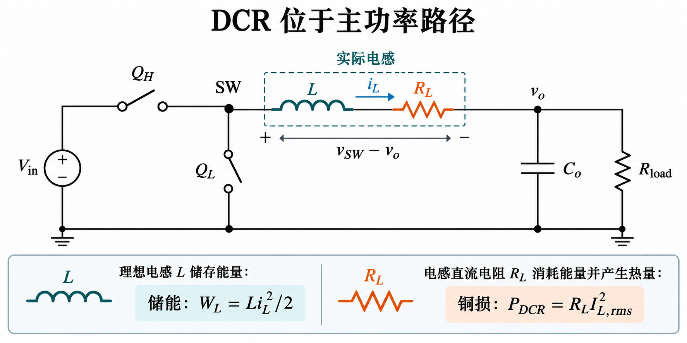
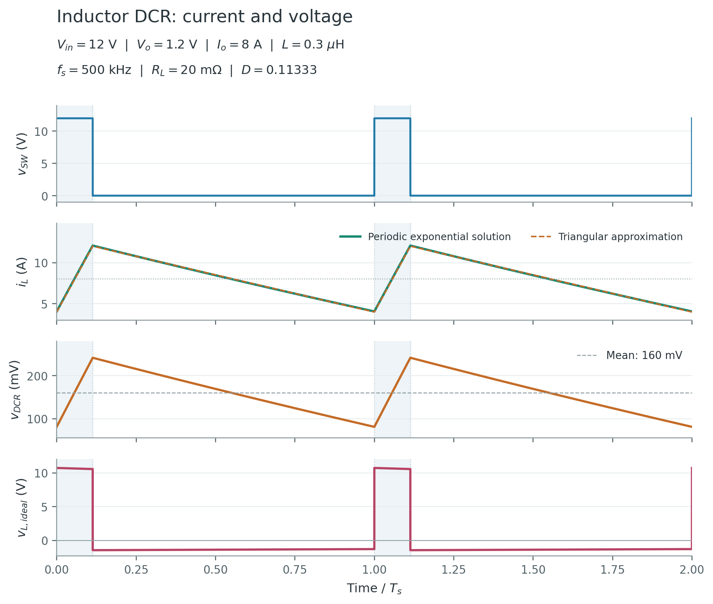
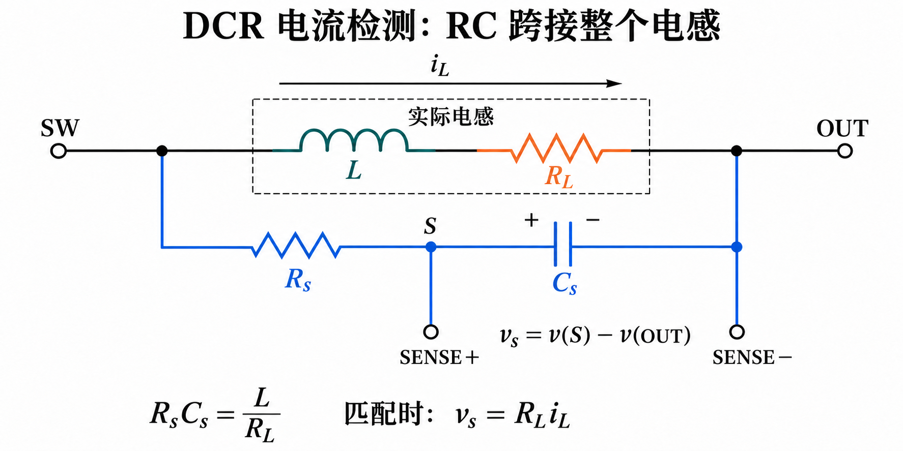
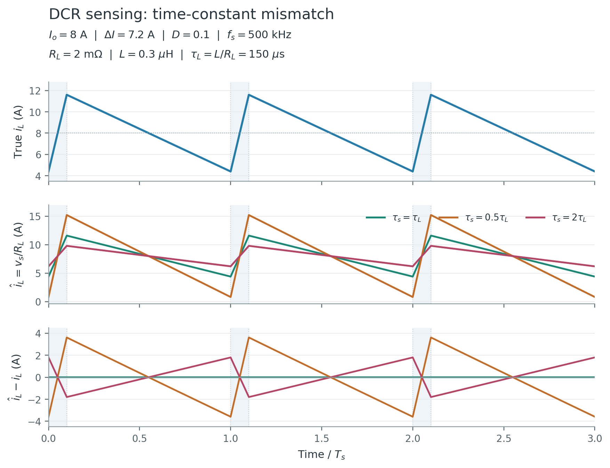

电感不仅储能，也具有绕组电阻。**理想电感电压由电流变化率决定，DCR 压降由电流本身决定；电感端口电压是这两项之和。** DCR 位于负载电流经过的主功率路径，因此会产生直流压降和持续铜损；它也能作为电流检测的信号来源。

[全部个人笔记](/zh/notes/) · [Buck 功率级基础](/zh/notes/buck-day-01/) · [负载阶跃与电荷恢复](/zh/notes/buck-day-02/) · [输出电容 ESR](/zh/notes/buck-esr-ripple/)

| 核心问题 | 结论 | 章节 |
| --- | --- | --- |
| DCR 与电容 ESR 都是串联电阻，有何区别？ | DCR 承载负载直流电流，输出电容 ESR 通常不承载 | §1–2 |
| 闭环能补偿 DCR 压降吗？ | 在调节余量内可提高占空比维持输出，但铜损仍存在 | §3 |
| 有 DCR 的电感电流还是严格三角波吗？ | 恒定输出电压模型内是分段指数，三角波是一阶近似 | §4 |
| 电感损耗能只用 $I_o^2R_{DCR}$ 吗？ | 还要区分纹波铜损、频变绕组损耗和磁芯损耗 | §5 |
| RC 检测为什么能复现电流？ | RC 极点与绕组 $L/R_{DCR}$ 零点匹配 | §7 |
| 时间常数失配只影响直流精度吗？ | 理想简单 RC 网络的直流增益不变，动态纹波会失真 | §8 |
| 绕组发热如何影响限流？ | DCR 增大改变检测增益，还可能破坏时间常数匹配 | §9 |

**模型范围：** 单相同步 Buck，两状态周期稳态，参数恒定，忽略功率管导通电阻、死区、寄生电容、磁芯非线性和输出高频尖峰。$R_L\equiv R_{DCR}$ 表示绕组在指定温度下的直流电阻。§4 另外假设端口输出电压在单周期内近似为常数；指数解只在这个简化模型内精确。§7–8 的检测网络采用恒定 $L$、$R_L$、高阻差分输入，并忽略其小支路电流对功率级的影响。实际闭环、热和非线性问题须另行校核。

## 1. DCR 的物理意义与电感模型

### 1.1 DCR 是绕组的直流电阻

DCR（DC Resistance，直流电阻）主要来自绕组导体及其连接。对均匀导体，一阶几何关系为：

$$R_L\approx\rho\frac{\ell}{A_w}.$$

其中 $\rho$ 为电阻率，$\ell$ 为导电长度，$A_w$ 为有效截面积。更粗、更短的导体通常有利于降低 DCR，但真实器件还涉及匝数、磁芯、窗口、封装和制造条件。**DCR 不是电感值，也不是饱和电流。** 同一标称电感量不能推出相同 DCR 或相同大电流能力。

取电流 $i_L$ 从 SW 流向输出，绕组端口电压按 SW 端为正：

$$
\begin{aligned}
v_w&=v_{SW}-v_o,\\
v_w&=L\frac{di_L}{dt}+R_Li_L,\\
v_{L,ideal}&=L\frac{di_L}{dt},\\
v_{DCR}&=R_Li_L.
\end{aligned}
$$

$v_w$ 是可从电感外部两端测得的总电压；$v_{L,ideal}$ 和 $v_{DCR}$ 是等效模型内的分量。绕组内部一般没有可直接引出的“纯 DCR 两端”。

### 1.2 储能与耗散是两种不同机制

在线性且恒定 $L$ 的模型中：

$$
\begin{aligned}
W_L&=\frac12Li_L^2,\\
p_w&=v_wi_L\\
&=\frac{dW_L}{dt}+R_Li_L^2.
\end{aligned}
$$

理想电感可以吸收或返还能量；正电阻项 $R_Li_L^2\ge0$ 只能耗散能量。周期稳态中储能回到起点，因而绕组端口的平均输入功率等于这个模型中的电阻损耗。即使绕组端口电压在两个状态间正负交替，铜损也不会在关断状态变成负值。

### 1.3 DCR 不等于完整交流等效电阻

在适用频带内，最简阻抗为 $Z_w(s)=R_L+sL$。但开关频率及谐波下还可能有趋肤效应、邻近效应、涡流和磁芯损耗，且 $L$ 可能随偏置电流变化。自谐振附近更不能沿用单纯串联 RL 模型。

[Coilcraft 的电感选型资料](https://www.coilcraft.com/getmedia/d4009ece-69be-49a6-9185-9cbacb65e3aa/doc469_selecting_inductors.pdf) 区分了直流电阻、交流电阻和电流能力。其频率示例与绕组结构相关，不能把其中某个频率阈值当成所有功率电感的统一界限。

## 2. DCR 与输出电容 ESR 的区别

两者都具有电阻压降和耗散，但位置、支路电流及直流结果不同。

| 比较项 | 电感 DCR | 输出电容 ESR |
| --- | --- | --- |
| 所在路径 | 串联在 SW 到输出的主功率路径 | 串联在电容支路内 |
| 电阻电流 | $i_L$，含负载直流分量 | $i_C\approx i_L-I_o$ |
| 周期平均电流 | $\langle i_L\rangle=I_o$ | $\langle i_C\rangle=0$ |
| 平均电阻压降 | $R_LI_o$ | 常数 ESR 时为零 |
| 纹波电压分量 | $R_L\widetilde i_L$，不等于输出端纹波 | $R_{ESR}i_C$，直接参与电容端口电压 |
| 损耗主项 | 大电流下常由 $I_o^2R_L$ 主导 | 主要来自纹波电流的均方值 |
| 控制信号用途 | 可经 RC 网络重建电感电流 | 某些纹波型控制利用电流同相的端口纹波 |

这里忽略分压器和检测网络电流，或把其平均负载计入 $I_o$。**不能把电感 DCR 的 $R_L\Delta I$ 直接加到输出电容的纹波公式上。** DCR 会改变功率级电流与动态，但其电阻压降不处在输出电容端口串联模型中。

负载突增时，电感电流连续，故常数 DCR 的 $R_Li_L$ 也连续；它不会仅因为负载电流跳变就立即增加 $R_L\Delta I_o$。输出电容电流可以跳变，因此 ESR 初始跳变与 DCR 是不同机制，详见[负载阶跃笔记](/zh/notes/buck-day-02/)。

## 3. 直流压降、占空比与调节余量

### 3.1 伏秒平衡必须施加在理想电感上

周期稳态要求电感电流回到原值：

$$\int_0^{T_s}L\frac{di_L}{dt}\,dt=0.$$

因此 $\langle v_{L,ideal}\rangle=0$，但整个绕组端口的平均电压为 $\langle v_w\rangle=R_LI_o$，不再为零。理想同步两状态中 $v_{SW}$ 分别为 $V_{in}$ 和 0，得到：

$$
\begin{aligned}
DV_{in}&=V_o+R_LI_o,\\
\boxed{V_o}&=\boxed{DV_{in}-R_LI_o}.
\end{aligned}
$$

该平均关系不要求电感电流严格三角，但要求所声明的两状态、周期稳态、恒定参数及 $\langle i_L\rangle=I_o$。若把整个绕组端口错误地做零伏秒平衡，就会漏掉直流压降。

### 3.2 固定占空比与闭环稳压要分开讨论

| 比较条件 | 增大 DCR 的结果 |
| --- | --- |
| 固定 $D,V_{in},I_o$，恒流负载且仍维持两状态 | 平均输出按 $R_LI_o$ 降低 |
| 固定 $D,V_{in}$，电阻负载 $R$ | $I_o$ 随输出改变，需联立 $I_o=V_o/R$ |
| 闭环固定 $V_o,I_o,V_{in}$，有足够调节余量 | 所需占空比提高，输出可保持不变 |
| 已达最大占空比、限流或热约束 | 不能保证继续维持目标输出 |

电阻负载下，固定占空比的解为：

$$V_o=DV_{in}\frac{R}{R+R_L}.$$

闭环维持目标输出时：

$$
\begin{aligned}
D_{req}&=\frac{V_o+I_oR_L}{V_{in}},\\
\Delta D&=\frac{I_oR_L}{V_{in}}.
\end{aligned}
$$

此处 $\Delta D$ 相对无 DCR 的理想值 $V_o/V_{in}$。控制器提高占空比是在输入侧提供额外能量，**不是把铜损消除**。实际还要加入功率管压降、死区、走线阻抗和控制器的最大占空比／最小关断时间限制。

### 3.3 算例：同一 12 V → 1.2 V、8 A 工作点

| DCR | 直流压降 $I_oR_L$ | 固定 $D=0.1$ 的输出，仅恒流负载 | 维持 1.2 V 的 $D_{req}$ |
| --- | --- | --- | --- |
| 0 | 0 | 1.200 V | 0.100000 |
| 2 mΩ | 16 mV | 1.184 V | 0.101333 |
| 20 mΩ | 160 mV | 1.040 V | 0.113333 |

20 mΩ 的额外占空比为 0.013333，即 **1.3333 个百分点**，不是 1.3333% 的相对变化。相对原占空比 0.1，其增加量为 13.333%。表中的固定占空比结果不适用于把负载电阻固定为同一数值的比较。

## 4. 两状态电流：指数解与三角近似

### 4.1 DCR 改变电流斜率

把一个周期内的输出电压近似为常数 $V_o$：

$$
\begin{aligned}
\left.\frac{di_L}{dt}\right|_{on}&=\frac{V_{in}-V_o-R_Li_L}{L},\\
\left.\frac{di_L}{dt}\right|_{off}&=\frac{-V_o-R_Li_L}{L}.
\end{aligned}
$$

同一瞬时电流、输入与输出电压下，正 DCR 减小导通段的增流斜率，并使正电流关断段的下降斜率更负。但闭环调整占空比后，两段持续时间也会改变，不能由这一局部斜率判断总纹波必然减小。

### 4.2 分段指数解

令 $\tau_L=L/R_L$、$I_a=(V_{in}-V_o)/R_L$、$I_b=-V_o/R_L$，$i_0=i_L(0)$、$i_1=i_L(DT_s)$：

$$i_{on}(t)=I_a+(i_0-I_a)e^{-t/\tau_L}.$$

$$i_{off}(t)=I_b+(i_1-I_b)e^{-(t-DT_s)/\tau_L}.$$

第一式用于 $0\le t\le DT_s$，第二式用于 $DT_s\le t\le T_s$。$I_a$、$I_b$ 是各状态长期保持时的数学平衡值；不是正常 Buck 每个周期必须达到的峰谷。

定义 $p=e^{-DT_s/\tau_L}$、$q=e^{-(1-D)T_s/\tau_L}$，周期边界给出：

$$
\begin{aligned}
i_0&=\frac{qI_a(1-p)+I_b(1-q)}{1-pq},\\
i_1&=I_a+(i_0-I_a)p.
\end{aligned}
$$

在电流上升／下降方向满足所设工作点时，$i_0$ 与 $i_1$ 是谷值、峰值，纹波为 $i_1-i_0$。$R_L\to0$ 时原始微分方程趋于恒斜率，两状态解趋于分段直线；上述含 $1/R_L$ 的表达式不宜直接用于零电阻数值计算。

### 4.3 三角波是小曲率近似

当两状态持续时间相对 $\tau_L$ 都很小，且 $R_L\Delta I$ 相对各状态有效驱动电压足够小，可把电阻电流项近似为 $R_LI_o$：

$$
\begin{aligned}
\Delta I&\approx\frac{(V_{in}-V_o-R_LI_o)D}{Lf_s}\\
&\approx\frac{(V_o+R_LI_o)(1-D)}{Lf_s}.
\end{aligned}
$$

闭环采用 §3 的 $D$ 时，进一步得到：

$$\Delta I\approx\frac{V_{in}D(1-D)}{Lf_s}.$$

固定 $V_o,I_o,V_{in},L,f_s$，DCR 增大使 $D$ 增大。当 $D<0.5$ 时，这个近似中的 $D(1-D)$ 随 $D$ 增大，纹波反而可能增大。若跨过或原本高于 0.5，趋势不同；若比较的是固定占空比或另一负载，须重新计算。

### 4.4 对齐波形与数值校核

图中 DCR 电压的平均值为 160 mV，而理想电感电压平均值为零。$i_L$ 连续，$R_Li_L$ 也连续；理想电感电压在开关切换处可以跳变。对同一工作点，周期指数解为：

| DCR | $D$ | $i_{min}$ | $i_{max}$ | 精确模型内 $\Delta I$ | 三角近似 $\Delta I$ |
| --- | --- | --- | --- | --- | --- |
| 2 mΩ | 0.101333 | 4.3639 A | 11.6490 A | 7.28518 A | 7.28519 A |
| 20 mΩ | 0.113333 | 4.0501 A | 12.0880 A | 8.03791 A | 8.03911 A |

两者均为正电流 CCM，平均电流均为 8 A。指数波形的峰谷中点未必严格等于周期平均值，故不能把精确解的 $i_{max}$ 一律写成 $I_o+\Delta I/2$。三角近似中可以这样写。

这些比较中的输出目标、负载平均电流和器件参数保持不变，占空比随 DCR 调整。它说明的是特定比较条件下的趋势，不表示 DCR 越大越能改善纹波。

## 5. 铜损、效率与温升

### 5.1 先对整个电流求均方值

写 $i_L=I_o+\widetilde i_L$，其中 $\langle\widetilde i_L\rangle=0$：

$$
\begin{aligned}
I_{L,rms}^2&=I_o^2+I_{ripple,rms}^2,\\
P_{DCR}&=R_LI_{L,rms}^2.
\end{aligned}
$$

零均值两段线性三角纹波时，$I_{ripple,rms}^2=\Delta I^2/12$，于是：

$$\boxed{P_{DCR}\approx R_L\left(I_o^2+\frac{\Delta I^2}{12}\right).}$$

该三角 RMS 关系不要求 $D=0.5$，但不能直接用于明显指数、DCM、跳脉冲或其他任意波形。对 §4 的指数解，可以直接积分 $i_L^2$；2 mΩ 与 20 mΩ 的模型内铜损分别为约 **0.13685 W**、**1.38767 W**。

### 5.2 与 ESR 算例保持同一给定电流条件

另取 $I_o=8\,\mathrm A$、给定三角纹波 $\Delta I=7.2\,\mathrm A$，并保持电流波形不变，以单独比较电阻损耗：

$$
\begin{aligned}
I_{L,rms}^2&=64+4.32=68.32\,\mathrm{A^2},\\
I_{L,rms}&\approx8.266\,\mathrm A.
\end{aligned}
$$

| DCR | 直流铜损 $I_o^2R_L$ | 纹波铜损 $\Delta I^2R_L/12$ | 合计 |
| --- | --- | --- | --- |
| 2 mΩ | 128.00 mW | 8.64 mW | **136.64 mW** |
| 20 mΩ | 1280.00 mW | 86.40 mW | **1366.40 mW** |

本表不是 §4 自洽工作点的精确损耗表：这里人为固定了相同 $\Delta I$，§4 则由电压、占空比、L 与 DCR 得到不同电流。两类算例的比较条件不能混用。

在相同三角纹波下，输出电容仅承担交流支路电流，其常数 ESR 损耗为 $R_{ESR}\Delta I^2/12$。若电容 ESR 也取 2 mΩ，则为 8.64 mW；同阻值的绕组 DCR 损耗为 136.64 mW。这是直流电流路径不同造成的，并非“DCR 和 ESR 的欧姆定律不同”。

若再假定输出保持 1.2 V、8 A，且**整个电路仅有本表 DCR 损耗**，则理想化效率上限为：

$$
\begin{aligned}
\eta_{DCR-only}&=\frac{P_o}{P_o+P_{DCR}},\\
P_o&=9.6\,\mathrm W.
\end{aligned}
$$

对应约 98.60% 与 87.54%。这些不是实际 Buck 效率，也不覆盖功率管、驱动、磁芯及其他损耗。

### 5.3 频变绕组损耗与磁芯损耗另计

若需要纳入谐波频率处的绕组损耗，可在适用的线性损耗模型中写：

$$
P_{winding}\approx I_o^2R_{DC}+\sum_{n\ge1}I_{n,rms}^2R_w(nf_s).
$$

这里 $R_w(nf_s)$ 是定义为**完整绕组交流电阻**的量。若资料提供的是相对 DCR 的额外交流损耗，应采用另一种账目：$R_{DC}I_{L,rms}^2+P_{AC,extra}$。不能将完整交流电阻算出的纹波损耗再叠加一次 DCR 纹波项。

电感总损耗还要加入磁芯损耗，并核对厂商损耗模型是否已包含绕组和磁芯贡献。高频损耗、温度与偏置相关时，不应仅凭低 DCR 断言某颗电感的总效率更高。

[Coilcraft 的电流与温升说明](https://cps.coilcraft.com/en-us/faq/) 指出，额定 RMS 电流常按直流或低频条件下的规定温升定义；真实开关应用还会增加交流绕组与磁芯发热。因此额定 $I_{rms}$ 不是在任意频率、纹波和环境下都保持同样温升的保证。

## 6. DCR 对阻尼与瞬态的作用

### 6.1 输出低通的阻尼，不是电容 ESR 零点

取电阻负载 $R$、理想输出电容 $C_o$，忽略电容 ESR，绕组采用 $R_L+sL$。周期平均小信号功率级为：

$$G_{vd}(s)=\frac{V_{in}}{a_0+a_1s+a_2s^2},$$

$$
\begin{aligned}
a_0&=1+\frac{R_L}{R},\\
a_1&=\frac LR+R_LC_o,\\
a_2&=LC_o.
\end{aligned}
$$

因此直流增益为 $V_{in}R/(R+R_L)$，与 §3 的电阻负载关系一致。按二阶标准形式归一化：

$$
\begin{aligned}
\omega_0&=\sqrt{\frac{a_0}{a_2}},\\
Q&=\frac{\sqrt{a_0a_2}}{a_1}.
\end{aligned}
$$

DCR 进入直流增益和分母系数，会影响谐振与阻尼；上述传递函数的分子没有由 DCR 引入的有限频率零点。若加入输出电容 ESR，常见功率级分子仍含电容 ESR 对应的 $1+sR_{ESR}C_o$。**检测网络中的 $R_L+sL$ 零点与占空比到输出的功率级零点，不是同一件事。**

这里 $R$ 必须是电阻负载。恒流、恒功率及主动负载的增量导纳不同，应重新建模。平均功率级阻尼也不能代替完整闭环稳定性结论。

### 6.2 “有阻尼”不等于“应当增加 DCR”

有限 DCR 可耗散振荡能量，但同时增加主路径损耗、压降与温升。不能只为了减小谐振峰而忽略效率与控制设计，也不能从较低 $Q$ 推出所有控制环路都更稳定。

负载阶跃后，电感追流速度由可用电感电压决定：

$$\frac{di_L}{dt}=\frac{v_{SW}-v_o-R_Li_L}{L}.$$

电流越大，正 DCR 的压降越大。在相同 $v_{SW},v_o,i_L$ 下，它减少正向追流余量。最终欠冲和恢复时间还取决于输出电容、控制延迟、导通时间、限流与补偿，不能只用 $L/R_L$ 一个时间常数描述完整 Buck 的负载瞬态。

## 7. RC 网络如何检测电感电流

### 7.1 检测的是重建信号，不是直接接到内部 DCR

定义 $v_s=v(S)-v(OUT)$、$\tau_s=R_sC_s$。RC 支路跨接的输入是**整个绕组端口电压** $v_w$。在高阻检测和零状态拉普拉斯表示下：

$$
\begin{aligned}
V_w(s)&=(R_L+sL)I_L(s),\\
\frac{V_s(s)}{V_w(s)}&=\frac1{1+s\tau_s},\\
\frac{V_s(s)}{I_L(s)}&=R_L\frac{1+s\tau_L}{1+s\tau_s}.
\end{aligned}
$$

所以匹配条件为：

$$\boxed{R_sC_s=\frac L{R_L}}.$$

当 $\tau_s=\tau_L$ 时，理想模型内极点与零点抵消，得到 $v_s=R_Li_L$。RC 的低通作用消除了理想电感电压项的影响，而不是把电流信号一并滤成只有平均值。[TI TPS40130 的 DCR 检测章节](https://www.ti.com/lit/gpn/tps40130) 给出了相同时间常数关系，本文使用简化网络独立推导。

### 7.2 时域推导与初始条件

RC 支路满足：

$$\tau_s\frac{dv_s}{dt}+v_s=L\frac{di_L}{dt}+R_Li_L.$$

令误差 $e=v_s-R_Li_L$，在恒定参数下：

$$\tau_s\frac{de}{dt}+e=(L-\tau_sR_L)\frac{di_L}{dt}.$$

时间常数匹配时右侧为零，故：

$$e(t)=e(t_0)e^{-(t-t_0)/\tau_s}.$$

只有初始误差也为零时，才从起始瞬间满足完全重建；任意初始电容电压产生的误差会按时间常数衰减。启动、停机与模式切换不能无条件套用“始终完全相等”。

### 7.3 基本参数算例

取 $L=0.3\,\mathrm{\mu H}$、$R_L=2\,\mathrm{m\Omega}$：

$$\tau_L=\frac{0.3\,\mathrm{\mu H}}{2\,\mathrm{m\Omega}}=150\,\mathrm{\mu s}.$$

若 $C_s=100\,\mathrm{nF}$，则 $R_s=1.5\,\mathrm{k\Omega}$。在 $I_o=8\,\mathrm A$、给定 $\Delta I=7.2\,\mathrm A$ 的三角电流下，匹配检测的平均电压为 16 mV，纹波为 14.4 mVpp，峰谷分别为 23.2 mV 和 8.8 mV。

这里给定的电流波形用于单独分析检测网络，未把它当作 §4 含 DCR 功率级的自洽指数解。即使 $\tau_L=150\,\mathrm{\mu s}$ 远大于开关周期 2 µs，匹配网络仍可在所声明模型内复现该周期纹波，因为检测传递函数同时含绕组零点。

### 7.4 带衰减的网络需要重新计算

某些控制器在 S 与 OUT 之间还并接电阻 $R_2$，并把 SW 到 S 的电阻记为 $R_1$。理想高阻输入时：

$$
\begin{aligned}
k&=\frac{R_2}{R_1+R_2},\\
\tau_s&=(R_1\parallel R_2)C_s,\\
\frac{V_s}{I_L}&=kR_L\frac{1+s\tau_L}{1+s\tau_s}.
\end{aligned}
$$

匹配后的等效检测电阻为 $kR_L$，匹配时间常数使用 $R_1\parallel R_2$，不是简单地使用 $R_1$。[ADI LTC3859A 数据手册](https://www.analog.com/media/en/technical-documentation/data-sheets/ltc3859a.pdf) 展示了这种衰减型 DCR 网络。实际设计还须按所选控制器核对共模范围、输入偏置电流和极性。

## 8. 时间常数失配：直流正确，纹波仍可能错误

### 8.1 频率响应说明误差来源

将检测电压除以实际 $R_L$ 定义理想标定的估计电流 $\hat i_L=v_s/R_L$，则：

$$\frac{\widehat I_L(s)}{I_L(s)}=\frac{1+s\tau_L}{1+s\tau_s}.$$

直流增益为 1；当频率远高于两个转折频率、且简单模型仍成立时，增益趋于 $\tau_L/\tau_s$。因此：

| 条件 | 直流／长期恒定电流 | 高频纹波倾向 |
| --- | --- | --- |
| $\tau_s=\tau_L$ | 正确 | 理想模型内正确 |
| $\tau_s<\tau_L$ | 稳态直流仍正确 | 纹波放大，动态过冲倾向 |
| $\tau_s>\tau_L$ | 稳态直流仍正确 | 纹波衰减，动态滞后倾向 |

有限频率下还存在相位误差。对非正弦电流，各谐波分别经历不同增益与相位，不能只用一个高频比例描述整条波形，也不能认为平均电流标定正确就足以保证峰值限流正确。

### 8.2 对齐波形：固定同一三角电流

| $\tau_s/\tau_L$ | $\hat i_L$ 平均值 | 检测纹波峰峰值 | 最大绝对瞬时误差 |
| --- | --- | --- | --- |
| 1 | 8.000 A | 7.200 A | 0 |
| 0.5 | 8.000 A | 约 14.400 A | 约 3.613 A |
| 2 | 8.000 A | 约 3.600 A | 约 1.802 A |

本例开关频率远高于两个时间常数的转折频率，所以纹波放大／衰减接近高频比例。图中的偏差由时间常数失配产生，没有额外假设噪声、比较器失调或 DCR 标定误差。

### 8.3 不同误差不能混成一个百分比

| 误差来源 | 主要表现 | 需检查的量 |
| --- | --- | --- |
| DCR 实际值与标定值不同 | 稳态电流增益误差 | DCR 容差、温度与标定方式 |
| RC 与 $L/R_L$ 失配 | 波形幅度与相位误差 | R、C、L、DCR 的组合容差 |
| $L$ 随偏置下降 | 动态匹配改变，也可能增加真实电流纹波 | 工作电流下的增量／差分电感 |
| 输入偏置电流、漏电、失调 | 小信号偏置与增益误差 | 源阻抗、输入模型和温度 |
| 共模瞬变与布局耦合 | 开关边沿尖峰或误触发 | 布局、共模范围与瞬态抑制 |

绕组电感在饱和附近明显变化时，常数 $L$ 的理想抵消不再成立。实际检测带宽也受寄生、输入电路和布局限制，不能把数学抵消解释成无限带宽。

## 9. 温度漂移与限流误差

### 9.1 用绕组温度，而不是只用环境温度

铜绕组在一定温度范围内可作线性近似：

$$R_L(T)\approx R_L(T_0)[1+\alpha(T-T_0)].$$

$T$ 是绕组温度，$T_0$ 是 DCR 标定温度。铜的温度系数常约为 $0.0039\,\mathrm{K^{-1}}$；厂商给出的参考温度、导体材料与数据优先。[TI TPS40130](https://www.ti.com/lit/gpn/tps40130) 明确讨论了铜正温度系数对检测电压、限流及负载线的影响。

取 $T_0=25\,\mathrm{^\circ C}$、$R_L(T_0)=2\,\mathrm{m\Omega}$，算例采用 $\alpha=0.00393\,\mathrm{K^{-1}}$。到 100 °C：

$$
\begin{aligned}
\frac{R_L(100)}{R_L(25)}&=1.29475,\\
R_L(100)&\approx2.5895\,\mathrm{m\Omega}.
\end{aligned}
$$

在同一 $I_o=8\,\mathrm A$、$\Delta I=7.2\,\mathrm A$ 三角电流条件下，DCR 损耗由 136.64 mW 增至约 **176.91 mW**。这是假设电流波形不变的电阻温漂比较，不是完整电热闭环结果。

真实温度还取决于磁芯与交流绕组损耗、PCB 散热、邻近热源及环境。应以工作条件下的损耗模型和测量逐步校核，不能仅把室温 DCR 损耗乘一个未经验证的热阻就当作最终温度。

### 9.2 室温标定同时留下增益和动态误差

若估计电流始终除以室温值 $R_{cal}$，则：

$$
\frac{\widehat I_L(s)}{I_L(s)}
=\frac{R_L(T)}{R_{cal}}\frac{1+sL(T)/R_L(T)}{1+s\tau_s}.
$$

长期恒定电流的增益为 $R_L(T)/R_{cal}$。本例未补偿时约高估 29.475%。同时，若 $L$ 仍为 0.3 µH，绕组时间常数由 150 µs 降至约 115.85 µs；固定室温 RC 不再动态匹配。

因此只修正电流读数的比例，并不一定同时修正瞬时波形；只调 RC 时间常数，也不一定消除直流增益误差。带 NTC 或内部温度补偿的实现应按实际拓扑推导，不能笼统宣称一个温度补偿电阻会使两者在所有工作点都完全一致。

### 9.3 限流阈值取决于检测的时刻

若有额外衰减系数 $k$，且实际网络在对应温度与工作点已匹配，简化峰值比较器满足：

$$I_{peak,lim}\approx\frac{V_{th}}{kR_L(T)}.$$

取 $k=1$、$V_{th}=24\,\mathrm{mV}$，忽略比较器失调、斜坡补偿、屏蔽时间与延迟，室温峰值阈值为 12 A，100 °C 时约为 **9.268 A**。该温度例假设动态匹配已维持；若 RC 仍固定在室温值，应把失配波形带入实际触发时刻，不能直接套用纯比例公式。

三角电流且确为峰值检测时，最大平均电流约为 $I_{peak,lim}-\Delta I/2$。谷值检测、平均值检测及带斜坡补偿的架构关系不同；其“限流电流”不能默认都等于负载直流电流。

## 10. 检测并非没有任何额外损耗

### 10.1 “无损检测”的工程含义

DCR 检测利用绕组已有电阻，不需在主功率路径再串一个检测电阻。它省去的是**额外分流电阻的主路径损耗**，不表示原有 DCR 不发热，也不表示 RC 支路、放大器和控制器完全不耗电。

对基本 RC 网络，检测电阻损耗为：

$$P_{R_s}=\left\langle\frac{(v_w-v_s)^2}{R_s}\right\rangle.$$

在 $\tau_s\gg T_s$、$v_s$ 的开关纹波相对输入方波很小的近似下，电阻承受的交流电压接近 $v_{SW}-DV_{in}$，所以：

$$P_{R_s}\approx\frac{V_{in}^2D(1-D)}{R_s}.$$

另取 $V_{in}=12\,\mathrm V$、$D=0.1$、$R_s=1.5\,\mathrm{k\Omega}$，得到约 **8.64 mW**。这是一阶估算，未计入检测输入负载及其他支路。电感 DCR 的已有损耗仍须另外计入。

[LTC3859A 的应用信息](https://www.analog.com/media/en/technical-documentation/data-sheets/ltc3859a.pdf) 也指出，DCR 网络检测电阻产生额外损耗，重载时省去分流电阻的收益更明显，轻载时不能仅凭“无损”名称判断效率优势。

### 10.2 与分流电阻检测的取舍

| 方案 | 主要优点 | 主要代价与边界 |
| --- | --- | --- |
| DCR 检测 | 不新增主路径检测电阻，适合关注大电流损耗的设计 | 信号小，需处理 DCR 温漂、容差、L 变化及 RC 动态匹配 |
| 精密分流电阻 | 检测系数较易定义，可选择低温漂器件 | 新增 $I_{rms}^2R_{sense}$ 损耗，仍有寄生与布局误差 |
| 功率管导通电阻检测 | 可减少外部主路径器件 | 导通电阻强烈受温度与驱动条件影响，并受采样窗口限制 |

具体选择取决于精度、保护要求、动态带宽、损耗预算与控制器支持，不能只按某一个阻值比较。更低 DCR 可降低铜损，却也使检测电压更小、失调与噪声的相对影响更大。

## 11. 选型、测量与校核顺序

### 11.1 把电感参数放在同一工作条件下

| 校核项 | 关键问题 |
| --- | --- |
| DCR | 典型值还是最大值？参考温度是什么？实际绕组温度下是多少？ |
| 电感量 | 标称测试条件是什么？工作偏置电流下 L 降低多少？ |
| 饱和电流 | 采用多少电感下降百分比定义？瞬态峰值与限流延迟是否覆盖？ |
| RMS／温升能力 | 额定温升、环境和板条件是什么？实际 AC 与磁芯损耗是否额外增加？ |
| 自谐振与寄生 | 开关及重要谐波所在频带能否使用所选模型？ |
| 调节余量 | 最坏 DCR、输入电压和负载下，是否仍有占空比与电压余量？ |
| 检测网络 | 是否同时覆盖增益、RC 匹配、输入共模、偏置和器件容差？ |

不能把更粗导体、更多匝数、更低 DCR 和更高饱和电流都看成能独立改善的参数。应在有效电感量、损耗、温升、体积和检测条件之间做共同校核。

### 11.2 测量低阻值与小差分信号

DCR 的毫欧级测量宜采用四线／Kelvin 方法，分离测量引线与接触压降；测试电流、热稳态和温度需记录。刚停止工作的热电感与室温规格不能直接比较。

检测波形应测量 Cs 的两个真实端点，而不是把 OUT 随意替换成地。差分幅度通常只有毫伏级，要核对探头的共模范围、带宽和共模抑制，并避免测量接地造成节点短路。对带电 SW 节点尤其不能把普通接地探头的地夹直接接上去。

检测电容与差分走线的摆放、SW 一侧电阻位置及 Kelvin 取样应遵从所选控制器的布局指导。不要把额外走线压降纳入一个未定义的“有效 DCR”之后，又在损耗或校准中重复计算。

### 11.3 从模型到工程结果

先确定工作温度下的 $L$ 与 DCR，再核对平均压降和占空比；随后计算电流波形、峰值与 RMS，建立不重复的损耗账目；若采用 DCR 检测，再推导实际 RC 与衰减网络，检查温度、偏置和容差对检测与限流的共同影响。最后用对应工作条件下的热、动态和测量结果验证。

理解 DCR 的主线不是“给理想电感随便串一个电阻”，而是分清三个层次：**主功率路径如何损耗能量，绕组端口如何决定电流变化，以及检测网络如何从端口电压重建电流。**

## 参考资料

1. Texas Instruments, [TPS40130 Data Sheet, SLUS602B](https://www.ti.com/lit/gpn/tps40130)，Inductor DCR Current Sense，文内第 20 页，式 23–25 与图 11–12。用于基本 RC 匹配及温度影响的核对，器件接口不外推到全部控制器。
2. Analog Devices, [LTC3859A Data Sheet, Rev. B](https://www.analog.com/media/en/technical-documentation/data-sheets/ltc3859a.pdf)，Applications Information，文内第 20–22 页。用于衰减型网络、Kelvin 布局、峰值限流和检测电阻损耗的核对。
3. Coilcraft, [Selecting the Best Inductor for Your DC-DC Converter, Document 469](https://www.coilcraft.com/getmedia/d4009ece-69be-49a6-9185-9cbacb65e3aa/doc469_selecting_inductors.pdf)。DCR、温度与交流电阻的背景资料；频率和尺寸示例限于其器件与条件。
4. Coilcraft CPS, [Support Center: Current Ratings, Losses and Temperature Rise](https://cps.coilcraft.com/en-us/faq/)。额定电流测试条件与实际开关损耗的区别。

本文周期指数波形、失配误差波形和数值算例由正文所声明的模型计算，不代表某一现成控制器、电感器件或完整闭环系统的实测结果。
