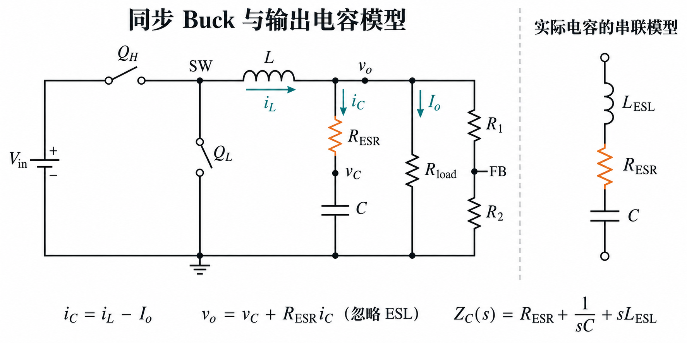
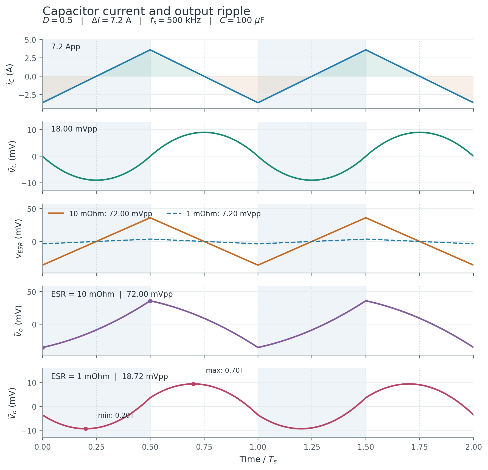
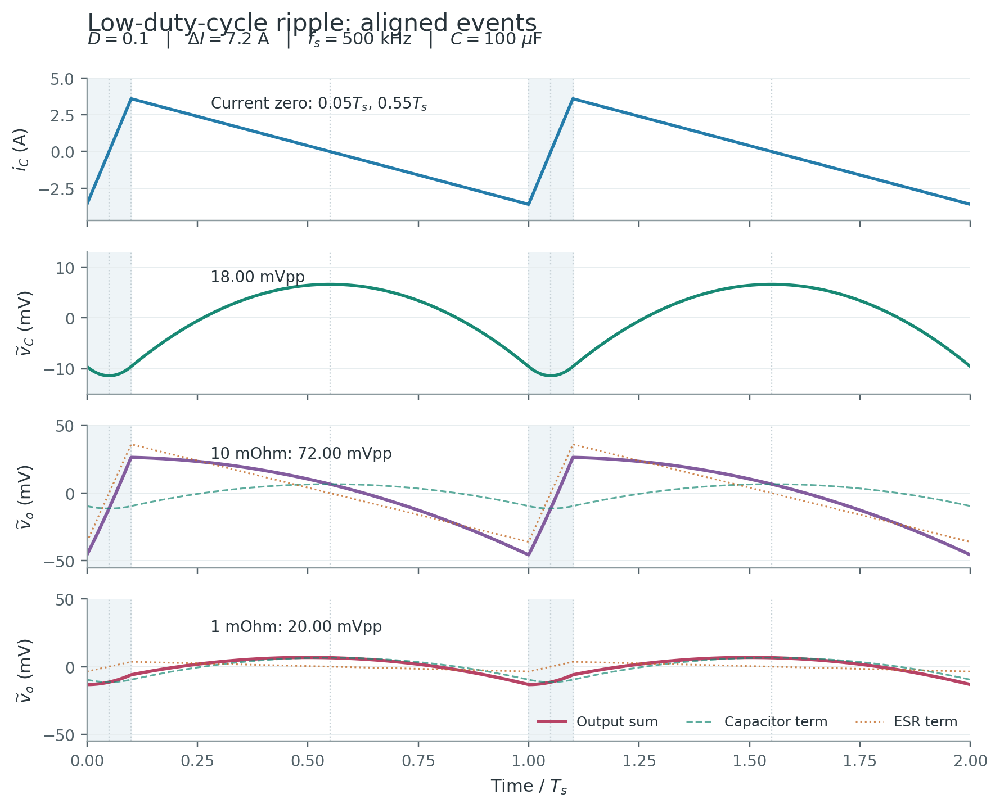
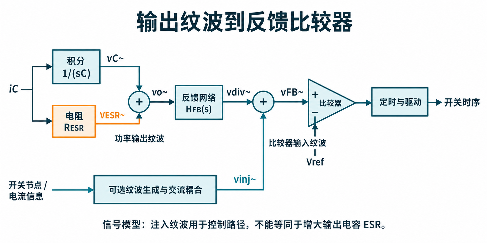

输出电容同时承担储能、滤波和瞬态电流缓冲。**理想电容电压由电流积分决定，ESR 电压由瞬时电流决定；两者逐点相加才是输出端口电压。** 这一区别不仅决定纹波幅度，也决定波形的极值、反馈比较器看到的斜率，以及电容的发热。

[全部个人笔记](/zh/notes/) · [Buck 功率级基础](/zh/notes/buck-day-01/) · [负载阶跃与电荷恢复](/zh/notes/buck-day-02/)

| 核心问题 | 结论 | 章节 |
| --- | --- | --- |
| 电容电流是三角波，电压也是三角波吗？ | 理想电容项是分段抛物线，ESR 项才是三角波 | §3–4 |
| 两项峰峰值能直接相加吗？ | 相加可作上界，精确值要寻找叠加波形的极值 | §5 |
| 降低 ESR 会改变什么？ | 减小电阻压降与发热，并改变端口纹波的幅度、曲率和极值时刻 | §2、§6 |
| 低 ESR 一定使 COT 不稳定吗？ | 取决于反馈纹波生成方式、比较器时序和具体稳定性条件 | §8 |
| 提高开关频率一定增加全部损耗吗？ | 必须先固定比较条件，再分别判断导通、开关、驱动与磁性损耗 | §9 |

**模型范围：** 单相同步 Buck，周期稳态，恒定参数，输出纹波相对直流输出较小；负载电流在单个开关周期内近似恒定。定量纹波先采用理想两状态、线性三角电流，忽略 ESL、死区、DCR 和高频开关尖峰。分段公式是该三角电流模型内的精确结果，并非完整非理想电路的精确解。两组原始算例未指定占空比；仅在明确补充 $D=0.5$ 或 $D=0.1$ 时给出对应总纹波。

## 1. 电容模型与基本方程

### 1.1 ESR、C 与 ESL 分别代表什么

ESR（Equivalent Series Resistance，等效串联电阻）用于描述电容的电阻性损耗。它把电极、引线与介质等损耗折算到一个串联电阻中。该参数通常随频率、温度和器件状态变化；在有限频带内采用常数模型是一种近似。

| 参数 | 物理关系 | 主要作用 |
| --- | --- | --- |
| 理想电容 $C$ | $i_C=C\,dv_C/dt$ | 储存电场能量，电压随累计电荷改变 |
| 串联电阻 $R_{ESR}$ | $v_{ESR}=R_{ESR}i_C$ | 产生电阻压降并耗散能量，不储能 |
| 串联电感 $L_{ESL}$ | $v_{ESL}=L_{ESL}\,di_C/dt$ | 对快速电流变化产生电压，参与高频谐振 |

忽略漏电支路时：

$$
Z_C(s)=R_{ESR}+\frac{1}{sC}+sL_{ESL}.
$$

这一集中参数模型只描述所选频带的端口特性。实际电容阵列、封装和 PCB 走线会构成更复杂的网络。

### 1.2 固定参考方向

$i_L$ 从电感流入输出节点，$I_o$ 从输出节点流向负载，$i_C$ 从输出节点流入电容支路。分压器电流在功率级计算中忽略，或计入 $I_o$。以理想电容上端相对地为正，得到：

$$\boxed{i_C=i_L-I_o}$$

$$
\begin{aligned}
C\frac{dv_C}{dt}&=i_C,\\
v_C(t)-v_C(t_0)&=\frac{1}{C}\int_{t_0}^{t}i_C(\tau)\,d\tau.
\end{aligned}
$$

忽略 ESL 时，实际端口电压为：

$$\boxed{v_o=v_C+R_{ESR}i_C}$$

含 ESL 时还需加上 $L_{ESL}\,di_C/dt$。因此不能把快速边沿附近的所有尖峰都解释为 ESR，也不能把端口电压的跳变解释成理想电容电压跳变。

### 1.3 直流值与交流纹波

用 $V_o$ 表示周期平均输出，$\widetilde v_o=v_o-V_o$ 表示零均值纹波。周期稳态要求电容净电荷变化为零：

$$\int_0^{T_s}i_C(t)\,dt=0.$$

常数 ESR 模型中，$\langle R_{ESR}i_C\rangle=0$，故 $\langle v_o\rangle=\langle v_C\rangle$。**输出电容 ESR 不承载负载的直流电流，不应把 $I_oR_{ESR}$ 当成稳态直流输出压降。** 电感 DCR 与功率管导通电阻位于直流功率路径中，与此不同。

## 2. ESR 对各项特性的影响

### 2.1 先区分直接影响与控制引起的间接影响

| 特性 | 增大 ESR 的直接影响 | 需要另行判断的条件 |
| --- | --- | --- |
| 稳态纹波 | 同一 $i_C(t)$ 下，ESR 电压分量增大 | 实际总纹波及开关时序还受控制器影响 |
| 负载阶跃 | 同一电流阶跃下，端口初始跳变增大 | 后续峰值与恢复由电荷和控制共同决定 |
| 电容损耗 | 同一 RMS 电流下，电阻耗散增大 | 温升和寿命还取决于热环境及电容技术 |
| 频率响应 | ESR 零点移向低频，同时改变阻尼 | 相位裕度须结合控制器及补偿网络 |
| 纹波型反馈 | 电流同相纹波增强 | 是否有利取决于比较器所需极性、斜率和时序 |
| 理想变换比 | 不直接改变理想两状态稳态的 $V_o=DV_{in}$ | 非理想压降和模式变化要另建模型 |

固定 $V_{in},V_o,L,f_s$ 时，三角电感纹波的一阶估算并不因 ESR 单独变化而改变。实际闭环中，ESR 可能改变触发时刻、占空比或工作模式，此时电感纹波也会间接变化。

### 2.2 负载从 2 A 跳到 8 A

采用周期平均模型，阶跃前 $i_L=2\,\mathrm A$、$i_C=0$，忽略 ESL。有限电感电压下 $i_L$ 连续，有限且无冲激的电容电流下 $v_C$ 连续：

$$
\begin{aligned}
i_C(t_0^+)&=2-8=-6\,\mathrm A,\\
\Delta v_o(t_0)&=-6\,\mathrm A\cdot R_{ESR},\\
\left.\frac{dv_C}{dt}\right|_{t_0^+}&=-\frac{6\,\mathrm A}{C}.
\end{aligned}
$$

| 阶段 | $i_L$ | $i_C$ | 理想 $v_C$ | 实际 $v_o$ |
| --- | --- | --- | --- | --- |
| $t_0^-$ | 2 A（平均） | 0 A（平均） | 原稳态值 | 原稳态值 |
| $t_0^+$ | 仍为 2 A | 跳到 −6 A | 连续 | 随 ESR 压降下跳 |
| 追流过程 | 以有限斜率上升 | 仍负，随后接近零 | 在 $i_C<0$ 时继续下降 | 由 $v_C+R_{ESR}i_C$ 决定 |
| 电荷回补 | 必须存在净超额供流 | 有正面积 | 才能回到原值 | 与控制过程共同恢复 |

10 mΩ 与 1 mΩ 对应初始下跳分别为 60 mV 与 6 mV。如果另取 $C=100\,\mathrm{\mu F}$，初始电容斜率均为 −60 mV/µs。低 ESR 减小初始跳变，但不改变同一电流差下的理想电容斜率。

对于任意开关相位，阶跃后应写 $i_C(t_0^+)=i_C(t_0^-)-\Delta I_o$。平均模型的 $i_C(t_0^-)\approx0$ 不等于每个瞬时电容电流都为零。电流刚追上负载时，仅有 $dv_C/dt=0$；只有 $i_C$ 从负变正，才对应理想电容电压的局部谷值。端口极值还要看 ESR 项，详见[负载阶跃笔记](/zh/notes/buck-day-02/)。

## 3. 从 Buck 两状态得到三角电容电流

### 3.1 电感斜率、伏秒平衡与电流纹波

定义上管导通占空比 $D$，$T_s=1/f_s$。小输出纹波近似下：

| 状态 | $v_L=v_{SW}-V_o$ | 电感斜率 |
| --- | --- | --- |
| 上管 ON、下管 OFF | $V_{in}-V_o$ | $(V_{in}-V_o)/L$ |
| 上管 OFF、下管 ON | $-V_o$ | $-V_o/L$ |

周期稳态要求 $i_L(T_s)=i_L(0)$，因此：

$$
\begin{aligned}
\int_0^{T_s}v_L\,dt&=0,\\
(V_{in}-V_o)D-V_o(1-D)&=0,\\
\boxed{V_o=DV_{in}}&.
\end{aligned}
$$

该变比限于上述理想两状态稳态；禁止反向电流且存在零电流停顿的 DCM 不能直接套用。电感电流峰峰值记为 $\Delta I\equiv\Delta i_{L,pp}$：

$$
\begin{aligned}
\Delta I&=\frac{(V_{in}-V_o)D}{Lf_s}\\
&=\frac{V_o(1-D)}{Lf_s}.
\end{aligned}
$$

恒定负载下，$\langle i_L\rangle=I_o$，所以 $i_C$ 是去掉直流分量的电感纹波。令 $u=t/T_s$：

$$
\begin{aligned}
i_C(u)&=\Delta I\,g(u),\\
g_{on}(u)&=-\frac12+\frac uD,\\
g_{off}(u)&=\frac12-\frac{u-D}{1-D}.
\end{aligned}
$$

其中上坡表达式用于 $0\le u\le D$，下坡表达式用于 $D\le u\le1$，并按周期延拓。

$i_C$ 负峰、正峰分别为 $-\Delta I/2$、$+\Delta I/2$，其峰峰值等于 $\Delta I$。$i_L$ 的谷值则为 $I_o-\Delta I/2$；判断正电流 CCM，要检查它是否大于零。允许反向电流的强制 PWM 可以维持两状态三角电流，但不应把它与禁止反向电流的轻载模式混用。

### 3.2 充放电区间与关键事件

| 事件 | 一个周期内的时刻 | 对电容电压的含义 |
| --- | --- | --- |
| 电容电流负峰 | $0$、$T_s$ | 电容电压的下降斜率最大 |
| 电容电流负→正过零 | $DT_s/2$ | $v_C$ 局部最小 |
| 电容电流正峰 | $DT_s$ | 电容电压的上升斜率最大 |
| 电容电流正→负过零 | $(1+D)T_s/2$ | $v_C$ 局部最大 |

电容是否充电由 $i_L-I_o$ 的符号决定。上管已经导通、电感电流已经上升，电容仍可能放电；电感电流正在下降时，电容也可能仍在充电。

## 4. 输出纹波的两个分量

### 4.1 电容积分项：三角电流的面积

正电流区间横跨上坡后半段与下坡前半段。两段面积分别为 $\Delta I DT_s/8$、$\Delta I(1-D)T_s/8$，故从电容谷值到峰值的充电量为：

$$
\begin{aligned}
\Delta Q&=\frac{\Delta I DT_s}{8}+\frac{\Delta I(1-D)T_s}{8}\\
&=\frac{\Delta I T_s}{8},\\
\boxed{\Delta V_{C,pp}}&=\boxed{\frac{\Delta I}{8f_sC}}.
\end{aligned}
$$

**系数 8 不要求 $D=0.5$。** 它来自零均值、峰谷对称、两段线性的三角电流面积。DCM、脉冲跳跃或明显变化的负载电流不满足这些前提时，需要重新积分。

由于 $dv_C/dt=i_C/C$，线性电流对应二次电压：$v_C$ 是分段抛物线，连续且在电流过零处斜率为零。它既不是三角波，也不是一般意义上的正弦波。

### 4.2 ESR 项：电流直接乘电阻

$$
\begin{aligned}
\widetilde v_{ESR}(t)&=R_{ESR}i_C(t),\\
\boxed{\Delta V_{ESR,pp}}&=\boxed{\Delta I R_{ESR}}.
\end{aligned}
$$

常数且为正的 ESR 不引入时间积分，电压分量与电容电流具有相同的峰谷时刻、零点及三角形状。恒定负载下，交流电容电流与交流电感电流相同，因此也可称为与电感纹波电流同相。

### 4.3 对齐波形与过零点

两种 ESR 条件保持相同的电容电流与容值，因此 $i_C$ 和 $\widetilde v_C$ 共用前两行；ESR 电压分量在第三行对照，总输出纹波则分别画在最后两行。两条 $\widetilde v_o$ 都表示 $\widetilde v_C+R_{ESR}i_C$，只是其中的 $R_{ESR}$ 不同。**最后两行的纵轴尺度也不同**，幅度比较应读标注的 mVpp，不能只看曲线高度。

图 2 中，$i_C$ 与 ESR 项在 $T_s/4$、$3T_s/4$ 过零；这些时刻对应 $v_C$ 的谷值和峰值。对称条件下，零均值 $\widetilde v_C$ 则在 $0,T_s/2,T_s$ 过零。总纹波的零点由叠加曲线决定，不能沿用任一分量的零点。

所谓积分项“滞后 90°”，严格地说是**每一个正弦谐波**经过 $1/(j\omega C)$ 后的相位关系；非正弦三角波积分后形状已经改变，不能把整条曲线当作简单平移四分之一周期的三角波。任意占空比的事件时刻应使用 §3.2 的表达式。

## 5. 为什么峰峰值不能直接相加

### 5.1 极值错位与上界

端口纹波为：

$$\widetilde v_o(t)=\widetilde v_C(t)+R_{ESR}i_C(t).$$

令 $A=\Delta V_{C,pp}$、$B=\Delta V_{ESR,pp}$。由于两个分量的最大值和最小值通常不同时发生：

$$\Delta V_{o,pp}\le A+B.$$

$A+B$ 是这两个分量模型内的保守上界，不能覆盖模型遗漏的 ESL、走线耦合尖峰或控制引起的低频纹波。也不能无依据采用 $\sqrt{A^2+B^2}$ 作为峰峰值；正交正弦的振幅合成不适用于这里的完整非正弦波形。

在光滑区间内，端口极值满足：

$$\boxed{\frac{dv_o}{dt}=\frac{i_C}{C}+R_{ESR}\frac{di_C}{dt}=0.}$$

还须检查开关切换处、周期边界和任何斜率不连续处。这些位置的极值不能仅靠设置导数为零得到。

### 5.2 任意占空比的分段表达式

令 $u=t/T_s$、$K=\Delta I T_s/C$。把电容电压写成零均值形式：

$$
\begin{aligned}
\widetilde v_C(u)&=K\,[F(u)-\overline F],\\
\overline F&=\frac{1-2D}{12},
\end{aligned}
$$

$$
\begin{aligned}
F_{on}(u)&=-\frac{u}{2}+\frac{u^2}{2D},\\
F_{off}(u)&=\frac{u-D}{2}-\frac{(u-D)^2}{2(1-D)}.
\end{aligned}
$$

$F_{on}$ 用于 $0\le u\le D$，$F_{off}$ 用于 $D\le u\le1$。

这里选取 $F(0)=F(D)=F(1)=0$，再减去其周期平均值。$F$ 的极差为 $1/8$，直接复现 $\Delta V_{C,pp}=K/8$。加入 $R_{ESR}i_C(u)$ 后，即可逐点求实际总纹波。

令 $r=R_{ESR}C/T_s$，两个区间的内部极值候选为：

$$
u_{min}=\frac D2-r,\qquad
u_{max}=\frac{1+D}{2}-r.
$$

第一式只有落在 $[0,D]$ 内才有效，第二式只有落在 $[D,1]$ 内才有效。将有效候选与 $u=0,D,1$ 一并比较，才能得到全周期峰谷。ESR 增大后，极值可能移到切换边界，因此并不存在一组适用于全部 ESR 和占空比的固定峰谷时刻。

### 5.3 对称占空比的闭式结果

当额外指定 $D=0.5$，有 $\overline F=0$。由 $A=\Delta I T_s/(8C)$ 和 $K=\Delta I T_s/C$ 可知 **$K=8A$**；$A$ 是电容积分项的峰峰值，$K$ 是归一化积分式的电压系数，两者不能直接互换。上坡内部 $0\le u\le1/2$：

$$
\widetilde v_o(u)=8A\left(u^2-\frac u2\right)+B\left(2u-\frac12\right).
$$

求导得到 $u_{min}=1/4-B/(8A)$，下坡的峰值晚半个周期。只有 $B<2A$ 时极值在区间内部；否则峰谷在切换边界。于是：

$$
\boxed{
\Delta V_{o,pp}=\begin{cases}
A+\dfrac{B^2}{4A},&B<2A,\\
B,&B\ge2A.
\end{cases}}
$$

两段在 $B=2A$ 处连续。**$B>A$ 只表示 ESR 分量峰峰值较大，不等于总纹波已经是纯三角波，也不等于总纹波必然等于 $B$。** 这个闭式结果依赖对称三角电流、常数 ESR 和无 ESL，不能套到任意占空比。

## 6. 两组纹波与损耗算例

### 6.1 算例一：7.2 A、500 kHz、100 µF

$$
\begin{aligned}
\Delta V_{C,pp}&=\frac{7.2\,\mathrm A}{8(500\,\mathrm{kHz})(100\,\mathrm{\mu F})}\\
&=18.00\,\mathrm{mV}.
\end{aligned}
$$

| ESR | ESR 纹波 $B$ | 积分纹波 $A$ | $B/A$ | 波形倾向 | $A+B$ 上界 |
| --- | --- | --- | --- | --- | --- |
| 10 mΩ | 72.00 mVpp | 18.00 mVpp | 4.0 | ESR 主导，近三角形 | 90.00 mVpp |
| 1 mΩ | 7.20 mVpp | 18.00 mVpp | 0.4 | 积分项主导，曲率明显 | 25.20 mVpp |

若补充 $D=0.5$，总纹波分别为 **72.00 mVpp** 与 **18.72 mVpp**。1 mΩ 时谷值在 $0.20T_s$，峰值在 $0.70T_s$；并非理想电容项的 $0.25T_s$、$0.75T_s$。

输出电容零均值三角电流的均方值可由两段积分求得：

$$
\begin{aligned}
I_{C,rms}^2&=\frac1{T_s}\int_0^{T_s}i_C^2(t)\,dt=\frac{\Delta I^2}{12},\\
I_{C,rms}&=\frac{\Delta I}{2\sqrt3},\\
P_{ESR}&=\frac{\Delta I^2}{12}R_{ESR}.
\end{aligned}
$$

本例 $I_{C,rms}=2.078\,\mathrm A$，两种 ESR 损耗分别为 **43.20 mW**、**4.32 mW**。这些结果仅为输出电容 ESR 损耗，不代表整个 Buck 的损耗或效率。

### 6.2 低占空比校核：同样的分量，不同的总纹波

若补充 $V_{in}=12\,\mathrm V$、$V_o=1.2\,\mathrm V$、$L=0.3\,\mathrm{\mu H}$、$f_s=500\,\mathrm{kHz}$，则 $D=0.1$，恰有 $\Delta I=7.2\,\mathrm A$。为满足正电流 CCM，可另取 $I_o=8\,\mathrm A$，谷值为 4.4 A。

| 条件 | 10 mΩ 总纹波 | 1 mΩ 总纹波 | 1 mΩ 的谷／峰时刻 |
| --- | --- | --- | --- |
| $D=0.5$ | 72.00 mVpp | 18.72 mVpp | $0.20T_s$／$0.70T_s$ |
| $D=0.1$ | 72.00 mVpp | 20.00 mVpp | $0$／$0.50T_s$ |

两种占空比的 $A$、$B$ 相同，但低 ESR 时的叠加极值不同。未给占空比的题目足以计算各分量峰峰值，却不足以唯一确定总纹波。

### 6.3 算例二：4.8 A、600 kHz、47 µF

$$
\begin{aligned}
\Delta V_{C,pp}&=\frac{4.8}{8(600\times10^3)(47\times10^{-6})}\,\mathrm V\\
&\approx21.277\,\mathrm{mV}.
\end{aligned}
$$

| ESR | ESR 纹波 | 积分纹波 | $B/A$ | 较大的分量 | 总纹波，仅 $D=0.5$ |
| --- | --- | --- | --- | --- | --- |
| 8 mΩ | 38.40 mVpp | 21.277 mVpp | 1.8048 | ESR | 38.603 mVpp |
| 0.8 mΩ | 3.84 mVpp | 21.277 mVpp | 0.18048 | 电容积分 | 21.450 mVpp |

第一行虽然 ESR 分量较大，但仍有 $B<2A$，应采用 §5.3 的第一段。用未经四舍五入的 $A$ 计算后再保留结果，可以避免显示值累积误差。

两例均忽略 ESL 和参数变化。改变电容技术或数量时，有效容值往往也会变化；不能默认现实中的“低 ESR 替换”只改变一个参数。

## 7. ESR 零点、阻尼与环路频率响应

### 7.1 ESR 零点的数值与含义

忽略 ESL，电容阻抗可改写为：

$$
\begin{aligned}
Z_C(s)&=\frac{1+sR_{ESR}C}{sC},\\
f_{z,ESR}&=\frac{1}{2\pi R_{ESR}C}.
\end{aligned}
$$

这是电容阻抗分子的左半平面零点。它也出现在常见 Buck 功率级的占空比到输出传递函数中。对 $C=100\,\mathrm{\mu F}$：

| ESR | $R_{ESR}C$ | $f_{z,ESR}$ |
| --- | --- | --- |
| 10 mΩ | 1.00 µs | **159.15 kHz** |
| 1 mΩ | 0.10 µs | **1.5915 MHz** |

单位核算为 $(10^{-2}\,\Omega)(10^{-4}\,\mathrm F)=10^{-6}\,\mathrm s$。降低 ESR 十倍会把零点提高十倍。零点频率不是开关频率，也不是环路交越频率；不能据此直接断言相位裕度是多少。

### 7.2 从输出网络得到功率级传递函数

取理想电感 $L$，电阻负载 $R$ 与串联 $R_{ESR}+1/(sC)$ 支路并联，忽略电感 DCR。先求并联阻抗，再与 $sL$ 分压，得到周期平均小信号功率级：

$$
G_{vd}(s)=V_{in}\frac{1+sR_{ESR}C}{1+a_1s+a_2s^2}.
$$

其中：

$$
\begin{aligned}
a_1&=\frac LR+R_{ESR}C,\\
a_2&=LC\left(1+\frac{R_{ESR}}R\right).
\end{aligned}
$$

令分母写成 $1+s/(Q\omega_0)+(s/\omega_0)^2$，则：

$$
\begin{aligned}
\omega_0&=\frac{1}{\sqrt{LC(1+R_{ESR}/R)}},\\
Q&=\frac{\sqrt{LC(1+R_{ESR}/R)}}{L/R+R_{ESR}C}.
\end{aligned}
$$

当 $R_{ESR}\ll R$ 时，$\omega_0\approx1/\sqrt{LC}$。ESR 同时改变零点与分母的阻尼项，不能只谈零点而忽略负载。该式的 $R$ 是电阻负载；理想恒流负载的小信号增量导纳不同，恒功率负载还可能呈负增量电阻，不能直接套用同一个 $Q$。

实际环路还包含误差放大器、补偿网络、调制器、反馈网络及延迟。低 ESR 把零点推向高频，但最终稳定性取决于完整环路。平均模型用于远低于开关频率的动态分析；即使数值计算出的 ESR 零点高于 $f_s$，也不能把该平均模型当作那里真实开关系统的完整描述。

## 8. 低 ESR 如何影响反馈与 COT

### 8.1 电阻分压传递的是整个端口纹波

无附加电容且忽略 FB 输入电流时，图 1 的分压系数为：

$$
\begin{aligned}
\beta&=\frac{R_2}{R_1+R_2},\\
\widetilde v_{FB}&=\beta\left(\widetilde v_C+R_{ESR}i_C\right).
\end{aligned}
$$

降低 ESR 会减少反馈中与电感电流同相的分量，使积分项相对占比增加，进而改变反馈曲线的幅度、曲率与斜率。若有前馈电容、滤波器或注入网络，交流分压不再是一个固定的 $\beta$，应采用实际网络的频率响应。

### 8.2 波形幅度与触发斜率是不同判据

对于直接用反馈谷值触发下一次导通的简化 COT，上管导通后，反馈信号需要按所设计的极性离开阈值。上坡初期，可能同时有 $i_C<0$ 与 $di_C/dt>0$：

$$\frac{dv_o}{dt}=\underbrace{\frac{i_C}{C}}_{\text{负}}+
\underbrace{R_{ESR}\frac{di_C}{dt}}_{\text{正}}.$$

因此“电感已经开始增流”不保证“反馈立即开始上升”。积分项占主导时，反馈在导通初期可能仍沿原方向变化；实际后果还取决于比较器屏蔽、最小关断时间、迟滞与传播延迟。

在指定三角电流模型中，上坡起点 $i_C=-\Delta I/2$，斜率为 $\Delta I/T_{on}$。若只要求这一瞬间端口斜率为正，有：

$$
\left.\frac{dv_o}{dt}\right|_{0^+}>0
\quad\Longleftrightarrow\quad
R_{ESR}C>\frac{T_{on}}2.
$$

这是**某一时刻的波形斜率条件**，不是所有 COT 控制器的充分稳定性条件。若还要求整个关断段端口单调下降，则有另一个条件 $R_{ESR}C>T_{off}/2$。不能从一个局部不等式推出完整闭环没有次谐波、抖动或双脉冲。

对于相同三角电流，峰峰值比较 $B/A=8f_sR_{ESR}C$。它只比较两个分量的幅度；§5 中的极值条件和这里的局部斜率条件还含占空比或相应导通时间。这三种判据不能互相替代。

### 8.3 纹波注入与低输出纹波可以同时实现

某些传统纹波型 COT 依赖足够的电流同相反馈纹波，低 ESR 可能导致相位与斜率不合要求，或使触发更容易受噪声影响。具体注入网络可从开关节点或电流信息生成纹波，经交流耦合加入反馈。TI 的 [SNVA874](https://www.ti.com/lit/an/snva874/snva874.pdf) 讨论了 Type-3 注入中同相纹波、输出耦合纹波和导通延迟对稳定性的共同影响；其示例说明不能只规定一个注入幅度就保证所有输入电压下稳定。

在拉普拉斯域中，以 $\widetilde V(s)$ 表示相应交流信号的变换，概念性表达式可写为：

$$\widetilde V_{FB}(s)=H_{FB}(s)\widetilde V_o(s)+\widetilde V_{inj}(s).$$

设计可使用低 ESR 电容减小功率输出的电阻压降，同时在控制信号路径生成所需纹波。内部纹波合成、外部注入和带其他控制环节的实现，应分别按其模型及数据手册评估。**“低 ESR 一定不稳定”与“加大 ESR 一定稳定”都不是通用结论。**

## 9. 损耗分类、器件约束与频率趋势

### 9.1 按物理机制分类，再避免重复记账

| 分类 | 主要位置 | 一阶关系或决定因素 |
| --- | --- | --- |
| 导通损耗 | MOSFET 沟道、电感绕组、电容 ESR | $I_{rms}^2R$；死区体二极管另计 |
| 开关损耗 | MOSFET 转换过程、MOSFET 输出电容充放电、反向恢复 | 电压电流重叠、$E_{oss}$、$Q_{rr}$、频率与换流条件 |
| 驱动损耗 | 栅极驱动器、栅极电阻和栅极回路 | 每周期栅极充放电能量 |
| 磁性元件损耗 | 电感绕组及磁芯 | 绕组直流／交流铜损、磁通摆幅、材料和温度 |

“导通”和“磁性”分类存在交叉：绕组 $I^2R$ 既是导通损耗，也是电感总损耗的一部分。效率预算应采用互斥的器件账目，例如 $P_{MOS,cond}+P_{MOS,sw}+P_{drive}+P_{L,copper}+P_{L,core}+P_{C,ESR}+P_{other}$，绕组铜损只记一次。

三角电流下：

$$I_{L,rms}^2=I_o^2+\frac{\Delta I^2}{12}.$$

忽略死区，两个线性区间具有相同的区间均方值，MOSFET 导通损耗为：

$$
\begin{aligned}
P_{HS,cond}&\approx D I_{L,rms}^2R_{HS},\\
P_{LS,cond}&\approx(1-D)I_{L,rms}^2R_{LS}.
\end{aligned}
$$

电感的最简估算是 $P_L\approx I_{L,rms}^2R_{DCR}+P_{core}$；高频交流绕组损耗需要另外评估。驱动功耗常用：

$$P_{drive}\approx(Q_{g,H}+Q_{g,L})V_{drv}f_s.$$

这里的 $Q_g$ 是驱动电压和工作点对应的**栅极电荷**，单位为库仑，不是电容值。硬开关电压电流重叠的一阶估算为 $P_{overlap}\approx V_{in}I_{sw}(t_r+t_f)f_s/2$；实际还需区分器件的 $E_{oss}$、反向恢复、死区与软开关过程，避免重复计入同一换流能量。

### 9.2 输出电容、电感与功率管的约束

TI [SLVA057 §5.1–5.3](https://www.ti.com/lit/an/slva057/slva057.pdf) 将输出电容的容值、ESR、ESL 和纹波电流温升，电感的电流及频率能力，以及功率开关的导通、耐压和转换损耗作为选型约束。页码 23–25 是文内印刷页码，对应该 PDF 的第 27–29 页。

工程校核据此展开：电容使用工作偏压、温度和容差下的有效容量；电感同时检查 $I_{L,peak}=I_o+\Delta I/2$、饱和、RMS 温升和瞬态限流；MOSFET 的耐压要包含尖峰裕量，导通电阻采用相应结温，电流能力与散热条件一起判断。历史资料中的器件技术推荐不应直接当作今天的选型结论。

### 9.3 提高开关频率前，先固定比较条件

下表固定 $V_{in},V_o,I_o,L,C,R_{ESR}$、器件和磁芯结构，维持两状态三角电流近似。此时 $D$ 近似不变，$\Delta I\propto f_s^{-1}$：

| 机制 | 主要决定参数 | 提高 $f_s$ 的趋势 | 尚需实际模型的因素 |
| --- | --- | --- | --- |
| 电容积分纹波 | $\Delta I,f_s,C$ | 约 $f_s^{-2}$ | 有效容量、模式变化及寄生网络 |
| ESR 纹波 | $\Delta I,R_{ESR}$ | 常数 ESR 时约 $f_s^{-1}$ | ESR 的频率与温度依赖 |
| 电容 ESR 损耗 | $\Delta I^2,R_{ESR}$ | 常数 ESR 时约 $f_s^{-2}$ | 各谐波的频变损耗 |
| 电感绕组直流损耗 | $I_o^2+\Delta I^2/12$, DCR | 直流部分近似不变，纹波部分下降 | 趋肤、邻近效应和温升 |
| 磁芯损耗 | $f_s,\Delta B$, 材料及温度 | 无通用单调结论 | 非正弦磁通、直流偏磁和材料损耗模型 |
| 功率管导通损耗 | $I_{L,rms}^2,R_{DS(on)},D$ | 同温度下近似不变或略降 | 温度引起的电阻变化 |
| 开关及驱动损耗 | 每周期耗能、$Q_g,V_{drv},f_s$ | 固定每周期耗能时近似随 $f_s$ 增大 | 换流方式、开关边沿和寄生参数 |

对固定磁芯与匝数，法拉第定律给出 $\Delta B\propto T_{on}\propto f_s^{-1}$。即使在经验形式 $P_{core}\propto f_s^\alpha(\Delta B)^\gamma$ 的适用范围内，代入后也得到 $P_{core}\propto f_s^{\alpha-\gamma}$，不能只看频率项就断言磁芯损耗上升。非正弦、偏磁和温度下还需采用合适的实际模型。

若提高频率同时减小 $L$ 以保持 $\Delta I$ 不变，则积分纹波只按 $f_s^{-1}$ 降低，ESR 纹波在固定 ESR 下近似不变。若仅把 $\Delta I$ 当作给定输入，也不能再宣称它会自动按 $1/f_s$ 改变。

## 10. 实际输出网络与测量边界

常数 ESR 的损耗关系适合有限频带的一阶估算。对明显频变的器件，可将周期电流展开为各谐波，用 $P\approx\sum_n I_{n,rms}^2\operatorname{Re}Z_C(jn\omega_s)$ 评估其耗散。多颗完全相同的电容理想并联时，低频可近似 $C_{eq}=NC$、$R_{eq}=R_{ESR}/N$；布局电感、不同器件阻抗及反谐振会破坏宽频段内的简单均分。

低 ESR 不会自动消除 ESL 或走线尖峰。带 ESL 的简化模型中，快速电流斜率变化会改变感性电压；极高频下应考虑封装和布局，而非外推理想电流阶跃。测量稳态纹波时应标明测量节点、带宽、探头连接与负载条件，并把开关尖峰、开关频率纹波及低频控制波动分别说明。[TI 关于输出纹波管理的技术文章](https://www.ti.com/document-viewer/lit/html/SSZT293) 可作为输出网络与测量的延伸阅读。

从公式到电路的主线是：先由电感和负载得到 $i_C$，再用积分与欧姆关系得到两个电压分量，随后寻找端口的实际峰谷，最后结合反馈网络和控制器判断时序与稳定性。有效容值、ESR、ESL、RMS 应力和控制模型必须在同一工作条件下校核。

## 参考资料

1. Everett Rogers, [Understanding Buck Power Stages in Switchmode Power Supplies, SLVA057](https://www.ti.com/lit/an/slva057/slva057.pdf), Texas Instruments, 1999，§2.1、§3.1、§5.1–5.3。用于功率级与器件约束的背景核对；本文分段纹波和极值公式由所声明的模型推导。
2. Texas Instruments, [Stability Analysis and Design of COT Type-3 Ripple Circuit, SNVA874](https://www.ti.com/lit/an/snva874/snva874.pdf), 2019，§1–3。用于具体 COT 注入机制与稳定性边界；其器件结论不外推到全部控制架构。
3. Texas Instruments, [Understanding and Managing Buck Regulator Output Ripple](https://www.ti.com/document-viewer/lit/html/SSZT293)。输出纹波与实际输出网络的延伸阅读。
