**电路设计方程确定器件需要的跨导、电流、增益和电压余量；$g_m/I_D$ 查表将这些工作条件映射到 W、L。** 从规格得到有依据的初始尺寸，再用全电路仿真检查偏置和性能，是这套方法的主线。

[全部个人笔记](/zh/notes/)

**编号约定：** 本笔记的显示公式按 `(1)` 起连续编号；引用论文时写作 `原文式 (n)`。图表保留原文编号。

| 设计问题 | 核心关系 | 对应章节 |
| --- | --- | --- |
| 跨导效率如何联系功耗？ | $g_m=\eta I_D$，其中 $\eta=g_m/I_D$ | §1 |
| 工作点怎样映射到尺寸？ | 由 $\eta$ 和本征增益选择 $L$，由归一化电流求 $W$ | §2 |
| 如何选择 $g_m/I_D$？ | 将 ICMR、噪声和 CMRR 约束取交集 | §3 |
| 补偿怎样影响工作点？ | GBW、补偿电容和支路电流共同决定跨导效率 | §4、6、7 |
| 初始尺寸是否保证全部达标？ | 对照全电路偏置、增益、稳定性、噪声和电流预算 | §5–8 |

**资料与适用范围：** 本文基于施国勇 2021 年发表于 *Integration* 的研究，保留与推导及案例直接相关的 17 幅图、6 张表，图表沿用原文编号。案例采用 180 nm CMOS / BSIM3、1.8 V 供电，结果来自 NGSPICE 仿真。方法面向初始尺寸设计；两级案例的相位裕度及三级输出电流等仍偏离目标，具体见各节对照。

## 1. 先理解传统 gm/ID 方法，再看本文的扩展

### 1.1 用跨导效率描述工作点

$g_m/I_D$ 方法以**跨导效率**为核心设计变量：每单位漏极电流能提供多少跨导。记作 $\eta$，其定义为：

$$
\begin{gathered}
g_m=\frac{\partial I_D}{\partial V_{GS}},\\
\eta=\frac{g_m}{I_D},\qquad I_D=\frac{g_m}{\eta}
\end{gathered}
\tag{1}
$$

$\eta$ 的单位是 $\mathrm{V^{-1}}$，也就是 S/A。已知所需跨导时，较大的 $\eta$ 意味着较小的偏置电流；已知偏置电流时，较大的 $\eta$ 能提供较大的跨导。它通常随强反型向弱反型增大，但反型区的数值边界依器件、偏置和工艺而变。

在理想长沟道、强反型平方律模型下，可以用下面的关系建立直觉：

$$
\eta\approx\frac{2}{V_{OV}},\qquad V_{OV}=V_{GS}-V_{TH}
\tag{2}
$$

这只是近似。实际尺寸设计使用器件模型仿真生成的查表数据，弱反型或短沟道器件不能直接套用这条平方律关系。高 $\eta$ 也有代价：固定电流下可能需要更大的 $W$，带来面积和寄生电容，因此还要同时检查速度、增益、电压余量和噪声。

### 1.2 基础流程：先确定工作点，再查表求尺寸

传统 $g_m/I_D$ 查表设计的基本顺序是：

1. **由电路指标确定跨导。** 例如，对负载电容主导的单级运放，可由目标 GBW 与 $C_L$ 估算输入管所需 $g_m$；补偿拓扑改变时要更换相应电路方程。
2. **选择跨导效率与电流。** 综合功耗、速度、面积和电压余量选择 $\eta$，再由 $I_D=g_m/\eta$ 得到电流；若电流预算已定，也可以反过来求 $\eta$。
3. **选择沟道长度。** 在候选 $L$ 的曲线中检查本征增益、寄生与速度等约束，不以 $\eta$ 单独决定 $L$。
4. **从归一化电流求宽度。** 在相同器件类型、$L$ 和偏置条件下查表，再按所需 $I_D$ 缩放 $W$。
5. **放回完整电路验证。** 核对实际偏置、饱和余量、增益、稳定性、噪声和瞬态指标，必要时调整工作点或尺寸。

常用的本征增益和归一化电流定义为：

$$
\begin{gathered}
r_o=\frac{1}{g_{ds}},\qquad A_M=g_mr_o=\frac{g_m}{g_{ds}},\\
I_{D,\mathrm{norm}}=\frac{I_D}{W/L}
\end{gathered}
\tag{3}
$$

查表给出 $I_{D,\mathrm{norm}}$ 后，宽度为：

$$
W=\frac{I_D}{I_{D,\mathrm{norm}}}L
\tag{4}
$$

**一个最小算例：** 假设电路需要 $g_m=100\,\mathrm{\mu S}$，选定 $\eta=10\,\mathrm{V^{-1}}$，则 $I_D=10\,\mathrm{\mu A}$。下一步仍需由真实 LUT 确定合适的 $L$ 和对应的 $I_{D,\mathrm{norm}}$，才能得到 $W$；这些值不能从 $\eta=10$ 单独推出来。这里是方法示例，后文的单级运放才采用论文的具体参数。

这一基础流程可参考 Jespers 与 Murmann 的查表设计教材及其[作者配套资料](https://github.com/bmurmann/Book-on-gm-ID-design)。成熟的 $g_m/I_D$ 方法本来就可以结合电路方程；不能把它概括成只凭经验取一个跨导效率。

### 1.3 这篇论文在基础方法上增加了什么

施国勇这篇论文仍使用同一套“工作点 → 查表 → 尺寸”映射，重点是**如何在多级运放中更有依据地确定工作点，以及如何组织逐级设计**。

| 设计环节 | 基础 $g_m/I_D$ 查表流程 | 本文具体采用的组织方式 |
| --- | --- | --- |
| 选择跨导效率 | 综合功耗、速度、增益与余量，选择满足要求的工作点 | 将 ICMR、噪声、CMRR 写成不等式，形成联合可行区域 |
| 确定后级跨导 | 使用该级的电路指标和负载约束 | 用拓扑专属补偿方程，将 GBW、极点分离与电流预算联系起来 |
| 协调不同器件 | 分别查表并检查完整电路偏置 | 引入输出电阻平衡、共享偏置下的跨导效率传播 |
| 修正初始设计 | 仿真核验，按偏差调整尺寸或工作点 | 将部分修正收敛为共源级的局部扫描，再核对整机结果 |

> **原文核心论断（摘要）**
> *“A main feature of the proposal is to use circuit-level design equations as constraints on the gm/ID table lookup method to substantially reduce the uncertainty in the sizing calculations.”*
>
> **解读**：电路方程负责收紧工作点的可选范围，器件查表负责将工作点映射为尺寸。本文的价值在于明确这套约束与逐级流程，而不是另造一套跨导效率定义。

### 1.4 初始尺寸在整个设计流程中的位置

图 1 连接“拓扑选择／综合 → 初始尺寸 → 优化”。初始尺寸为后续优化提供起点，也帮助发现需要重点修正的偏置和级间关系。

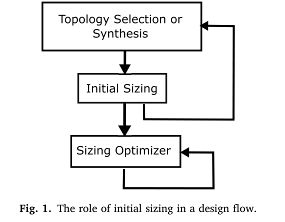

本文主要使用 DC 查表，并假设器件寄生电容相对补偿和负载电容足够小。三个案例展示的是可工作的初始设计，并未全部达到规格；寄生主导、高速或纯前馈结构需要调整设计流程，后续仍需全电路验证。

## 2. 器件查表：从工作点映射到尺寸

### 2.1 建立器件查表

原文 NMOS 查表条件：$V_{DS}=0.6$ V（$V_{DD}/3$），$W=10\,\mathrm{\mu m}$；$V_{GS}$ 从 0 到 1.2 V，步长 0.1 V；L 从 0.4 到 2 μm，步长 0.2 μm。分别收集 $I_D$、$g_m$、$R_{DS}$、$V_{GS}$、$V_{DSAT}$。PMOS 需要独立的数据，不能直接沿用 NMOS 表。这里的 $R_{DS}$ 表示小信号输出电阻 $r_o$，不是功率开关导通电阻 $R_{DS(\mathrm{on})}$。

| 曲线 | 对应图 | 在设计中回答的问题 |
|---|---|---|
| $A_M=g_mr_o$ 对 $\eta$ | Fig.5 | 当前 $\eta$ 下，哪个 L 可以提供足够本征增益？ |
| $I_{D,\mathrm{norm}}=I_D/(W/L)$ 对 $\eta$ | Fig.6 | 已知 $I_D$ 和 L，尺寸 W 应是多少？ |
| $V_{GS}$ 对 $\eta$ | Fig.7 | 栅源偏置与输入共模余量是否兼容？ |
| $V_{DSAT}$ 对 $\eta$ | Fig.8 | 饱和所需压差是否满足堆叠管余量？ |
| $f_T$ 对 $\eta$ | 本文未绘制/未使用 | 寄生和速度成为主导时如何限制工作区？ |

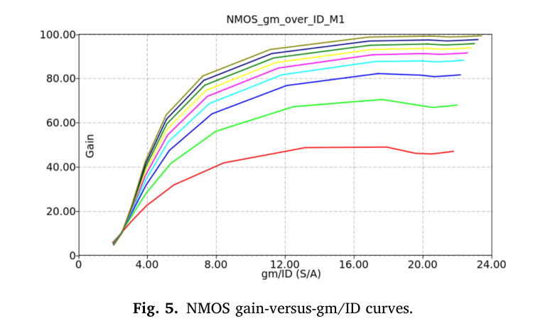
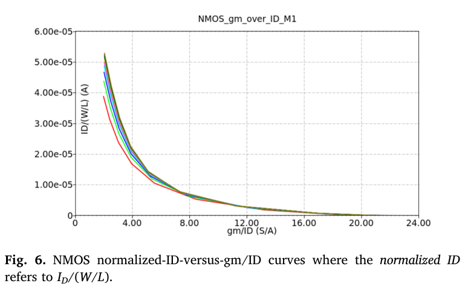
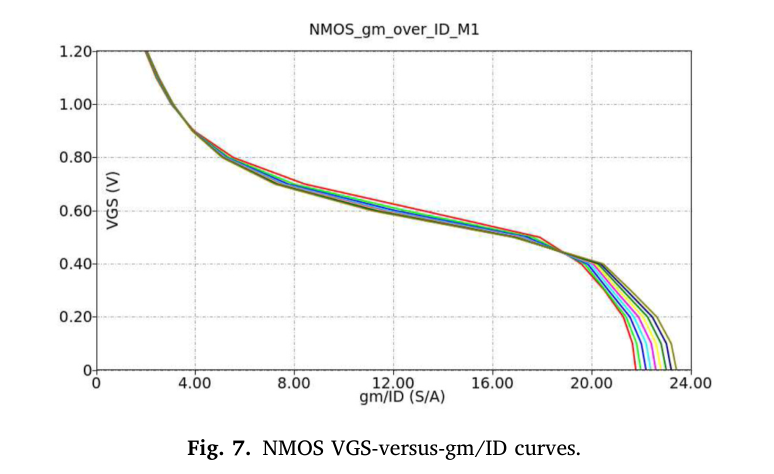
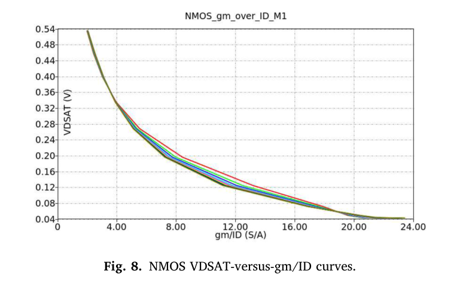

原文在这组扫描中观察到 $\eta$ 大约落在 2–24 S/A、本征增益最高约 100。这是特定器件模型和扫描范围的结果，不代表所有 CMOS 的上限。$V_{GS}$、$V_{DSAT}$ 对 $\eta$ 的单调性使“电压限制→$\eta$ 边界”的反查成为可能。作者把 $V_{DS}$ 的影响视作初始设计中可以暂时忽略的次级效应；后续案例恰好显示仍可能需要修正。

**补充建议**：用于自己的工艺时，要记录器件类型、W/L 范围、$V_{DS}$、$V_{SB}$、温度、工艺角及单位；曲线没有覆盖的范围不外推。扫描步长是本文演示条件，不能自动保证自己的 LUT 插值精度。

### 2.2 由电流、跨导效率和增益求尺寸

1. 给定 $\eta$ 与器件本征增益 $A_M$，在 Fig.5 一类曲线中寻找可用 L。若多个 L 可行，按其他约束选择，映射并不必然唯一。
2. 选定 L 后，在 Fig.6 的对应曲线上读取 $I_{D,\mathrm{norm}}$。
3. 求 W：

$$
\begin{gathered}
I_{D,\mathrm{norm}}=\frac{I_D}{W/L}\\
W=\frac{I_D}{I_{D,\mathrm{norm}}}L
\end{gathered}
\tag{5}
$$

$I_{D,\mathrm{norm}}$ 的单位仍然是电流，因为 W/L 无量纲；它不是 A/m² 的物理电流密度，也与常见的 $I_D/W$ 表不同。若自己的表使用 $J_W=I_D/W$，则应使用 $W=I_D/J_W$，不能额外乘 L。

**关键链条**：先由规格确定 $g_m$、$I_D$ 与 $A_M$，再选择 $\eta$ 和 $L$，最后查 $I_{D,\mathrm{norm}}$ 求 $W$。所有查表坐标都应来自同一个偏置与模型设置。

### 2.3 正向与反向电压查表

给定 $\eta$、L 后沿对应单条曲线读取电压。反方向则由 $V_{GS}$/$V_{DSAT}$ 的上限和曲线单调性读取 $\eta$ 下限。ICMR 就利用这种反向查表。PMOS 要采用 $V_{SG}$、$V_{SD}$ 或明确绝对值的统一约定，不能用负电压直接套 NMOS 正值。

**可靠性说明**：给定三元组得到的 W/L 是查表条件下的初始解。实际电路中 $V_{DS}$、体效应和版图寄生改变后，必须用 DC 工作点核验。

## 3. 用 ICMR、噪声与 CMRR 构造可行区域

### 3.1 电路指标与器件要求

目标包括所有晶体管的 W、L、偏置电压/电流及补偿等集总元件。小信号指标如增益、GBW、PM、CMRR、PSRR由传递函数联系到电路参数；噪声由噪声传递路径决定；ICMR 和 SR 则还需要大信号、电压余量和充放电路径分析。

### 3.2 逐级分配增益与电流

按输入到输出逐级设计；先分配总增益和电流；输入级重点考虑增益、GBW、共模增益与噪声；后级重点考虑增益、极点/零点和 SR；共享 $V_{GS}$ 的镜像支路尝试 $\eta$ 传播；同一支路的互补器件尝试 $r_o$ 平衡；最后确定补偿器件及偏置。

**解读**：总增益在线性域相乘，在 dB 域相加。电流分配也不能只按级数均分，需要考虑不同负载、内部 SR 和输出充放电。作者的分配是示例，没有证明它是最优分配。

### 3.3 ICMR 给出 gm/ID 下限

对 NMOS 输入差分对 $M_1/M_2$（单级案例的图 2），低端共模决定源节点能给尾管留下多少压差：

$$
V_{DSAT0,max}=ICMR_{min}-V_{GS1,2}
\tag{6}
$$

由 $V_{DSAT}$ 查表可得到尾管 $\eta_0$ 的下限。高端共模则要求输入管仍处于饱和，限制输入对漏端的最低电压，并约束上方负载的最大 $V_{SG}$，由 PMOS 表得到 $\eta_{3,4}$ 下限。

**校核提醒**：原文高端 ICMR 的阈值符号写作 $V_{THp1,2}$，但 Fig.2 的 M1/M2 为 NMOS。按该拓扑重新推导应检查输入 NMOS 的阈值、体效应和实际 $V_{DSAT}$；不要把这个符号当作无需验证的 PMOS 阈值公式。物理上使用 $V_D\ge V_{ICM}-V_{GS}+V_{DSAT}$ 最稳妥，长沟道近似才化成 $V_{ICM}-V_{THn}$。

### 3.4 噪声给出负载 gm/ID 上限

`原文式 (4)–(6)`对文中的相应噪声路径写成：

$$
S_n(f)=\frac{4kT}{g_{mN}}\left(\gamma_N+\gamma_P\frac{\eta_P}{\eta_N}\right)
\tag{7}
$$

其中 N/P 管共享同一静态电流，$\gamma$ 是热噪声系数。若输入 $g_m$ 和 $\eta_N$ 已知，则噪声 PSD 上限给出：

$$
\eta_P\leq\eta_N\frac{S_{n,max}g_{mN}/(4kT)-\gamma_N}{\gamma_P}
\tag{8}
$$

**解释**：输入管 $g_m$ 增大可降低输入参考噪声；负载管 $g_m$ 增大则会增强其噪声贡献，故负载 $\eta$ 受到上界约束，与 ICMR 下界形成竞争。若括号项为负，当前 $g_m$ 选择连这一简化噪声模型都不可行，需要增加 $g_m$ 或重新配置，而不是强行选 $\eta$。

**噪声归一化特别注意**：表格给的是幅度谱密度 $\sqrt{S_n}$，单位 nV/√Hz；代入式子时必须平方成 V²/Hz。原文第3.2节又提醒差分级分到每个半电路的 PSD 要除以2；原文第2.8节的`原文式 (19)`显式出现系数2。必须保证单边/双边、单端/差分和半电路/完整电路的约定一致。本文模拟示例用 $\gamma_N=\gamma_P=2/3$；不能把这当作真实短沟道器件全偏置区精确常数。此处只讨论热噪声，不包含完整低频闪烁噪声和带内积分噪声预算。

### 3.5 CMRR 给出联合约束

`原文式 (7)–(10)`以：

$$
A_{cm}\approx\frac{g_{ds0}}{2g_{m3,4}}
\tag{9}
$$

开始，设 $A_{M0}=g_{m0}/g_{ds0}$，$I_{D0}=2I_{D3,4}$，则得到：

$$
\eta_0\leq A_{cm,max}A_{M0}\eta_{3,4}
\tag{10}
$$

CMRR 的 dB 换算应先求 $A_{cm,\max,\mathrm{dB}}=A_{d,\mathrm{dB}}-\mathrm{CMRR}_{\min,\mathrm{dB}}$，再使用 $A_{cm,\max}=10^{A_{cm,\max,\mathrm{dB}}/20}$ 进入线性不等式，不能将 dB 数直接相乘。增大尾管 $r_o$ 可以降低共模增益；这里的 $A_{M0}$ 是按真实器件曲线可行范围选择的初始自由度。

把以上约束合并：横坐标负载 $\eta_{3,4}$ 被 ICMR 下限和噪声上限夹住；纵坐标尾管 $\eta_0$ 被 ICMR 下限限制，并位于 CMRR 斜线之下。Fig.9 的梯形就是可行区域，还需与器件 LUT 的有效范围取交集。

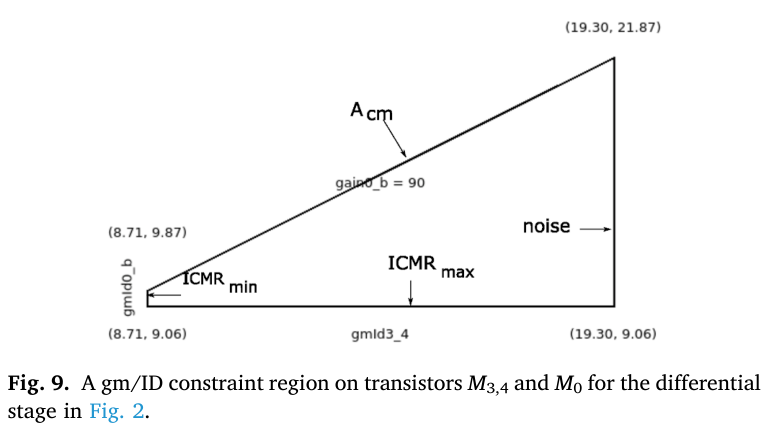

**解读**：区域为空表示当前规格、电流、$g_m$、增益分配或模型设置相互冲突；此时应回到约束来源调整。区域非空也只说明近似约束可同时满足，不保证全电路、所有角落均达标。

### 3.6 共源级增益与输出电阻平衡

`原文式 (11)–(12)`：

$$
\begin{gathered}
R_{o,stg}=r_{on}\parallel r_{op}\\
A_{stg}=g_{mn}\frac{r_{on}r_{op}}{r_{on}+r_{op}}
\end{gathered}
\tag{11}
$$

若初始设计令 $r_{on}\approx r_{op}$，则 $A_{stg}\approx A_{Mn}/2$，所以先令信号管的本征增益 $A_{Mn}\approx2A_{stg}$，再据此选择 L。这一“乘2”必须在线性增益中进行，在 dB 中对应加约6.02 dB，不能把38 dB直接乘成76 dB。

在同一 $I_D$ 且 $r_{on}=r_{op}$ 时，`原文式 (13)`给出：

$$
A_{Mp}=A_{Mn}\frac{\eta_p}{\eta_n}
\tag{12}
$$

**原文策略**：先用信号管的 $g_m/I_D$、本征增益、电流求尺寸，再由`原文式 (13)`得到负载管的本征增益，查负载的独立 LUT。

**更严谨的解读**：$r_o$ 平衡是避免一个差的输出电阻拖累整级增益的实用启发式，并不是在所有自由度下最大增益的数学定理。固定 $g_m$ 和 $r_{on}$ 时，继续增大 $r_{op}$ 仍能提高增益；固定 $r_{on}$+$r_{op}$ 时，二者相等才使并联值最大。是否采用平衡需要结合功耗、尺寸、电压余量与速度约束。

## 4. 补偿方程、偏置传播与局部修正

### 4.1 小信号补偿方程

将每级压缩为 $G_{mk}$、$R_{ok}$、$C_{ok}$ 的宏模型，补偿前馈用 $g_{mf}$ 表示，可以手工或符号分析获得极点和零点。Fig.10–12分别展示二级 Miller 电路、对应宏模型，以及串联调零电阻、 voltage buffer、current buffer 三类补偿变体。

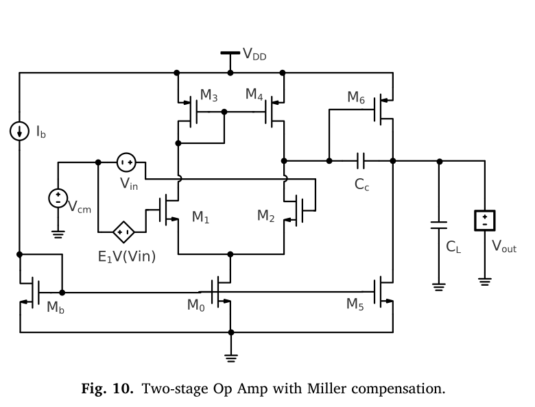
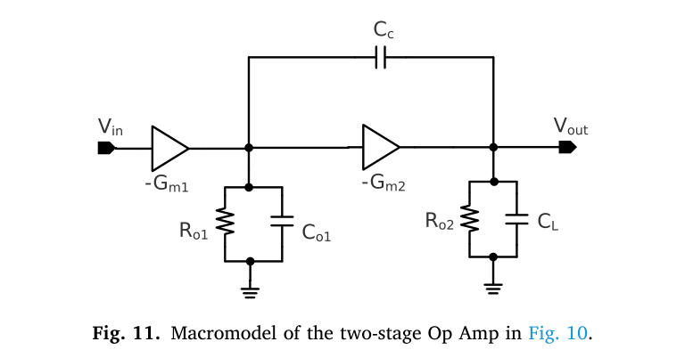
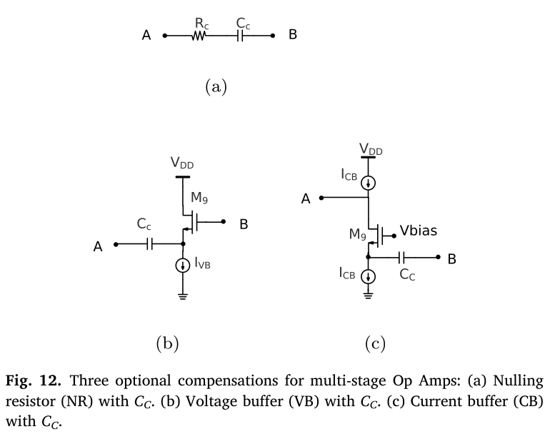

`原文式 (14)`把 GBW 转为输入管 $\eta$ 与 $C_c$ 的关系：

$$
\begin{gathered}
f_{GBW}=\frac{g_{m1,2}}{2\pi C_c}\\
C_c=\frac{\eta_{1,2}I_{D1,2}}{2\pi f_{GBW}}
\end{gathered}
\tag{13}
$$

这里 $f_{GBW}$ 以 Hz 为单位；原文有时将 GBW 写成 $G_{m1}/C_c$，这一形式对应角频率 $\omega_{GBW}$，不能漏掉 $2\pi$。$C_c$ 同时影响内部充放电的 SR，不能仅为了 $\eta$ 落入有效范围就任意增大它。

`原文式 (15)`定义极点分离系数 $\chi=f_{p2}/f_{GBW}$。两极点、主极点充分低且零点影响可忽略时，$\mathrm{PM}\approx\arctan\chi$，所以 $\chi=2,3$ 分别对应约63.4°、71.6°。实际含 RHP 零点和额外极点时该关系只是估计。

`原文式 (16)–(18)`：

$$
\begin{aligned}
f_{p2}&\approx\frac{g_{m6}}{2\pi C_L},\\
g_{m6}&=2\pi\chi f_{GBW}C_L,\\
\eta_6&=\frac{2\pi\chi f_{GBW}C_L}{I_{D6}}
=\frac{2\pi\chi f_{GBW}}{SR^-}
\end{aligned}
\tag{14}
$$

最后一个等号采用 $\mathrm{SR}^{-}\approx I_{D6}/C_L$ 的近似，具体符号和限流管应由充放电路径核对。其他补偿拓扑必须使用自己的 $p_2$ 方程。

**补充理解**：简单 Miller 结构存在前馈路径造成的 RHP 零点，常见近似位置为 $\omega_z\approx g_{m6}/C_c$；该式是帮助理解 PM 偏差的通用解释，本文没有单独用它完成此案例的误差归因。不能把“$\chi=2$”视为自动保证60°以上 PM。

### 4.2 共享偏置下的 gm/ID 传播

Fig.13 的镜像偏置共享 $V_{GS}$。如果 $V_{GS}\text{–}\eta$ 曲线对 L 不敏感，确定前一支路 $\eta$ 后，后续镜像管暂用相同 $\eta$，从而减少自由度。再结合支路电流和本征增益查 W/L。

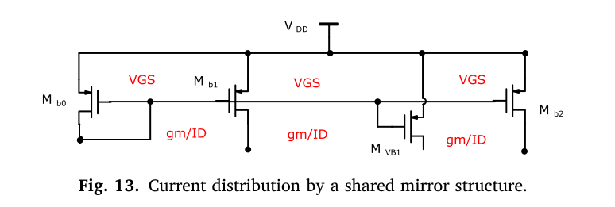

> **原文关于启发式传播**
> *“For devices whose VGS-vs-gm/ID curves are insensitive to the channel length L (as seen in Fig. 7), we may presume that all such devices have approximately equal gm/ID values.”*
>
> **解读**：条件是曲线对长度不敏感，并且只是“近似相等”。共享栅压不能消除 $V_{DS}$、$V_{SB}$、温度和短沟道效应造成的差异。

**补充判断**：相同器件类型、相近端电压和体偏置时传播较可信；跨 NMOS/PMOS、不同 L、不同电压余量时需要独立查表。原文第3.4节的一些直接复制尺寸是更强的简化，不能混同于普遍物理规律。

### 4.3 共源级的局部扫描与修正

查表固定的参考 $V_{DS}$ 与全电路实际工作点可能不同，导致两个 $r_o$ 未平衡、输出直流点偏移、整级增益下降。作者用 Fig.14 独立测试共源级，围绕前级已确定的 $V_{SG,\mathrm{ref}}$ 扫 $V_{SG}$ 和 L，从输出转移曲线的陡峭区找高增益点。

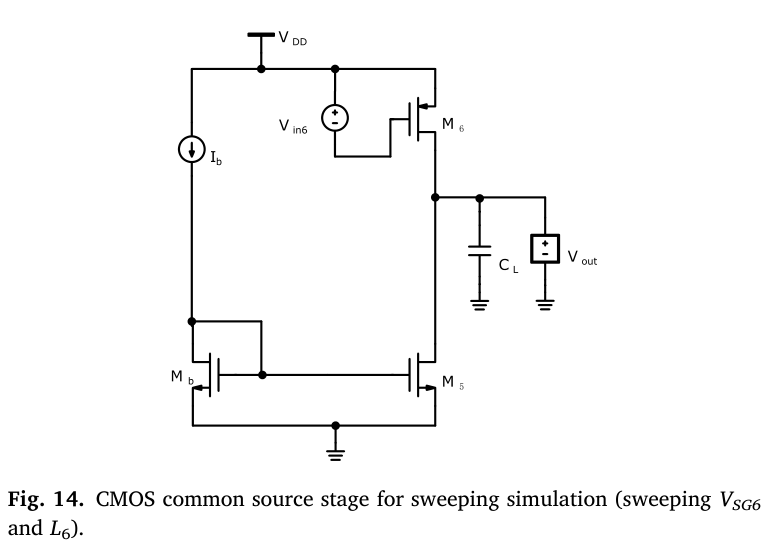
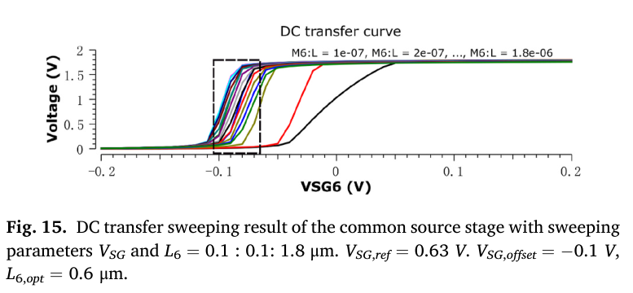

Fig.15 给出的参考 $V_{SG}$ 是0.63 V，图注偏移约−0.1 V，正文说聚集约−0.09 V；L 的示例扫描从0.1到1.8 μm，步长0.1 μm，图注推荐 $L_{\mathrm{opt}}=0.6$ μm。正文方法是先微调信号管 W，使高增益区域对齐已有前级输出偏置，再选合适 L；并不表示每个案例的最终 L 都等于0.6 μm。

**操作含义**：把大问题降为单级两参数扫描，保持已完成的前级设计，用 DC 偏置和局部增益的证据修正后级。完成后仍需要整机 DC/AC/瞬态验证。Remark 1 所说“唯一需要迭代的部分”是作者对这套初始流程的描述，不是对所有运放设计的承诺。

### 4.4 与其他尺寸设计方法的比较

作者强调三个区别：用噪声方程构造负载 $\eta$ 上界，而非直接把负载噪声完全忽略；联合多个规格形成二维可行域；以 LUT 完成偏置到尺寸的可靠映射，并允许轻量局部修正。作者同时讨论传统 PSO 方法、结合 LUT 的启发式优化，与自己的人工可循序执行的初始方法之间的差别。

`原文式 (19)`在完整差分噪声表达中显式带系数2；`原文式 (20)`基于负载 $g_m$ 远小于输入 $g_m$ 的假设估计输入 $g_m$。作者认为不能无条件忽略负载 $g_m$，尤其在 $r_o$ 平衡关系下它仍与级增益有关。

**评价**：这是有意义的方法论比较，但文中没有给出相同拓扑、相同预算、相同终止条件下各算法的统一性能/耗时基准，因此不能从本文推出某个优化算法必然慢多少倍。

对于纯前馈且寄生影响重要的结构，本文明确要求修改流程，并纳入 $f_T$ 等速度数据；这也是第4章再次强调的适用边界。

## 5. 单级运放：完整尺寸推导与结果对照

### 5.1 案例仿真条件

原文：采用 NGSPICE、BSIM3、180 nm CMOS 模型验证三个拓扑。单级为 Fig.2；二级为 Fig.10 的简单 Miller 补偿（SMC）；三级为 Fig.18 的 RNMCVB，即反向嵌套 Miller 补偿加电压缓冲。Table 1 列出1.8 V供电。本文没有报告流片照片、面积、实测效率、完整 PVT/Monte Carlo 或版图后提取验证。

**在 PMIC 中的应用**：$g_m/I_D$ 可用于误差放大器、OTA、电流检测放大器和偏置电路等小信号模块。Buck 功率管的导通电阻、栅电荷与开关损耗优化需要另行建模。

### 5.2 单级差分运放的尺寸流程

单级案例采用图 2：输入对为 $M_1/M_2$，镜像负载为 $M_3/M_4$，尾管为 $M_0$，偏置参考管为 $M_b$。这也明确了前文输入级约束中的器件编号。

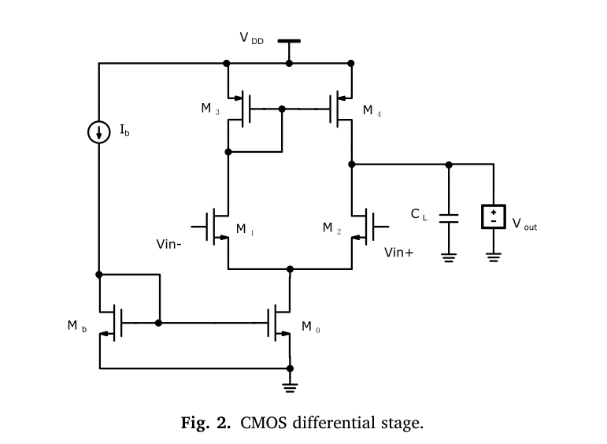

目标：$C_L=5$ pF、$I_b=10$ μA、尾电流20 μA、增益32 dB（约40倍）、$f_{GBW}=5\,\mathrm{MHz}$、$\mathrm{SR}=4\,\mathrm{V/\mu s}$、$\mathrm{PM}=70^\circ$、$\mathrm{CMRR}=70\,\mathrm{dB}$、$\mathrm{ICMR}=[0.7,1.6]\,\mathrm V$、输入热噪声17.7 nV/√Hz。

**Step 1–2：算输入 $g_m$ 与 $\eta$。** 每个输入管电流10 μA：

$$
\begin{gathered}
g_{m1,2}=2\pi(5\times10^6)(5\times10^{-12})\\
=157.08\,\mathrm{\mu S}\\
\eta_{1,2}=15.708\ V^{-1}
\end{gathered}
\tag{15}
$$

原文 Step 1 印成15.7 μS，但 Step 2 给 $\eta=15.7$ S/A；按参数重算应为157 μS。这一数值与所给参数及下一步 $\eta$ 不一致，计算时采用157 μS。

**Step 3：增益决定 L。** $A_{stg}\approx 40$，选 $A_{M1,2}\approx 80$（38 dB），由$\eta$和本征增益查 L，然后查 $I_{D,\mathrm{norm}}$ 求 W。最终输入管6.6/0.8 μm。

**Step 4：ICMR 下界。** 原文查得 $\eta_{3,4,\min}=8.7$，$\eta_{0,\min}=9.05$ S/A。L 尚未确定时，作者取各 L 曲线中较小的 $\eta$ 边界；最终仍需按选定 L 检验。

**Step 5：噪声上界。** 采用$\gamma_N=\gamma_P=2/3$，并按差分半电路处理 PSD，得 $\eta_{3,4,\max}=19.3$ S/A。该数是论文报告值；完整电路的最终仿真噪声并未达到表中目标，因此不能以这个上界推断全电路已经满足热噪声指标。

**Step 6：CMRR 斜边。** 对32 dB差模增益和70 dB CMRR，$A_{cm,\max}=10^{(32-70)/20}\approx0.01259$。取尾管 $A_{M0}=100$，斜率约1.26，即 $\eta_0\le1.26\eta_{3,4}$。

**Step 7：选区域内点。** 作者选$(\eta_{3,4},\eta_0)=(12,12)$。该点满足$8.7\le12\le19.3$、$12\ge9.05$、$12\le1.26\times12$。

**Step 8–10：负载、尾管和偏置管。** `原文式 (13)`给 $A_{M3,4}\approx80\times12/15.7\approx61.1$。按各自$(I_D,\eta,A_M)$查表；尾管使用20 μA、$\eta=12$、$A_{M0}=100$。Mb 与M0同 L，电流减半，W近似减半。

| 器件 | Table 2 最终 W/L |
|---|---|
| M1、M2 | 6.6/0.8 μm |
| M3、M4 | 6.6/0.4 μm |
| M0 | 14.3/2.0 μm |
| Mb | 7.1/2.0 μm |

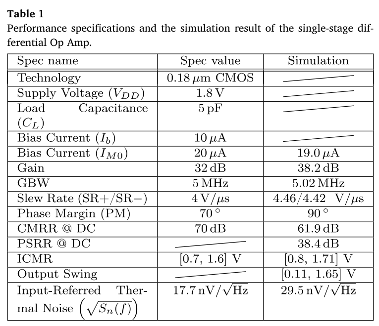
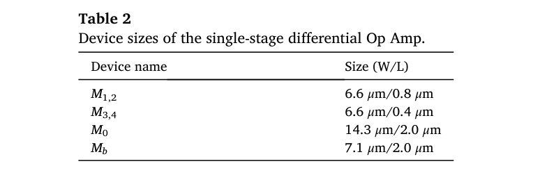
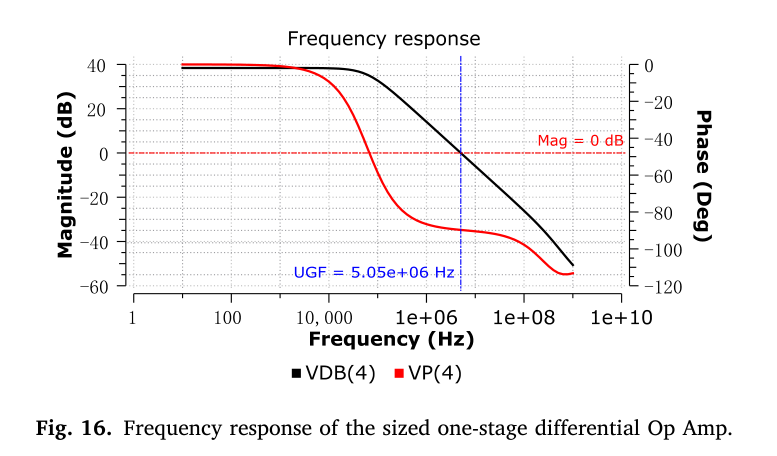

### 5.3 单级结果逐项判断（Table 1）

| 指标 | 目标 | 仿真 | 判断 |
|---|---|---|---|
| 尾电流 | 20 μA | 19.0 μA | 略低于分配值 |
| DC增益 | 32 dB | 38.2 dB | 达到 |
| GBW | 5 MHz | 5.02 MHz | 达到 |
| SR⁺/SR⁻ | 4 V/μs | 4.46/4.42 V/μs | 达到 |
| PM | 70° | 90° | 达到 |
| CMRR @ DC | 70 dB | 61.9 dB | 未达到 |
| PSRR @ DC | 未设 | 38.4 dB | 仅报告 |
| ICMR | [0.7,1.6] V | [0.8,1.71] V | 低端未覆盖目标0.7 V |
| 输出摆幅 | 未设 | [0.11,1.65] V | 仅报告 |
| 输入热噪声 | 17.7 nV/√Hz | 29.5 nV/√Hz | 未达到，幅度约高67% |

**评价**：作者强调 AC 主指标实现且无需额外尺寸微调，表格却清楚显示 CMRR、噪声、ICMR 仍有偏差。正确学习方式是认可初始解的效率，同时保留不满足项，不能将 Remark 2 解读成全部性能达标。

## 6. 两级 Miller 运放：补偿与稳定性

### 6.1 两级运放的尺寸流程

新增第二级后，第一级不再直接以 $C_L$ 定 GBW，而以 Miller $C_c$ 定 GBW；第二级 $g_m$ 负责非主极点。尺寸流程如下。

1. **分配电流**：正文 Step 1 为首级尾电流30 μA、第二级60 μA，因此每个输入管15 μA。Table 3 却写首级尾电流目标20 μA。需要保留这一不一致，不能声称整套数据完全统一。
2. **分配增益**：80 dB 分为首级38 dB、次级42 dB，本征增益目标各加约6 dB，即44、48 dB。
3. **选 $C_c$**：$\eta\in[2,24]$、$I_D=15$ μA、$f_{GBW}=10$ MHz，$C_c\in[0.477,5.730]$ pF；作者近似写[0.5,5.7] pF。选2 pF得到$g_{m1,2}=125.66$ μS、$\eta_{1,2}\approx 8.38$。
4. **完成首级**：沿单级的方法处理 ICMR、噪声、CMRR 和输出电阻匹配；不是把单级的全部尺寸原样照抄。
5. **算后级 $g_m$**：取$\chi=2$、$C_L=5$ pF、$I_{D6}\approx 60$ μA，$g_{m6}=628.32$ μS，$\eta_6\approx 10.47$ S/A。正文 Step 5 打印的$\eta$式子漏了 $C_L$；按`原文式 (18)`补上 $C_L$ 才具有正确单位并得到10.4。
6. **负载传播与修正**：对共享偏置的 M5 暂取 $\eta_5\approx\eta_0$，用`原文式 (13)`求其 $A_M$，再查表。若 DC 增益不理想，按原文第2.7节的局部扫描，调整第二级器件的 W/L 和偏置对齐。

| 器件 | Table 4 最终 W/L 或值 |
|---|---|
| M1、M2 | 7.7/2.0 μm |
| M3、M4 | 7.5/0.4 μm |
| M5 | 42.6/2.0 μm |
| M6 | 32.2/0.8 μm |
| M0、Mb | 14.2/2.0 μm |
| $C_c$ | 2 pF |

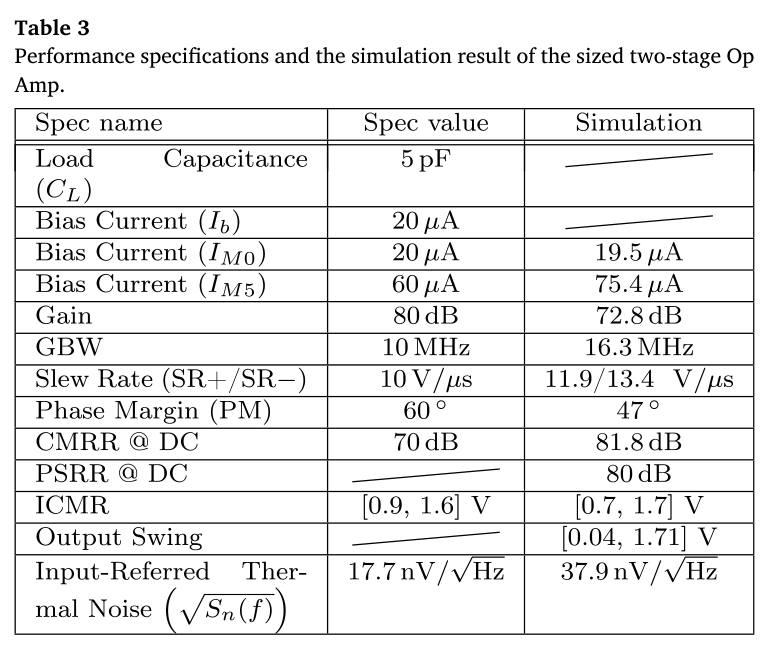
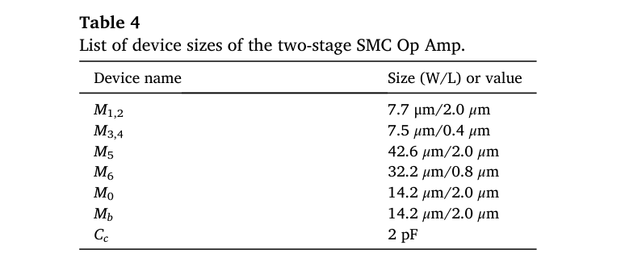
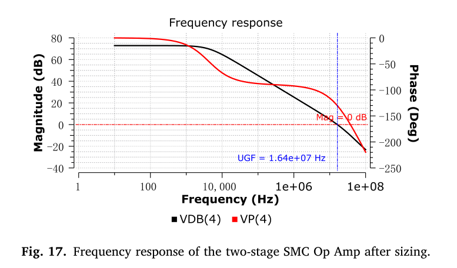

### 6.2 两级结果逐项判断（Table 3）

| 指标 | 表中目标 | 仿真 | 判断 |
|---|---|---|---|
| $C_L$ | 5 pF | 固定仿真条件 | 不作为独立测得指标 |
| 尾电流 | 20 μA；正文分配30 μA | 19.5 μA | 原文目标不一致 |
| 次级电流 | 60 μA | 75.4 μA | 高于分配值约26% |
| DC增益 | 80 dB | 72.8 dB | 低7.2 dB |
| GBW | 10 MHz | 16.3 MHz | 高于目标 |
| SR⁺/SR⁻ | 10 V/μs | 11.9/13.4 V/μs | 达到 |
| PM | 60° | 47° | 未达到 |
| CMRR @ DC | 70 dB | 81.8 dB | 达到 |
| PSRR @ DC | 未设 | 80 dB | 仅报告 |
| ICMR | [0.9,1.6] V | [0.7,1.7] V | 覆盖目标 |
| 输出摆幅 | 未设 | [0.04,1.71] V | 仅报告 |
| 输入热噪声 | 17.7 nV/√Hz | 37.9 nV/√Hz | 未达到，约为2.14倍 |

> **原文对初始设计目标的界定**
> *“our purpose of initial sizing is not seeking an exact satisfaction of all design targets, but rather to work out a preliminarily sized design with a working performance.”*
>
> **解读**：作者明确承认初始设计的目标是先得到可工作的电路，后续仍可能需要优化。读表时尤其不能因 GBW 提升就忽略 PM 降低和增益/噪声失败。

**补充分析**：实际 GBW 超过预算，会使原来按目标 GBW 分配的非主极点相对距离变小；SMC 前馈零点、实际 $g_m$/电流偏差、未计寄生也可能增加相位损失。这些是合理候选原因，原文并未给出逐项仿真拆分，不能确定每项的贡献。下一轮优化应一起核查 DC、$p_2$、零点、PM、功耗和噪声，避免只追逐增益或 GBW。

## 7. 三级 RNMCVB：拓扑专属方程与尺寸

### 7.1 三级拓扑与补偿作用

Fig.18：首级为互补极性的常规差分级；第二级由 Mb2 和 M5 构成；第三级含 M6/M9 与镜像负载 M7/M8。$C_{c1}$ 跨首级和第三级提供主补偿，$C_{c2}$ 通过 $M_{VB}$/$M_{VB1}$ 的电压缓冲支路参与补偿零点。M9 的栅压必须匹配 M6 的实际栅源偏置。

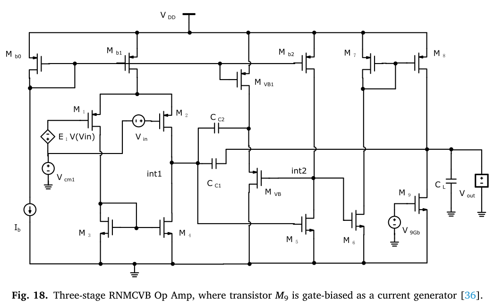

### 7.2 从补偿方程确定尺寸

以下 p、z 用 rad/s；转换 Hz 时除以2π。原文 $G_{m3}=g_{m6}$，令$\rho=g_{m6}/g_{mVB}$，并记 $D=C_L+(1+\rho)C_{c1}$，将`原文式 (23)、(24)`提取公因子后写为：

$$
\begin{gathered}
z_1=-\frac{g_{mVB}}{C_{c2}}\\
f_{GBW}=\frac{g_{m1,2}}{2\pi C_{c1}}
\end{gathered}
\tag{16}
$$

$$
\begin{gathered}
D=C_L+(1+\rho)C_{c1},\\
p_2=-\frac{C_{c1}G_{m3}}{C_{c2}D}
\end{gathered}
\tag{17}
$$

$$
p_3=-\frac{C_{c2}g_{mVB}D}{C_{c1}C_L}
\tag{18}
$$

在$\rho\approx1$的初始假设下：

$$
p_2\approx-\frac{C_{c1}g_{m6}}{C_{c2}(C_L+2C_{c1})}
\tag{19}
$$

**解读**：这个结构的次主极点取决于第三级 $g_{m6}$ 和两个补偿电容，而不是像两级 SMC 那样只用$g_{m6}/C_L$。第二级 $G_{m2}$ 没有出现在作者保留的主导方程中，因此先主要按 DC 增益设计；这不是说真实电路的第二级及其寄生完全不影响频率响应。

令 $|p_2|=2\pi\chi f_{GBW}$，根据`原文式 (26)`应推导：

$$
g_{m6}\approx2\pi\chi f_{GBW}\frac{C_{c2}(C_L+2C_{c1})}{C_{c1}}
\tag{20}
$$

**重要校核**：原文 Step 6 又写$\eta_6=\chi\,2\pi f_{GBW}/I_{D6}$，并引用两级的`原文式 (17)`，缺少电容因素且量纲不对。三级应从`原文式 (26)`重推。取$C_L=10$ pF、$C_{c1}=2$ pF、$C_{c2}=0.5$ pF、$f_{GBW}=5$ MHz、$\chi=2$、$I_{D6}=20$ μA，得到$g_{m6}\approx 219.91$ μS、$\eta_6\approx 11.0$ S/A，与原文报告的数值一致。

### 7.3 三阶段十步流程的具体含义

1. **电流分配**：Table 5 的偏置参考10 μA，Mb1/Mb2各10 μA，$M_{VB1}$与输出 M7/M8 的分配值各20 μA；必须以图中支路关系核对总电流，不能直接把所有表中电流相加当作芯片 $I_Q$。
2. **增益分配**：120 dB 均分为三段各40 dB。每级信号管初始本征增益200倍，约46 dB。
3. **首级 $g_m$/$\eta$**：每个输入管5 μA、$C_{c1}=2$ pF、$f_{GBW}=5\,\mathrm{MHz}$，$g_{m1,2}\approx 62.83$ μS，$\eta\approx 12.57$ S/A，原文近似12.5。
4. **首级其余器件**：沿此前的 ICMR/噪声/共模增益可行域流程完成。因输入极性改变，要按对应器件表和余量关系使用约束。
5. **第二级**：Mb2复制Mb1的初始偏置和尺寸；令$\eta_5=\eta_{b2}$，信号管 $A_{M5}\approx2A_{stg2}$，据$(I_{D5},\eta_5,A_{M5})$求 $W_5/L_5$。
6. **第三级信号管**：采用上方三级 $p_2$ 方程而非两级公式，选$C_{c2}=0.5$ pF和$\chi=2$，得到$\eta_6\approx 11$。再用电流与本征增益查M6尺寸。
7. **M9偏置**：查得$V_{GS6}$后令$V_{GS9}=V_{GS6}$；该电压初始是表值，最终需用全电路实际工作点修正。
8. **镜像负载M7/M8**：作者先令$\eta_{7,8}=\eta_6$，由`原文式 (13)`令$A_{M7}=A_{M6}$，再查相应器件表。
9. **VB支路**：作者为简化初始流程，复制前支路的$\eta$与W/L到$M_{VB}$/$M_{VB1}$。Remark 3指出这是简化；真实$g_{mVB}$并不一定与$g_{m6}$相等，且表中VB电流偏差也说明不能将复制视为最终匹配。
10. **全电路检查与轻修正**：调整第二级M5的W/L、检查AC，并用实际$V_{GS6}$设置M9。最终作者把L5从2.0 μm减至1.8 μm以改善增益。

### 7.4 最终器件与补偿值（Table 6）

| 器件/元件 | 最终值 |
|---|---|
| M1、M2 | 10.4/1.0 μm |
| M3、M4 | 3.6/2.0 μm |
| M5 | 7.2/1.8 μm；L从2.0微调 |
| M6、M9 | 11.8/2.0 μm |
| M7、M8 | 10.6/0.4 μm |
| Mb0、Mb1、Mb2 | 6.8/0.4 μm |
| $M_{VB}$、$M_{VB1}$ | 6.8/0.4 μm |
| $C_{c1}$、$C_{c2}$ | 2 pF、0.5 pF |
| $V_{GS9}$ | 0.82 V，匹配实际$V_{GS6}$ |

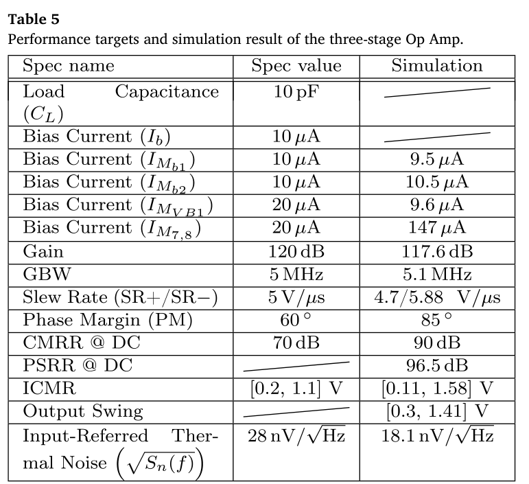
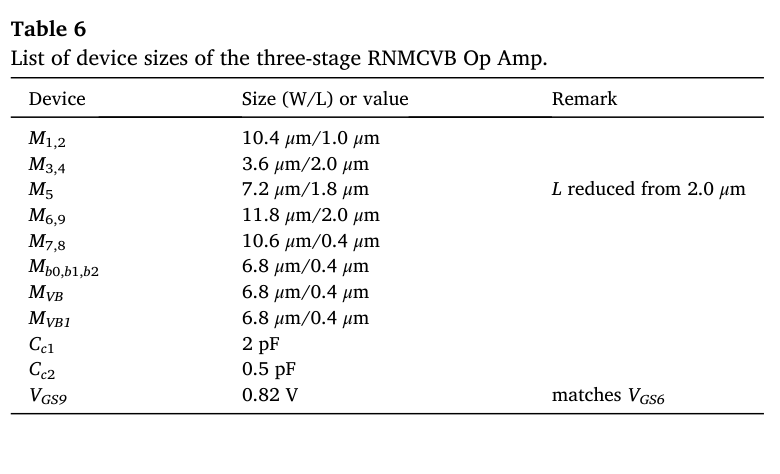
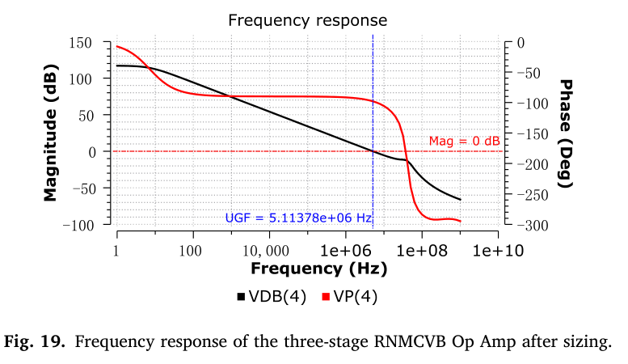

### 7.5 三级结果逐项判断（Table 5）

| 指标 | 目标 | 仿真 | 判断 |
|---|---|---|---|
| $C_L$ | 10 pF | 固定条件 | 不作为独立测得指标 |
| $I_{Mb1}$ | 10 μA | 9.5 μA | 接近分配值 |
| $I_{Mb2}$ | 10 μA | 10.5 μA | 接近分配值 |
| $I_{M_{VB1}}$ | 20 μA | 9.6 μA | 明显低于分配值 |
| $I_{M7,8}$ | 20 μA | 147 μA | 约7.35倍，严重超预算 |
| DC增益 | 120 dB | 117.6 dB | 低2.4 dB |
| GBW | 5 MHz | 5.1 MHz | 达到 |
| SR⁺/SR⁻ | 5 V/μs | 4.7/5.88 V/μs | 正向略未达到 |
| PM | 60° | 85° | 达到 |
| CMRR @ DC | 70 dB | 90 dB | 达到 |
| PSRR @ DC | 未设 | 96.5 dB | 仅报告 |
| ICMR | [0.2,1.1] V | [0.11,1.58] V | 覆盖目标 |
| 输出摆幅 | 未设 | [0.3,1.41] V | 仅报告 |
| 输入热噪声 | 28 nV/√Hz | 18.1 nV/√Hz | 达到 |

> **原文主动报告的电流代价（Remark 5）**
> *“the quiescent current of the output stage, IM7,8 = 147 μA, is greatly higher than the spec 20 μA.”*
>
> **解读**：论文主动披露了主要失败项。三级案例具有高增益和较好频率响应，但不能被引用为严格满足低功耗预算的设计。

作者解释：$V_{GS6}=0.82$ V偏高，使M6的$g_m/I_D$偏低、$I_D$偏高；它又等于第二级$V_{DS5}$，若降低此电压，需要同时调整M5和Mb2的尺寸/工作点。若目标确实要求高SR，大输出电流也可能是合理的，但这必须重新纳入规格分配。**补充建议**：加入第二级输出电压约束、重新算输出级实际$\eta$、迭代$g_{mVB}/g_{m6}$和$p_2$，再核验功耗及SR；不能仅复制原文W/L就宣称实现了20 μA输出偏置。

## 8. 方法边界与数值校核

### 8.1 初始设计的适用范围

作者强调增益、GBW、PM是多级运放的首要指标；联合设计方程与 $g_m/I_D$ 表把尺寸设计变为一系列代数计算和查表，输出电阻平衡、偏置传播和局部扫描则加快初始流程。若寄生在极点/零点中成为主导因素，就必须开发新的顺序设计流程。

> **原文对 SPICE 的定位**
> *“SPICE simulation becomes only a means of validation and light-loaded sizing correction.”*
>
> **解读**：这句话的适用范围是本文构建的初始设计流程；实际产品设计仍需充分验证。查表本身也来源于器件模型仿真。

### 8.2 五处数值与符号校核

| 位置 | 原文情况 | 本笔记处理 |
|---|---|---|
| 3.2 Step 1 | $g_m=15.7$ μS与下一步$\eta$及参数不一致 | 重算应为157.08 μS |
| 3.3 Step 1 / Table 3 | 首级尾电流30 μA与20 μA不一致 | 正文流程按15 μA/输入支路重算，表格照录 |
| 3.3 Step 5 | $\eta_6$式子缺$C_L$ | 采用`原文式 (18)`，得到约10.47 S/A |
| 3.4 Step 6 | 打印式缺电容因素且援引两级关系 | 按`原文式 (26)`重推，得到约11.0 S/A |
| 2.4.2.1 | Fig.2 NMOS输入对的阈值下标出现p | 以实际NMOS饱和边界检查，不混用阈值符号 |

**复算原则**：优先采用拓扑、量纲、自洽的完整方程和仿真表格相互核对。以上是笔记对不一致的标注，并非对作者发布正式勘误的声称。

### 8.3 三个案例的核心结论对比

| 案例 | 优点证据 | 主要未达标项 |
|---|---|---|
| 单级 | 增益38.2 dB、GBW5.02 MHz、PM90° | CMRR、噪声、ICMR低端 |
| 两级SMC | GBW16.3 MHz、SR和CMRR较好 | 增益、PM47°、噪声、电流预算 |
| 三级RNMCVB | 增益117.6 dB、GBW5.1 MHz、PM85°、噪声18.1 nV/√Hz | 输出电流147 μA、增益稍低、SR⁺稍低 |

**总评价**：论文强项是可解释、可执行的初始设计流程，尤其可行区域和局部修正；限制是近似寄生/偏置、部分目标失败，以及缺少统一优化比较、原始LUT、完整电路验证与实测。应把它作为“从规格获得有依据初始解”的基础知识，不把示例尺寸当作跨工艺设计模板。

## 参考文献

本文依据施国勇的研究整理，所用 17 幅图和 6 张表均来自原文，沿用原始编号。案例均为 NGSPICE 仿真结果，数值校核为本笔记的推导。

- Guoyong Shi. *Sizing of multi-stage Op Amps by combining design equations with the $g_m/I_D$ method*. Integration, 79 (2021): 48–60. [DOI: 10.1016/j.vlsi.2021.03.003](https://doi.org/10.1016/j.vlsi.2021.03.003)。

原文中与本方法直接相关的参考：

- [18] Silveira、Flandre、Jespers，1996，*A $g_m/I_D$ based methodology for the design of CMOS analog circuits and its application to the synthesis of a silicon-on-insulator micropower OTA*，JSSC 31(9):1314–1319。理解$g_m/I_D$最初的设计角色。
- [23] Jespers、Murmann，2017，*Systematic Design of Analog CMOS Circuits Using Pre-computed Lookup Tables*。理解系统化查表和尺寸设计。
- [21] Sabry、Omran、Dessouky，2018，*Systematic design and optimization of operational transconductance amplifier using $g_m/I_D$ design methodology*。DOI 10.1016/j.mejo.2018.02.002。理解单级系统化约束。
- [22] Aminzadeh，2020，*Systematic circuit design and analysis using generalised $g_m/I_D$ functions of MOS devices*。DOI 10.1049/iet-cds.2019.0209。理解更广泛的器件函数与变化数据。
- [36] Mita、Palumbo、Pennisi，2003，*Design guidelines for reversed nested Miller compensation in three-stage amplifiers*。理解本文三级RNMCVB的补偿来源。
