> **论文核心亮点与芯片定位**
> - **行业历史地位**：本文是电源管理集成电路（PMIC）与开关电容（Switched-Capacitor, SC）转换器领域的**里程碑之作**。它彻底终结了经典 Dickson 电荷泵中二极管阈值压降（$V_{TH}$）逐级累加及体效应（Body Effect）导致的低压转换失效，确立了现代集成电路中沿用至今的 **“交叉耦合倍压单元（Favrat Cell）+ 动态衬底自适应换向（Dynamic Bulk Switching）”** 黄金拓扑结构。
> - **核心技术突破**：
>   1. **动态衬底换向技术（Dynamic Bulk Switching）**：引入仅由两只最小尺寸 PMOS 构成的极简换向网络，动态将 PMOS 开关的 N 阱偏置至源极与漏极中的最高瞬时电位，彻底阻断寄生垂直 PNP 双极型晶体管导通，将衬底注流从 0.5mA 压缩至皮安级（$< 10^{-10}\text{ A}$），杜绝 Latch-up 风险。
>   2. **全摆幅栅极电平移位（Full-Swing Level Shifting）**：将串联 PMOS 开关管的栅极驱动摆幅由传统的 $V_{IN} \sim 2V_{IN}$ 扩展至 $0 \sim 2V_{IN}$，过驱动电压提升多达 4 倍，导通内阻降低为原来的 1/4。
>   3. **超低压启动自举拓扑（Sub-1V Auxiliary Booster）**：提出辅助微型倍压驱动单元，在 $V_{IN} < V_{TH} + 500\text{mV}$ 时将核心 NMOS 栅极驱动电压推升至 $3V_{IN}$，突破亚伏特启动瓶颈。
>   4. **完整的开关电容内阻与能量效率解析模型**：严格推导了包含慢速开关极限（SSL）、快速开关极限（FSL）、死区非重叠时间 $T_{SW}$、开关导通电阻 $R_{ON}$ 以及寄生底板电容比例系数 $\alpha = C_S/C$ 的能量转换效率闭式解与最优负载匹配公式。
> - **芯片实测速记**：
>   - **片外电容版 (2.0µm CMOS)**：$V_{IN} = 1.1\text{V} \sim 1.5\text{V}$ | $f_{SW} = 50\text{kHz}$ | $C = 100\text{nF}$ | $I_{OUT} = 1\text{mA}$ | **实测峰值效率 95.6%** | 静态功耗仅 $30\mu\text{A}$。
>   - **全集成版 (0.7µm CMOS)**：$V_{IN} = 3.0\text{V}$ | $V_{OUT} = 5.3\text{V}$ | $f_{SW} = 10\text{MHz}$ | $C = 100\text{pF}$ (MOS电容) | $I_{OUT} = 2\text{mA}$ | **实测峰值效率 75%** | 芯片面积仅 $500 \times 300\,\mu\text{m}^2$。

---

## 1. 芯片电气性能与设计指标 (Specs Table)

| 参数类别 | 参数项 (Parameter) | 片外电容版本 (Discrete Caps) | 全集成版本 (Fully Integrated) | 物理意义与设计考量 |
| :--- | :--- | :--- | :--- | :--- |
| **工艺制程** | Process Technology | **2.0 µm CMOS** (双层金属/双层多晶) | **0.7 µm Digital CMOS** | 早期高压与标准数字互补工艺 |
| **输入电压** | Input Voltage ($V_{IN}$) | **1.1 V ~ 1.5 V** (极低压电池供电) | **3.0 V** (标准低压输入) | 突破 $V_{TH}$ 压降限制 |
| **输出电压** | Output Voltage ($V_{OUT}$) | **2.1 V ~ 2.9 V** (升压倍压) | **5.3 V** (接近理想 2 倍压 6V) | 纹波与电压跌落 $\Delta V_{OUT}$ 依赖负载 |
| **最大负载** | Max Load Current ($I_{OUT}$) | **1.0 mA ~ 5.0 mA** | **2.0 mA** (在 10MHz 下输出能力) | 适应生物医疗 ASIC / 模拟前端偏置 |
| **开关频率** | Switching Frequency ($f_{SW}$) | **50 kHz** | **10 MHz** (可在 100kHz~10MHz 调频) | 频率随电容容量做系统级 trade-off |
| **无源器件** | Pump Capacitor ($C$) | 片外 $2 \times 100\,\text{nF}$ 贴片电容 | 片上 $2 \times 100\,\text{pF}$ NMOS 积累区电容 | $\alpha = C_{BP}/C \approx 0.002$ vs $0.096$ |
| **滤波电容** | Output Capacitor ($C_{OUT}$) | 片外电解/陶瓷电容 | 片上可选集成 / 紧凑型极板 | 衬底换向后无需巨大 $C_{OUT}$ 防止漏电 |
| **效率表现** | Peak Power Efficiency ($\eta_{max}$) | **95.6%** (测试与理论模型完美贴合) | **75.0%** (受限于片上 MOS 电容寄生 $\alpha$) | 转换效率完全由无源元件品质决定 |
| **静态功耗** | No-load Current ($I_Q$) | **30 µA** (含 15µA 驱动反相器短路电流) | 随驱动时钟频率线性增加 | 无偏置运放，纯动态低功耗工作 |
| **输出内阻** | Output Resistance ($R_S$) | 理论 $100\,\Omega$ ($1/(2fC)$) | 500 $\Omega$ ~ 800 $\Omega$ | 呈现出明显的 SSL 与 FSL 两段特性 |
| **芯片面积** | Active / Die Area | 裸片 $1.4 \times 0.56\,\text{mm}^2$ (有源区 $1\,\text{mm}^2$) | $500 \times 300\,\mu\text{m}^2$ ($0.15\,\text{mm}^2$ 无需 Pad) | 全集成电荷泵无需外引脚，面积紧凑 |

---

## 2. 研究背景与设计痛点 (Motivation & Bottlenecks)

### 2.1 传统集成电荷泵的核心物理瓶颈

在 1990 年代以前，片上高压产生电路主要依赖 Dickson 电荷泵。然而伴随半导体工艺向深亚微米演进以及电池便携式设备的普及，供电电压急剧下降至 1V~2V，传统方案遭遇了无法克服的物理瓶颈：

```
[经典 Dickson 架构]                [Nakagome 交叉耦合单元]            [Cho & Gray 方案缺陷]
Diode-connected MOS              Cross-Coupled NMOS                 PMOS 衬底悬空 / 偏置不足
  +---|>|---+---|>|---+            +---||--[ M1 ]--+                  Pump Node > Bulk + V_junction
  |   V_th  |   V_th  |            |               |                              |
 C1        C2        C3           C1              C2                              v
逐级累加体效应 Delta V_th         仅有时钟提升功能，无直流DC输出        寄生 PNP 导通，0.5mA 衬底注流
低压下直接无法导通升压!             需额外 PMOS 串联整流管             引发 Latch-up 闭锁与效率骤降
```

1. **二极管阈值压降与体效应（Body Effect）恶化**：
   - 经典 Dickson 电荷泵采用二极管连接的 MOSFET 传输电荷。每级理论升压为 $V_{DD} - V_{TH}$。
   - 随着级数增加，管子的源衬底偏压 $V_{SB}$ 逐级升高，导致阈值电压因体效应显著剧增：
     $$\Delta V_{TH} = \gamma \left(\sqrt{2\phi_F + V_{SB}} - \sqrt{2\phi_F}\right)$$
   - 当输入电压 $V_{IN} \le 1.5\text{V}$ 时，甚至会出现 $V_{IN} \approx V_{TH}$，使得泵单元完全无法导通传输电荷，效率趋于零。
2. **Nakagome 交叉耦合单元的局限（图 1）**：
   - Nakagome 等人在 1991 年 JSSC 上针对 DRAM 时钟驱动提出了交叉耦合 NMOS 单元（图 1），利用交叉连接的栅极实现零 $V_{TH}$ 开关导通，且 NMOS 衬底接最低电位，天然处于反偏。
   - **致命缺陷**：该单元只能输出高频互补升压交流时钟（$OUT1, OUT2$），无法直接输出稳定的直流高压（DC Output）。要获得直流输出，必须在输出端串联整流开关管。
3. **PMOS 串联整流管的寄生双极型效应（图 2 与图 3）**：
   - 为避免在输出端再次出现 NMOS 的 $V_{TH}$ 阈值损失，串联开关必须采用 PMOS 管（图 2 中的 P1, P2）。
   - 然而在标准 N 阱 CMOS 工艺中，PMOS 的源极和漏极（$p^+$ 区）与 N 阱、P 衬底共同构成了**寄生垂直 PNP 双极型三极管（Q1, Q2）**以及横向 PNP 晶体管（Q3）（图 3）。

| 交叉耦合单元雏形 (Nakagome) | Cho & Gray 早期直流倍压尝试 | PMOS 寄生双极型晶体管横截面 |
| :---: | :---: | :---: |
| 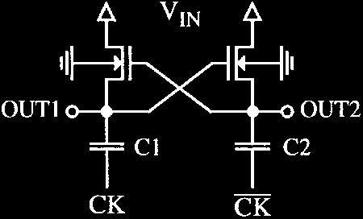 | 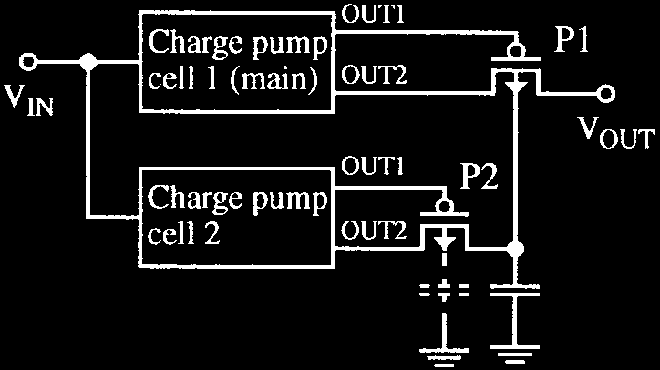 | 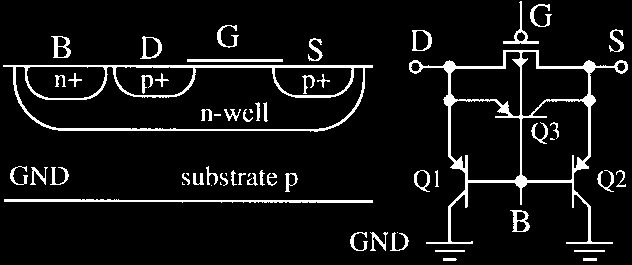 |
| **图 1**：Nakagome 交叉耦合时钟升压单元 | **图 2**：Cho & Gray 采用辅助电荷泵偏置 PMOS 衬底 | **图 3**：标准 N-well PMOS 中的寄生 PNP 结构 |

4. **Cho & Gray (1994 CICC) 方案的缺陷**：
   - Cho & Gray 尝试采用辅助电荷泵来提升主开关 P1 的 N 阱电位（图 2）。
   - 但在第二级电荷泵中，P2 的 N 阱仅连接到电容上，处于**动态悬空（Floating）状态**。
   - 当电路经历负载阶跃或启动时，P2 的漏极电位高于其 N 阱电位，导致 PN 结正向偏置，寄生垂直 PNP 开启，数十到数百微安的电流源源不断注向衬底，造成不可逆的电荷泄漏与系统发热。

### 2.2 本文切入点与重大创新

Favrat 等人提出了一整套从**器件级物理机制**到**电路级驱动优化**的系统性创新：
1. **动态自适应换向（Bulk Commutation）**：仅需额外 2 个最小尺寸 PMOS，将 N 阱永远自动锁定在两端的最高电位，从根源上将寄生 PNP 的基发射极结电压钳位在反偏或零偏状态。
2. **驱动摆幅倍增**：设计专用的交叉耦合自偏置电平移位器，使得 PMOS 开关栅极驱动摆幅达到两倍 $V_{IN}$，导通电阻大幅下降。
3. **建立开关电容能量转换极限理论**：揭示了寄生底板电容与开关电容等效内阻对系统效率的物理制约，为现代 PMIC 设计提供了指导准则。

---

## 3. 系统拓扑与控制架构 (Topology & Working Principles)

### 3.1 核心拓扑架构

Favrat 倍压电路的核心拓扑如图 5 所示，其等效戴维宁模型如图 6 所示。

| 衬底自适应换向原理 | Favrat 高效率倍压电荷泵核心原理图 | 戴维宁等效输出电路模型 |
| :---: | :---: | :---: |
| 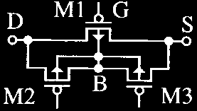 | 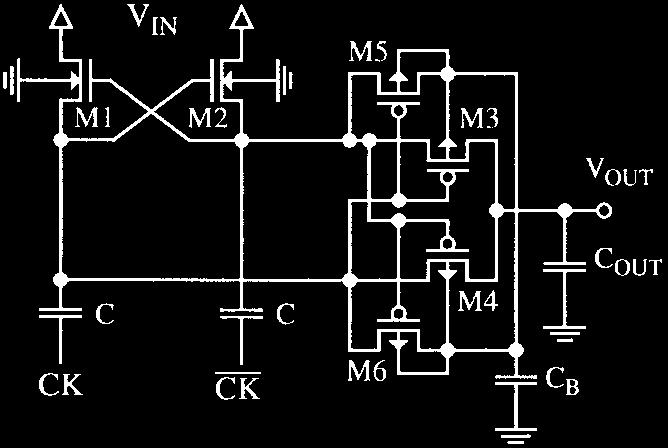 | 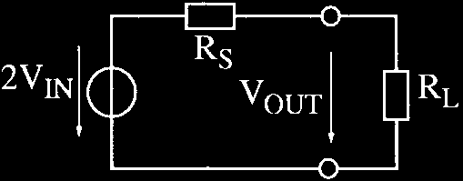 |
| **图 4**：将 PMOS 阱电位动态钳位至最高电压 | **图 5**：包含 M1~M6 及双飞跨电容的完整架构 | **图 6**：开路电压 $2V_{IN}$ 与源内阻 $R_S$ |

- **开关管组成**：
  - **M1, M2（下边充电开关，NMOS）**：交叉耦合连接。M1 栅极接泵节点 2，M2 栅极接泵节点 1，实现对飞跨电容 $C_1, C_2$ 的对地或对 $V_{IN}$ 充放电回路。
  - **M3, M4（上边输出串联开关，PMOS）**：交替将两路泵电容的升压电荷输出到 $V_{OUT}$。
  - **M5, M6（衬底动态换向开关，最小尺寸 PMOS）**：将 M3、M4 的公共 N 阱自动连接到 $OUT1, OUT2$ 与 $V_{OUT}$ 之间的瞬时最高电压。
  - **$C_1, C_2$（飞跨电容，Flying Capacitors）**：由互补时钟信号 $CK, \overline{CK}$ 驱动，容值均为 $C$。
  - **$C_B$（阱滤波/稳压小电容）**：容值极小，用于吸收换向瞬间的时钟馈通扰动，保持阱电位平稳。

### 3.2 两相非重叠工作模态分解

设时钟周期为 $T$，$CK$ 与 $\overline{CK}$ 为高电平为 $V_{IN}$、低电平为 $0$ 的互补两相不重叠时钟：

```
Phase 1: CK = Low (0V), /CK = High (Vin)
--------------------------------------------------------------------------------------
  - 泵节点 1 (Node 1): 底板为 0V，M1 开启，上板被充电钳位至 VIN。
  - 泵节点 2 (Node 2): 底板由 0V 跳变至 VIN，由于电容电压不能突变，上板电位泵升至 2*VIN。
  - 开关状态: M2 关断；M4 导通（栅极被拉低），将 Node 2 (2*VIN) 的电荷无损传输至 VOUT。
  - 衬底状态: Node 2 电位 (2*VIN) >= VOUT，M6 导通，公共 N-well 被可靠偏置到最高电位 2*VIN。

Phase 2: CK = High (Vin), /CK = Low (0V)
--------------------------------------------------------------------------------------
  - 泵节点 1 (Node 1): 底板由 0V 跳变至 VIN，上板电位泵升至 2*VIN。
  - 泵节点 2 (Node 2): 底板为 0V，M2 开启，上板被充电钳位至 VIN。
  - 开关状态: M1 关断；M3 导通（栅极被拉低），将 Node 1 (2*VIN) 的电荷无损传输至 VOUT。
  - 衬底状态: Node 1 电位 (2*VIN) >= VOUT，M5 导通，公共 N-well 被可靠偏置到最高电位 2*VIN。
```

由于两路时钟相位差为 $180^\circ$，每个时钟周期输出端都得到两次电荷注入，等效纹波频率为 $2f_{SW}$，极大地降低了输出滤波电容 $C_{OUT}$ 的纹波压力。

---

## 4. 理论推导：开关电容等效阻抗与能量转换效率模型

Favrat 论文在理论上作出的杰出贡献之一，是构建了统一的开关电容转换器戴维宁等效模型，并将寄生电容对转换效率的根本性限制用精确的数学解析式进行了量化。

### 4.1 稳态戴维宁等效输出内阻 ($R_S$) 的严格推导

开关电容倍压电路的输出特性完全可以等效为一个理想直流电压源 $2V_{IN}$ 串联一个等效输出阻抗 $R_S$（图 6）。

#### 1. 慢速开关极限 (Slow Switching Limit, SSL)
在低开关频率下，每个时钟相位的持续时间远大于开关与电容形成的充放电时间常数（$T/2 \gg R_{ON} \cdot C$），电荷传输完全完成。每个周期飞跨电容传输的电荷量为 $Q = 2 \cdot C \cdot \Delta V$。
忽略开关导通电阻，系统的输出源内阻表现为纯开关电容内阻：
$$R_{S,SSL} = \frac{1}{2 \cdot f \cdot C} \tag{1}$$
*式中的因子 2 源于 $C_1$ 与 $C_2$ 在互补时钟的两相中交替工作，等效为双倍电荷传输频率。*

#### 2. 考虑非重叠死区时间与开关电阻的完整内阻模型 (SSL 到 FSL)
当工作频率提升至兆赫兹级别时，开关导通电阻 $R_{ON}$ 以及为防止直通而必须设置的**非重叠死区时间 $T_{SW}$** 成为主导因素。
定义单周期内有效的电荷传输导通时间为：
$$T_{ON} = \frac{T}{2} - T_{SW} = \frac{1}{2f} - T_{SW} \tag{10}$$

电荷的不完全转移导致系统呈现一阶低通滤波响应特性。结合 Van Steenwijk 等人的电荷泵阻抗理论，串联源内阻的精确表达式修正为双曲余切形式：
$$R_S = \frac{1}{2 \cdot f \cdot C} \cdot \coth\left(\frac{T_{ON}}{R_{ON} \cdot C}\right) \tag{11}$$

系统的特征截止频率（Cutoff Frequency）定义为：
$$f_C = \frac{1}{2 \cdot (R_{ON} \cdot C + T_{SW})} \tag{12}$$

当开关死区可以忽略（$T_{SW} \to 0$），且开关频率趋于无穷大（$f \to \infty$）时，利用双曲函数渐进展开 $\coth(x) \approx \frac{1}{x}$，源内阻逼近其物理极限——**快速开关极限 (Fast Switching Limit, FSL)**：
$$\lim_{f \to \infty, T_{SW}=0} R_S = R_{ON} \tag{13}$$

> **阻抗反弹现象（Impedance Rebound）**
> 实际电路中由于必须存在死区时间 $T_{SW} > 0$，当开关频率超过 $f_C$ 后，$T_{ON} = \frac{1}{2f} - T_{SW}$ 急剧缩短，$\coth\left(\frac{T_{ON}}{R_{ON}C}\right)$ 迅速发散至无穷大。因此，**输出内阻 $R_S$ 随频率上升会先下降到极小值，随后强烈反弹增大（见图 22 实测波形）**！最佳工作频率区间必须严格设计在 $f \le f_C$ 范围内。

---

### 4.2 寄生电容比例系数 $\alpha$ 与能量效率极限推导

在集成电路中，任何电容都不可避免地存在寄生电容（图 7）。

| 电容寄生电容分布模型 | 效率随输出电压跌落关系 | 效率随负载匹配比 $R_S/R_L$ 变化 |
| :---: | :---: | :---: |
| 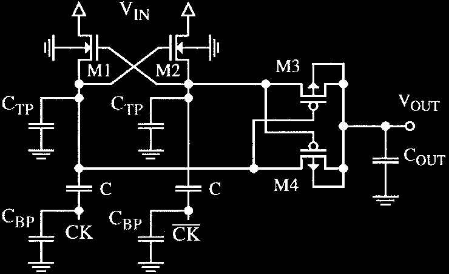 | 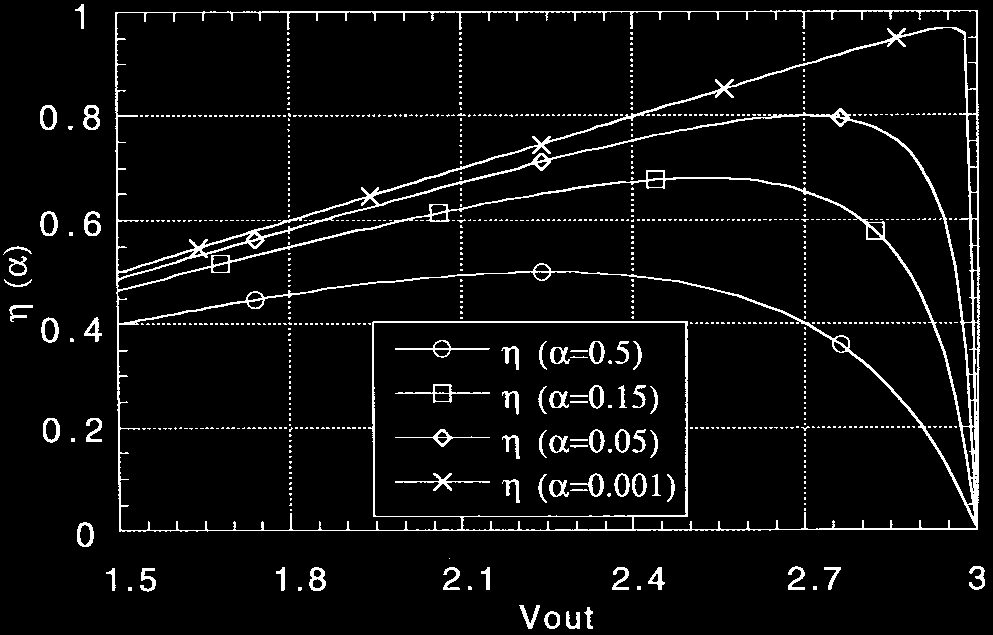 | 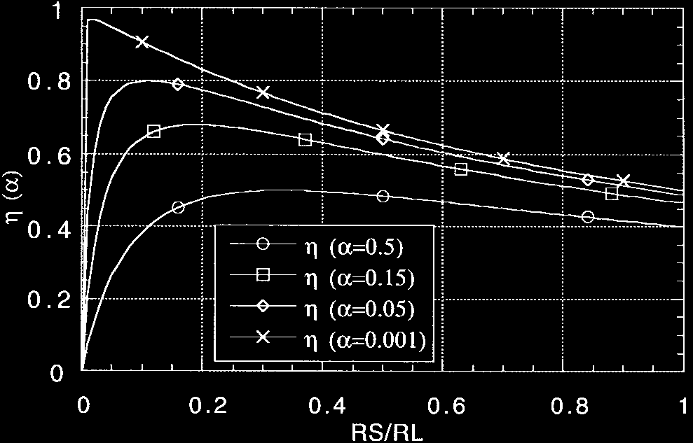 |
| **图 7**：顶板 $C_{TP}$ 与底板 $C_{BP}$ 寄生分布 | **图 8**：不同 $\alpha$ 下效率与输出电压关系 | **图 9**：不同 $\alpha$ 对应的最佳阻抗匹配点 |

定义总寄生杂散电容为飞跨电容的固定比例系数 $\alpha$：
$$C_S = \alpha \cdot C = C_{TP} + C_{BP} \tag{6, 7}$$
- **片上集成电容**：顶板寄生 $C_{TP}$ 极小（通常与金属走线有关），底板寄生 $C_{BP}$（对衬底或深阱）占据绝对主导，故 $\alpha \approx C_{BP} / C$。
- **片外贴片电容**：$C$ 巨大（微法/百纳法级），而 Pad、PCB 走线及驱动器输出电容引起的寄生 $C_S$ 仅为皮法级，故 $\alpha \approx 0.001 \sim 0.002$。

#### 1. 能量平衡方程与转换效率闭式解
在一个开关周期 $T$ 内：
- **负载获得的有用能量**：
  $$E_L = \frac{V_{OUT}^2}{f \cdot R_L} \tag{3}$$
- **系统内部耗散的总损耗能量 $E_S$**（包含寄生电容充放电损耗与内阻导通损耗）：
  $$E_S = 2 \cdot C_S \cdot V_{IN}^2 + 2 \cdot C \cdot \Delta V_{OUT}^2 \tag{4}$$
  其中输出电压跌落为 $\Delta V_{OUT} = 2V_{IN} - V_{OUT}$。
- 根据戴维宁分压公式：
  $$V_{OUT} = 2 V_{IN} \cdot \frac{R_L}{R_L + R_S} \tag{5}$$
  $$\Delta V_{OUT} = 2 V_{IN} \cdot \frac{R_S}{R_L + R_S}$$

将上述各式代入转换效率通用定义 $\eta = \frac{E_L}{E_L + E_S}$，经过严格代数整理，推导得出著名的 **Favrat 开关电容效率通用公式**：
$$\eta = \frac{1}{1 + \alpha \cdot C \cdot f \cdot \frac{(R_L + R_S)^2}{2 \cdot R_L} + 2 \cdot C \cdot f \cdot \frac{R_S^2}{R_L}} \tag{8}$$

#### 2. 最优负载阻抗匹配与最高效率极限
对式 (8) 关于负载电阻 $R_L$ 求一阶导数并令 $\frac{\partial \eta}{\partial R_L} = 0$，得到**取得最高系统转换效率的充要条件**：
$$R_{L,opt} = R_S \cdot \sqrt{1 + \frac{\alpha}{4}} \tag{9}$$

将该最优匹配条件代入式 (8)，并利用 $R_S \approx \frac{1}{2fC}$，可得出**不同集成电容工艺所决定的最高物理转换效率极限表**（表 I）：

| 电容结构类型 (Capacitor Type) | 寄生电容比率 ($\alpha \approx$) | 理论最大功率效率 ($\eta_{max}$) | 最大效率点倍压因子 ($V_{OUT}/V_{IN}$) | 典型工艺与适用场景 |
| :--- | :--- | :--- | :--- | :--- |
| **Poly-Metal (多晶硅-金属电容)** | $0.20 \sim 0.50$ | **50% ~ 64%** | $1.50 \sim 1.64$ | 早期标准单多晶 CMOS，不推荐作为泵电容 |
| **Thin Oxide (薄栅氧 MOS 电容)** | $0.05 \sim 0.15$ | **68% ~ 80%** | $1.68 \sim 1.80$ | 单位面积容值极高，低压下在积累区工作 |
| **Double Poly (双多晶 PIP 电容)** | **0.05** | **80%** | **1.80** | 线性度优异，寄生仅 5%，且无电压非线性 |
| **External (片外贴片电容)** | **0.002** | **95.6%** | **1.95** | 寄生比率极低，可逼近 100% 理想极限 |

> **效率与纹波的工程博弈**
> 从式 (9) 与图 8、图 9 可以清晰看出：若要追求 $75\% \sim 80\%$ 的高功率效率，输出电压必定下降至约 $1.8 \cdot V_{IN}$（即允许电容释放约 $10\%$ 的电荷量）；若强行要求 $V_{OUT} \to 2V_{IN}$（零纹波、无跌落），则 $R_L \gg R_S$，寄生电容充放电的高频静态动态损耗将占据主导，导致总转换效率剧烈退化。

---

## 5. 晶体管级关键子电路创新 (Transistor-Level Subcircuits)

### 5.1 核心突破一：衬底自适应动态换向电路 (Dynamic Bulk Switching)

这是整篇论文最具启发性的核心发明（图 4、图 5）。

```
           Dynamic Bulk Commutation Principle (M5, M6)
                      
                         V_OUT (DC)
                            |
                     +------+------+
                     |             |
                    --- M5        --- M6
                 P1 ---        P2 --- (Minimum Size PMOS)
                     |             |
    Node 1 (OUT1) ---+             +--- Node 2 (OUT2)
                     |             |
                     +------+------+
                            |
                         Common
                         N-Well (Bulk of M3, M4, M5, M6)
```

#### 1. 晶体管级动作机制
- 功率开关 M3、M4 以及换向开关 M5、M6 制作在同一个连续的 N 阱中。
- M5 的源/漏跨接在 Node 1 与公共 N 阱之间，其栅极连接至 Node 2；
- M6 的源/漏跨接在 Node 2 与公共 N 阱之间，其栅极连接至 Node 1。
- **相位 1**：Node 2 电位泵升至 $2V_{IN}$，Node 1 为 $V_{IN}$。此时 Node 2 显著高于 Node 1，使得 M6 强行导通，直接将公共 N 阱与 Node 2 短接；由于 Node 2 此时是全芯片最高电位，公共 N 阱电位即被牢牢钳位在 $2V_{IN}$。
- **相位 2**：Node 1 电位泵升至 $2V_{IN}$，Node 2 降为 $V_{IN}$。M5 强行导通，公共 N 阱被无缝切换钳位到 Node 1。

| 无衬底换向时的瞬态启动波形 (严重漏电) | 引入衬底自适应换向后的启动波形 (漏电彻底消除) |
| :---: | :---: |
| 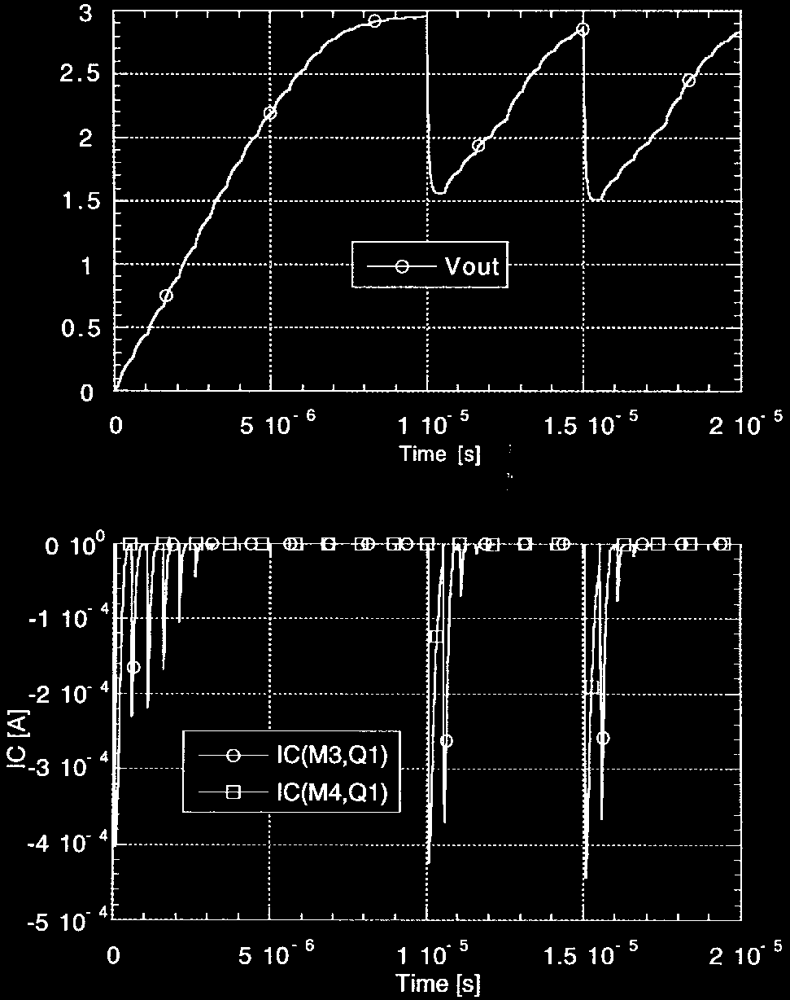 | 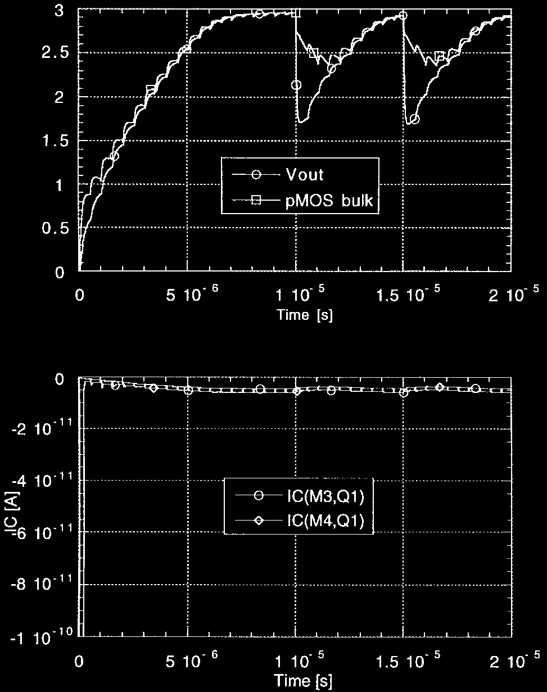 |
| **图 15**：未加入 M5/M6，寄生垂直 PNP 导通，衬底漏电流峰值高达 **0.5 mA** | **图 16**：加入 M5/M6 后，阱电位恒大于等于 $V_{OUT}$，衬底电流抑制至 **$10^{-11}\text{ A}$** |

#### 2. 抑制双极型漏电与消除 Latch-up 隐患
- **传统无换向设计**：如果直接将 PMOS N 阱接至 $V_{OUT}$，在芯片上电启动初期或遭遇突发重负载时，$V_{OUT}$ 尚未建立或发生大幅瞬态下冲跌落。此时泵节点电位高达 $2V_{IN}$，导致 $p^+$(泵节点)-$n$(阱) 结发生正向严重导通，激活图 3 中的垂直 PNP 三极管，实测出现高达 **0.5 mA 的衬底漏电尖峰**（图 15）。
- **Favrat 换向技术**：从图 16 可以看到，N 阱电位始终包络跟踪全电路的瞬时最高电压（$V_{bulk} \ge V_{OUT}$ 且 $V_{bulk} \ge V_{node}$），结电压永远保持零偏或反偏，**基底电流直接降至 $10^{-11}\text{ A}$（皮安量级）**，不仅提升了 10% 以上的启动建立速度，而且彻底免疫了任何由瞬态基底注流诱发的 CMOS 寄生可控硅（SCR）Latch-up 风险！

---

### 5.2 核心突破二：全摆幅非重叠电平移位驱动器 (Level-Shifted Gate Drive)

对于低压应用（如 $V_{IN} = 1.5\text{V}$，工艺 $V_{TH} \approx 1.0\text{V}$），若按照传统方式将 PMOS 开关 M3、M4 的栅极驱动在 $V_{IN} \sim 2V_{IN}$ 之间（图 10），其开启时的过驱动电压仅为：
$$V_{OV} = V_{GS} - V_{TH} = (2V_{IN} - V_{IN}) - V_{TH} = V_{IN} - V_{TH} = 1.5 - 1.0 = 0.5\text{ V}$$
极小的过驱动电压导致 PMOS 导通内阻极其庞大，限制了输出电流能力。

|                重叠驱动时序与窄摆幅缺陷                 |          非重叠全摆幅驱动时序 ($0 \sim 2V_{IN}$)          |              经典交叉耦合高压电平移位器原理图              |
| :-----------------------------------------: | :---------------------------------------------: | :----------------------------------------: |
|   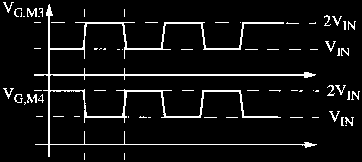   | 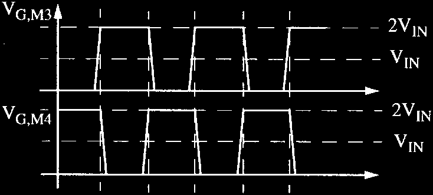 | 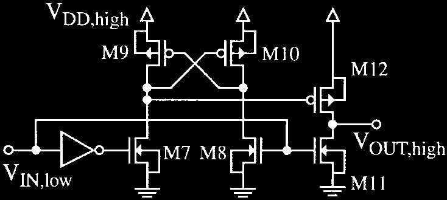 |
| **图 10**：传统 $V_{IN} \sim 2V_{IN}$ 摆幅与交叠直通风险 |    **图 11**：全摆幅 $0 \sim 2V_{IN}$ 驱动与非重叠死区时序     |       **图 13**：由 M7~M12 组成的高速电平移位电路        |

#### 1. 栅极全摆幅扩展技术 ($0 \sim 2V_{IN}$)
Favrat 提出利用图 13 所示的紧凑型电平移位器，将输入时钟的摆幅扩展为从 **$0\text{V}$ 到 $2V_{IN}$（即 $V_{OUT}$）**：
- 当 PMOS 开关导通时，其栅极被直接下拉到**地电位（$0\text{V}$）**；
- 此时其有效过驱动电压飙升为：
  $$V_{OV}' = 2V_{IN} - 0 - V_{TH} = 2 \times 1.5 - 1.0 = 2.0\text{ V}$$
- **过驱动电压提升整整 4 倍，使得开关管导通电阻 $R_{ON}$ 直接衰减至原来的 1/4**！

#### 2. 非重叠死区产生（Non-overlapping Switching）
在频率高于 1MHz 时，图 10 中的时钟重叠会导致飞跨电容与输出端在切换间隙形成瞬间直通短路，产生巨大的动态电荷回流损失。论文在驱动链路上加入了异步延迟逻辑（图 11、图 12），严格产生非重叠死区时间 $T_{SW}$，彻底消除了短路损耗。

---

### 5.3 核心突破三：亚伏特超低压辅助自举升压启动结构 (Sub-1V Auxiliary Booster)

当输入电压进一步下探至极低压区间（$V_{IN} < V_{TH} + 500\text{mV}$，例如 $V_{IN} = 1.1\text{V}$，而 $V_{TH} \approx 0.8\text{V} \sim 1.0\text{V}$）时，下管 NMOS（M1, M2）的开启同样面临严重瓶颈，导致电路无法冷启动。

| 完整高效率倍压电荷泵系统框图 | 适用于极低压 (<1V) 的辅助自举升压拓扑架构 |
| :---: | :---: |
| 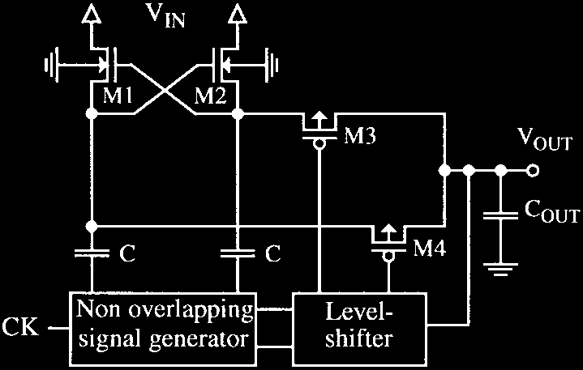 | 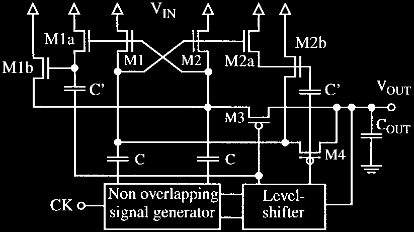 |
| **图 12**：标准高效率架构（含非重叠发生器与电平移位器） | **图 14**：引入辅助倍压电容 $C'$，将 NMOS 栅极推升至 **$3V_{IN}$** |

#### 晶体管级实现拓扑（图 14）
- 在主功率通路外，附加由微型晶体管构成的辅助交叉耦合升压单元（M1a/M1b/C' 与 M2a/M2b/C'）。
- 辅助泵由已经升至 $0 \sim 2V_{IN}$ 的电平移位信号驱动。
- 在辅助泵的叠加作用下，**核心 NMOS 管 M1 和 M2 的栅极驱动电压被推升到 $V_{IN} \sim 3V_{IN}$ 的超高摆幅**！
- 这一极具巧思的设计彻底解决了亚伏特输入下 NMOS 导通电阻过大的难题，保证了在 1.1V 极低电压下的稳定自启动与高能效运行。
- *安全注意事项：由于内部局部产生了 $3V_{IN}$ 高压，工艺选择上必须确保 $3V_{IN} \le V_{max,process}$（不超过栅氧击穿耐压极限）。*

---

## 6. 芯片实测结果与理论验证 (Silicon Results & Verification)

作者分别采用两种完全不同的工艺制作了原型芯片并进行了详尽测试，测试数据与理论解析模型呈现了惊人的吻合度。

### 6.1 原型芯片实测性能对比

| 实测指标 / 特性 | 原型芯片一：片外电容版 (Discrete) | 原型芯片二：全集成版 (Fully Integrated) |
| :--- | :--- | :--- |
| **显微照片展示** | 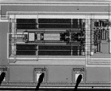<br>**图 17**：2.0 µm 工艺芯片 ($1.4 \times 0.56\,\text{mm}^2$) | 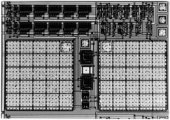<br>**图 19**：0.7 µm 工艺芯片 ($500 \times 300\,\mu\text{m}^2$) |
| **工艺技术** | 2.0 µm CMOS (单阱双金属) | 0.7 µm Digital CMOS |
| **飞跨电容类型** | 外挂贴片电容 $2 \times 100\,\text{nF}$ | 片上集成薄栅氧 MOS 电容 $2 \times 100\,\text{pF}$ |
| **寄生电容比率 $\alpha$** | $\alpha \approx 0.002$ (极低) | $\alpha = 0.096$ (标准 MOS 电容底板寄生) |
| **工作开关频率** | 50 kHz | 10 MHz (100kHz ~ 10MHz 宽频调频) |
| **静态电流消耗** | 空载 $30\,\mu\text{A}$ (仅 $15\,\mu\text{A}$ 为驱动短路电流) | 随工作频率动态线性变化 |
| **最大输出电流能力** | 1.0 mA ~ 5.0 mA | 2.0 mA |
| **实测最高功率效率** | **95.6%** (在 $V_{IN}=1.5\text{V}$ 时测得) | **75.0%** (在 $V_{IN}=3.0\text{V}$ 时测得) |
| **设计核心目标** | 极低压便携式医疗设备超高效率供电 | 零外部元件、极小占板面积的片上系统偏置 |

---

### 6.2 实测特性曲线与理论模型深度对比

| 片外电容版实测效率与理论拟合 | 全集成版在 10MHz 下效率特性 |
| :---: | :---: |
| 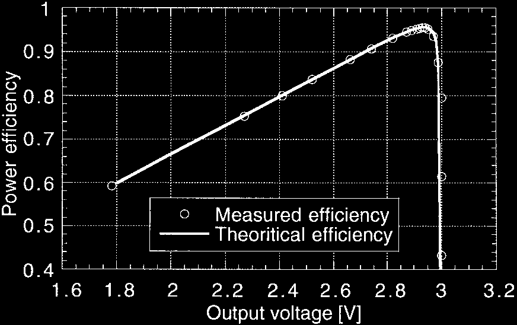 | 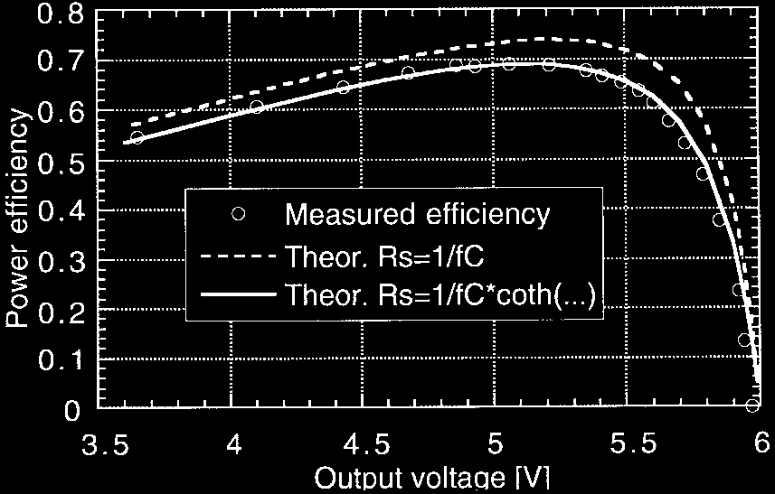 |
| **图 18**：片外电容版测试点（圆圈）与理论曲线（实线）高度重合，峰值达 **95.6%** | **图 20**：全集成版在 $V_{OUT} = 5.3\text{V}$ 时取得 **75%** 峰值效率 |

| 宽频范围内的功率效率随频率响应曲线 | 实测源内阻 $R_S$ 随频率变化特性曲线 |
| :---: | :---: |
| 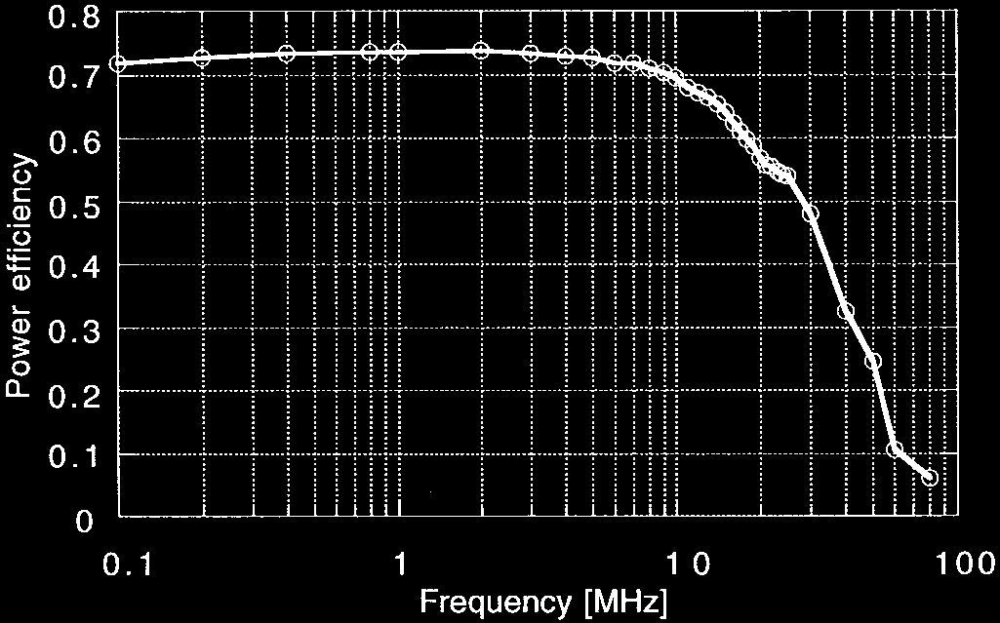 | 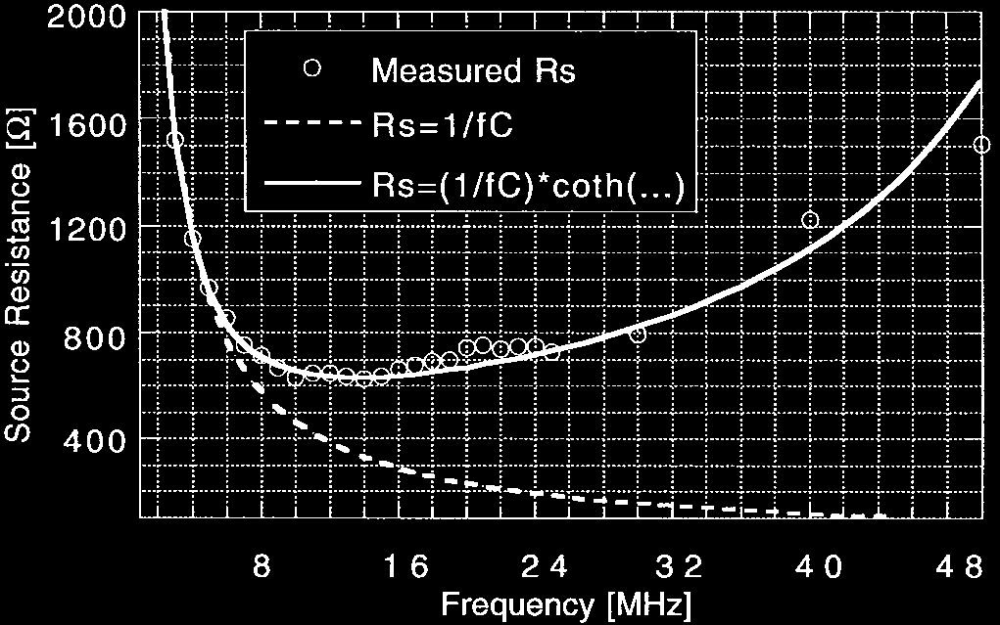 |
| **图 21**：在 100kHz~10MHz 宽达两个数量级范围内保持 $>70\%$ 的高效率 | **图 22**：高频下清晰呈现式 (11) 预测的内阻反弹特性（双曲余切发散效应） |

#### 理论验证要点提炼
1. **理论曲线完美重合**：图 18 与图 20 中，理论公式 (8) 计算出的曲线与实测离散数据点几乎完全重合，证明了论文提出的电荷泵功率损耗模型的极高准确性。
2. **频率调制稳压能力（PFM 调压潜力）**：图 21 显示，全集成电荷泵在 100 kHz 到 10 MHz 之间，效率平坦地维持在 70%~75% 的高原区。这表明可以通过**调制开关频率（PFM）**来调控输出阻抗，在 $20\,\mu\text{A}$ 到 $2\,\text{mA}$ 的百倍动态负载范围内实现高效率稳压输出。
3. **高频阻抗反弹验证**：图 22 实测验证了快速开关极限下开关电阻与死区时间的阻抗限制：在 16MHz 以下，内阻严格跟随 $1/(2fC)$ 下降；在 16MHz~20MHz 处达到物理极小值（约 $500\,\Omega$）；而在 20MHz 以上，由于有限死区时间 $T_{SW}$ 压缩了有效导通时间 $T_{ON}$，内阻如理论模型预测的那样迅速劣化反弹。

---

## 7. Cadence Virtuoso 仿真与设计借鉴 (IC Design & Virtuoso Takeaways)

> **现代电源芯片设计与 Cadence Virtuoso 落地指导**
> 尽管本论文发表于 1998 年，但其电路结构已被几乎所有现代 PMIC（如手机快充电荷泵、Flash/EEPROM 编程高压发生器、Buck 上管 Bootstrap 自举电路）奉为工业标准。在现代高压 BCD 工艺（如 0.18µm BCD）或纳米级 CMOS 工艺中复现与应用该电路时，需重点关注以下工程细节：

### 1. 核心可复用模块与改进
- **自适应 N 阱换向网络（M5/M6）**：
  - **应用场景**：任何需要防止高边开关管寄生体二极管倒灌的场合（如双电源自动切换电路、USB Type-C VBUS 逆向防倒灌保护开关、高低压隔离电平移位器）。
  - **尺寸设计**：M5、M6 仅需提供阱电位充电电流，**务必采用最小 $W/L$ 尺寸**。过大的 M5/M6 会引入显著的漏端寄生电容，直接增加开关节点的无效动态充放电功耗。
- **电平移位驱动器（Level Shifter）**：
  - 图 13 所示的交叉耦合电平移位器在高频（>5MHz）下存在静态翻转电流。在现代高速设计中，推荐在其输入端加入窄脉冲产生器（Pulse Generator），演进为**脉冲触发式动态电平移位器（Dynamic Latch Level Shifter）**，可消除直流穿通功耗。

### 2. Cadence Virtuoso 仿真验证策略 (Testbench 搭建)
- **寄生提取与极板方向连接（Pcell Placement & Routing）**：
  - 在 Virtuoso 中画板图或调用 MIM/MOM 电容 Pcell 时，**务必明确区分顶板（Top Plate）与底板（Bottom Plate）**。
  - **黄金走线准则**：底板寄生容值极大（通常占主容值 5%~15%），**必须将底板端连接至低阻抗的驱动反相器时钟输出端（$CK, \overline{CK}$）**，而将寄生电容极小的顶板连接至高阻抗的高敏升压节点（$OUT1, OUT2$）。若接反，底板高频对地充放电将使全芯片效率直接暴跌 15% 以上！
- **瞬态启动与 Latch-up 监控 (Transient TB)**：
  - 设置 `tran` 仿真时间步长足够精细（建议 $\Delta t \le \frac{1}{100 \cdot f_{SW}}$），开启 `conservative` 精度。
  - 重点监测上电瞬态以及加载瞬态过程中，M3、M4、M5、M6 的基底-源/漏极电压差：确保无论在何种工况下，所有 $V_{PN} \le 0.4\text{ V}$，绝不允许结电压超过 $0.6\text{ V}$。
- **Corner 与全温区扫描**：
  - **Worst Case 启动**：在 SS 工艺角、低温（$-40^\circ\text{C}$，此时阈值电压 $V_{TH}$ 最大）下验证最低输入电压（$V_{IN,min}$）的冷启动能力；
  - **Worst Case 耐压**：在 FF 工艺角、高温（$125^\circ\text{C}$）以及最大输入电压（$V_{IN,max}$）下，监测内部节点最大峰值电压，确保不超过工艺栅氧击穿限值（如 1.8V / 3.3V / 5V）。
  - 使用 `spectre` 蒙特卡洛（Monte Carlo）分析器件失配对两相平衡度与非重叠死区时间的影响，防止死区消失发生直通。

### 3. 版图与物理实现避坑要点 (Layout Reliability)
- **隔离阱结构（Deep N-Well / Guard Rings）**：
  - 将所有工作在高电位的 PMOS 管（M3~M6）放置在独立的 N 阱中。在现代深亚微米或 BCD 工艺中，使用**双层保护环（Double Guard Ring，外圈 $p^+$ 接地，内圈 $n^+$ 接最高电位）**进行物理全隔离，彻底拦截任何逃逸的少子注入基底。
- **金属走线寄生电阻优化**：
  - 飞跨电容连接线承载巨大的高频脉冲交流电流，走线寄生电阻将直接叠加进开关导通电阻 $R_{ON}$，降低特征截止频率 $f_C$。连接电容的金属线务必使用厚金属层（Top Metal）并行打孔走线。

---

## 8. 关联文献与知识图谱链接 (References & Graph)

- **工艺库基础**：
- **工业级产品与仿真案例**：
- **经典学术里程碑**：
  - `[Nakagome JSSC-1991]`：*An experimental 1.5 V 64 Mb DRAM* —— 奠定互补交叉耦合 NMOS 升压架构先河。
  - `[Cho & Gray CICC-1994]`：*A 10-bit, 20 MS/s, 35 mW pipeline A/D converter* —— 探索 PMOS 串联倍压输出与衬底悬空问题的早期文献。
  - `[Makarov & Maksimovic TPEL-2010]`：*Switched-Capacitor DC-DC Converters Optimization* —— 现代开关电容转换器两相两极限（SSL/FSL）完备阻抗理论的集大成者。
