> **论文核心亮点与芯片定位**
> - **行业学术地位**：本文是英特尔电路研究实验室（Intel Circuit Research Labs）由 **Peter Hazucha**、**Gerhard Schrom**、**Vivek De** 以及微处理器架构先驱 **Shekhar Borkar（Intel Fellow）** 领衔的重量级里程碑之作，发表于固态电路顶刊 *IEEE Journal of Solid-State Circuits (JSSC 2005)*。论文首次在现代微处理器多电源域（Multi-$V_{CC}$）供电场景中，实现了突破百兆赫兹（最高达 317 MHz）的集成四相交错同步降压转换器，被誉为**甚高频（VHF / Ultra-High Frequency）片上与封装协同集成稳压器（IVR）的开山先驱工作之一**。
> - **四大核心技术突破**：
>   1. **无源储能器件狂减 3 个数量级（1000×），彻底摒弃磁芯**：将开关频率推高至 $233\,\text{MHz}$ 并结合四相交错纹波抵消拓扑，使得单相滤波电感骤降至仅 $6.8\,\text{nH}$（四相并联等效仅 $1.7\,\text{nH}$），输出解耦电容骤降至仅 $2.5\,\text{nF}$。不仅完全省去了体积庞大、高频磁损严重的高磁导率磁芯（改用封装级 Coilcraft 0402 表面贴装微型空心电感），更首次实现了**输出解耦电容 100% 片上全集成（$C_{DIE} = 2.5\,\text{nF}$）**！
>   2. **注入锁定（Injection-Locked）迟滞控制与多相交错时钟同步机制**：彻底攻克了“传统迟滞控制无法精确多相交错同步”的经典难题。发明了基于差分小信号电流注入（Injection Locking）的包络调制技术，既保留了迟滞控制亚周期级（$<1.2\,\text{ns}$）近乎零延迟的超高速大信号瞬态恢复能力，又在稳态下实现严格 $90^\circ$ 错相锁频，在 $75\%$ 标称占空比（$1.2\text{V} \to 0.9\text{V}$）下达成**理论输出开关纹波电流 $100\%$ 完美对消**。
>   3. **电感 RC 无损电流估算与自适应电压定位（AVP / Droop Control）**：摒弃任何有损的采样电阻或复杂的 SenseFET 电流检测通路，直接在滤波电感两端并联无源 RC 积分滤波网络，精确提取电感高频瞬时纹波电流；进一步通过在比较器输出端与反馈节点间引入受控注入电阻 $R_{DRP}$，构造出精确可编程的下垂负载线（Load-Line Voltage Positioning），使极端瞬态过冲/下冲对中收敛。
>   4. **功率级正向衬底偏置（Forward Body Bias, FBB）与倒装封装协同设计**：针对 90 nm 标准数字逻辑工艺中 PMOS 导通内阻与驱动瓶颈，在功率桥 PMOS 的 N 阱端引入 $500\,\text{mV}$ 正向衬底偏置，使功率管有效导通电阻降低 $10\%$，斩获 $0.5\% \sim 1.0\%$ 的整机效率净提升；芯片采用高密度 Flip-Chip BGA 倒装焊封装，每相通过专用 C4 凸点阵列将寄生互连电感降至极低，奠定了现代高性能计算 IVR 封装供电技术范式。
> - **芯片实测指标速记**：
>   - **工艺制程**：标准 90 nm 逻辑 CMOS 工艺（Standard 90-nm Logic CMOS）；
>   - **输入与输出**：标称输入 $V_{IN} = 1.2\,\text{V}$，输出 $V_{OUT} = 0.9\,\text{V}$（占空比 $D = 0.75$）；扩展工作点 $V_{IN} = 1.4\,\text{V} \to V_{OUT} = 1.1\,\text{V}$；
>   - **开关频率与无源器件**：$f_{SW} = 233\,\text{MHz}$（可调范围 $100 \sim 317\,\text{MHz}$），单相空心电感 $L = 6.8\,\text{nH}$，片上输出电容 $C_{DIE} = 2.5\,\text{nF}$；
>   - **负载能力与功率密度**：最大负载电流 $0.3\,\text{A}$（$1.2\text{V}\to 0.9\text{V}$）和 $0.4\,\text{A}$（$1.4\text{V}\to 1.1\text{V}$），功率桥电流密度高达 **$15 \sim 20\,\text{A/mm}^2$**；
>   - **转换效率**：标称峰值效率 **$83.2\%$**，满载效率 **$82.5\%$**；在 $100\,\text{MHz} / 36\,\text{nH}$ 下峰值效率最高达 **$87.0\%$**；
>   - **大信号极速瞬态**：在 $\Delta I_{LOAD} = 150\,\text{mA}$（50% 满载阶跃）、超陡峭边沿 $100\,\text{ps}$（$di/dt = 1.5\,\text{A/ns}$）的极端测试下，仅依靠 $2.5\,\text{nF}$ 片上电容，输出电压峰值下冲被成功压制在 $10\%$（$90\,\text{mV}$）以内，恢复建立时间仅 $\approx 10\,\text{ns}$！

---

## 1. 芯片电气性能与设计指标 (Specs Table)

| 参数类别 | 参数项 (Parameter) | 论文数值 / 实测表现 | 测试条件与备注说明 (Conditions & Notes) |
| :--- | :--- | :--- | :--- |
| **工艺制程** | Process Technology | **90 nm Standard Logic CMOS** | 纯数字逻辑工艺，无厚栅高压管，无额外磁性/高Q模拟掩模 |
| **芯片总面积** | Total Die Size | **$3500\,\mu\text{m} \times 4500\,\mu\text{m}$ ($15.75\,\text{mm}^2$)** | 包含微处理器测试核心与配套外围辅助逻辑 |
| **电源转换区面积** | DC-DC Converter Area ($A_{CONV}$) | **$1280\,\mu\text{m} \times 990\,\mu\text{m} = 1.26\,\text{mm}^2$** | 包含 4 相转换器、片上解耦电容、测试负载与扫描链 |
| **功率级与控制器面积** | Active Bridges & Controllers | **$1000\,\mu\text{m} \times 140\,\mu\text{m} = 0.14\,\text{mm}^2$** | 扣除片上解耦电容与测试负载后的核心净面积 |
| **功率桥净占硅面积** | Power Bridge Area ($A_{BRDG}$) | **$0.02\,\text{mm}^2$** (单相仅 $0.005\,\text{mm}^2$) | 贡献极限桥电流密度 $15 \sim 20\,\text{A/mm}^2$ |
| **标称输入电压** | Input Voltage ($V_{IN}$) | **1.2 V** (常规工作点) / **1.4 V** (加速工作点) | 供给微处理器速度关键路径（如执行 ALU、高频时钟树） |
| **标称输出电压** | Output Voltage ($V_{OUT}$) | **0.9 V** (标称工作点) / **1.1 V** (加速工作点) | 供给时序松弛逻辑核（Logic Cores）以节省 $CV^2f$ 动态功耗 |
| **标称占空比** | Duty Cycle ($D$) | **0.75 ($75\%$)** | $0.9\,\text{V} / 1.2\,\text{V}$，天然契合 4 相交错纹波全消条件 |
| **最大输出负载电流**| Maximum Load Current ($I_{MAX}$) | **0.3 A** (@ 1.2V->0.9V) / **0.4 A** (@ 1.4V->1.1V) | 单相平均分担 $75\,\text{mA} \sim 100\,\text{mA}$ |
| **开关工作频率** | Switching Frequency ($f_{SW}$) | **233 MHz** (标称最优频点，范围 $100 \sim 317\,\text{MHz}$) | 甚高频开关，比同期商业转换器高出两个数量级 |
| **功率滤波电感** | Power Inductor ($L$) | **6.8 nH / phase** (4 相并联等效 $1.7\,\text{nH}$) | Coilcraft 0402 贴片微型空心电感，无磁芯损耗，表贴于 BGA 封装 |
| **输出解耦电容** | Decoupling Capacitance ($C_{DIE}$) | **2.5 nF** (100% 片上集成薄栅 MOS 电容) | 无需任何片外大容量电解/陶瓷贴片电容 |
| **稳态峰值转换效率**| Peak Power Efficiency ($\eta_{peak}$) | **83.2%** (@ 233 MHz, 6.8 nH, 2.5 nF) **87.0%** (@ 100 MHz, 36 nH, 6.8 nF) | 包含功率开关损耗、栅极驱动损耗与空心电感高频 DCR 损耗 |
| **满载转换效率** | Full-Load Efficiency ($\eta_{full}$) | **82.5%** (@ 0.3 A, 1.2V->0.9V) **83.2%** (@ 0.4 A, 1.4V->1.1V) | 在最大设计功率输出下的实测电转换效率 |
| **正向偏置效率增益**| FBB Efficiency Gain ($\Delta \eta_{FBB}$) | **+0.5% ~ +1.0%** | 给 PMOS 施加 500 mV 正向衬底偏置所带来的净收益 |
| **极端负载阶跃幅度**| Load Transient Step ($\Delta I_{LOAD}$) | **150 mA** (50% 满载大阶跃，从 0 突增至 150 mA) | 由片上集成的超快可编程可控电流源模拟注入 |
| **阶跃边沿上升时间**| Load Current Slew Rate ($di/dt$) | **100 ps** ($di/dt = 1.5 \times 10^9\,\text{A/s} = 1.5\,\text{A/ns}$)| 极度苛刻的高频阶跃边沿，极度考验片上控制瞬态响应 |
| **瞬态输出压降** | Output Voltage Droop ($\Delta V_{DROOP}$) | **$\le 10\%$ Peak-to-Peak ($90\,\text{mV}$)** | 包含自适应电压定位（AVP）预设的 $50\,\text{mV}$ 稳态负载线偏差 |
| **瞬态建立恢复时间**| Settling Time ($t_{settling}$) | **$\approx 10\,\text{ns}$** (亚开关周期级别恢复) | 得益于迟滞非线性闭环控制，远快于 PWM 控制器的 5~10 个周期 |

| 4 相交错降压转换器系统架构框图 (Fig. 6) | 90 nm CMOS 芯片实测显微照片 (Fig. 7) |
| :---: | :---: |
| 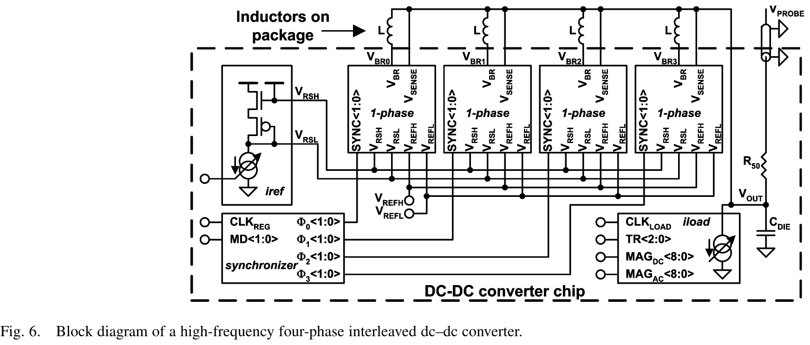 | 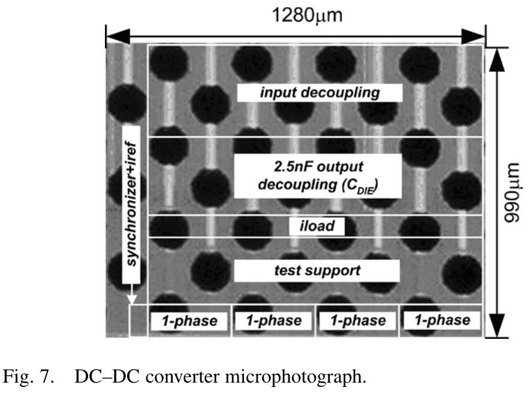 |

| 倒装封装与 BGA 封装体表面 0402 空心电感贴装实物 (Fig. 8) | 芯片实测主要性能指标汇总表 (Table I) |
| :---: | :---: |
| 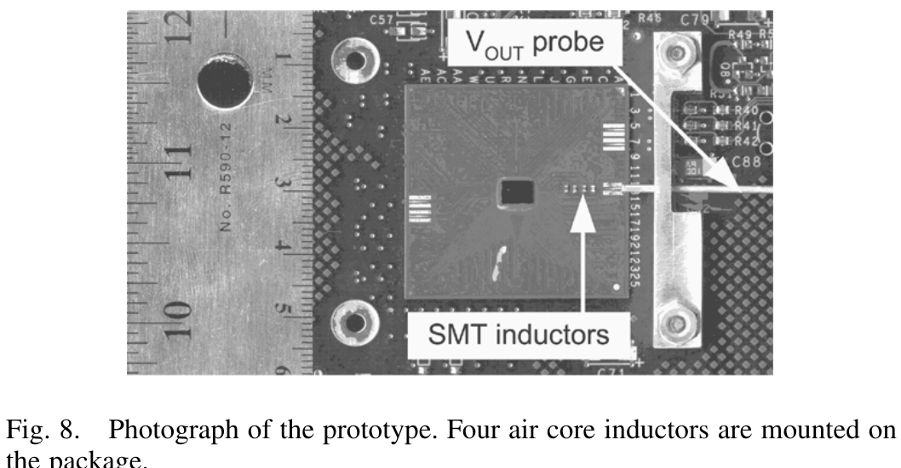 | 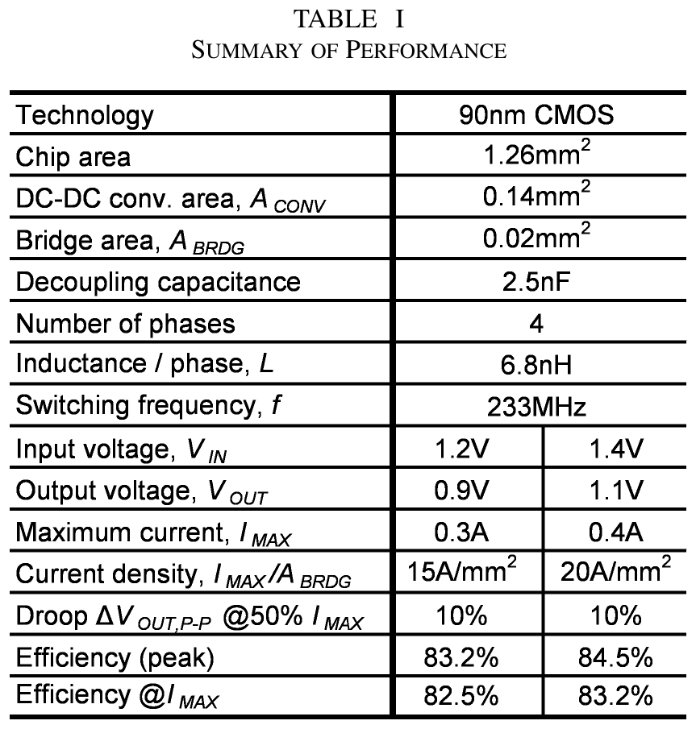 |

---

## 2. 研究背景与设计痛点 (Motivation & Bottlenecks)

### 2.1 传统微处理器多电压域供电瓶颈与无源器件集成困境
在 90 nm 及其后续先进深亚微米互补金属氧化物半导体（CMOS）微处理器架构中，芯片整体功耗随着集成度与主频的攀升急剧恶化。为了在极为严苛的热设计功耗（TDP）与电池寿命约束下实现极致算力，**多电源域供电架构（Multi-$V_{CC}$ Architecture）**成为了学术界与工业界的必然演进方向：
1. **时序关键路径与松弛路径分压供电**：处理器中的高速算术逻辑单元（ALU）和关键指令译码通路需要维持高电压（如 $1.2\,\text{V}$）以确保晶体管极高饱和驱动电流与超高主频；而占比庞大、存在显著时序裕量（Delay Slacks）的非关键逻辑核与外围控制逻辑，则可降压至低电平（如 $0.8 \sim 1.0\,\text{V}$）运行。由于动态翻转功耗与供电电压的平方成正比（$P_{dyn} = \alpha C V^2 f$），适度降低电压即可带来惊人的二次方级功耗节省。
2. **大容量片上静态存储器（SRAM Cache）稳定裕度**：在 90 nm 节点，SRAM 位元（Bitcell）受到器件本征掺杂波动（RDF）与阈值展宽的严重制约，必须维持较高的供电电压以保障静态噪声裕度（SNM）和抗软错误（Soft Error）能力；而流水线核心逻辑则允许在更低电平下运转。
3. **模拟/射频外设电压净空（Voltage Headroom）**：微处理器片上集成的锁相环（PLL）、高速差分 I/O 驱动器及带隙基准源往往要求高于纯数字逻辑的供电轨，以保证足够的模拟动态范围与电源抑制比（PSRR）。

在面对如何从主供电轨（$1.2\,\text{V}$）高效生成次级供电轨（$0.8 \sim 1.0\,\text{V}$）的问题上，传统板级与片上稳压方案遇到了难以逾越的物理瓶颈：
- **开关电容电荷泵（Switched-Capacitor Charge Pump）**：基于标准体硅 CMOS 片上电容实现的开关电容转换器，在 $1.2\text{V} \to 0.9\text{V}$ 的压降比下理论转换效率通常低于 $65\%$；且由于片上电容电荷密度受限，每提供 $100\,\text{mA}$ 输出电流就需要耗费高达 $1\,\text{mm}^2$ 的庞大硅片面积，面积性价比极低。
- **低压差线性稳压器（LDO / Linear Regulator）**：线性稳压器的理论效率严格受限于输入输出压比：
  $$\eta_{LDO} = \frac{V_{OUT}}{V_{IN}} = \frac{0.8\,\text{V} \sim 1.0\,\text{V}}{1.2\,\text{V}} \approx 66\% \sim 83\%$$
  尽管 LDO 拥有极小的硅片面积和纳秒级的超快瞬态调节能力（Hazucha 等人在同刊发表的文献 [12] 中对此有深入研究），但在大电流满载运转时，高达 $17\% \sim 34\%$ 的未转换能量将直接化作芯片热能耗散，加剧了热斑（Thermal Hotspot）隐患。
- **传统开关型 Buck 转换器（Conventional Buck Converter）**：虽然开关降压能够轻松突破 $80\%$ 甚至 $90\%$ 的转换效率，但在传统数十 kHz 至数 MHz 的低开关频率下，需要数微亨（$\mu\text{H}$）量级的庞大滤波电感以及数十微法（$\mu\text{F}$）的滤波电容。这些外置无源器件由于封装引脚寄生电感巨大、占板空间惊人，根本无法适配要求高度集成的微处理器系统级封装（SiP）与片上集成供电（IVR）。

### 2.2 本文切入点与极小电容下的超瞬态严苛要求

> **原文动机论述 (Verbatim Quote)**
> *"By operating at high switching frequency of 100 to 317 MHz with four-phase topology and fast hysteretic control, we reduced inductor and capacitor sizes by three orders of magnitude compared to previously published dc–dc converters. This eliminated the need for the inductor magnetic core and enabled integration of the output decoupling capacitor on-chip."*
> 
> **【核心要义解读】**：作者在此明确指出了该工作的核心创新切入点：通过将开关频率推向惊人的 $100 \sim 317\,\text{MHz}$ 甚高频区间，并巧妙融合四相交错拓扑与超快迟滞控制，成功将无源滤波电感和输出电容的物理尺寸**削减了整整三个数量级（1000倍）**！这种无源器件尺寸的断崖式下降，直接在物理层面消除了对高频磁损严重、工艺复杂的磁芯电感的依赖（使得廉价高Q值的空心电感在封装级贴装成为可能），并首次使高达 $2.5\,\text{nF}$ 的输出滤波储能电容得以**完全集成在芯片内部**。

然而，将输出解耦电容压缩至仅有几纳法（$\text{nF}$）级别，会在电源系统动态调节中引发致命的物理挑战：
微处理器核心在执行突发指令或从睡眠模式唤醒时，负载电流会在瞬间发生数十安培的阶跃，电流变化率 $di/dt$ 动辄超过数个 $\text{A/ns}$。在电感电流尚未响应前，负载跳变所需的所有电荷必须全部由输出电容供应：
$$Q = C_{DIE} \cdot \Delta V_{DROOP}$$
若以输出电压标称值 $V_{OUT} = 0.9\,\text{V}$、允许最大下冲 $\Delta V_{DROOP} = 10\% \times 0.9\,\text{V} = 90\,\text{mV}$、负载电流阶跃 $\Delta I_{LOAD} = 50\% I_{MAX} = 150\,\text{mA}$ 计算，当片上滤波电容仅为 $1\,\text{nF}$ 时，转换器闭环环路所必须具有的响应时间上限为：
$$t_{RESP} = \frac{C_{DIE} \cdot \Delta V_{DROOP}}{\Delta I_{LOAD}} = \frac{1\,\text{nF} \times 90\,\text{mV}}{150\,\text{mA}} = 0.6\,\text{ns} \sim 1.2\,\text{ns}!$$
**$1.2\,\text{ns}$ 的响应时限甚至短于当时常规微处理器的一个时钟周期！**
而广泛应用的传统脉宽调制（PWM）控制器从检测到误差到调节占空比生效，通常需要消耗 $5 \sim 10$ 个开关周期的群延迟。即便是工作在 $100\,\text{MHz}$ 下，PWM 的响应延迟也高达 $50 \sim 100\,\text{ns}$，输出节点电荷早已被瞬间抽干。
因此，必须探索一种具有**零小信号群延迟、亚周期直接翻转特性的非线性控制架构（迟滞控制 Hysteretic Control）**，并攻克其无法多相交错同步的顽疾，才能在纳法级片上电容下维持严苛的电源轨完整性。

---

## 3. 系统拓扑与控制架构 (Topology & Control Architecture)

### 3.1 四相交错同步 Buck 功率级拓扑与纹波消除机理

为了解决超小电容下的稳态电压纹波，论文采用了四相交错并联同步 Buck 架构（Four-Phase Interleaved Buck Converter）。系统整体架构如图 6 所示，由 4 个物理结构完全一致的单相转换器核心模块（1-phase）、一个全局集中式同步偏置发生器（Synchronizer + iref）以及片上集成测试负载（iload）共同组成。

| 单相迟滞控制器与电感 RC 积分网络 (Fig. 1) | 引入下垂电阻实现自适应电压定位 (Fig. 2) |
| :---: | :---: |
| 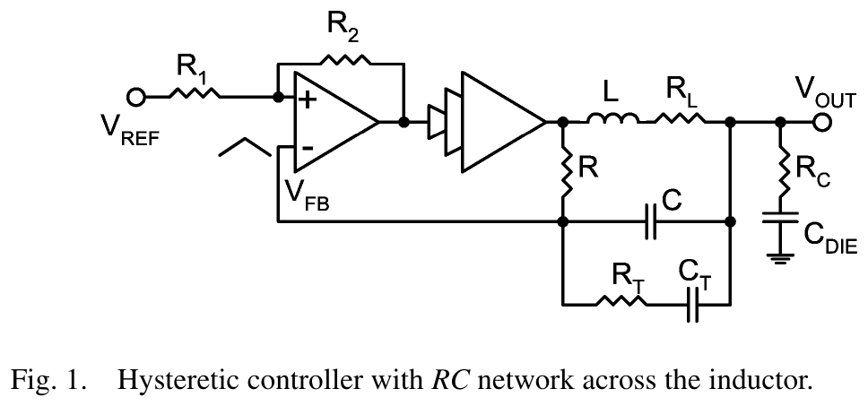 | 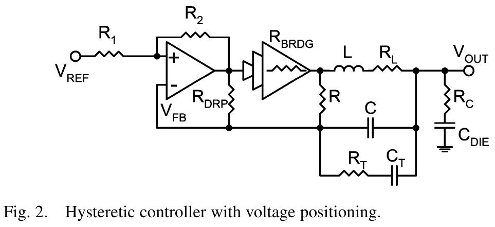 |

在多相交错 Buck 拓扑中，各相功率开关的导通时钟在相位上均匀错开：
$$\theta_{phase} = \frac{360^\circ}{N} = \frac{360^\circ}{4} = 90^\circ$$
由于各相滤波电感输出端直接并联于唯一的输出电容节点 $V_{OUT}$，各相电感的高频三角波纹波电流在输出节点相互叠加。
根据多相交错理论，总输出交流纹波电流 $\Delta I_{OUT,total}$ 与单相电感纹波电流 $\Delta I_L$ 满足特定的对消关系：
$$\Delta I_L = \frac{V_{IN} - V_{OUT}}{L} D T_{SW} = \frac{V_{IN}}{L} D (1 - D) T_{SW}$$
当总相数 $N = 4$ 时，总纹波抵消因子在特定的离散占空比点会出现完全对消的零陷区（Zero Ripple Points）：
$$D = \frac{k}{N} = \frac{k}{4} \in \{0.25, 0.50, 0.75\}, \quad (k = 1, 2, 3)$$
在本芯片的应用场景中：
$$V_{IN} = 1.2\,\text{V}, \quad V_{OUT} = 0.9\,\text{V} \implies D = \frac{V_{OUT}}{V_{IN}} = \frac{0.9\,\text{V}}{1.2\,\text{V}} = 0.75 \quad (75\%)$$
**这一数值与 $N=4$ 的第三个纹波完全零陷点（$k=3$）产生完美物理重合！**
在 $D = 0.75$ 下，四相交错的三角波电流相位依次错开 $90^\circ$（即 $0.25 T_{SW}$），某一相处于上行充磁斜坡时，其余三相恰好以精准互补的下行续流斜率工作，总和注入输出电容的交流纹波电流在理论上**完全恒定、纹波归零**！
这一纹波完全消除特性带来两大决定性优势：
1. **彻底解除了电感纹波对输出电容容值的物理束缚**：输出滤波电容 $C_{DIE}$ 的选型不再受制于稳态开关电压纹波，容值直接被大幅压缩至仅 $2.5\,\text{nF}$ 并成功片上集成。
2. **大幅降低了单相电感值**：单相电感可选用极小的 $6.8\,\text{nH}$，在高频下显著降低了等效输出阻抗，成倍拔高了电感电流的变化斜率上限（Slew Rate $= V_L / L$），极大地改善了大信号动态响应。

### 3.2 迟滞控制与电感并联 RC 无损积分网络原理

如图 1 所示，基本控制拓扑由高速迟滞比较器、多级倒向推挽驱动缓冲器、CMOS 功率开关桥（高边 PMOS + 低边 NMOS）以及跨接在滤波电感两端的无源网络 $R, C$ 构成。

#### 1. 电感电流等效重构原理
在数百兆赫兹的甚高频开关状态下，任何在功率回路中串联的实际取样电阻都会导致严重的导通损耗与热耗散；而传统的 SenseFET 采样在亚纳秒开关切换中因寄生电容充放电迟滞会产生巨大的波形失真。
Hazucha 等人采用了巧妙的**跨电感无源 RC 积分估算机制**。功率桥输出节点 $V_{BR}$ 为高频方波脉冲（在 $V_{IN}$ 与 $0$ 之间剧烈切换），而输出节点 $V_{OUT}$ 由于大容量旁路电容的存在，交流电位波动极小。
因此，施加在 $RC$ 网络两端的交流压降精确等于施加在物理滤波电感 $L$ 两端的压降：
$$V_{BR}(t) - V_{OUT}(t) = v_L(t) = L \frac{d i_L(t)}{dt}$$
设并联网络支路阻抗远大于电感阻抗，流经 $RC$ 网络的电流极小，则反馈节点 $V_{FB}$ 相对 $V_{OUT}$ 的交流小信号传递函数为：
$$v_{FB}(s) - v_{OUT}(s) = \frac{1}{1 + sRC} [v_{BR}(s) - v_{OUT}(s)] = \frac{1}{1 + sRC} v_L(s)$$
当开关角频率 $\omega_{SW} \gg \frac{1}{RC}$ 时，$RC$ 网络进入纯积分工作区间：
$$v_C(t) = v_{FB}(t) - v_{OUT}(t) \approx \frac{1}{RC} \int v_L(t) dt = \frac{L}{RC} i_L(t)$$
**电容 $C$ 上的高频电压降正比于流过电感的瞬时电流 $i_L(t)$！**
该方法无需任何有源采样器件或串联损耗，以纯无源方式高保真地重构了高频电感三角波电流。

#### 2. 自激振荡频率分析
高速比较器的迟滞窗口由正反馈电阻网络 $R_1, R_2$ 决定。反馈节点 $V_{FB}$ 的电压三角摆幅必须与比较器等效迟滞窗口 $V_H$ 严格匹配：
$$\Delta V_{FB} = \frac{R_1}{R_1 + R_2} V_H$$
由此可严密推导出该单相自激迟滞控制器的自激振荡开关频率 $f_{SW}$ 表达式：
$$f_{SW} = \frac{V_{IN} D (1 - D)}{R C \cdot V_H \cdot \left(\frac{R_1 + R_2}{R_1}\right)}$$
在电路实现中，通过在 $R, C$ 基础上并联微调支路 $R_T, C_T$（如图 1 所示），可以在高频下提供相位超前补偿，彻底克服片上高阻抗节点的分布杂散电容引起的自激频率偏移。

### 3.3 自适应电压定位（AVP / Droop Control）控制机理与等效输出阻抗推导

在微处理器大动态电流阶跃供电中，传统的“零直流误差”稳压系统存在严重的动态过冲痛点：空载时电压维持在最高轨，一旦发生急剧重载阶跃，输出先发生严重下冲，环路再将电压拉回最高轨；而当重载瞬间卸载时，电感中蕴含的多余磁能又会将轻载电压推至过压上限。
本文在迟滞控制中引入了创新的**自适应电压定位（Adaptive Voltage Positioning, AVP，又称下垂控制 Droop Control）**，其拓扑演进如图 2 所示。

> **原文电压定位论述 (Verbatim Quote)**
> *"The optimum load response is achieved by designing the output impedance for a resistive response. When that is the case and the converter is loaded by current, the output exhibits a dc error proportional to the output resistance. Since the output voltage at any time 'positions' itself along a load line with the slope of the output resistance, this concept is called voltage positioning."*
> 
> **【核心要义解读】**：作者阐明了电压定位的最优物理判据：使闭环电源转换器的宏观等效输出阻抗呈现出纯电阻性响应（$Z_{OUT}(s) \approx R_{OUT}$）。在恒定输出阻抗设计下，任何负载电流阶跃 $\Delta I_{LOAD}$ 所引发的稳态偏置漂移 $\Delta V_{OUT} = - R_{OUT} \cdot \Delta I_{LOAD}$，恰好与高频瞬态下冲的包络对齐。如此一来，瞬态下冲与空载卸载过冲的动态极限被完美均分压缩了一半，大幅减轻了片上储能解耦电容的容值负担！

#### 理论推导与下垂电阻设计
如图 2 所示，在比较器输出端与反馈节点 $V_{FB}$ 之间跨接一个下垂电阻 $R_{DRP}$。
功率桥输出的平均直流电压 $V_{BR,avg}$ 受到高边与低边开关导通电阻的削减：
$$V_{BR,avg} = D V_{IN} - I_{OUT} R_{BRDG}$$
其中 $R_{BRDG}$ 为开关桥等效加权导通内阻：
$$R_{BRDG} = D R_{ON,P} + (1 - D) R_{ON,N}$$
在闭环负反馈的强迫钳位下，比较器反相输入端的平均直流电位严格跟踪参考基准：$V_{FB,avg} = V_{REF}$。
联立节点电流基尔霍夫定律（KCL），推导出输出直流电压 $V_{OUT,avg}$ 与负载电流 $I_{OUT}$ 的严格解析关系式：
$$V_{OUT,avg} = V_{REF} - I_{OUT} \cdot \left[ R_{BRDG} \cdot \frac{R_{DRP} \parallel (R_1 + R_2)}{R + R_{DRP} \parallel (R_1 + R_2)} + R_L \right]$$
其中 $R_L$ 为滤波电感的直流内阻（DCR）。
由此定义出转换器的**直流闭环输出电阻 $R_{OUT,dc}$**：
$$R_{OUT,dc} = R_{BRDG} \cdot \frac{R_{DRP} \parallel (R_1 + R_2)}{R + R_{DRP} \parallel (R_1 + R_2)} + R_L$$
**电路设计指导意义**：芯片设计者只需精准调节片上下垂电阻 $R_{DRP}$ 的阻值，即可在不引入复杂运放补偿网络的前提下，完全独立、线性地设定变换器的输出负载线下垂斜率（Load-Line Slope），在瞬态跌落与稳态直流精度之间达成精确折中。

### 3.4 基于注入锁定（Injection Locking）的迟滞多相时钟同步机制

迟滞控制虽然在瞬态响应上冠绝所有控制架构，但其缺乏外部时钟基准约束，开关频率极易随输入电压、负载电流与工艺角剧烈漂移，因而在历史上**被普遍认为无法应用于多相交错系统**（各相自由漂移会导致相位紊乱，使交错纹波抵消完全失效）。
Hazucha 等人在本文中做出了奠基性的理论突破：**将射频与振荡器领域的“注入锁定（Injection Locking）”物理机制引入迟滞控制电源领域！**

| 注入锁定迟滞控制器原理图 (Fig. 3) | 注入锁定同步几何边界条件推导 (Fig. 4) |
| :---: | :---: |
| 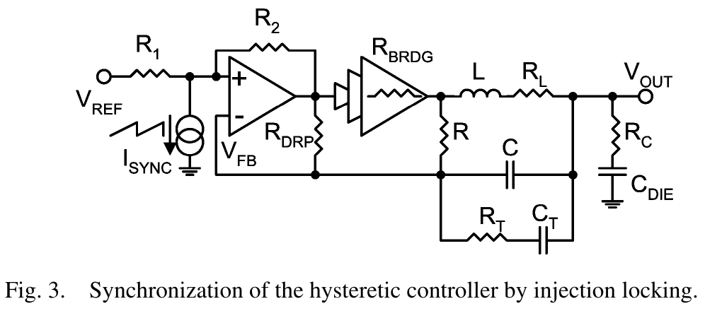 | 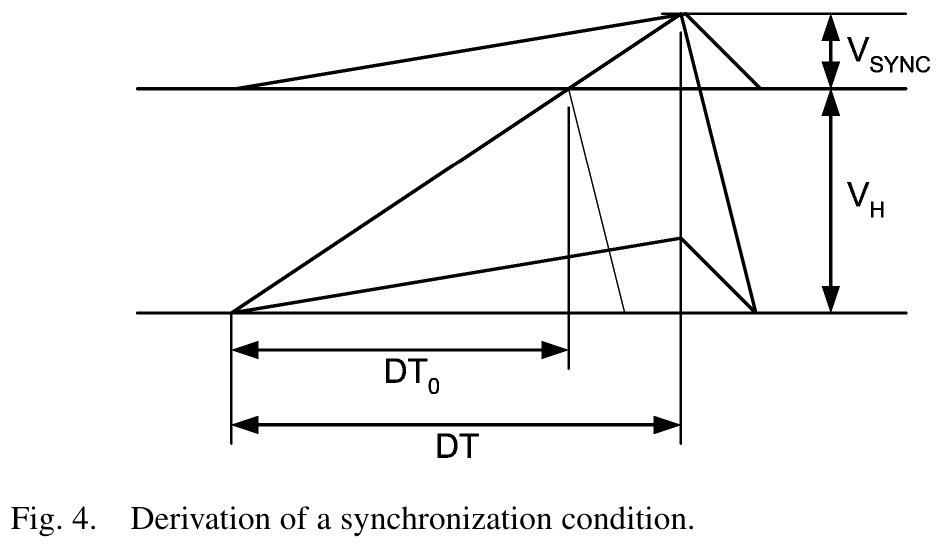 |

#### 1. 注入锁定机理与包络调制
如图 3 所示，在比较器同相输入端注入一个微弱的周期性电流信号 $I_{SYNC}$。该注入电流在节点等效阻抗上产生一个交流电压扰动 $V_{SYNC}(t)$，使比较器的实际翻转阈值包络产生周期性倾斜调制（如图 4 所示）。
设单相自激自振荡固有频率为 $f_0$（周期 $T_0 = 1/f_0$），注入同步时钟频率为 $f_{SYNC}$（周期 $T_{SYNC} = 1/f_{SYNC}$）。

#### 2. 锁定判据几何推导
由图 4 中的几何斜率边界条件可知，若要实现可靠无滑动的相位注频锁定，必须满足两大严苛判据：
1. **注入频率约束**：注入时钟频率必须严格略低于转换器的固有自激频率：
   $$f_{SYNC} < f_0$$
   物理机制：只有当注入信号周期大于本征周期时，注入的下倾三角波才能在自然翻转点之前“提前诱发”比较器阈值越限翻转。
2. **注入电压幅值最小阈值**：注入三角波信号的峰峰值幅度 $V_{SYNC}$ 必须满足：
   $$V_{SYNC} > V_H \cdot \left(1 - \frac{f_{SYNC}}{f_0}\right)$$
其中注入小信号在反馈节点激发的实际电压幅值为：
$$V_{SYNC} = I_{SYNC} \cdot \left[ R_1 \parallel (R_2 + R_{DRP}) \right]$$
**工程控制意义**：一旦注入电流 $I_{SYNC}$ 的幅值越过临界阈值，各相转换器的开关边沿即被牢牢“牵引”并锁定在注入时钟的对应相位上。
中央同步器只需向 4 个单相核心分别提供相移严格相差 $90^\circ$ 的四相注入电流（$\Phi_0, \Phi_1, \Phi_2, \Phi_3$），即可以极低的控制功耗将 4 个独立的迟滞控制器锁定在稳定的四相正交交错时序上。即使突发超大瞬态导致某一相短暂脱锁响应，在阶跃结束后系统也会在数个纳秒内自动重捕并平滑回锁！

---

## 4. 晶体管级关键子电路创新 (Transistor-Level Subcircuits)

### 4.1 单相核心电路架构全景（Fig. 5）

论文在 90 nm 硅片上实现了高度集成的单相完整转换器单元（1-phase Module），其实际晶体管级电路原理图完整展示于图 5 所示。

| 单相转换器完整晶体管级电路原理图 (Fig. 5) |
| :---: |
| 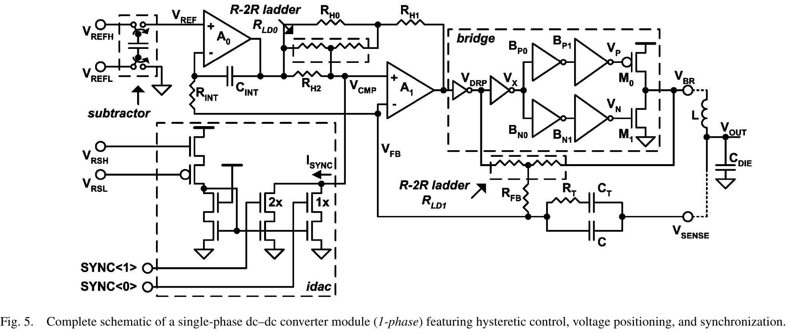 |

> **原文电路原理论述 (Verbatim Quote)**
> *"A switched capacitor circuit, subtractor, generates a reference voltage with respect to the local ground by subtracting the external reference voltages. An integrator compensates for the input offset of comparator and other offsets induced by the synchronization current. Resistors with large values implemented in CMOS usually have large parasitic capacitance to ground that limits the bandwidth... Resistive divider was replaced by the R-2R ladder which do not require high-value resistors."*
> 
> **【电路精髓深度剖析】**：这段论述高度提炼了 Hazucha 等人在高频模拟集成电路设计中的顶级工程手笔：
> 1. **彻底斩断地弹噪声**：通过片上开关电容减法器接收远端差分参考源，将其精确换算为本地洁净基准；
> 2. **失调全动态补偿**：利用辅助低频运放积分器自调零消除高速比较器输入失调与注入电流引起的直流偏移；
> 3. **消灭多晶硅电阻寄生电容**：彻底废弃巨型高阻，全面改用紧凑型 **R-2R 梯形电阻网络**，从根本上释放了数百兆赫兹下模拟节点的带宽极限！

### 4.2 关键子模块晶体管级拆解

#### 1. 差分电荷泵电平减法器（Switched-Capacitor Subtractor）
在微处理器芯片中，高频大电流的反复开关会在片上电源地网（Power Grid）上激发极其剧烈的地弹（Ground Bounce）与 $L \cdot di/dt$ 高频扰动。若直接输入单端参考电压，地弹将直接调制参考轨并恶化输出稳压精度。
- **电路拓扑**：如图 5 左上角所示，外部差分基准电压 $V_{REFH}$ 与 $V_{REFL}$ 经过一组互补 CMOS 模拟开关交替对浮动飞电容进行充放电采样。
- **降噪机制**：该开关电容结构执行高共模抑制比（CMRR）的差分代数减法操作，将远端干净的差分电压 $(V_{REFH} - V_{REFL})$ 转换并电平移位为相对于**转换器模块本地模拟洁净地（Local Ground）**的基准电位 $V_{REF}$，从源头上切断了外部共模地弹噪声向高速比较器的传导通路。

#### 2. 误差积分自调零放大器（Auto-Zeroing Integrator $A_0, C_{INT}, R_{INT}$）
- **失调痛点**：甚高频迟滞比较器 $A_1$ 必须采用极小尺寸的差分对晶体管以换取数百兆赫兹的判决响应速度，这必然带来高达数十毫伏的本征随机输入失调电压（Random Input Offset）；此外，差分注入同步电流 $I_{SYNC}$ 注入比较器输入端后，会在分压网络上沉淀不可忽略的直流压降偏置。
- **补偿原理**：设计引入了由低速辅助运算放大器 $A_0$、积分电阻 $R_{INT}$ 与积分电容 $C_{INT}$ 构成的超低频辅助积分补偿伺服环路。该环路在甚低频段检测反馈节点与 $V_{REF}$ 之间的稳态残余直流漂移，并自适应调节注入节点的直流基准，将高速比较器 $A_1$ 的输入等效总失调压制在亚毫伏级，确保了输出直流电压定位精度的绝对严谨。

#### 3. 基于 R-2R 梯形电阻网络的高频无寄生迟滞/定位编程
- **高频寄生电容危机**：在标准 90 nm CMOS 工艺中，采用高阻多晶硅（High-Res Poly）制作的几十上百千欧级大电阻，其对衬底的分布结电容高达数百皮法，会严重拉低比较器输入节点的极点频率，导致迟滞回差产生严重的相位滞后失真。
- **R-2R 架构突破**：
  - 设计人员将图 3 中的固定分压电阻全面替换为紧凑的低阻值电阻单元配合 **R-2R 梯形电阻网络（$R_{LD0}, R_{LD1}$）**。
  - **迟滞窗口数字微调（$R_{LD0}$）**：通过数字总线控制 $R_{LD0}$ 的分压抽头，可以在片上连续精细配置高速比较器 $A_1$ 的迟滞正反馈量，实现比较器迟滞窗口 $V_H$ 从 $10\,\text{mV}$ 到 $100\,\text{mV}$ 的多档数字编程。
  - **负载线斜率数字微调（$R_{LD1}$）**：数字切换 $R_{LD1}$ 的等效并联分流比，使下垂等效电阻 $R_{DRP}$ 在宽范围内步进可调，实现自适应电压定位（AVP）下垂斜率在不同芯片功耗模式下的在线校准。

#### 4. 差分注入电流 DAC（IDAC）与多相交错同步发生器（Synchronizer）
- **差分高速注入镜（Fig. 5 左下角）**：由差分共源共栅电流镜和二进制加权（$1\times, 2\times$）开关管组成 IDAC，由外部偏置发生器 $iref$ 供给主参考电流。
- **数字同步控制**：接收由中央同步器分发的数字注入选通码 $SYNC\langle 1:0\rangle$，以纳秒级切换速率将阶梯化微弱电流脉冲注入至节点 $V_{CMP}$。
- **正交四相时钟发生**：中央时钟发生器输入主时钟 $CLK_{REG}$（频率等于预定开关频率，如 $233\,\text{MHz}$），经由片上低抖动除频与相位延时锁相环，输出四路彼此严格滞后 $90^\circ$ 的差分互补方波信号 $\Phi_0\langle 1:0\rangle \sim \Phi_3\langle 1:0\rangle$，分别直连 4 个独立的单相转换单元。

#### 5. 功率级自适应死区缓冲驱动链与正向衬底偏置（FBB）优化
- **非重叠死区产生缓冲链**：为彻底杜绝高压侧 PMOS（$M_0$）与低压侧 NMOS（$M_1$）在数百兆赫兹高速换向时的直通短路电流（Shoot-Through Current），比较器输出信号 $V_{DRP}$ 分路经过两级独立的反相驱动链（$B_{P0}, B_{P1}$ 与 $B_{N0}, B_{N1}$）。驱动链内部植入了独立可调的延时单元，实现高边关断与低边开启之间精准的固定非重叠死区时间控制。
- **PMOS 正向衬底偏置（Forward Body Bias, FBB）**：
  - 在 90 nm 数字工艺中，PMOS 载流子空穴迁移率远低于 NMOS，导致上拉开关管导通电阻 $R_{ON,P}$ 偏大，构成了桥臂欧姆损耗的主体；
  - 论文在测试芯片中引入了独立的 N 阱偏置控制线，给功率桥 PMOS 的 N 阱施加比其源极电位低 $500\,\text{mV}$ 的正向偏置（即 $V_{BS} = -500\,\text{mV}$）；
  - **物理机制与效果**：强烈的正偏衬底效应显著降低了 PMOS 的阈值电压 $|V_{TH,P}|$，增大了有效栅过驱动电压（$V_{GS} - |V_{TH}|$），使 PMOS 导通电阻狂降约 $10\%$，一举斩获 $0.5\% \sim 1.0\%$ 的整体转换效率红利！

---

## 5. 芯片实测结果与 SOTA 对比 (Silicon Results & FoM)

### 5.1 实测四相开关波形与交错对消（Fig. 9）

| 四相功率桥输出节点实测开关波形 (Fig. 9) |
| :---: |
| 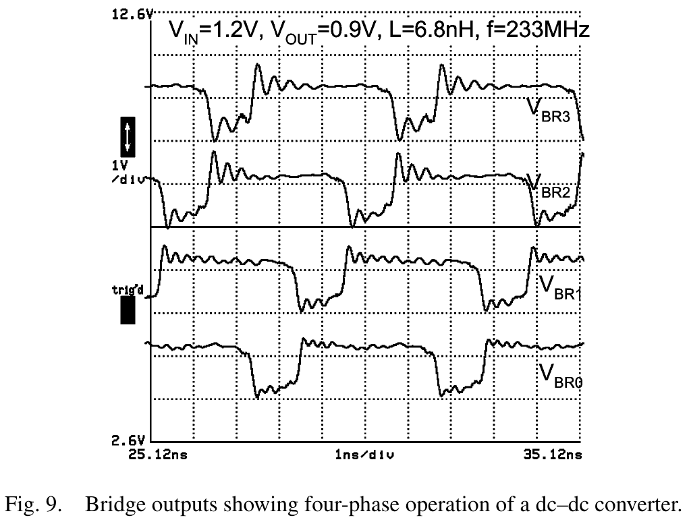 |

图 9 给出了转换器在测试芯片探针下实测捕获的四相桥输出引脚电压波形（$V_{BR0}, V_{BR1}, V_{BR2}, V_{BR3}$）。
- **测试工况**：$V_{IN} = 1.2\,\text{V}$，$V_{OUT} = 0.9\,\text{V}$，单相空心电感 $L = 6.8\,\text{nH}$，开关频率锁定在 $f_{SW} = 233\,\text{MHz}$（对应单个开关周期仅为 $T_{SW} = 4.29\,\text{ns}$）。
- **波形特性分析**：
  1. 四相方波占空比严格维持在预设的 $75\%$（$D = 0.75$），高电平持续时间约为 $3.22\,\text{ns}$，低电平续流时间约为 $1.07\,\text{ns}$；
  2. 四个通道的开关下跳沿在时间轴上彼此均匀错开恰好 **$1.07\,\text{ns}$（严格对应 $90^\circ$ 相位差）**；
  3. 实测波形边缘非常陡峭，上升/下降时间小于 $200\,\text{ps}$，验证了基于注入锁定的四相交错时序具备极高的保真度与锁定刚度，成功在微纳尺度实现了无缝的电感纹波相位重叠对消。

### 5.2 稳态转换效率与正向衬底偏置增益（Fig. 10, 11, 12）

| 1.2V 转 0.9V 实测转换效率曲线 (Fig. 10) | 1.4V 转 1.1V 实测转换效率曲线 (Fig. 11) |
| :---: | :---: |
| 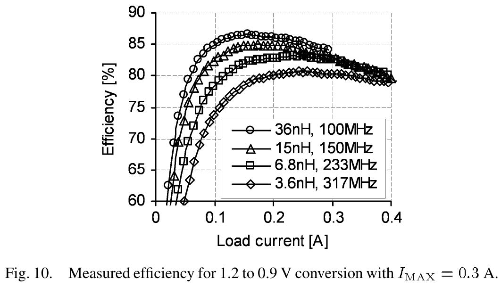 | 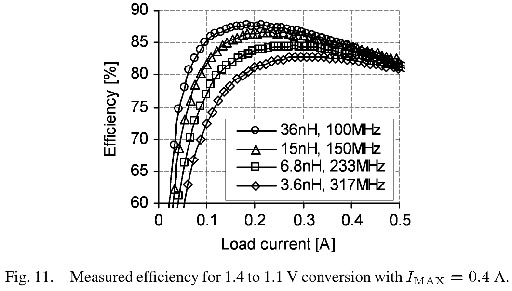 |

| 施加 0.5V 正向衬底偏置前后效率对比 (Fig. 12) | 频率、电感与片上电容多维权衡折中曲线 (Fig. 14) |
| :---: | :---: |
| 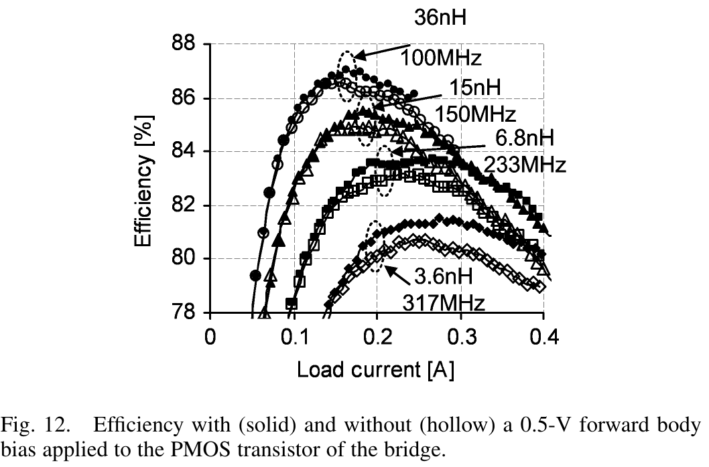 | 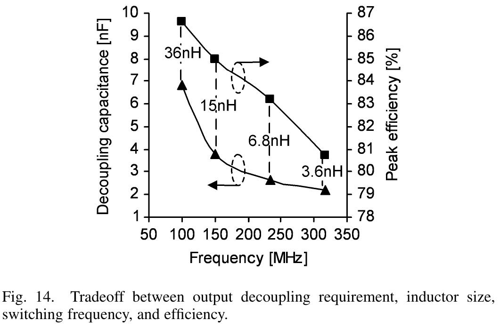 |

> **原文实验与测试论断 (Verbatim Quote)**
> *"Forward body bias reduced the series resistance and the resistive loss of the bridges by about 10%. Since this type of loss contributes about one-third of the total loss, the overall loss reduction is about 3%. For a dc–dc converter efficiency of 85%, the total loss is 15% of the input power. A 3% reduction translates into about a 0.5% improvement in efficiency, which is in agreement with the measurements... At larger load currents, the improvement is as much as 1%."*
> 
> **【测试结果评估】**：作者通过详尽的损耗分解模型与实测对比，精准指出了损耗构成的内在平衡：在 $233\,\text{MHz}$ 甚高频下，功率开关桥的阻性导通损耗占系统总损耗的约三分之一。通过施加 $500\,\text{mV}$ 正向衬底偏置，不仅在轻中载下带来了稳定 $0.5\%$ 的效率提升，在满载及过载大电流区间（导通欧姆损耗占比主导），效率增益进一步放大至惊人的 **$1.0\%$**，极具流片指导价值。

#### 实测效率核心结论提炼：
1. **输入输出工况特性**：
   - 在标称 $1.2\text{V} \to 0.9\text{V}$（$I_{MAX} = 0.3\,\text{A}$）工况下（图 10），当采用 $L = 6.8\,\text{nH}$ 运行于 $233\,\text{MHz}$ 时，系统在 $I_{LOAD} \approx 0.2\,\text{A}$ 处斩获 **$83.2\%$ 的峰值转换效率**，满载 $0.3\,\text{A}$ 下仍保持在 $82.5\%$ 的高水准；
   - 在高压工况 $1.4\text{V} \to 1.1\text{V}$（$I_{MAX} = 0.4\,\text{A}$）下（图 11），峰值转换效率攀升至 **$84.5\%$**，满载效率保持在 $83.2\%$；
2. **频率与电感选型折中（图 10/11 规律）**：
   - 在轻载电流区间（$I_{LOAD} < 0.15\,\text{A}$），采用大感值（$36\,\text{nH}$）配合较低开关频率（$100\,\text{MHz}$）表现出更优异的效率（最高达 **$87.0\%$**），原因在于栅极电荷充放电损耗（$P_{gate} = C_{iss} V_{IN}^2 f_{SW}$）以及电感纹波交流涡流损耗随频率显著降低；
   - 但在重载电流区间（$I_{LOAD} > 0.3\,\text{A}$），大感值电感由于匝数增多导致直流电阻（DCR）成倍增大，其欧姆导通损耗急剧恶化；反而是小电感（$6.8\,\text{nH} / 3.6\,\text{nH}$）由于 DCR 极低，在高负载下的效率衰减极为平缓，展现出更高的满载韧性。

### 5.3 50% 阶跃极端负载瞬态响应与 10% 压降特性（Fig. 13）

| 50% 负载急剧阶跃下瞬态输出电压跌落与噪声波形 (Fig. 13) |
| :---: |
| 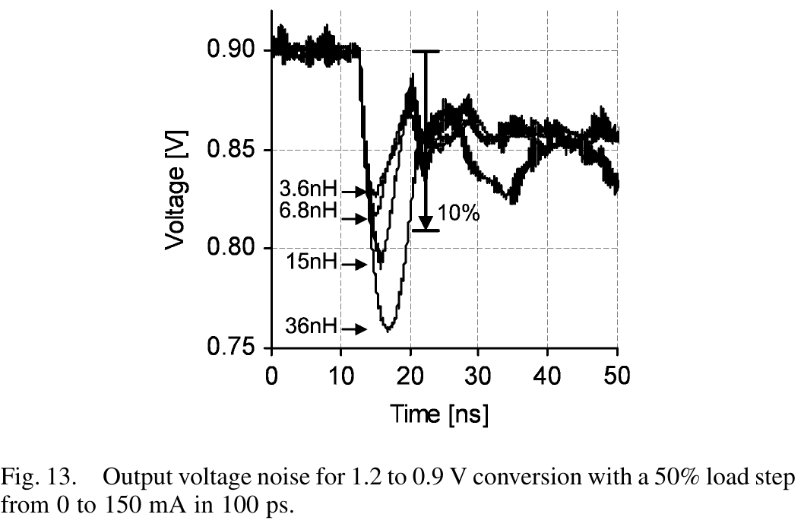 |

为了精确表征微处理器核心在极端工况下的供电稳定性，芯片内置了高速瞬态电流源测试负载，实测结果如图 13 所示：
- **测试条件**：$V_{IN} = 1.2\,\text{V} \to V_{OUT} = 0.9\,\text{V}$，负载电流从零瞬间阶跃至满载的一半（$0 \to 150\,\text{mA}$），跳变沿上升时间设置为极为苛刻的 **$t_{ramp} = 100\,\text{ps}$**（由 4 GHz 带宽高速采样示波器通过 50 $\Omega$ 同轴低寄生接口采集）。
- **实测动态指标剖析**：
  1. **极小电感（$3.6\,\text{nH}$ 与 $6.8\,\text{nH}$）**：响应速度受限于控制器与驱动链的逻辑传播延迟，但在迟滞控制的即时触发下，电感电流以极高斜率迅速补充。实测最大动态压降（Droop）严格控制在标称电压的 **$10\%$（$90\,\text{mV}$）以内**；随后在短短 **$10\,\text{ns}$（仅约 2 个开关周期）**内迅速平息，进入稳定状态。
  2. **大电感（$15\,\text{nH}$ 与 $36\,\text{nH}$）**：输出压降恶化至 $150\,\text{mV}$ 以上（超过 $16\%$ 下冲），主要原因在于大感值电感的电流爬升率（Slew Rate $= (V_{IN} - V_{OUT})/L$）严重不足，在亚纳秒级瞬态下片上电容迅速被透支；
  3. **自适应电压定位（AVP）稳态对齐**：各波形在经过瞬态震荡后，稳定在比空载低约 $50\,\text{mV}$ 的直流电平上（如图 13 中 $0.85\,\text{V}$ 处所示），这完全符合前文推导的自适应电压定位受控下垂负载线特征，证实了 AVP 机制在硬件实测中的高度精准性。

### 5.4 频率、电感、电容与效率的多维权衡空间（Fig. 14）

图 14 系统揭示了在微处理器片上集成供电设计中，输出解耦电容需求（Decoupling Requirement）、滤波电感尺寸（Inductor Size）、工作开关频率（Switching Frequency）以及转换效率（Efficiency）之间的四维底层设计约束空间：
- 若追求极致的集成度与最小的硅片电容面积（$C_{DIE} = 2.5\,\text{nF}$），转换器必须运行在 $233\,\text{MHz}$ 甚高频下，并配合 $6.8\,\text{nH}$ 封装空心电感，此时峰值转换效率为 $83.2\%$；
- 若系统允许容纳更大的解耦电容（如增至 $6.8\,\text{nF}$），工作频率可适度回退至 $100\,\text{MHz}$，电感采用 $36\,\text{nH}$，转换效率可进一步攀升至 $87.0\%$；
这一完备的折中曲线为芯片系统架构师在“硅片面积/电容开销”与“供电效率”之间权衡系统最优点提供了量化理论工具。

### 5.5 性能汇总与同类 SOTA 横向对比 (Benchmark Table)

论文将其实测成果与 1996 年至 2002 年间发表于顶级期刊与学术会议（APEC、ISSCC、PESC、JSSC）的同类代表性集成 DC-DC 转换器进行了全面横向对标，结果整理于下表（亦见实测对比图 Table II）：

| 关键性能指标 (Performance Metric) | 本文成果 (This Work, JSSC'05) | Mino 等 [7] (APEC'96) | Sakiyama 等 [8] (ISSCC'99) | Katayama 等 [9] (PESC'00) | Kim 等 [10] (JSSC'02) | Kim 等 [11] (TMAG'02) |
| :--- | :--- | :--- | :--- | :--- | :--- | :--- |
| **发表年份 / 出处** | **JSSC 2005 (Intel)** | APEC 1996 | ISSCC 1999 | PESC 2000 | JSSC 2002 | IEEE TMAG 2002 |
| **工艺制程 (Process)** | **90 nm Logic CMOS** | 不适用 (n/a) | 0.25 µm CMOS | 不适用 (n/a) | 0.25 µm CMOS | 不适用 (n/a) |
| **拓扑交错相数 (# Phases)**| **4 相交错 (4-Phase Interleaved)** | 1 相 (Single) | 1 相 (Single) | 1 相 (Single) | 1 相 (Single) | 1 相 (Single) |
| **输入 / 输出电压 ($V_{IN} / V_O$)**| **1.2 V / 0.9 V** | 4.0 V / 3.3 V | 3.0 V / 2.0 V | 4.0 V / 3.0 V | 2.5 V / 1.4 V | 3.6 V / 2.7 V |
| **开关工作频率 ($f_{SW}$)** | **233 MHz** (甚高频) | 1.6 MHz | 0.5 MHz | 3.0 MHz | 0.75 MHz | 1.8 MHz |
| **标称峰值效率 ($\eta_{peak}$)** | **83.2% ~ 87.0%** | 85.0% | 94.0% | 83.3% | 95.0% | 80.0% |
| **总滤波电感量 ($L_{TOT}$)** | **0.0017 µH (1.7 nH)** | 3.0 µH | 10.0 µH | 1.0 µH | 15.2 µH | 1.0 µH |
| **滤波电容容量 ($C_{OUT}$)** | **0.0025 µF (2.5 nF)** | 不适用 (n/a) | 47.0 µF | 1.0 µF | 21.6 µF | 不适用 (n/a) |
| **最大额定负载 ($I_{MAX}$)** | **0.3 A** (扩展 0.4 A) | 0.3 A | 0.25 A | 0.33 A | 0.25 A | 0.3 A |
| **芯片转换面积 ($Area$)** | **0.14 mm²** | 不适用 (n/a) | 0.46 mm² | 20.0 mm² | 0.35 mm² | 不适用 (n/a) |
| **无源器件集成方案** | **封装级贴装空心电感 + 片上全集成薄栅电容** | 磁性薄膜电感 | 外挂庞大电感与电容 | 磁性薄膜电感 | 外挂庞大电感与电容 | FeBN 磁性薄膜电感 |

| 同类集成稳压器代表作横向全景对标表 (Table II) |
| :---: |
| 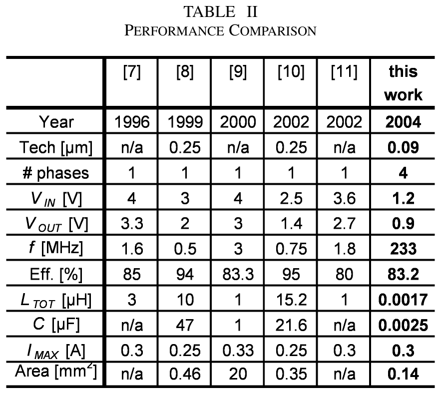 |

#### 深度对比剖析：
1. **无源器件集成度的飞跃**：对比同为几十至数百毫安级负载的既往工作，Sakiyama [8] 与 Kim [10] 虽然取得了高于 $90\%$ 的效率，但其依赖高达 $10 \sim 15\,\mu\text{H}$ 的巨型电感以及 $20 \sim 47\,\mu\text{F}$ 的庞大片外电容，体积完全不具备实用集成可行性；而 Katayama [9] 虽尝试集成薄膜电感，但芯片面积高达惊人的 $20\,\text{mm}^2$。本文将总滤波电感压缩至仅 **$1.7\,\text{nH}$（缩减近 10,000 倍）**，滤波电容压缩至 **$2.5\,\text{nF}$（缩减近 10,000 倍）**，核心净面积仅需 **$0.14\,\text{mm}^2$**，展现出压倒性的集成度与面积功耗比。
2. **频率突破**：在保证同等高效率（$>83\%$）的前提下，将 CMOS 开关频率从既往的 $0.5 \sim 3\,\text{MHz}$ 极限一举推升两个数量级至 **$233\,\text{MHz}$**，彻底证明了标准深亚微米逻辑 CMOS 工艺制作甚高频电源转换器的巨大工程可行性。

---

## 6. Cadence Virtuoso 仿真与流片借鉴建议 (IC Design & Virtuoso Takeaways)

> **课题借鉴与工程落地思考**
> 1. **核心可复用模块推荐**：
>    - **基于跨电感 RC 积分网络的无损电流采样拓扑**：在当前主流BCD工艺（如 0.18 µm BCD）或先进 FinFET 工艺中设计大电流或高频 Buck 时，强烈推荐采用该无损 RC 积分架构。其彻底消除了串联 SenseFET 带来的导通阻抗与版图面积，但在设计时务必严格保证 $R \cdot C$ 时间常数与电感物理等效参数 $L / R_{EQ}$ 的匹配度。
>    - **自适应下垂电阻（$R_{DRP}$）与 R-2R 梯形编程网络**：用 R-2R 替代大阻值多晶硅电阻的设计思想对于任何高频模拟前端（AFE）或电源控制环路具有极高普适性，能显著压减节点寄生电容对闭环相位的侵蚀。
>    - **注入锁定多相交错同步结构**：对于需要兼顾“亚纳秒瞬态恢复”与“多相交错对消纹波”的高性能 CPU/GPU 供电 PMIC，该方案是打破传统 PWM 环路带宽瓶颈的绝佳拓扑选择。
> 2. **Cadence Virtuoso 仿真验证策略**：
>    - **瞬态大信号阶跃设置（Transient Step Simulation）**：在 Spectre 仿真中验证超快瞬态（如 $100\,\text{ps}$ 边沿），务必在仿真器选项中强制设置 `maxstep <= 5ps`，并开启 `errpreset = conservative`。若采用默认宽松步长，数值积分算法极易在数吉赫兹的高频开关跳变沿处产生严重的数值阻尼或发散伪迹。
>    - **注入锁定捕获带与同步裕度仿真**：使用包含寄生参数的晶体管级网表，对主时钟频率进行连续参数扫描（Parametric Sweep），测量转换器从自然自激频率 $f_0$ 被成功牵引锁频的最小注入电流 $I_{SYNC,min}$ 与锁定带宽 $\Delta f_{lock}$，验证其是否满足理论边界条件：
>      $$V_{SYNC} > V_H \left(1 - \frac{f_{SYNC}}{f_0}\right)$$
>    - **环路稳定性验证（PSTB / Strobe Analysis）**：由于迟滞控制属于本质非线性强开关系统，传统 AC 小信号断环仿真（Middlebrook 法）不再适用。建议在 Cadence 中采用周期性小信号分析工具（Periodic Transfer Function, PXF / PSTB），或者通过瞬态大信号注入轻微扰动脉冲观察时域阻尼衰减比（Damping Ratio）来反推相位裕度（Phase Margin $\ge 50^\circ$）。
> 3. **版图与可靠性避坑指南**：
>    - **正向衬底偏置（FBB）的闩锁（Latch-up）与结漏电风险**：在现代先进双阱/三阱 CMOS 工艺中实施 PMOS 正向衬底偏置时，阱-源 PN 结的正向导通电位在高温（$125^\circ\text{C}$）下会从室温的 $0.7\,\text{V}$ 显著跌落至 $0.5\,\text{V}$ 左右。因此，注入的偏置电位**严禁超过 $500\,\text{mV}$**，否则极易触发寄生晶闸管（SCR）结构诱发毁灭性闩锁；同时必须在 N 阱与 P 衬底之间密布高密度保护环（Guard Rings）隔离衬底注入电流。
>    - **封装级寄生电感与地弹（Ground Bounce）隔离**：在 $233\,\text{MHz}$ 频率下，$1\,\text{nH}$ 的引线寄生电感在 $1\,\text{A/ns}$ 的跳变沿下即可激发出高达 $1\,\text{V}$ 的寄生尖峰！因此，必须严格遵循本文的封装策略：淘汰一切打线封装（Wire-bond），全面采用倒装焊（Flip-Chip BGA）；每相功率桥的输出、输入与地电位必须各自分配独立的 C4 焊球凸点阵列（如图 7 所示），并在芯片表层铺设厚铜金属层（RDL）构建超低阻抗低寄生供电网。

---

## 7. 关联文献与学术网络 (Academic References)

- **甚高频（VHF）集成稳压器与多相交错先驱文献**：
  - J. A. Abu-Qahouq, N. Pongratananukul, I. Batarseh, and T. Kasparis, *"Multiphase voltage-mode hysteretic controlled VRM with DSP control and novel current sharing,"* in *Proc. IEEE Int. Caracas Conf. Devices, Circuits and Systems*, Apr. 2002, pp. P017-1–P017-7. *(多相迟滞控制概念先驱，本文引用 [2])*
  - S. Sakiyama, J. Kajiwara, M. Kinoshita, K. Satomi, K. Ohtani, and A. Matsuzawa, *"An on-chip high-efficiency and low-noise DC/DC converter using divided switches with current control technique,"* in *IEEE Int. Solid-State Circuits Conf. (ISSCC) Dig. Tech. Papers*, Feb. 1999, pp. 156–157. *(低频高集成 Buck 经典对比文献，本文对比文献 [8])*
- **超快负载瞬态与自适应电压定位（AVP）理论基础**：
  - R. Redl, B. P. Erisman, and Z. Zansky, *"Optimizing the load transient response of the buck converter,"* in *Proc. IEEE Applied Power Electronics Conf. Expo. (APEC)*, vol. 1, Feb. 1998, pp. 170–176. *(电压定位与最优电阻性输出阻抗奠基之作，本文理论溯源文献 [3])*
  - A. Waizman and C.-Y. Chung, *"Resonant free power network design using extended adaptive voltage positioning (EAVP) methodology,"* *IEEE Trans. Adv. Packag.*, vol. 24, no. 3, pp. 236–244, Aug. 2001. *(微处理器自适应电压定位 EAVP 规范，本文引用 [4])*
- **英特尔同期极速片上集成线性稳压器（同专题姊妹篇）**：
  - P. Hazucha, T. Karnik, B. A. Bloechel, C. Parsons, D. Finan, and S. Borkar, *"Area-efficient linear regulator with ultra-fast load regulation,"* *IEEE J. Solid-State Circuits*, vol. 40, no. 4, pp. 933–940, Apr. 2005. *(同一团队同刊发表的超快瞬态片上 LDO 姐妹作，本文对比与互补设计 [12])*
- **微处理器双电压域与低功耗架构代表作**：
  - S. Mathew, M. Anders, B. Bloechel, T. Nguyen, R. Krishnamurthy, and S. Borkar, *"A 4 GHz 300 mW 64 b integer execution ALU with dual supply voltages in 90 nm CMOS,"* in *IEEE Int. Solid-State Circuits Conf. (ISSCC) Dig. Tech. Papers*, Feb. 2004, pp. 162–163. *(Intel 90 nm 双电源域 4 GHz 算术逻辑单元应用原型，本文直接供电目标 [1])*
