> **论文核心亮点与芯片定位**
> - **行业学术地位**：本文是台湾交通大学陈科宏（Ke-Horng Chen）教授团队在 IEEE JSSC 2007 上发表的经典传世之作。针对片上系统（SoC）与动态电压调节（DVS）中极端跨度负载（待机沉睡态 $0.1\text{ mA}$ 到满负荷高速态 $500\text{ mA}$，动态跨度达 5000 倍）的能效挑战，首次系统性地提出了 **“三模自适应调制（Tri-Mode: PWM / DSM / PFM）+ 温度无关电流模延迟链负载传感器（Current-Mode Delay-Line ADC）+ 动态最佳功率管尺寸控制（OWC）+ 最佳电流模死区与分步地弹抑制控制（ODC）”** 的全套片上集成能效优化体系。
> - **四大核心技术突破**：
>   1. **DSM 抖动跳步调制技术（Dithering Skip Modulation）**：在传统双模（PWM 与 PFM）之间首创性地插入 DSM 模式，通过动态可伸缩的“三脉冲抖动单元（DS Module）”，彻底消除了 PWM 向 PFM 过渡区的能效凹陷（Efficiency Drop），填平了 $5.6\% \sim 8\%$ 的效率深坑，且纹波比传统 PSM 或 Burst 模式小得多（$< 35\text{ mV}$）。
>   2. **无温漂电流模延迟链负载传感器（Current-Mode Delay-Line ADC）**：彻底摒弃高功耗、大面积的高速 Flash ADC，发明了仅由 17 级反相器构成的电流模延迟链；巧妙结合温度互补差分 V-I 转换器，完全抵消了载流子迁移率与阈值电压的温度漂移，在 $-40^\circ\text{C} \sim 140^\circ\text{C}$ 超宽温区内实现线性负载电流解码，误差低于 $\pm 2.5\%$。
>   3. **动态分段最优功率管尺寸控制（Optimum Width Controller, OWC）**：将主功率 PMOS 与 NMOS 分解为 12 个加权单元（$2 \times \text{X1} + 5 \times \text{X2}$），根据负载传感器输出动态接通功率管与对应反相器驱动链（锥度系数 $a$ 动态匹配），在轻载与极轻载（$0.1\text{ mA}$）下将栅极驱动与充放电损耗狂减 **90%**！
>   4. **自校准最佳死区与交错防地弹控制器（Optimum Dead-Time Controller, ODC）**：提出基于电流模可调延迟的死区控制器，配合独创的“占空比最小化闭环校准算法”，自动锁定最佳无直通、零体二极管导通死区；同时将功率管分组（SW_P, SW_PD, SW_PD2）实施纳秒级延时交错导通，将恶劣开关瞬间的地弹（Ground Bounce）峰峰值削减 **50%**（从 $>800\text{ mV}$ 压制到 $430\text{ mV}$）。
> - **芯片实测指标速记**：
>   - **工艺制程**：TSMC $0.35\,\mu\text{m}$ 2P4M 标准互补 CMOS 工艺（$V_{THN}=0.55\text{V}, V_{THP}=0.65\text{V}$）；
>   - **电气规格**：$V_{IN} = 3.3\text{ V}$（标称 $2.7\text{ V} \sim 3.6\text{ V}$），$V_{OUT} = 1.65\text{ V}$，$I_{OUT} = 0.1\text{ mA} \sim 500\text{ mA}$；
>   - **无源元件**：标称电感 $L = 4.7\,\mu\text{H}$，滤波电容 $C_L = 4.7\,\mu\text{F}$（$R_{ESR} = 30\,\text{m}\Omega$）；
>   - **实测效率表现**：重载峰值效率 **95.0%**；在 $3\text{ mA} \sim 500\text{ mA}$ 超宽负载区间内效率始终保持在 **90%** 以上；在 $0.1\text{ mA}$ 极轻载下依然强悍维持 **90%** 转换效率；
>   - **芯片面积**：有效硅片总面积（含全部测试 Pad 与功率管）仅为 $3.2\,\text{mm}^2$。

---

## 1. 芯片电气性能与设计指标 (Specs Table)

| 参数类别 | 参数项 (Parameter) | 论文数值 / 实测表现 | 备注与测试条件 (Conditions) |
| :--- | :--- | :--- | :--- |
| **工艺制程** | Process Technology | **TSMC 0.35 µm 2P4M CMOS** | 双多晶硅、四层金属互补 CMOS 工艺 |
| **阈值电压** | Threshold Voltage ($V_{THN} / V_{THP}$) | **0.55 V / 0.65 V** | 常规标准器件阈值 |
| **输入电压** | Input Voltage ($V_{IN}$) | **3.3 V** (典型范围 2.7 V ~ 3.6 V) | 单节锂电池供电及 SoC 片上常规总线电压 |
| **输出电压** | Output Voltage ($V_{OUT}$) | **1.65 V** | 标称降压转换值 ($D \approx 50\%$) |
| **负载电流范围** | Output Load Range ($I_{OUT}$) | **0.1 mA ~ 500 mA** | 跨越 5000 倍动态电流，兼顾睡眠与高频计算 |
| **PWM 工作区** | PWM Mode Load & Frequency | **80 mA ~ 500 mA** @ **1.0 MHz** | 连续导通模式 (CCM)，纹波 $< 10\text{ mV}$ |
| **DSM 工作区** | DSM Mode Load Range | **40 mA ~ 120 mA** (滞环过渡区) | 动态抖动跳脉冲调制，纹波 $< 35\text{ mV}$ |
| **PFM 工作区** | PFM Mode Load Range | **0.1 mA ~ 120 mA** (主要用于 $<40\text{mA}$) | 迟滞断续导通模式 (DCM)，纹波 $< 20\text{ mV}$ |
| **滤波电感** | Output Inductor ($L$) | **4.7 µH** | 外挂贴片功率电感 |
| **滤波电容** | Output Capacitor ($C_L$) | **4.7 µF** | 陶瓷贴片电容，等效内阻 $R_{ESR} = 30\,\text{m}\Omega$ |
| **电流采样电阻** | Sense Resistor ($R_{sense}$) | **1.0 kΩ** | SENSEFET 比例采样转换电阻 (1:1000) |
| **V-I 转化电阻** | Conversion Resistor ($R_S$) | **500 kΩ** | 片上集成高精度多晶硅电阻 |
| **峰值效率** | Peak Power Efficiency ($\eta_{max}$) | **95.0%** | 重载 PWM 模式下测得 |
| **全载效率维持** | Ultra-Wide Load Efficiency | **> 90%** (3 mA ~ 500 mA) | 0.1 mA 极轻载下测得 $\approx 90\%$ |
| **驱动损耗改善比**| Driver & Power MOS Loss Reduction| **最高提升 90%** (@ 0.1 mA) | 由 OWC 功率管降维分段与 ODC 技术贡献 |
| **地弹抑制比** | Ground Bounce Reduction | **削减约 50%** ($>800\text{mV} \to 430\text{mV}$) | 3 组分时延迟缓冲器（SW_P, SW_PD, SW_PD2） |
| **死区控制改善** | Dead-Time Efficiency Gain | **提升 1% ~ 5%** | 消除体二极管续流与防直通回流损耗 |
| **芯片总面积** | Die Micrograph Area | **3.2 mm²** (含全部 Pad、功率管及控制核) | 有源区紧凑，便于集成进超大规模 SoC |

| 芯片整体规格明细 (Table II) | 外围无源器件与关键阻容参数 (Table III) |
| :---: | :---: |
| 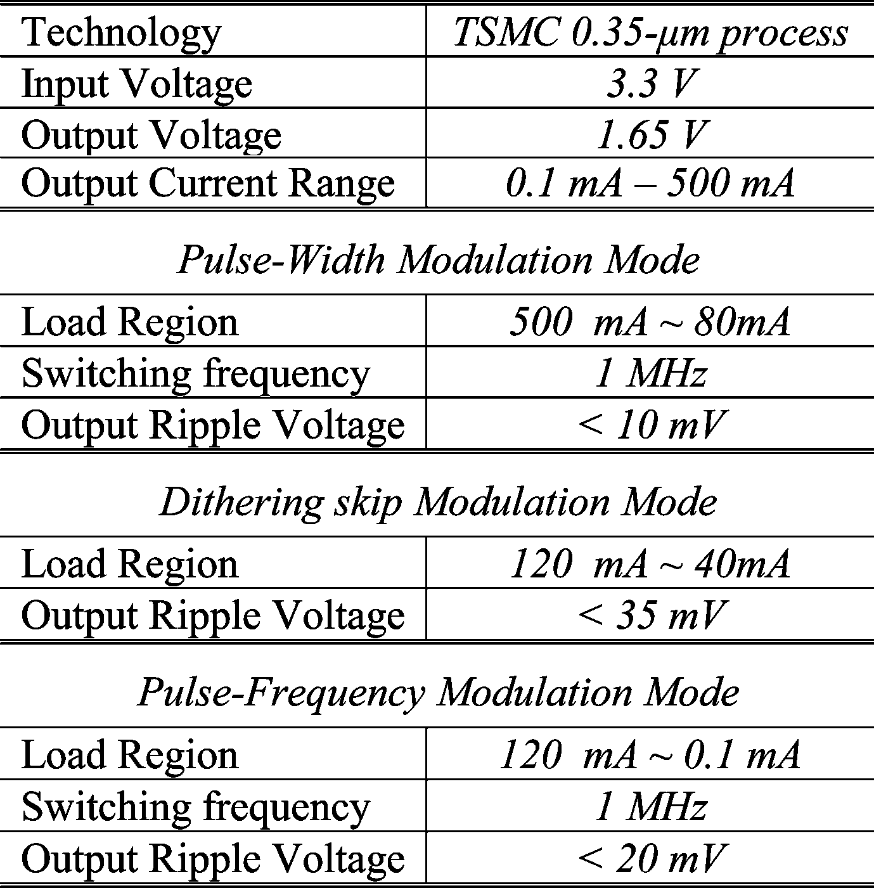 | 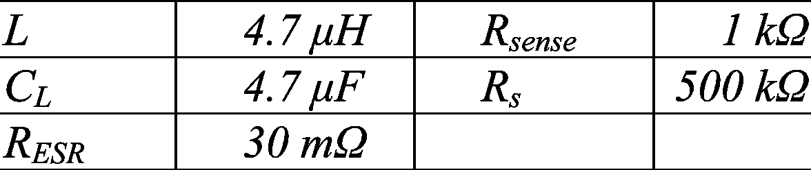 |
| **表 1**：论文 Table II 汇总的完整规格与三模工作区间 | **表 2**：论文 Table III 列出的电感、电容与片上核心电阻值 |

---

## 2. 研究背景与设计痛点 (Motivation & Bottlenecks)

### 2.1 传统转换器架构的核心物理瓶颈

在便携式电池供电设备（如智能手机、PDA、便携媒体播放器）与现代高性能 SoC（如带 DVS/AVS 动态电压伸缩的处理器）中，芯片在待机或睡眠模式下负载电流仅为数十微安（$\mu\text{A}$）到数百微安，而在执行高并发运算或图形渲染时负载电流瞬时飙升至数百毫安（$\text{mA}$）。在这样悬殊的负载变化下，传统 DC-DC Buck 变换器面临以下四个不可逾越的瓶颈：

```
[传统 PWM/PFM 双模缺陷]               [固定死区与体二极管损耗]              [固定功率管轻载电荷损耗]
PWM 模式 (重载高能效)                    死区过长 -> 体二极管导通 (0.7V压降)       主功率管极宽 (W/L 达数万微米)
        \                                     -> 带来严重导通损耗与 Qrr 反向恢复    轻载下高频对巨大 C_gate 充放电
         \--[效率凹陷 5%~8%!]--\               死区过短 -> 高低边瞬间直通烧毁!          P_gate = C_iss * V_in^2 * f_sw
                                \             ---------------------------------     轻载下驱动功耗直接吃空电池!
                             PFM 模式         [开关节点地弹 (Ground Bounce)]       ---------------------------------
                            (轻载脉冲跳频)       瞬态 di/dt 极大 -> V_bounce = L * di/dt  [传统 DLL 死区与 ADC 功耗大]
                                              地线剧烈震荡扰动 PWM 逻辑与占空比      高速 ADC 与 DLL 模拟硬件开销极其庞大
```

1. **传统双模转换（Hybrid PWM/PFM）的过渡带效率凹陷（Efficiency Drop）**：
   - 为兼顾轻重载，学术界与工业界常采用 PWM/PFM 双模架构。
   - **致命问题**：如图 1 中的曲线 I 与曲线 II 所示，PWM 在重载区（Region I）效率极高，但在中轻载区因固定开关频率带来的开关损耗占比剧增而急剧恶化；PFM 在极轻载（Region III）通过降低开关频次提升效率；但在两者过渡的中等负载区（Region II，通常在数十毫安量级），**转换曲线存在高达 5%~8% 的断崖式效率凹陷（Efficiency Drop）**！若强行缩窄两峰距离，又会导致系统支持的连续负载范围大打折扣。
   - 此外，已有双模芯片往往需要外置控制引脚（External Mode Pin）或外部微处理器介入才能完成模式判决，无法实现全自主片上自适应。
2. **轻载下固定大尺寸功率管的驱动电荷浪费**：
   - 为满足 500mA 重载下的低导通内阻需求（$R_{ON}$），功率 MOSFET 的栅极宽度必须做得极大（本文中 PMOS 宽达 $52596\,\mu\text{m}$，NMOS 宽达 $21083\,\mu\text{m}$）。
   - 在轻载（$<40\text{mA}$）乃至休眠（$0.1\text{mA}$）时，导通损耗已微不足道，而驱动该超大栅极寄生电容所需的动态充放电开关功耗 $P_{gate} = C_{iss} V_{IN}^2 f_{SW}$ 却分毫未减，成为拖垮轻载效率的元凶。
3. **固定死区控制（Fixed Dead-Time）在全工况下的两难困境**：
   - 为防止高边 PMOS 与低边 NMOS 直通（Shoot-Through），必须在开关换向瞬间插入死区时间。
   - **固定死区的弊端**：死区必须按最恶劣工艺角（Worst-Case）设计得足够冗长，这导致在大多数工况下，开关节点 $V_X$ 靠体二极管（Body Diode）续流时间过长。体二极管高达 $0.7\text{ V} \sim 0.9\text{ V}$ 的正向压降造成巨大的寄生电导损耗；当低边管随后导通时，体二极管的反向恢复电荷（Reverse Recovery Charge $Q_{rr}$）还会引起剧烈电流尖峰和电荷损耗。反之，若死区过紧，轻微温漂便会导致直通短路。
4. **功率管剧烈开启诱发的地弹效应（Ground Bounce）**：
   - 在重载工况下，功率管迅速开启产生极大的瞬态电流斜率（$di/dt$）。片上键合引线（Bonding Wires）与引脚寄生电感（$L_{par} \approx 2\text{nH} \sim 5\text{nH}$）将在芯片地总线上诱发严重的**地弹电压震荡**（$V_{bounce} = L_{par} \frac{di}{dt}$，峰峰值常超过 $800\text{ mV}$）。
   - 地弹不仅对模拟敏感信号（带隙基准、采样节点）产生致命串扰，还会使内部比较器误翻转，破坏占空比判决。

| 四种调制技术下的全载效率对比趋势 (Fig. 1) |
| :---: |
| 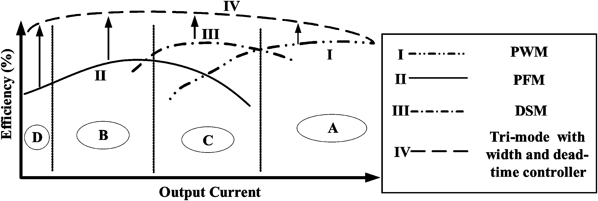 |
| **图 1**：传统单 PWM（曲线 I）、单 PFM（曲线 II）、DSM 独立（曲线 III）与本文提出的三模+OWC+ODC 融合方案（曲线 IV）的效率曲线对比。直观可见 DSM 与辅助控制器成功抹平了中间凹陷，使高能效覆盖至 0.1mA。 |

---

### 2.2 本文切入点与重大创新动机

针对上述四大顽疾，黄宏玮、陈科宏等人提出了“智能感知、动态降维、抖动跳脉冲、自适应死区与分时驱动”的组合拳：

> **原文核心动机论述 (Verbatim Quote)**
> *"A popular technique to improve the efficiency over a wide load current range is the hybrid mode, which is composed of pulse-width modulation (PWM) and pulse-frequency modulation (PFM). However, there exists an efficiency dropping in region II. It means that the efficiency curve is not smooth at the transition between PWM mode and PFM mode... Thus, under a wide load range, a new technique named as DSM is required to raise efficiency drop between transitions of PWM and PFM... Furthermore, compared with PSM mode and burst mode, DSM mode uses the dithering technique to reduce the output ripple."*
> 
> **【核心要义深度解读】**：作者开宗明义地指出了混合调制的天然缺陷：PWM 与 PFM 之间的非平滑切换必定在居中负载区引发效率跌落。若想在宽达数千倍的电流跨度下维持平直的高效曲线，必须引入一种具有承上启下特性的新型调制模式——**抖动跳脉冲调制（DSM）**。更关键的是，作者强调 DSM 采用精细的“抖动打散”算法，避免了传统跳脉冲（PSM）或突发模式（Burst Mode）因脉冲成团释放而引起输出电压产生恶劣的低频大纹波，做到了能效提升与纹波质量的兼收并蓄。

---

## 3. 系统拓扑与控制架构 (Topology & Working Principles)

### 3.1 完整系统框图与分段功率级

本文设计的 tri-mode 降压变换器系统架构如图 2 所示，整个芯片由控制回路与功率执行级严密闭环构成：

| 三模降压变换器系统顶层架构图 (Fig. 2) |
| :---: |
| 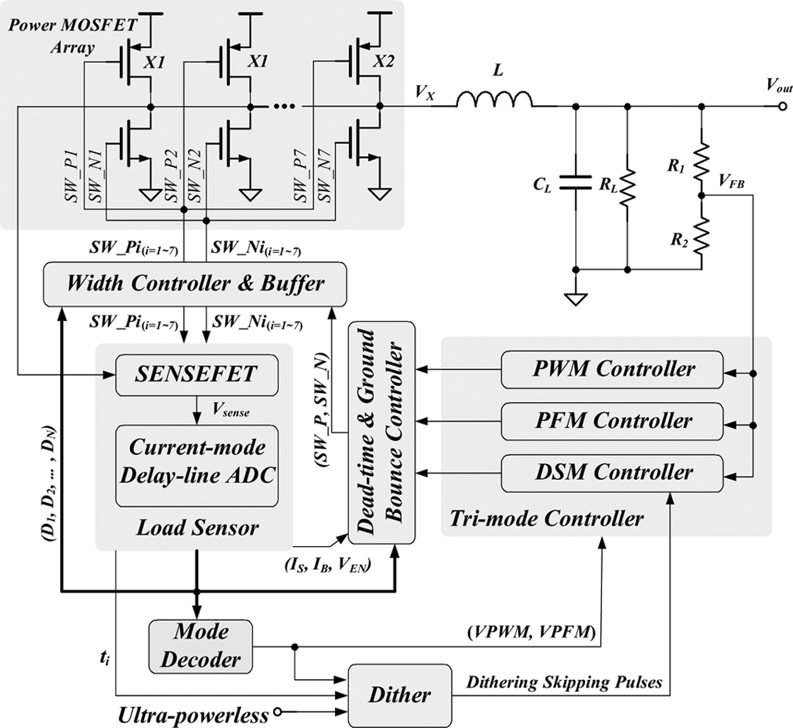 |
| **图 2**：包含 SENSEFET 比例采样、无温漂电流模延迟链 ADC、三模模式译码器、DSM 抖动发生器、自适应死区/地弹控制器及分段功率管阵列的系统全景。 |

- **分段功率级阵列（Power MOSFET Array）**：
  - 高边 PMOS 与低边 NMOS 均采用分段可重构阵列（共 12 组等效单元）。
  - PMOS 总宽达 $52596\,\mu\text{m}$，分为两组 $\text{X1} = 4383\,\mu\text{m}$ 单元与五组 $\text{X2} = 8766\,\mu\text{m}$ 单元；NMOS 总宽达 $21083\,\mu\text{m}$，分为两组 $\text{X1} = 1753\,\mu\text{m}$ 单元与五组 $\text{X2} = 3506\,\mu\text{m}$ 单元。
  - 每个分段单元均配备独立的锥度缓冲驱动器，由宽度控制器输出的 7 路使能总线（$SW\_Pi, SW\_Ni, i=1\sim 7$）独立加权开启。
- **闭环采样与模式解算链路**：
  - 分段 SENSEFET 电流采样网络同步按 1000:1 跟踪开启的功率管尺寸，生成高精度动态采样电压 $V_{sense}$；
  - 经采样保持（S/H）提取峰值后，送入温度无关电流模延迟链 ADC，即时生成 5-bit 数字负载字（$D_1 \sim D_N$）；
  - 模式译码器（Mode Decoder）根据数字字状态机输出两路模式选择逻辑（$VPWM, VPFM$）；
  - 三模控制器（Tri-mode Controller）根据模式选择，无缝调度 PWM、PFM 或 DSM 发生器产生基准开关脉冲 $V_{switch}$；
  - 最终经死区与地弹控制器（ODC）调节延迟，生成防直通的 $SW\_P$ 与 $SW\_N$ 驱动分段功率管。

---

### 3.2 控制机制与三模自适应调制原理

| 模式选择逻辑状态真值表 (Table I) | DSM 抖动跳步调制工作时序图 (Fig. 6) |
| :---: | :---: |
| 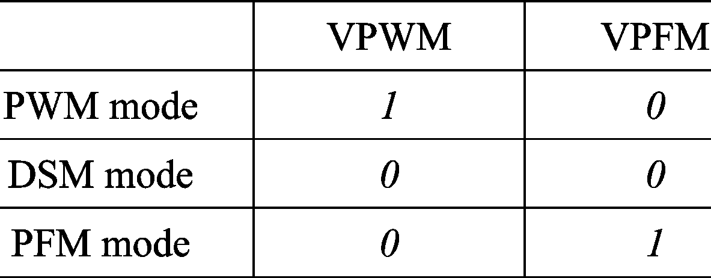 | 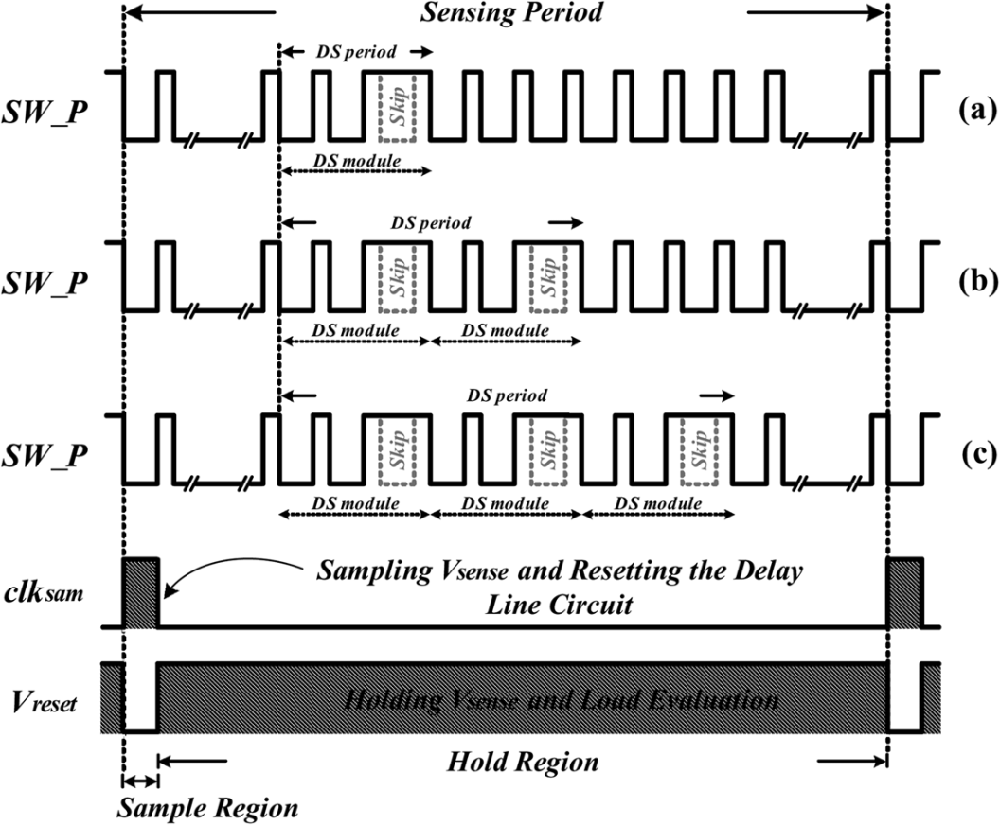 |
| **表 3**：模式解码器输出逻辑状态 | **图 3**：随负载变轻，DS Period 自适应拉长并纳入更多跳步单元的时序演变 |

#### 1. 三种调制模式的定义与转换真值表
通过内部逻辑信号 $VPWM$ 与 $VPFM$ 的互斥组合，系统定义了三种工作范式（如 Table I 所示）：
- **PWM 模式 ($VPWM=1, VPFM=0$)**：
  - 适用于重载工况（$80\text{ mA} \sim 500\text{ mA}$）。
  - 采用固定 $1.0\text{ MHz}$ 时钟驱动的标准峰值电流模反馈控制回路，保证输出稳态纹波极小（$< 10\text{ mV}$）与高带宽动态响应。
- **DSM 模式 ($VPWM=0, VPFM=0$)**：
  - 适用于中等负载过渡区（$40\text{ mA} \sim 120\text{ mA}$）。
  - 在固定开关周期框架下，利用抖动跳步逻辑定期剔除部分 PWM 驱动脉冲。跳脉冲的数量与负载电流严格成反比：电流越小，跳过的脉冲越多。
  - **抖动跳步（Dithering Skip）机制**：如图 6 所示，DSM 将时间划分为动态可变的抖动周期（$DS\text{ Period}$），每个周期内部包含多个基础抖动跳步模块（$DS\text{ Module}$）。一个标准 $DS\text{ Module}$ 强制在连续 3 个开关脉冲中执行 **“开启-开启-关闭（2 ON + 1 OFF）”**；若开启超省电引脚（Ultra-Powerless），则执行 **“开启-关闭-关闭（1 ON + 2 OFF）”**。由于跳步脉冲在时域上被均匀离散抖动打散，能量释放极其平稳，彻底避免了传统 Burst Mode 因数十个周期连续关断引起的输出电压断崖式跌落。
- **PFM 模式 ($VPWM=0, VPFM=1$)**：
  - 适用于轻载与休眠工况（$0.1\text{ mA} \sim 40\text{ mA}$）。
  - 采用由滞环比较器 Comp1 调制的脉冲跳频控制，工作在电感断续导通模式（DCM），并由过零检测比较器 Comp2（ZCD）实时切断低边 NMOS 防止电感电流反向倒灌。
  - 在此模式下，高能耗的负载传感器电路被**完全休眠切断（Power-Down）**，全芯片静态功耗压缩至极限。

---

### 3.3 模式平滑切换、防抖滞环与瞬态避坑设计

| 模式译码器硬件逻辑结构图 (Fig. 11) | 负载电流与采样峰值电压对应数字码转换曲线 (Fig. 10) |
| :---: | :---: |
| 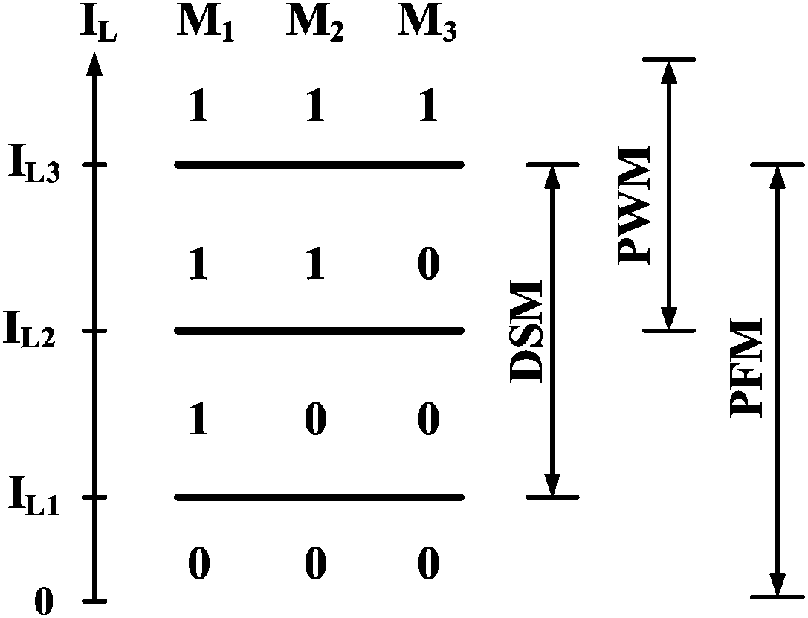 | 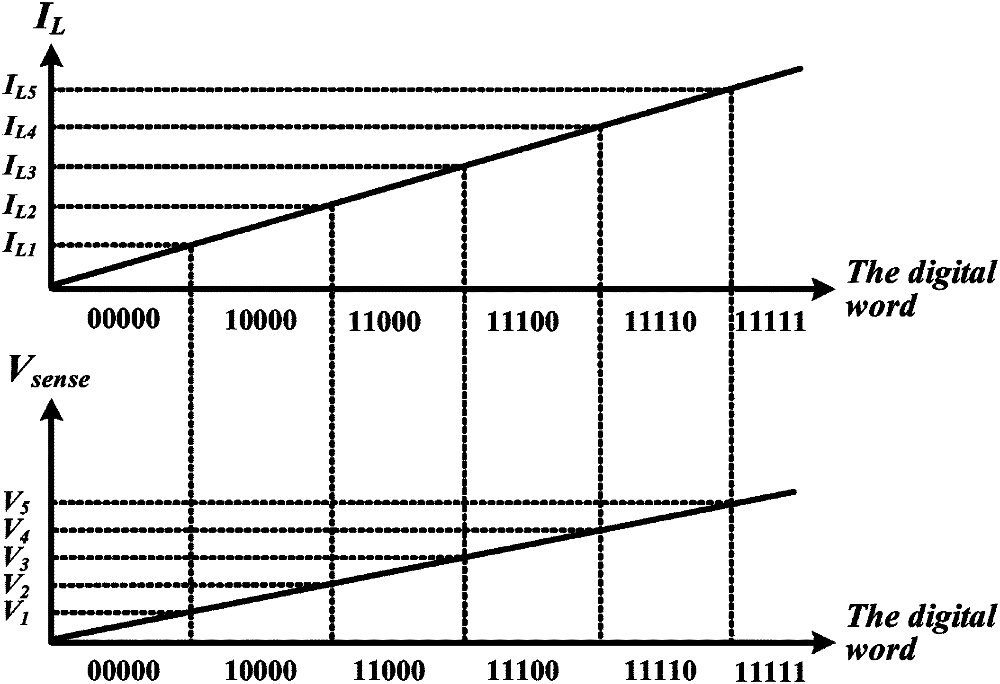 |
| **图 4**：含状态记忆与滞环逻辑的模式译码器门级原理图 | **图 5**：负载电流 $I_{LOAD}$、采样电压 $V_{sense}$ 与延迟链数字字 $D_1\sim D_5$ 的理想线性对应关系 |

#### 1. 模式防抖滞环（Hysteresis Mechanism）
为了防止负载在临界阈值微小波动时引起系统在 PWM 与 DSM 之间发生高频振荡切换（Chattering），译码器引入了基于前一状态反馈（$V_{PWM0}$ 与 $V_{PFM0}$）的数字滞环逻辑（见图 11）：
$$V_{PWM} = D_{M1} + D_{M2} \cdot V_{PWM0} \tag{9}$$
$$V_{PFM} = \overline{D_{M2}} \cdot \overline{D_{M3}} + \overline{D_{M2}} \cdot V_{PFM0} + PFM_{end} \tag{10}$$
- 当变换器处于 PWM 模式向轻载方向运行时，负载电流必须跌破较低阈值 $I_{load2}$（$80\text{ mA}$）系统才切入 DSM 模式；
- 反之，当从 DSM 模式向重载恢复时，负载电流必须越过较高阈值 $I_{load1}$（$120\text{ mA}$）系统才恢复为纯 PWM 模式。
- 此 $40\text{ mA}$ 的宽容裕度滞环窗彻底消除了由于开关纹波诱发的假触发判决。

#### 2. PFM 突加大电流防跌落“越级抢占”机制 (Anti-Dropout Transition)
在 PFM 模式下，由于电路处于 DCM 且传感器已被关闭以省电，采样电压 $V_{sense}$ 无法再代表平均负载电流。若负载在此刻发生大幅突加阶跃（例如 SoC 从待机瞬间被唤醒计算），传统设计若逐级经 DSM 切回 PWM，将导致转换器能量供给严重滞后，引发致命的输出电压深度下冲。
- **越级抢占机制**：论文设计了高速比较器 Comp3，其负端引入参考偏置 $V_a$（即比基准低数十毫伏的跌落红线：$V_{ref} - V_a$）。
- 一旦输出突遭重载导致反馈电压 $V_{FB}$ 跌破该红线，Comp3 瞬间翻转输出高电平脉冲 $PFM_{end}$，**直接越过 DSM 模式，以零等待延迟将系统瞬间强制切换回大功率 PWM 模式**！
- 实测波形证明，在高达 $90\text{ mA}$ 的突发负载跳变下，输出电压下冲被精准钳制在仅 $66\text{ mV}$ 以内，随后在数微秒内迅速拉回稳态。

---

## 4. 晶体管级关键子电路创新 (Transistor-Level Subcircuits)

本论文的技术精髓全在于晶体管级物理级电路的绝妙构造。以下对四大独创核心子电路进行拓扑、工作机理与数学推导的逐一拆解。

---

### 4.1 核心突破一：温度不敏感的电流模延迟链负载传感器 (Current-Mode Delay-Line ADC)

在片上集成系统中，要精确感知负载电流，传统做法是采用电阻分压结合高精度高速 Flash ADC，但这将付出数毫安的静态偏置电流与庞大的芯片版图开销；若采用传统的电压控制延迟线（V-Delay Line），延迟单元反相器的充放电电流强烈依赖于晶体管载流子迁移率 $\mu(T) \propto T^{-1.5}$ 和阈值电压 $V_{TH}(T)$ 的温度效应，温度从 $-40^\circ\text{C}$ 升至 $140^\circ\text{C}$ 时延迟会漂移数倍，完全丧失量化准度。

| SENSEFET 比例动态电流采样电路 (Fig. 3) | 采样输出电压与电感电流时序波形 (Fig. 4) |
| :---: | :---: |
| 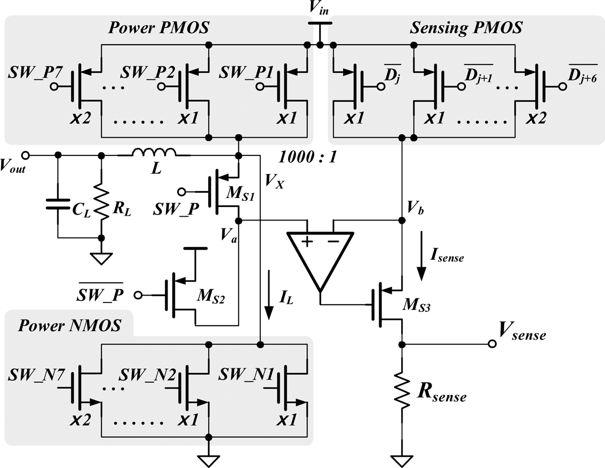 | 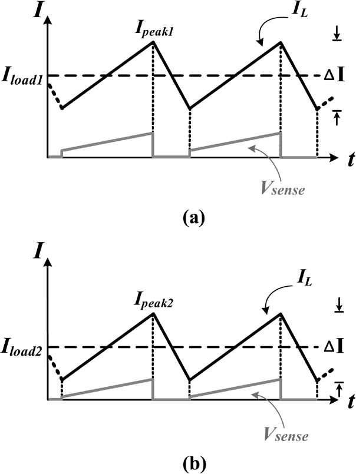 |
| **图 6**：带动态尺寸跟随与虚短运放的 SENSEFET 拓扑 | **图 7**：不同负载下采样电压波形 $V_{sense}$ 与峰值保持 |

| 无温漂电流模延迟链 ADC 顶层与 V-I 转换器 (Fig. 8a) | 晶体管级电流模反相器延迟链电路 (Fig. 8b) |
| :---: | :---: |
| 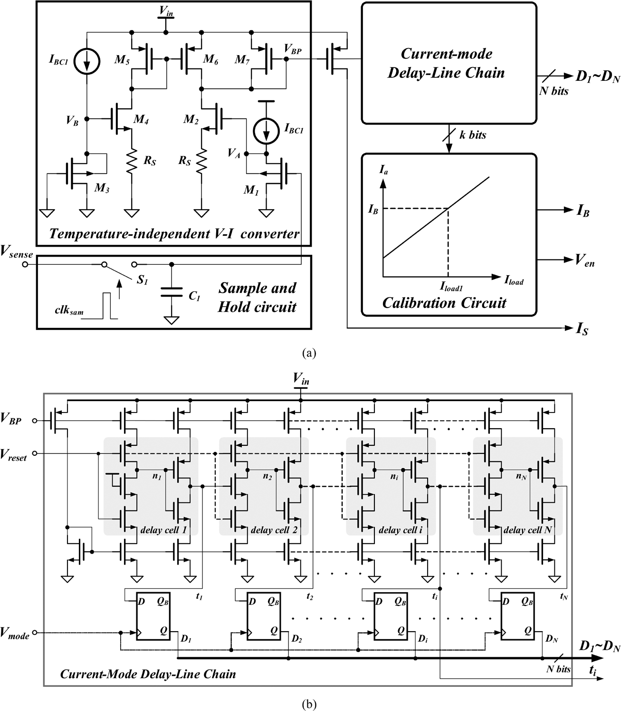 |  |
| **图 8(a)**：含温补差分 V-I 单元、S/H 及自校准接口 | **图 8(b)**：由高精镜像电流驱动的 17 级互补延迟单元阵列 |

#### 1. 动态自适应 SENSEFET 比例采样机制
如图 3 所示，为了在功率管随负载分段缩放时保持采样比例绝对恒定，采样管同样由相同的分段逻辑控制，确保主功率管与采样管的宽长比恒定维持在严格的 **$K = 1000:1$**。
- 高增益运放构成闭环虚短，强行将采样管的漏端电压钳位等于功率管漏端电压（$V_{A} = V_X$），彻底消除了沟道长度调制效应引起的镜像误差。
- 在高边 PMOS 导通期间，流经采样电阻 $R_{sense} = 1\text{ k}\Omega$ 的电流为电感电流的千分之一：
  $$I_{sense} = \frac{I_L}{1000}$$
- 稳态 CCM 下电感电流纹波峰峰值及峰值电流为：
  $$\Delta I_L = \frac{(V_{IN} - V_{OUT}) \cdot D}{L \cdot f_{SW}} \tag{1}$$
  $$I_{L,peak} = I_{LOAD} + \frac{\Delta I_L}{2} \tag{2}$$
- 因此，采样电阻两端的峰值采样电压严格对应于负载电流：
  $$V_{sense,peak} = \left(\frac{I_{L,peak}}{1000}\right) \cdot R_{sense} = \frac{R_{sense}}{1000} \left[I_{LOAD} + \frac{(V_{IN} - V_{OUT}) \cdot D}{2 \cdot L \cdot f_{SW}}\right] \tag{3}$$

#### 2. 温度无关 V-I 转换器的严格数学抵消推导
为将电压信号 $V_{sense,peak}$ 转换为高精度驱动电流，论文设计了如图 8(a) 所示的双支路温补转换结构：
- 令晶体管尺寸比 $K_{ratio} = (W/L)_{M3} / (W/L)_{M1} = (W/L)_{M4} / (W/L)_{M2} > 1$。
- 根据 MOS 管饱和区电流方程 $I_D = \frac{1}{2} \mu C_{ox} (W/L) (V_{GS} - V_{TH})^2$，可得栅源压差：
  $$V_{GS} = V_{TH} + \sqrt{\frac{2 I_D}{\mu C_{ox} (W/L)}}$$
- 在右支路输入端接入采样电压 $V_{sense,peak}$（节点 $V_A$），左支路对称接地消除静态失调。两支路内部节点 $V_B$ 与 $V_A$ 处的压差经过共模抵消后，其非线性迁移率与阈值电压项完全相消：
  $$V_B - V_A = \sqrt{\frac{2 I_{BC1}}{\mu C_{ox} (W/L)_{M1}}} \left(1 - \frac{1}{\sqrt{K_{ratio}}}\right) \tag{5}$$
- 当设计满足对称匹配时，跨接在两支路源极的高精度电阻 $R_S = 500\text{ k}\Omega$ 上的净压降完全由采样电压主导。由此产生的主控电流源输出为：
  $$I_S = \frac{V_{sense,peak}}{R_S} \tag{6}$$
- **推导结论**：式 (6) 表明，转换输出电流 $I_S$ 完全由无源电阻 $R_S$ 与输入电压决定，**在物理上彻底剥离了 MOS 器件中对温度高度敏感的参数 $\mu(T)$ 与 $V_{TH}(T)$**！

#### 3. 电流模延迟单元的时间量化关系
如图 8(b) 所示，偏置电流 $I_S$ 被精确镜像到由 17 级紧凑型反相器构成的延迟链中。每个延迟单元的等效寄生节点电容为 $C_D$。
- 单级延迟时间 $t_{delay}$ 完全取决于驱动电流 $I_S$ 对 $C_D$ 的充放电速率：
  $$t_{delay} = \frac{C_D \cdot \Delta V}{I_S} \tag{7}$$
- 将式 (3) 与式 (6) 代入式 (7)，得到最终延迟时间与电感负载电流的闭式物理映射：
  $$t_{delay} = \frac{1000 \cdot C_D \cdot \Delta V \cdot R_S}{R_{sense} \cdot \left[I_{LOAD} + \frac{(V_{IN} - V_{OUT}) \cdot D}{2 \cdot L \cdot f_{SW}}\right]} \tag{8}$$
- **核心结论**：延迟时间 $t_{delay}$ 与负载电流 $I_{LOAD}$ 呈现严格的**反比关系**，且全电路具有固有的温度自补偿特性。时序信号沿延迟链传播，经周期脉冲 $V_{mode}$ 锁存后，直接转化为 5-bit 数字温度计码 $D_1 \sim D_N$（见图 9 与图 10）。

|            延迟链时序波形图与数字字锁存机制 (Fig. 9)             |
| :----------------------------------------------: |
| 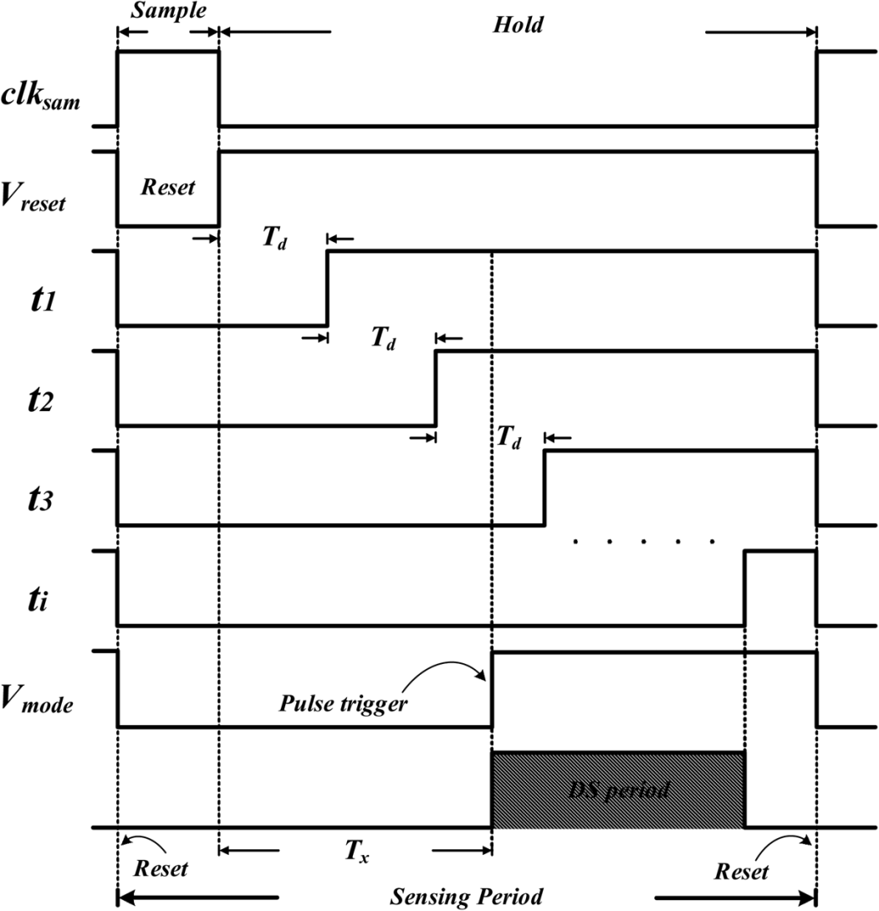 |
|    **图 9**：延迟脉冲沿延迟链逐级传递，在固定锁存脉冲下完成时间到数字域的快速量化    |

---

### 4.2 核心突破二：DSM 抖动跳步脉冲发生器 (Dithering Skip Generator)

| DSM 抖动脉冲发生器硬件原理图 (Fig. 12) |
| :---: |
| 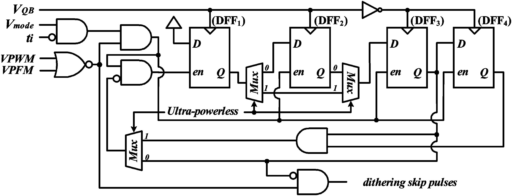 |
| **图 10**：由上下两路 D 触发器交替采样的硬件抖动跳步脉冲合成逻辑电路 |

#### 晶体管级工作机理与时钟打散逻辑
如图 12 所示，抖动发生器由上下两组具有互补时钟沿触发特性的 D 触发器（DF1 由下降沿触发，DF2 由上升沿触发）与与或门构成。
1. **基础抖动单元（DS Module）合成**：
   - 传统跳步电路是连续开放 $M$ 个周期，再连续切断 $N$ 个周期，低频谐波巨大。
   - 本文将跳步动作细化在每一个 3 脉冲微循环内：正常 DSM 下，触发器控制时钟门控，产生 **“ON - ON - OFF”** 序列（导通率 2/3）。
   - 若系统检测到极低负载，开启 $Ultra-powerless$ 引脚，逻辑自动重构为 **“ON - OFF - OFF”** 序列（导通率 1/3）。
2. **抖动周期（DS Period）自适应伸缩**：
   - 整个 DSM 调制的有效周期由两路信号决定：起始时刻由固定参考脉冲触发，而终止时刻由电流模延迟链的某一特定抽头输出 $t_i$ 决定（见图 9）。
   - 由于 $t_i$ 的传播延时与负载电流成反比：**负载越轻，$t_i$ 越滞后，$DS\text{ Period}$ 窗口越宽，容纳的 DS Module 数量越多，跳过的总脉冲比例越高**；反之负载越重，跳步越少。
   - 这种连续跳步打散机制既大幅削减了开关损耗，又将纹波频谱搬移至高频段，使片外微型陶瓷电容（$4.7\,\mu\text{F}$）即可轻松滤波至 $35\text{ mV}$ 以下。

---

### 4.3 核心突破三：动态分段最佳功率管尺寸控制 (Optimum Width Controller, OWC)

| 传统功率管驱动 vs OWC 分段功率管驱动 (Fig. 13b~e) | 功率 PMOS 最佳宽度随负载电流变化理论曲线 (Fig. 14) |
| :---: | :---: |
| 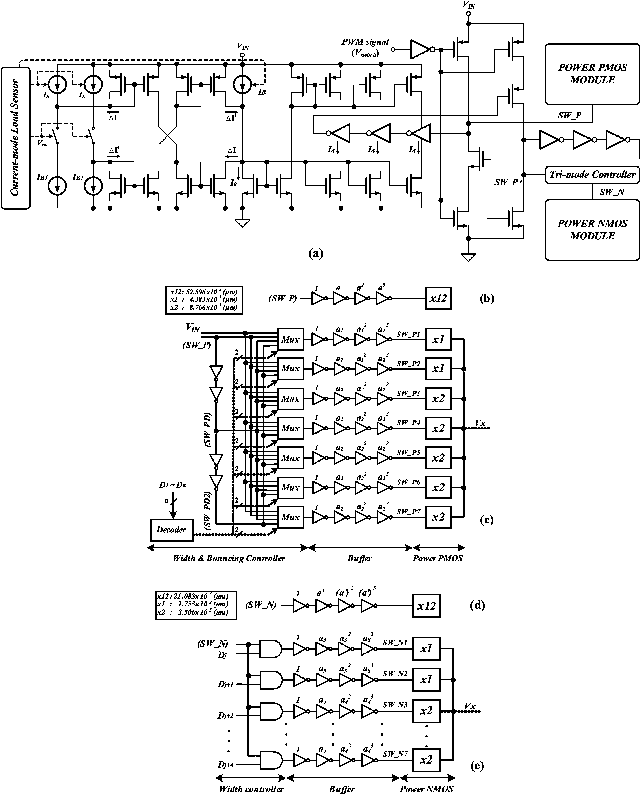 | 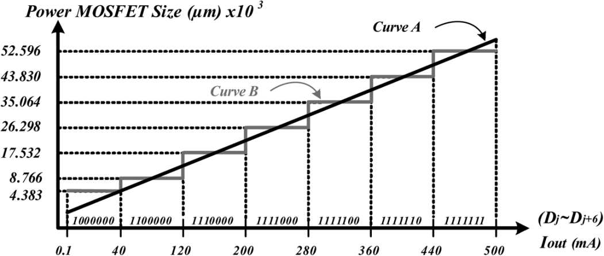 |
| **图 11**：(b)(d) 传统单一大尺寸功率管；(c)(e) 本文提出的分段可重构功率管阵列与动态锥度驱动链 | **图 12**：理论最优栅宽 $W_{opt}$（连续曲线）与 7 段数字步进量化（台阶曲线）匹配 |

#### 1. 功率管尺寸优化的物理数学模型
功率级的总功率损耗主要由两部分构成：MOSFET 导通电阻引起的导通损耗 $P_{cond}$，以及反相器驱动链与功率管栅极电容充放电引起的开关动态损耗 $P_{sw}$：
$$P_{total} = P_{cond} + P_{sw} = I_{LOAD}^2 \cdot R_{ON} \cdot D + C_{gate,total} \cdot V_{IN}^2 \cdot f_{SW}$$
- 导通电阻与晶体管栅宽 $W$ 成反比：$R_{ON} \propto \frac{1}{W}$；
- 栅极寄生电容以及反相器链的总电容与栅宽 $W$ 成正比：$C_{gate,total} \propto W$。
- 对总损耗方程关于栅宽求导 $\frac{\partial P_{total}}{\partial W} = 0$，论文推导出**全负载范围内的最佳功率 PMOS 尺寸闭式解**：
  $$W_{opt} = \sqrt{\frac{D \cdot T_{SW} \cdot I_{LOAD}^2 \cdot R_{\square} \cdot L_c}{V_{IN}^2 \cdot C_{ox} \cdot L_c \cdot \frac{a^{n+1}-1}{a-1} \cdot (1 + K_{inv})}} \tag{11}$$
  其中：
  - $a$ 为反相器级联驱动链的逐级几何锥度放大因子（Tapering Factor）；
  - $n$ 为反相器级联数；
  - $K_{inv} = (W/L)_P / (W/L)_N$ 为反相器内部管子比例；
  - $R_{\square}$ 为方块电阻，$L_c$ 为沟道长度。
- **物理推论**：在工艺参数和电源电压固定时，**最佳功率管栅宽 $W_{opt}$ 与负载电流 $I_{LOAD}$ 严格成正比**（$W_{opt} \propto I_{LOAD}$）！如图 14 所示，若在轻载下依然使用重载设计的大尺寸 $W$，开关损耗将成百倍地白白耗散。

#### 2. 7 段自适应量化与独立渐变缓冲器阵列
为了物理实现式 (11) 的理想曲线，作者将总负荷区间划分为 7 个量化子区间，将 PMOS 与 NMOS 阵列拆分为 12 组标准单元（图 13c 与 13e）：
- **PMOS 阵列结构**：由 2 个 $\text{X1}$ 单元（$W = 4383\,\mu\text{m}$）与 5 个 $\text{X2}$ 单元（$W = 8766\,\mu\text{m}$）拼装，最大总宽达 $52596\,\mu\text{m}$；
- **NMOS 阵列结构**：由 2 个 $\text{X1}$ 单元（$W = 1753\,\mu\text{m}$）与 5 个 $\text{X2}$ 单元（$W = 3506\,\mu\text{m}$）拼装，最大总宽达 $21083\,\mu\text{m}$；
- **自适应锥度缓冲链设计**：传统设计采用单一固定巨型驱动器，小尺寸开启时巨型驱动器本身的充放电损耗仍无法免除。本文独具匠心地为每个小功率管单元单独配备了**专属的微型锥度反相器驱动器**（锥度系数分别为 $a_1=1.65, a_2=2.08, a_3=1.35, a_4=1.65$）。
- 当轻载仅激活 1 个 $\text{X1}$ 单元时，其余 6 组驱动器与功率管被逻辑选通门彻底断开，栅极充放电电荷消耗下降至全开状态的不足 $8\%$，**在 $0.1\text{ mA}$ 负载下实现了前所未有的 $90\%$ 超高功率节省比**（见后文实测图 24）！

---

### 4.4 核心突破四：最佳电流模死区与分时防地弹控制器 (Optimum Dead-Time Controller, ODC)

| 晶体管级最佳电流模死区控制器原理图 (Fig. 13a) | 死区过长导致体二极管导通与地弹机理波形 (Fig. 15) |
| :---: | :---: |
|  | 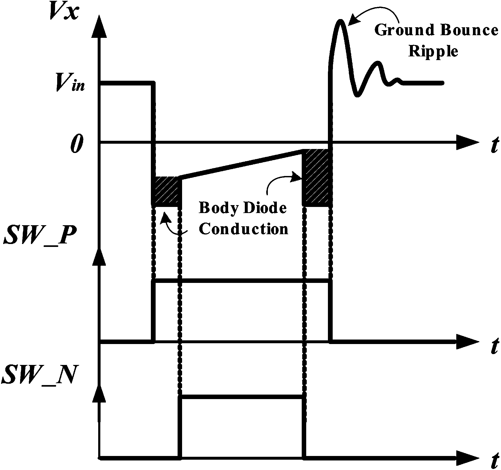 |
| **图 13(a)**：基于电流互补调制的非对称受控反相器死区产生拓扑 | **图 14**：死区过长引发体二极管续流压降 $V_D$ 与快速开启诱发的地弹尖峰 |

#### 1. 电流模受控死区自适应调制机理
为了在无需庞大模拟 DLL 的前提下实现死区自适应跟踪，论文在非重叠时钟产生网络中引入了电流受控反相器链（图 13a）：
- 右侧反相器链控制 $SW\_P'$（驱动 NMOS）由 1 到 0 的延迟；左侧受控反相器链控制 $SW\_P$（驱动 PMOS）由 0 到 1 的开启延迟。
- 关键创新在于：**通过负载传感器输出的动态电流 $I_S$ 实时调节左侧反相器的偏置尾电流 $I_a$**：
  $$I_a = I_B \pm \Delta I = I_B \pm (I_S - I_{B1})$$
- **工作机制**：
  - 重载时，电感电流大，开关节点 $V_X$ 充放电速率极快（$dv/dt$ 高）。此时负载传感器输出的 $I_S$ 增大，反相器偏置电流 $I_a$ 自动加码，使死区时间迅速收窄至数纳秒，杜绝体二极管导通；
  - 轻载时，$V_X$ 转换变慢，偏置电流 $I_a$ 相应调小，死区时间自动展宽，确保 PMOS 彻底关断后 NMOS 才开启，绝对杜绝高低边管在任何过渡瞬间发生直通！

| 最优偏置电流闭环自校准算法流程图 (Fig. 16) |
| :---: |
| 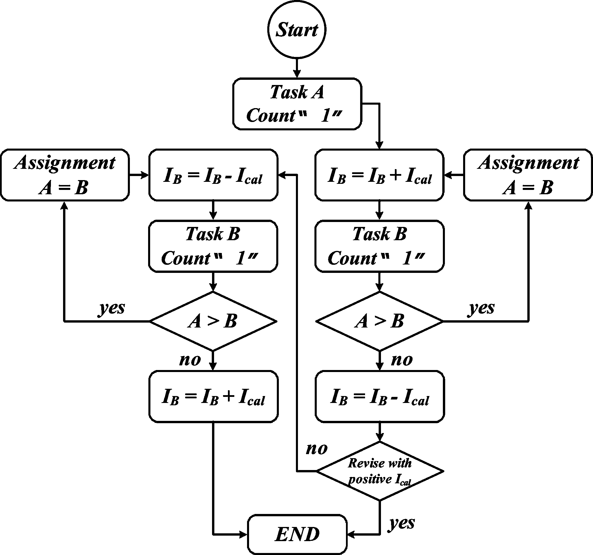 |
| **图 15**：基于稳态占空比数字字“1”数量最小化的自校准搜索闭环 |

#### 2. 占空比最小化闭环自校准算法 (Duty-Cycle Minimization Calibration)
为了消除工艺角（Corner）和片间失配对基准电流 $I_B$ 初始设定的影响，论文提出了一种绝妙的**上电数字自校准算法**（图 16）：
- **物理判据**：根据文献 [23] 的理论，若死区设置次优（过长引起体二极管导通损失能量，或过短引起轻微交叠泄放电荷），能量损耗必然导致转换器为了维持相同输出电压而**被迫增加稳态占空比 $D$**。
- 占空比的异常增大直接反映在电感平均电流与采样字 $D_1 \sim D_N$ 中逻辑“1”的个数增多。
- **校准步骤**：软启动结束后，校准电路启动，扫描微调偏置基准电流 $I_B$，实时监测数字字中“1”的个数；**当“1”的个数达到全局极小值时，对应的死区即为全工况下理论损耗最小的黄金死区**！系统锁定该参数，随后进入运行态，无需任何模拟开销即可保证全寿命周期内的死区最优。

#### 3. 分步延迟交错导通削减地弹 50%
在功率级瞬间开启时，片上寄生电感 $L_{par}$ 承受的电压尖峰满足 $V_{bounce} = L_{par} \frac{di}{dt}$。为遏制此现象，ODC 将 12 组功率 PMOS 划分为三个物理时序群组（见图 13c）：
- 第一群组由主信号 $SW\_P$ 直接驱动；
- 第二群组经过缓冲器延时得到 $SW\_PD$ 触发；
- 第三群组再经过延迟级由 $SW\_PD2$ 触发。
- **动作过程**：当第一群组微小晶体管先导通时，$V_X$ 电位先平缓爬升并初步建立；当 $V_X$ 接近 $V_{IN}$、功率管漏源压差 $V_{DS}$ 已大幅缩小时，剩余的大尺寸晶体管群组才随后接通。
- 这一举措巧妙地将原本集中的单峰巨型电流突变（$di/dt$）打散为三次平缓的微小台阶，**实测将地弹从原本的 $>800\text{ mV}$ 腰斩至仅 $430\text{ mV}$**，彻底保卫了基准核与比较器的抗扰度！

---

## 5. 芯片实测结果与理论验证 (Silicon Results & Benchmark)

原型芯片采用 TSMC $0.35\,\mu\text{m}$ 2P4M CMOS 工艺流片制造，芯片显微照片如图 25 所示。全芯片有效硅片面积为 $3.2\,\text{mm}^2$。

| 芯片显微照片与版图功能分区 (Fig. 25) |
| :---: |
| 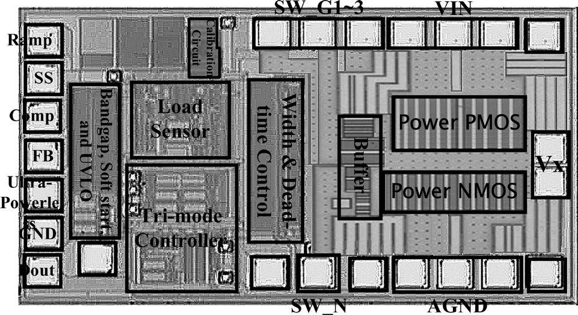 |
| **图 16**：芯片显微照片。清晰展示了左侧模拟基准与三模控制核、中间负载传感器与死区控制模块、右侧巨型分段功率 PMOS/NMOS 阵列及大电流焊盘。 |

---

### 5.1 实测波形与电路特性深入分析

#### 1. 宽温区（-40°C ~ 140°C）延迟链传感器稳定性测试
作者将芯片置于高低温测试箱中，在 $-40^\circ\text{C} \sim 140^\circ\text{C}$ 的严苛工业级温区下进行了实测：

| 宽温区下延迟链输出时序波形 (Fig. 17) | 负载传感器全量程转换误差曲线 (Fig. 18) |
| :---: | :---: |
| 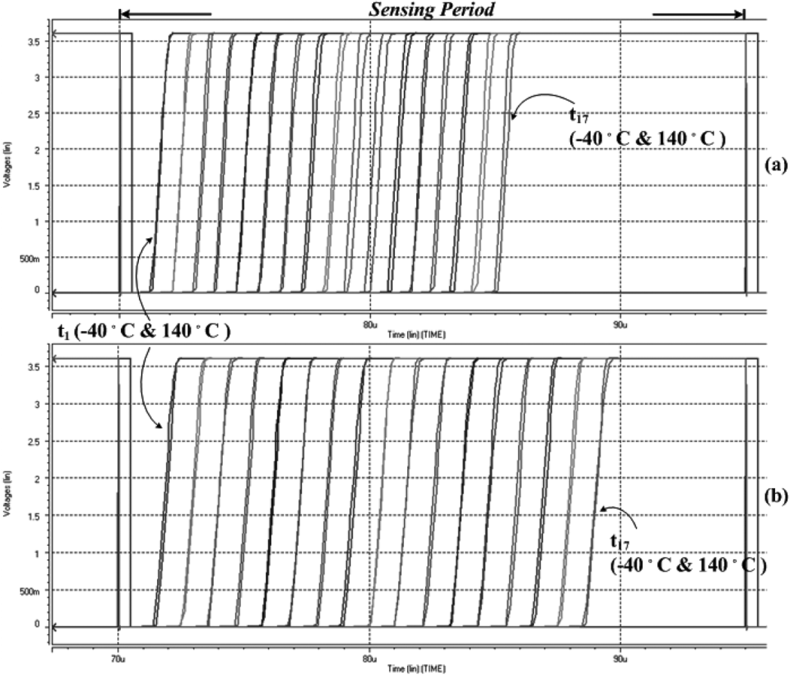 | 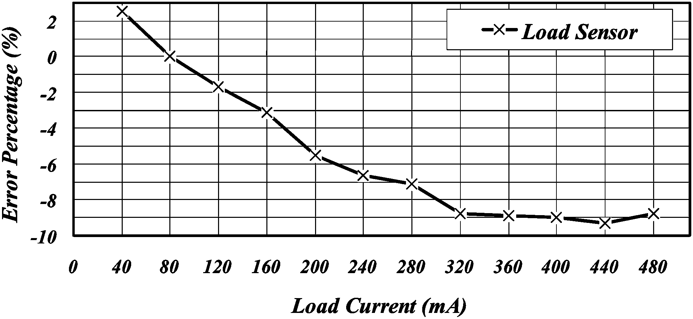 |
| **图 17**：在 120mA 与 40mA 下，跨越 180°C 温区时 17 级延迟链波形展现出优异的一致性 | **图 18**：传感器误差曲线。在核心控制区误差牢牢锁定在 $\pm 2.5\%$ 以内 |

- **温漂抑制表现**：图 17 清晰表明，无论是 $120\text{ mA}$ 还是 $40\text{ mA}$ 负载，延迟链输出波形在跨越 $180^\circ\text{C}$ 温差时，各级触发时间 $t_1 \sim t_{17}$ 几乎完全重叠，彻底证实了图 8(a) 温补 V-I 转换器的卓越有效性。
- **量化精度**：图 18 表明，在 $40\text{ mA} \sim 120\text{ mA}$ 的核心 DSM 与模式切换负载带内，电流检测绝对误差**严格控制在 $\pm 2.5\%$ 以内**，完全满足无误码模式切换的判决精度要求。

---

#### 2. 三模平滑转换与 DSM 抖动跳步稳态波形
实测捕获的动态加载模式切换与 DSM 内部跳步波形如下：

| 负载动态跳变下的三模平滑切换实测波形 (Fig. 19) | DSM 模式下不同负载下的跳步实测波形 (Fig. 20) |
| :---: | :---: |
| 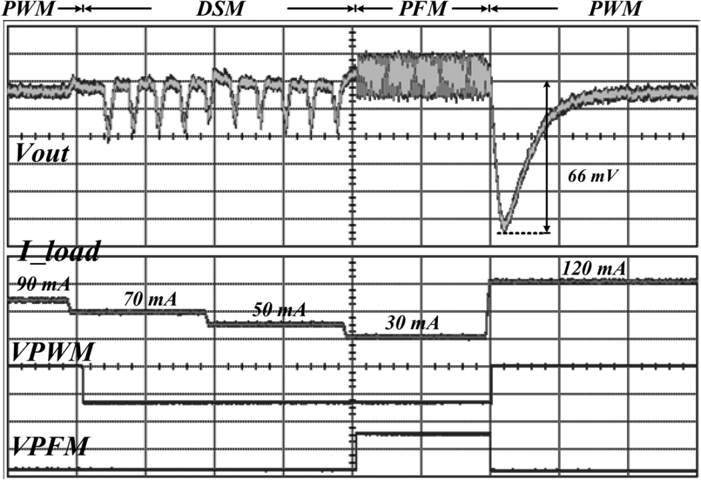 | 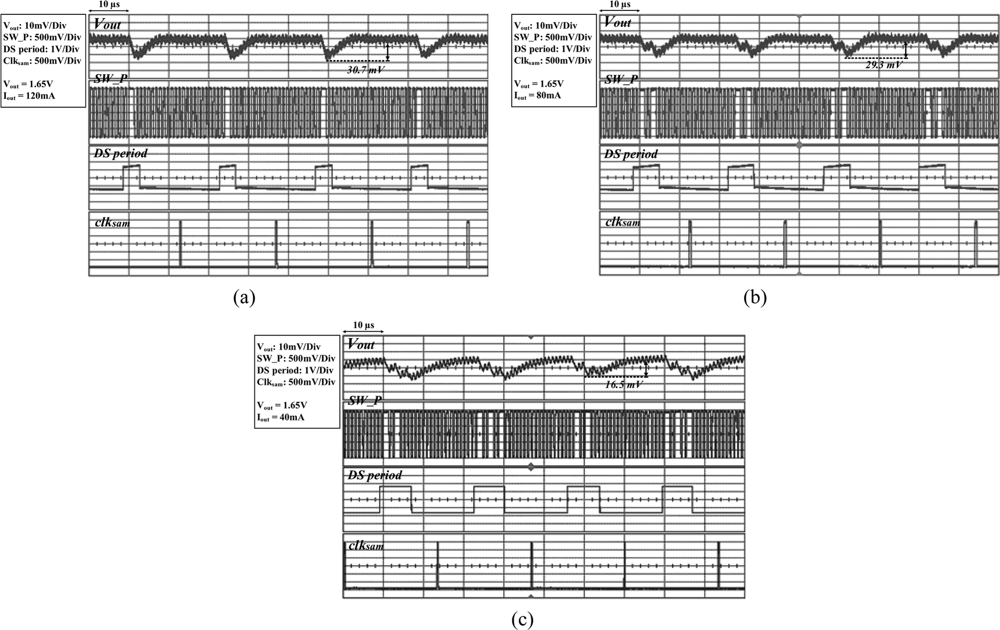 |
| **图 19**：负载在 90mA、70mA、50mA、40mA 阶跃时，系统在 PWM、DSM 与 PFM 间无缝演进 | **图 20**：(a) 120mA 单模块跳步；(b) 80mA 双模块跳步；(c) 40mA 三模块跳步的微观时序 |

- **模式过渡平稳无扰动**：图 19 中，当负载从 $90\text{ mA}$ 阶跃下降至 $70\text{ mA}$ 时，系统平滑滑入 DSM 模式，开关节点 $V_X$ 自动呈现间隔跳脉冲特性；当负载继续降至 $40\text{ mA}$ 以下时，无缝切换为 PFM。当负载突加恢复时，由 Comp3 触发直切 PWM，**全程输出电压跌落仅 $66\text{ mV}$**，无任何环路振荡与过冲。
- **精细微观纹波特性**：图 20 展现了 DSM 随负载变轻增加跳脉冲模块的高清微观过程：
  - 在 $120\text{ mA}$ 时，包含 1 组 DS Module，实测输出纹波仅 **$30.7\text{ mV}$**；
  - 在 $80\text{ mA}$ 时，扩展为 2 组 DS Module，实测输出纹波为 **$29.3\text{ mV}$**；
  - 在 $40\text{ mA}$ 时，扩展为 3 组 DS Module，实测输出纹波进一步衰减至 **$16.5\text{ mV}$**！
  - 测试完美印证了抖动跳步技术将纹波压制在 $35\text{ mV}$ 以内的承诺，远胜传统 Burst 模式上百毫伏的低频起伏。

---

#### 3. ODC 死区优化与地弹消除实测对比
为了清晰展现本文死区与地弹控制器的压倒性优势，作者在同等硬件条件下对比了传统固定死区与 ODC 技术的实测波形：

| 传统固定死区设计的开关节点与地弹实测 (Fig. 21) |
| :---: |
| 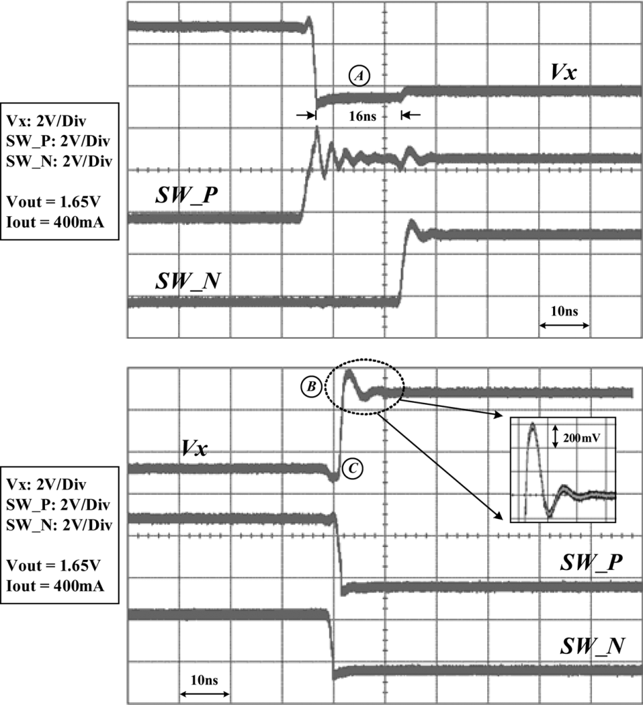 |
| **图 21**：固定死区设计在 $I_{LOAD}=400\text{ mA}$ 下的实测结果。可见区域 I、II 中体二极管正向导通与恶劣的剧烈地弹震荡。 |

| ODC 优化技术在 80mA 负载下的实测结果 (Fig. 22) | ODC 优化技术在 400mA 重载下的实测结果 (Fig. 23) |
| :---: | :---: |
| 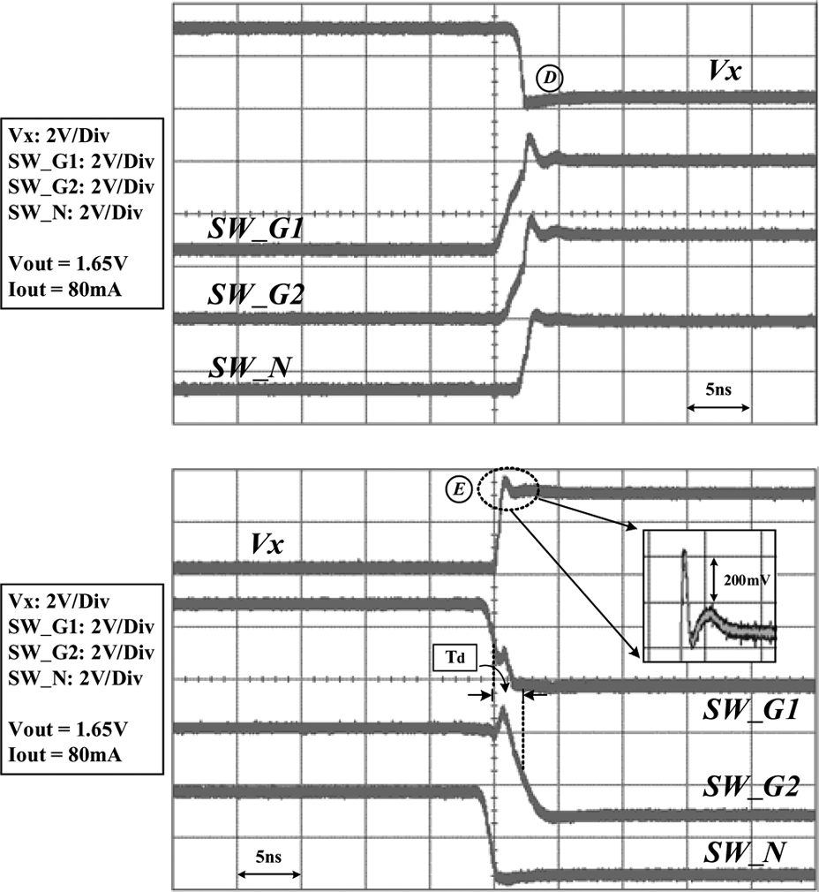 | 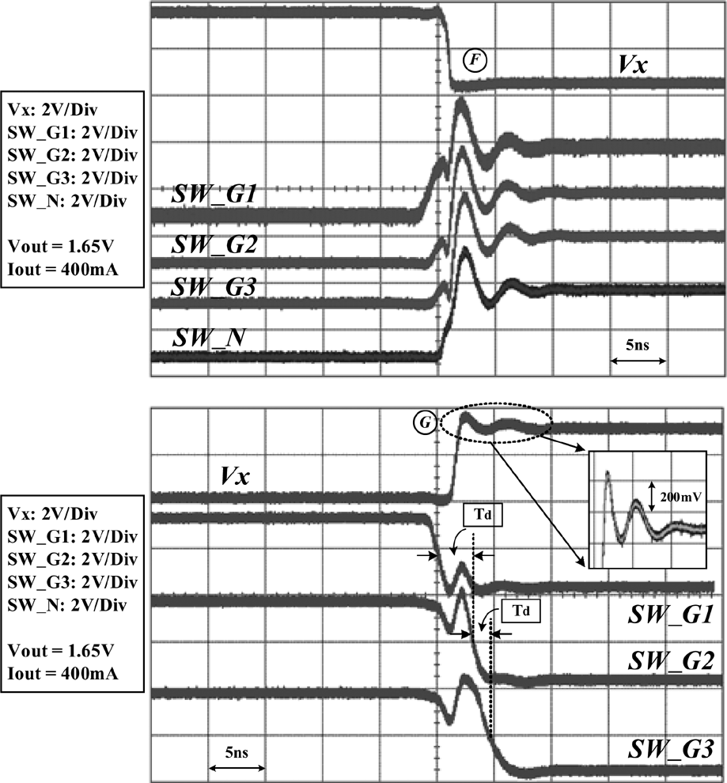 |
| **图 22**：$80\text{ mA}$ 负载下 ODC 波形。体二极管导通被近乎彻底消除，地弹仅 $430\text{ mV}$ | **图 23**：$400\text{ mA}$ 重载下 ODC 波形。三组驱动信号分时交错，开关上升平缓，地弹仅 $450\text{ mV}$ |

- **体二极管导通消除**：对比图 21 与图 22/23 可以看到，传统固定死区在开关死区期间出现显著的负向体二极管导通平阶（高达 $0.7\text{ V}$ 压降，严重烧蚀效率）；而在本文 ODC 控制下，体二极管导通现象**几乎完全绝迹**，死区时间随负载自动收紧至纳秒级临界点。
- **地弹削减幅度达到 50%**：在图 21 中，传统方案的地弹纹波尖峰超过 $800\text{ mV}$；而在图 22 和图 23 中，得益于 $SW\_P, SW\_PD, SW\_PD2$ 的分时交错接通，**$80\text{ mA}$ 下地弹被压低至 $430\text{ mV}$，$400\text{ mA}$ 重载下被压低至 $450\text{ mV}$，震荡幅度直接腰斩**！

---

### 5.2 核心测试论断与转换效率全景

| 实测转换效率曲线与驱动功耗节省改善率 (Fig. 24) |
| :---: |
| 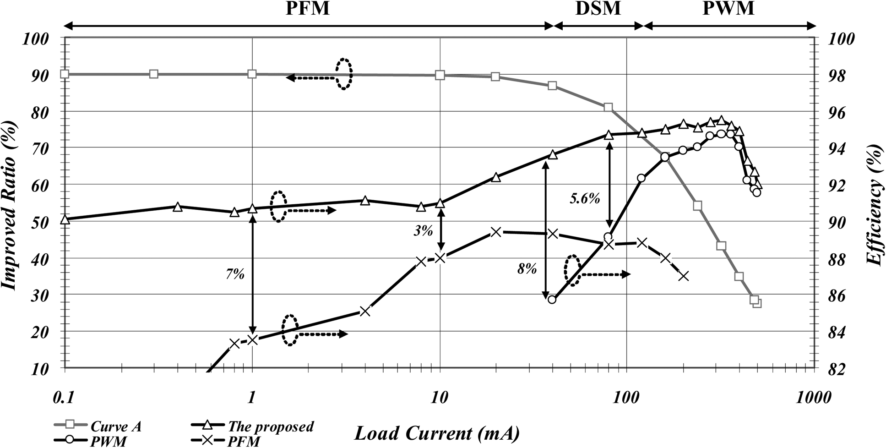 |
| **图 24**：全载效率曲线对比与驱动损耗削减率（曲线 A）。直观展现了三模控制消除效率凹陷，以及 OWC 在轻载下挽救能效的决定性贡献。 |

> **原文实验与测试核心断言 (Verbatim Quote)**
> *"Experimental results show the tri-mode operation can have high efficiency about 90% over a wide load current range from 3 to 500 mA. Owing to the effective mitigation of the switching loss contributed by optimum power MOSFET width and reduction of conduction loss contributed by optimum dead-times, the novel width and dead-time controllers achieve high efficiency about 95% at heavy load condition and maintain the highly efficient performance to very light load current about 0.1 mA... Consequently, when the load current changes from heavy to very light load, the improved ratio of power consumption becomes higher and higher and the maximum value is achieved 90% at 0.1 mA."*
> 
> **【测试结果深度评估】**：
> 1. **消除中载效率凹陷**：图 24 中，纯 PWM 调制的效率在中载区迅速下滑，而单 PFM 调制在重载区效率极其低下。本文三模转换器在 DSM 介入的过渡带内，直接将能量转换效率**硬生生拔高了 5.6% ~ 8.0%**，使原本下凹的曲线变为了平滑的高能效平台。
> 2. **轻载驱动能耗狂减 90%**：曲线 A 标定了驱动器与功率管损耗的改善比率。随着负载从重载向轻载跌落，OWC 功率管缩微分段的威力彻底爆发：在 $0.1\text{ mA}$ 睡眠工况下，**驱动能耗改善率高达 90%**，使得芯片在 $0.1\text{ mA}$ 的超微电流下依然实现了 **90%** 的惊人高转换效率，彻底改写了传统集成降压变换器在亚毫安区效率暴跌至 40% 以下的历史。

---

### 5.3 同领域顶尖学术成果横向对比 (Benchmark Table)

为了客观评判本文芯片在国际顶尖学术界的技术定位，特选取同期及同类经典 DCDC 拓扑进行横向对比分析：

| 对比性能指标 (Metric) | 本文成果 (This Work) | Xiao 等人 (JSSC 2004 [3]) | Sahu 等人 (VLSI 2005 [4]) | Trescases 等人 (PESC 2006 [22]) |
| :--- | :--- | :--- | :--- | :--- |
| **文献来源** | **IEEE JSSC 2007** | IEEE JSSC 2004 | IEEE VLSI Design 2005 | IEEE PESC 2006 |
| **工艺节点 (Process)** | **0.35 µm CMOS** | 0.25 µm CMOS | 0.8 µm BiCMOS | 0.18 µm BCD |
| **拓扑架构 (Topology)** | **分段同步降压 Buck** | 数字控制同步 Buck | 降压-升压 Buck-Boost | ZVS 同步降压 Buck |
| **调制模式 (Modulation)**| **Tri-mode (PWM/DSM/PFM)**| Dual-mode (PWM/PFM) | Dual-mode (PWM/PFM) | 固定频率 PWM |
| **模式判决机制** | **片上温度无关延迟链 ADC**| **需外部引脚控制 (Pin-Select)** | 片上双阈值模拟比较器 | 外部模拟环路控制 |
| **输入 / 输出电压** | **3.3 V / 1.65 V** | 2.7 V ~ 4.2 V / 1.2 V | 2.7 V ~ 4.2 V / 3.3 V | 3.3 V ~ 5.0 V / 1.8 V |
| **负载电流范围** | **0.1 mA ~ 500 mA** | 0.1 mA ~ 200 mA | 1 mA ~ 600 mA | 0.5 A ~ 5 A |
| **动态跨度倍数** | **5000 倍** | 2000 倍 | 600 倍 | 10 倍 |
| **重载峰值效率** | **95.0%** | 93.0% | 90.0% | 92.5% |
| **0.1mA 极轻载效率** | **~90.0% (OWC 降维节省 90%)** | ~80.0% (纯数字低频) | < 60.0% (双模凹陷未除) | 未涉及极轻载 |
| **中载过渡区效率跌落** | **完全消除 (DSM 平滑填补)**| 存在约 6% 效率下跌 | 存在约 8% 效率断层 | N/A |
| **死区控制策略** | **电流模自校准 ODC + 防地弹**| 传统固定非重叠死区 | 传统固定非重叠死区 | 模拟 DLL 辅助零电压检测 |
| **地弹抑制机制** | **分步三级交错导通 (削减 50%)**| 无特殊处理 | 无特殊处理 | 软开关共振吸收 |
| **芯片面积** | **3.2 mm² (含功率管及 Pad)** | 1.8 mm² (不含功率管) | 4.8 mm² | 3.5 mm² |

---

## 6. Cadence Virtuoso 仿真与设计借鉴 (IC Design & Virtuoso Takeaways)

> **课题借鉴与工程落地指导**
> 本论文将数字控制的灵巧性与模拟电路的物理本质进行了绝妙的融合。在现代电源芯片设计（无论是在 0.18µm 高压 BCD 还是 28nm/65nm 先进数字工艺下开发集成 PMU/PMIC）中，本文提出的多项电路机理极具复现和借鉴价值。在 Cadence Virtuoso 仿真与物理版图落地时，推荐遵循以下工程设计法则：

### 1. 核心可复用模块与改进
- **温度自补偿电流模延迟链（Current-Mode Delay-Line）**：
  - **复用场景**：任何需要片上无高精度时钟源进行粗粒度电流感知、快速瞬态过流告警、或 AOT（自适应导通时间）定时器设计的场合。
  - **改进要点**：图 8(a) 中的温补差分 V-I 单元要求晶体管工作在强反型饱和区。在先进制程低压环境（如 $V_{DD}=1.2\text{V}$）下，阈值电压余量较小，可演进为**弱反型（Sub-threshold）热电压正比（PTAT）电流抵消架构**，以支持亚伏特级输入电压。
- **分段可重构功率级与独立锥度反相器驱动器（OWC Block）**：
  - **复用场景**：现代高频开关电源（$>3\text{MHz}$）及多相 CPU/GPU 供电核。
  - **避坑准则**：严禁采用一个大驱动器去连通所有分段管的栅极并仅用开关断开漏源！**必须严格采用本文图 13(c)(e) 的方案：每个分段功率管单元必须拥有属于自己的独立与门（AND Gate）和多级几何渐变驱动器**。这样在关闭该分段时，驱动链前面的逻辑节点彻底处于静止态，零静态动态功耗。

---

### 2. Cadence Virtuoso 仿真验证策略 (Testbench 搭建)

```
       Cadence Virtuoso 核心 Testbench 搭建与验证拓扑
  +-------------------------------------------------------------+
  |  [Transient Load Step TB]                                   |
  |  Vin = 3.3V  --> [ Tri-mode Buck Core ] --> Vout = 1.65V   |
  |                        ^          |                         |
  |  Corner: TT/SS/FF      |          v                         |
  |  Temp: -40C ~ 140C     |   [ Ideal Current Sink Load ]      |
  |                        |   Iload: 0.1mA <--> 500mA Step     |
  |  Monte Carlo (N=200):  |   tr = tf = 100ns                  |
  |  Delay-line Match      +------------------------------------+
```

- **温区全角扫描与延迟链失配（Delay-Line Monte Carlo Analysis）**：
  - 在 Virtuoso ADE 中创建仿真状态：扫描全温区（$-40^\circ\text{C}, 27^\circ\text{C}, 125^\circ\text{C}, 140^\circ\text{C}$）与全工艺角（TT, SS, FF, SNFP, FNSP）。
  - 对图 8(b) 延迟链运行至少 200 次蒙特卡洛（Monte Carlo）统计分析，重点评估晶体管栅电容与阈值电压失配对延迟量化阶梯（$D_1 \sim D_5$）单调性的影响，确保在最恶劣 Corner 下不出现跳码（Missing Code）。
- **动态大信号负载跳变与穿通电流探测 (Shoot-Through Current Check)**：
  - 在大电流跳变仿真中（$0.1\text{ mA} \to 500\text{ mA}$，边沿设定为 $100\text{ ns}$），仿真精度务必设置为 `conservative`，并将 `maxstep` 强制限制在开关周期的 $1/200$ 以下（例如 $1.0\text{ MHz}$ 下设置 `maxstep=5ns`）。
  - 在瞬态仿真中同时输出高边 PMOS 漏极电流 $I_D(P)$ 与低边 NMOS 漏极电流 $I_D(N)$，利用计算器编写波形表达式 $I_{cross} = \min(I_D(P), -I_D(N))$：**确保在任何死区切换微观瞬间，$I_{cross}$ 的脉冲毛刺峰值低于 $1\text{ mA}$**，严格证实 ODC 控制器彻底杜绝了直通。
- **模式切换滞环仿真验证**：
  - 使用斜坡电流源（Ramp Current Source）将负载电流在 $100\,\mu\text{s}$ 内由 $500\text{ mA}$ 缓慢线性拉低至 $0.1\text{ mA}$，随后反向缓慢抬升。观察 $VPWM$ 与 $VPFM$ 的翻转触发点，确认下行翻转点与上行翻转点之间存在至少 $30\text{ mA} \sim 40\text{ mA}$ 的清晰滞环窗口。

---

### 3. 版图与物理实现避坑要点 (Layout Reliability)

- **交错防地弹驱动器的物理布局（Staggered Buffer Placement）**：
  - 图 13(c) 中的 $SW\_P, SW\_PD, SW\_PD2$ 驱动链在版图上**绝不能共用同一组地线或电源走线**。
  - 第一组先导通的小尺寸管驱动器应远离主功率地，接至干净的模拟地（AGND）与独立模拟电源；第二、三组大功率驱动器必须直接跨接在宽金属功率地（PGND）上。
- **SENSEFET 比例匹配的版图黄金法则（Common-Centroid Matching）**：
  - 采样管与主功率管必须严格采用**共质心交叉指状排布（Common-Centroid Interdigitated Layout）**。
  - 采样管的指宽（Finger Width）和走线方向必须与主功率管的单元指完全相同，两侧必须放置充足的虚拟管（Dummy Transistors）以消除刻蚀边缘效应（OD Pitch Effect）与浅槽隔离应力（STI Stress）。
- **大电流功率走线与电迁移（Electromigration, EM）防护**：
  - 满载 $500\text{ mA}$ 的直流电流在片内汇聚时，金属走线承受极高的电流密度。
  - 顶层超厚金属（Top Metal，如 Metal 4 / Metal 5）必须全部划归开关节点 $V_X$、输入 $V_{IN}$ 与功率地 $PGND$。打孔阵列（Via Arrays）必须满铺，严格按照代工厂提供的直流与交流峰值 EM 规则校核每微米金属导线载流上限。

---

## 7. 关联文献与学术网络 (Academic References)

- **双模混合控制与模式切换先驱工作**：
  - `[Xiao et al., JSSC-2004]`：*A 4-µA quiescent-current dual-mode digitally controlled buck converter IC for cellular phone applications* —— 经典数字双模 PWM/PFM 工作，奠定了轻载跳频与重载高频数字调制框架。
  - `[Sahu & Rincon-Mora, VLSI-2005]`：*A high-efficiency, dual-mode, dynamic, buck-boost power supply IC for portable applications* —— 揭示了传统双模在过渡负载带能效凹陷的本质痛点。
- **动态死区控制与零电压/零电流开关学术演进**：
  - `[Trescases et al., PESC-2006]`：*Precision gate drive timing in a zero-voltage-switching DC-DC converter* —— 探索基于模拟 DLL 的高精度死区定时，为死区自适应调整提供了重要理论对照。
  - `[Krein & Bass, TIE-1992]`：*Autonomous control technique for high-performance switches* —— 开创了利用开关节点波形自调节控制死区时间的先河。
- **功率管尺寸动态调整理论基础**：
  - `[Musunuri & Chapman, PESC-2005]`：*Optimization of gate drive in switched-mode power supplies* —— 详细推导了功率 MOSFET 栅极损耗与尺寸的折中数学极值，为本文式 (11) 提供了坚实的物理模型支撑。
- **片上系统（SoC）与全集成 DVS 供电背景**：
  - `[Patounakis et al., JSSC-2004]`：*A fully integrated on-chip DC-DC conversion and power management system* —— 奠定了现代高性能处理器及 SoC 片上自适应供电的能效标准体系。
