> **论文核心亮点与芯片定位**
> - **行业学术地位**：本文是香港科技大学（HKUST）模拟集成电路名家**单咏红（Wing-Hung Ki）教授团队**与**程林（Lin Cheng）博士**于 2014 年在顶级期刊 *IEEE Journal of Solid-State Circuits (JSSC)* 上发表的重磅代表作。论文针对移动计算处理器动态电压调节（DVS/DVFS）对电源高开关频率（10/30 MHz）、极宽占空比动态范围和极速参考电压跟踪速度的严苛诉求，从“高频时钟斜坡发生”、“片上高密度紧凑型环路补偿”以及“非线性大信号前馈预测加速”三个底层维度做出了突破性的理论与拓扑创新。
> - **三大核心技术突破**：
>   1. **延时自补偿高精度超低功耗斜坡发生器（Delay-Compensated Ramp Generator）**：在高频（数十 MHz）下，纳秒级的比较器和逻辑传播延时会导致传统弛张型斜坡电容产生严重的“过充”与“过放”，造成高达 $50\% \sim 100\%$ 的斜坡幅值与偏置畸变。本文首创引入**上下双峰/谷采样保持辅助负反馈闭环调节通路**，自动动态修正比较器阈值偏置，使得斜坡发生器即使采用超低功耗慢速比较器（仅消耗 $15\,\mu\text{A}$）与超微功耗 OTA（仅消耗 $1\,\mu\text{A}$），也能在最高达 **70 MHz** 的极高频率下实现纳秒延时完全免疫的基准级精确锯齿波（幅值误差 $<10\,\text{mV}$）。
>   2. **基于差动差分放大器（DDA）的片上紧凑型 Type-III 补偿器**：彻底打破了传统电压模 Type-III 补偿网络必须占用庞大芯片面积（大容量 MIM 储能电容与多晶硅高阻）的物理限制。巧妙借用**双差分输入对差动差分放大器（DDA）**的代数相减特性，将极点与零点的生成完全解耦，以单级高增益 OTA 驱动超紧凑的 MOS 电容生成主极点与第一零点，并以 DDA 反馈网络生成第二对极零点。在保持与传统 Type-III 完全一致的高相位裕度频响特性的前提下，**MIM 电容容量狂减 80%（25pF $\to$ 5pF），电阻阻值降低 50%（400k$\Omega$ $\to$ 200k$\Omega$），硅片核心版图面积暴减 60%~80%（从 $0.048\,\text{mm}^2$ 骤降至 $0.019\,\text{mm}^2$）**！
>   3. **基于 DDA 稳态代数映射的终点前馈预测加速技术（End-Point Prediction, EPP Scheme）**：利用 DDA 补偿器独特的双差分输入直流电位在 CCM 稳态下的精确等式约束，在 DVS 参考电压 $V_{ref}$ 阶跃瞬间，通过片上极简的双迟滞窗口瞬态检测器（Transition Detector）直接启动单位增益缓冲器，**将误差放大电位 $V_{ea}$ 瞬时强行注入至预测的终态稳态值**，无需经历缓慢的小信号积分环路充放电过程，将参考电压跟踪阶跃建立速度相比传统补偿网络**大幅飙升 12 倍以上**，且实现几乎零过冲与零下冲。
> - **芯片实测指标速记**：
>   - **工艺制程**：标准 TSMC $0.13\,\mu\text{m}$ 1P8M CMOS 工艺，采用 $3.3\,\text{V}$ 厚氧厚栅器件（兼容单节锂电池 $2.7\,\text{V} \sim 4.2\,\text{V}$ 输入）；
>   - **电气规格**：标称输入 $V_{IN} = 3.3\,\text{V}$；输出电压支持连续大跨度动态可调：10 MHz 下 $V_{OUT} = 0.37\,\text{V} \sim 2.85\,\text{V}$（占空比跨度 $D_{range} = 0.75$）；30 MHz 下 $V_{OUT} = 0.45\,\text{V} \sim 2.4\,\text{V}$（占空比跨度 $D_{range} = 0.59$）；
>   - **功率与效率**：最大连续输出电流达 $1.5\,\text{A}$，最大输出功率 $3.6\,\text{W}$；10 MHz 下峰值效率达 **91.8%**，30 MHz 下峰值效率达 **86.6%**；
>   - **DVS 动态跟踪速度**：上行跟踪速度（Up-tracking）在 30 MHz 下达到惊人的 **$0.67\,\mu\text{s/V}$**（10 MHz 下为 **$1.67\,\mu\text{s/V}$**）；下行跟踪速度在 30 MHz 下达 **$1.56\,\mu\text{s/V}$**；刷新了同类电感型转换器的业界最快纪录；
>   - **芯片面积**：包含全部测试衬底焊盘（Pads）与功率级开关管在内的完整裸片面积仅为 $1160\,\mu\text{m} \times 650\,\mu\text{m} = 0.754\,\text{mm}^2$。

---

## 1. 芯片电气性能与设计指标 (Specs Table)

| 参数类别 | 参数项 (Parameter) | 论文数值 / 实测表现 | 测试条件与备注说明 (Conditions & Notes) |
| :--- | :--- | :--- | :--- |
| **工艺制程** | Process Technology | **Standard 0.13 µm CMOS** | 1P8M 标准互补工艺，采用 3.3V 厚栅器件 |
| **输入电压** | Input Voltage ($V_g / V_{IN}$) | **3.3 V** (标称值，范围 2.7 V ~ 4.2 V) | 完美兼容单节锂离子电池全电量工作区间 |
| **输出电压** | Output Voltage Range ($V_o / V_{OUT}$) | **0.37 V ~ 2.85 V** (@ 10 MHz)<br>**0.45 V ~ 2.4 V** (@ 30 MHz) | 支持超大动态范围连续动态电压调节 (DVS) |
| **最大负载电流** | Maximum Load Current ($I_o$) | **1.5 A** | 连续承载电流，对应最大输出功率 3.6 W |
| **开关频率** | Switching Frequency ($f_{SW}$) | **10 MHz / 30 MHz** 双频工作 | 斜坡产生模块最高闭环自激振荡达 70 MHz |
| **占空比范围** | Usable Duty-Cycle Range ($D_{range}$) | **0.11 ~ 0.86 ($D_{range}=0.75$)** @ 10 MHz<br>**0.14 ~ 0.73 ($D_{range}=0.59$)** @ 30 MHz | 远优于传统高频电流模控制的 0.6 占空比瓶颈 |
| **功率滤波电感** | Power Inductor ($L$) | **0.33 µH** | 贴片微型功率电感（超小感值契合 VHF 频段） |
| **功率滤波电容** | Output Capacitor ($C$) | **3.3 µF** (@ 10 MHz)<br>**1.0 µF** (@ 30 MHz) | 陶瓷贴片电容（ESR 典型值 $10\,\text{m}\Omega$） |
| **斜坡发生摆幅** | Ramp Voltage Swing ($V_L \sim V_H$) | **0.9 V ~ 1.2 V** ($V_{swing} = 0.3\,\text{V}$) | 延时闭环自修正，过充/过放误差 $< 10\,\text{mV}$ |
| **转换效率表现** | Peak Power Efficiency ($\eta_{max}$) | **91.8%** (@ 10 MHz, $V_o=2.4\text{V}, I_o=300\text{mA}$)<br>**86.6%** (@ 30 MHz, $V_o=2.4\text{V}, I_o=300\text{mA}$) | 30 MHz 下损耗主要由栅极驱动与开关电荷贡献 |
| **DVS 上行速度** | Up-Tracking Speed ($\Delta t / \Delta V$) | **0.67 µs/V** (@ 30 MHz)<br>**1.67 µs/V** (@ 10 MHz) | $V_{ref}$ 从 0.8V 阶跃至 1.4V (边沿 20ns)，比传统快 12 倍 |
| **DVS 下行速度** | Down-Tracking Speed ($\Delta t / \Delta V$) | **1.56 µs/V** (@ 30 MHz)<br>**4.44 µs/V** (@ 10 MHz) | 受限于非同步整流反向电流保护限制 |
| **瞬态过冲/下冲**| Reference Step Under/Overshoot | **可忽略不计 ($\approx 0\,\text{mV}$)** | 传统补偿器由于积分滞后存在高达 300mV 冲激 |
| **芯片裸片面积** | Total Die Size (with Pads) | **1160 µm × 650 µm** ($0.754\,\text{mm}^2$) | 包含功率开关级、驱动级、补偿核及所有测试焊盘 |
| **补偿器核心面积**| Compensator Active Area | **0.019 mm²** (传统结构为 $0.048\,\text{mm}^2$) | 相比传统 Type-III 单独节省 60% 面积 |

| 转换器系统拓扑架构框图 (Fig. 1) | 芯片实测显微照片与版图划分 (Fig. 15) |
| :---: | :---: |
| 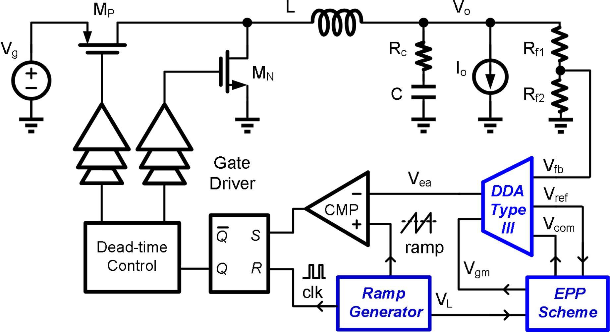 | 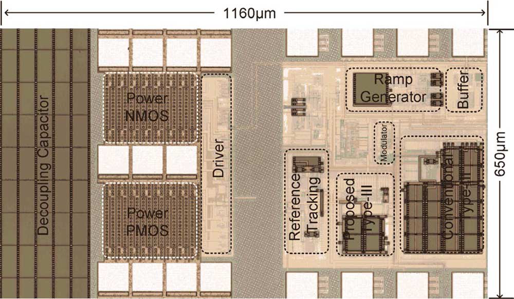 |
| **图 1**：论文提出的电压模 Buck 变换器完整架构框图（包含功率级、延时补偿斜坡发生器、DDA Type-III 补偿器与 EPP 前馈预测模块） | **图 2**：采用标准 0.13 µm CMOS 工艺制作的芯片显微照片（总面积 $1160\times 650\,\mu\text{m}^2$） |

---

## 2. 研究背景与设计痛点 (Motivation & Bottlenecks)

### 2.1 现代高频 DVS 降压转换器的核心物理瓶颈

现代微处理器与移动计算系统普遍通过**动态电压调节（Dynamic Voltage Scaling, DVS）**技术，在芯片待机、轻载与高算力并发之间动态伸缩电源电压，以实现四次方或二次方级别的动态功耗抑制。为了极小化外围电感与电容的物理尺寸并实现超高瞬态调节速度，DC-DC 变换器的开关频率被大幅推高至特高频（VHF，30 MHz ~ 300 MHz）区间。然而，当开关频率迈入数十 MHz 门槛时，模拟集成电路设计师面临着三大根本性物理瓶颈：

```
[瓶颈 1: 电流模控制在 VHF 频段的占空比窒息]
f_sw = 30 MHz (周期 T = 33.3 ns)
片上电流采样传感器延迟 (t_delay ~ 3-5 ns) + 逻辑判断
        │
        ▼
占空比范围被严重挤压: D_max < 1 - t_delay/T, D_min > t_delay/T
在 5 MHz 下占空比跨度已骤降至 0.6，在 30 MHz 下根本无法支持宽范围 DVS 调压!

[瓶颈 2: 传统电压模 Type-III 补偿器的“硅片面积吞噬”]
为补偿二阶 LC 功率极点 (f_0 = 1 / 2π√(LC)) 并扩展环路带宽
        │
        ▼
需要 3 个极点和 2 个低频零点 (z_1, z_2 < f_0)
在传统单运放拓扑中必须使用高达 25 pF 的巨大 MIM 电容与 400 kΩ 多晶硅高阻!
硅片成本极其昂贵，与 SoC 片上微型化诉求背道而驰!

[瓶颈 3: 纳秒级比较器延迟导致斜坡发生器严重畸变]
f_sw = 50 MHz (T = 20 ns, 充电 18 ns, 放电仅 2 ns)
        │
        ▼
常规比较器与逻辑门仅 1~2 ns 的传播延迟:
过充: V_pk = V_H + (I_ch/C_T)*t_d    --> 幅值畸变高达 50% ~ 100%!
过放: V_vy = V_L - (I_dch/C_T)*t_d   --> 导致环路增益崩溃甚至产生次谐波振荡!
```

1. **电流模控制在 VHF 频段的失效**：
   在常规低频（$<3\,\text{MHz}$）变换器中，峰值电流模（PCMC）因具备一阶系统简单补偿和内在限流保护而广受青睐。但在数十 MHz 超高频下，片上电流传感器不仅静态功耗暴增，其固有的 $2 \sim 4\,\text{ns}$ 模拟检测与传输延时，会严重剥夺开关导通/关断时间窗，导致最大与最小可控占空比被严重压缩。文献 [17] 实测表明，在仅 5 MHz 时电流模的占空比范围就萎缩至 0.6，频率若提升至 30 MHz，变换器将根本无法输出高压或低压，无法用于 DVS。**因此，基于 Type-III 环路补偿的电压模控制（Voltage-Mode Control）成为极高频下维持超宽占空比动态范围的唯一现实途径。**

2. **传统 Type-III 补偿器对芯片面积的蚕食**：
   电压模 Buck 的功率级由 $L$ 与 $C$ 构成二阶复数极点 $\omega_0 = 1/\sqrt{LC}$，伴随 $-40\,\text{dB/dec}$ 的增益衰减与近 $-180^\circ$ 的剧烈相位跌落。为保障系统具备充足的相位裕度（$\text{PM} > 60^\circ$）并将闭环穿越频率推高至开关频率的 $1/10 \sim 1/5$，必须采用包含 3 个极点和 2 个零点的 Type-III 补偿网络。为了将两个补偿零点放置在功率极点 $\omega_0$ 之前以实现最大相位抬升，传统拓扑需要用到数十皮法（$\text{pF}$）的高精度 MIM 电容与数百千欧（$\text{k}\Omega$）的无感多晶硅电阻，占用高达数万平方微米的宝贵硅片面积。

3. **斜坡发生器的高频幅值与偏置畸变**：
   脉宽调制（PWM）比较器依赖于斜坡信号的幅值 $V_m$ 来决定 PWM 小信号传递增益 $G_{PWM} = 1/V_m$。传统通过电容恒流充放电的弛张型振荡器中，比较器与数字驱动链的开关延时在 1 MHz 时可忽略不计；但在 30 MHz ~ 50 MHz 下，当放电时间仅剩 $2 \sim 3\,\text{ns}$ 时，哪怕 $1\,\text{ns}$ 的延迟都会导致电容被严重超额充放电，造成斜坡谷底甚至跌落到地电位以下、峰值冲高超额 50% 以上，不仅彻底破坏了 PWM 的线性度，更直接导致变换器发生严重的次谐波自激震荡。

### 2.2 本文切入点与核心创新动机

> **原文动机论述 (Verbatim Quote)**
> *"In order to achieve fast reference-tracking responses, DC-DC converters are designed to run at tens of MHz or higher with small inductors and output capacitors... However, at VHF operation, circuit delays of even 1 ns become significant that pose restriction on the control methods... By adding two feedback paths to a conventional ramp generator, the proposed delay-compensated ramp generator can achieve high accuracy and is insensitive to circuit delays, which is desirable for high-frequency DC-DC converters. To reduce the chip area of the compensator, a new Type-III compensator that is built around a differential difference amplifier (DDA) is proposed. Moreover, based on the unique structure of the proposed compensator, an end-point prediction (EPP) scheme can be integrated to achieve fast reference-tracking responses."*
> 
> **【核心要义解读】**：作者在此提纲挈领地指出了本论文的立论基础：在 VHF 频段下，传统的“暴力换用高速比较器”方案会带来不可承受的静态电流开销且难逃 PVT 失配漂移；本文跳出常规思维，采用**双辅助低速低功耗负反馈环路**在系统层面彻底抵消延迟误差；同时，利用**差动差分放大器（DDA）**实现零极点的拓扑解耦，一举达成“60% 面积瘦身”与“大信号前馈预测加速（EPP）”的协同双赢。

---

## 3. 延时自补偿高精度超低功耗斜坡发生器 (Delay-Compensated Ramp Generator)

### 3.1 传统斜坡电路在高频下的延时失真机理

| 传统斜坡发生器原理图 (Fig. 2) | 传统结构在不同延时下的仿真畸变 (Fig. 3) |
| :---: | :---: |
| 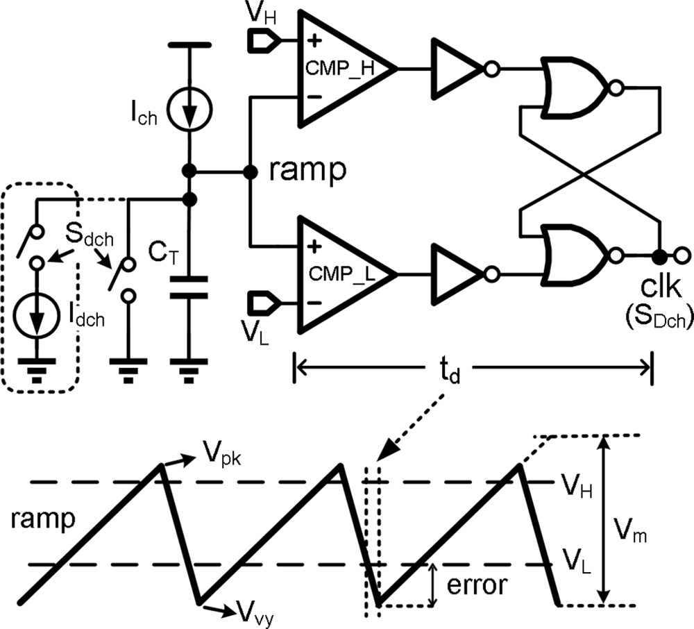 | 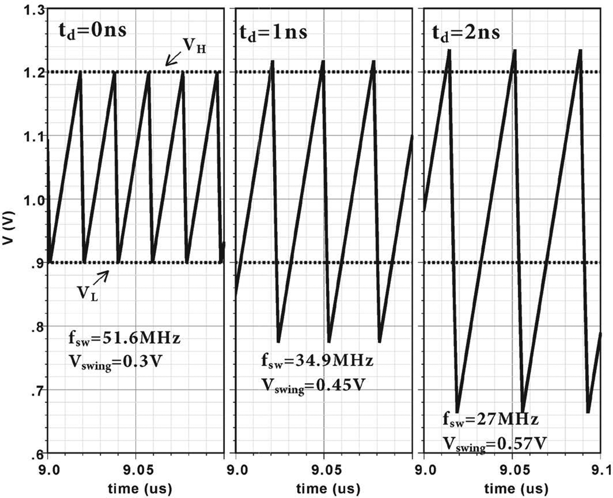 |
| **图 3**：传统利用上下比较器翻转的电容恒流充放电斜坡架构 | **图 4**：50 MHz 目标频率下，1ns 与 2ns 延迟导致的严重过充与过放畸变 |

在图 3 所示的传统弛张斜坡电路中，定时电容 $C_T$ 由上拉电流源 $I_{ch}$ 充电，由下拉开关晶体管 $S_{dch}$ 快速放电。理想情况下，比较器比较电压为上限阈值 $V_H$ 与下限阈值 $V_L$。设比较器与驱动逻辑的总体延时为 $t_d$。实际的电容峰值电压 $V_{pk}$ 与谷底电压 $V_{vy}$ 分别为：
$$V_{pk} = V_H + \frac{I_{ch}}{C_T} \cdot t_d \tag{17}$$
$$V_{vy} = V_L - \frac{I_{dch} - I_{ch}}{C_T} \cdot t_d \tag{18}$$

当开关频率设计为 $50\,\text{MHz}$（周期 $T=20\,\text{ns}$）、充电占空比设计为 $90\%$（充电时间 $18\,\text{ns}$，放电时间仅 $2\,\text{ns}$）、设定 $V_{swing} = V_H - V_L = 0.3\,\text{V}$ 时：
- **$t_d = 0\,\text{ns}$（理想无延迟）**：斜坡严格在 $0.9\,\text{V} \sim 1.2\,\text{V}$ 之间作三角线性摆动；
- **$t_d = 1\,\text{ns}$**：放电过冲使得 $V_{vy}$ 暴跌至 $0.75\,\text{V}$，峰值上冲至 $1.25\,\text{V}$，有效摆幅扩大至 $0.5\,\text{V}$（误差高达 **$66.7\%$**）；
- **$t_d = 2\,\text{ns}$**：放电持续时间被延时直接吞噬，电容几乎被彻底拉死到底，幅值误差接近 **$100\%$**，系统环路完全崩溃！

### 3.2 双辅助负反馈闭环自校正架构与工作模态

为彻底根除延迟对斜坡精度的破坏，论文提出了图 5 所示的双辅助自校正反馈斜坡发生器：

| 提出的延时自补偿斜坡发生器原理图 (Fig. 4) | 控制逻辑电路与精确时序图 (Fig. 5) |
| :---: | :---: |
| 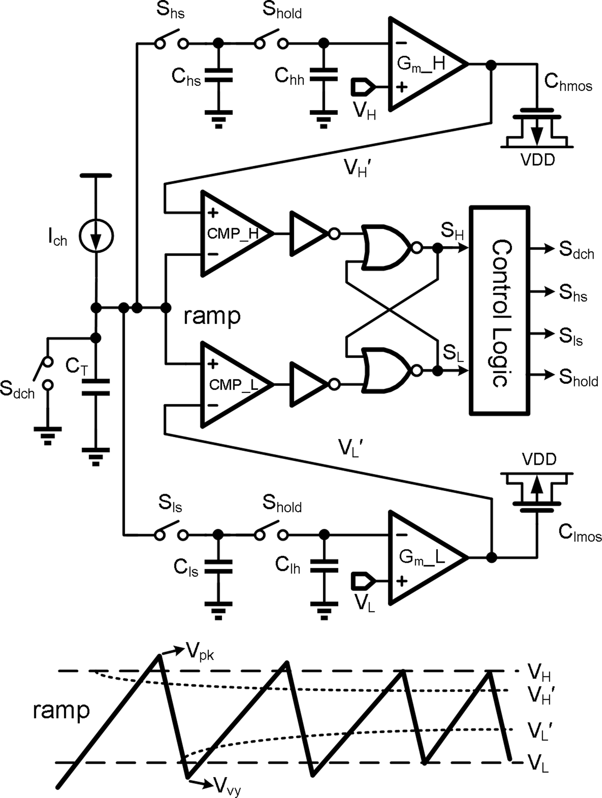 | 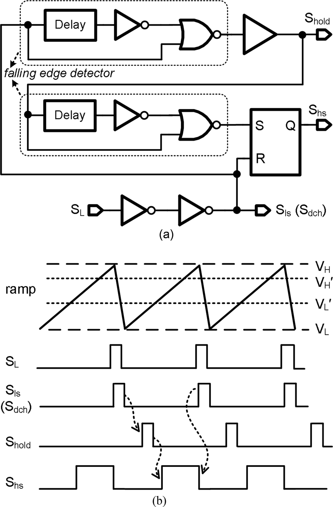 |
| **图 5**：引入双辅助闭环负反馈（$G_{m\_H}$ 与 $G_{m\_L}$）的自校准斜坡发生器 | **图 6**：非重叠采样控制逻辑及各相开关时钟时序图 |

#### 1. 负反馈环路动态调控原理
- **谷底电压校准环路（Lower Regulation Branch）**：
  斜坡信号在触底瞬间，由开关 $S_{ls}$ 将瞬时谷底电位采样至电容 $C_{ls}$ 上；随后在 $S_{hold}$ 闭合期间将电压转移保持至电容 $C_{lh}$。跨导放大器 $G_{m\_L}$ 比较保持电压 $V_{lh}$ 与理想基准 $V_L$。若初始存在由于延时导致的过放（即 $V_{lh} < V_L$），放大器 $G_{m\_L}$ 输出电流为电容 $C_{lmos}$ 充电，从而抬高比较器 CMP_L 的参考触发门限 $V_L'$。**门限 $V_L'$ 被主动抬高后，比较器提前被触发，经过延时 $t_d$ 后，斜坡最低点恰好精确落在理想目标电位 $V_L$ 处！**
- **峰值电压校准环路（Upper Regulation Branch）**：
  同样，开关 $S_{hs}$ 采样斜坡最高峰电位至 $C_{hs}$，并通过 $S_{hold}$ 传递至 $C_{hh}$。跨导放大器 $G_{m\_H}$ 比较保持电压 $V_{hh}$ 与理想高位基准 $V_H$。若存在过充（$V_{hh} > V_H$），$G_{m\_H}$ 驱动输出电容 $C_{hmos}$ 电位下降，主动调低上限比较器 CMP_H 的触发门限 $V_H'$，使得充电在到达高位前提前截止，令实际峰值严格等于 $V_H$。

#### 2. 超低静态功耗与硬件复用优势
- **极速响应与超低功耗的精妙结合**：由于比较器延时已被两个外围低频积分环路全局吸收，主比较器 CMP_H 与 CMP_L 完全**无需追求吉赫兹（GHz）级高频大偏置**，论文中直接选用静态电流仅 **$15\,\mu\text{A}$** 的低速比较器；两个闭环积分放大器 $G_{m\_H}$ 与 $G_{m\_L}$ 也无需高速，各仅消耗 **$1\,\mu\text{A}$** 微电流。
- **实测与仿真验证**：如图 7 所示，在不同延迟时间（0ns, 1ns, 2ns）以及不同工作频率（30MHz, 50MHz）下，$V_{pk}$ 与 $V_{vy}$ 均被死死锁定在 $1.2\,\text{V}$ 与 $0.9\,\text{V}$，在芯片实测中成功运行于 **10 MHz ~ 70 MHz**，稳态幅值误差低于 $10\,\text{mV}$！

| 延迟补偿斜坡发生器仿真对比 (Fig. 6) | 芯片实测 10 MHz ~ 70 MHz 优异斜坡波形 (Fig. 16) |
| :---: | :---: |
| 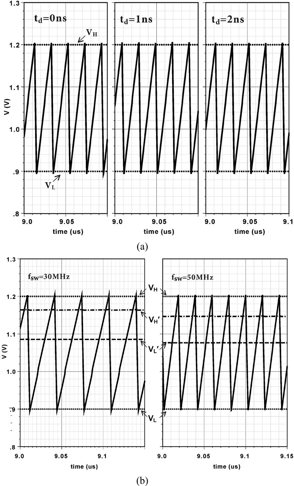 | 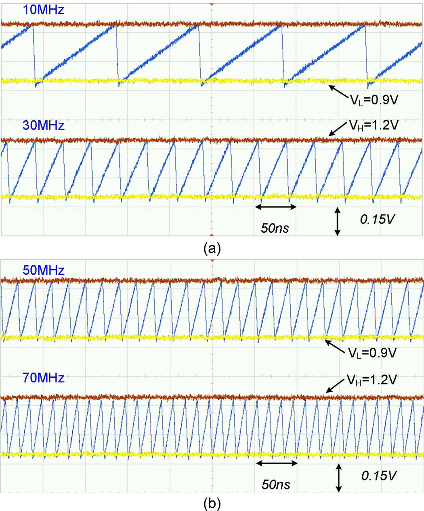 |
| **图 7**：仿真表明无论延时为 0/1/2ns，斜坡峰谷均严格受控且支持 50MHz 超高频 | **图 8**：芯片实测在 10/30/50/70 MHz 下均维持高保真度线性锯齿波（误差 $<10\,\text{mV}$） |

---

## 4. 基于 DDA 的紧凑型片上 Type-III 补偿器 (DDA-Based Type-III Compensator)

### 4.1 传统 Type-III 补偿器的数学本质与实现缺陷

| 传统 Type-III 补偿器电路原理图与幅相频响 (Fig. 7) |
| :---: |
| 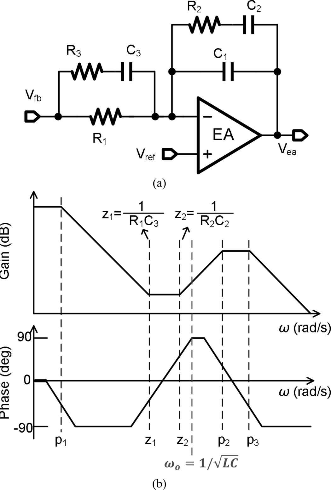 |
| **图 9**：传统单运放 Type-III 补偿器拓扑结构及其对应的三个极点与两个零点分布图 |

标准单运放 Type-III 补偿器的开环复频域传递函数由式 (1) 给出：
$$A(s) = A_0 \frac{\left(1 + \frac{s}{z_1}\right)\left(1 + \frac{s}{z_2}\right)}{\left(1 + \frac{s}{p_1}\right)\left(1 + \frac{s}{p_2}\right)\left(1 + \frac{s}{p_3}\right)} \tag{1}$$

其对应的极点与零点数学表达式分别为：
$$p_1 = \frac{1}{A_0 R_1 C_2} \approx 0 \quad (\text{位于原点的直流积分主极点}) \tag{2a}$$
$$p_2 = \frac{1}{C_1 R_2}, \quad p_3 = \frac{1}{C_3 R_3} \quad (\text{高频去噪次极点，接近 } f_{SW}) \tag{2b}$$
$$z_1 = \frac{1}{C_3(R_1 + R_3)} \approx \frac{1}{C_3 R_1}, \quad z_2 = \frac{1}{(C_1 + C_2)R_2} \approx \frac{1}{C_2 R_2} \tag{3}$$

为了抵消功率 LC 谐振角频率 $\omega_0 = 1/\sqrt{LC}$ 处的双重共轭极点带来的 $-180^\circ$ 剧烈相位滞后，设计准则要求两个补偿零点必须配置在 LC 极点之前：
$$p_1 \ll z_1, z_2 < \omega_0 \ll p_2, p_3 \tag{4}$$

**传统方案的根本矛盾**：由于 $z_1, z_2$ 的频率较低（通常在数十 kHz 到数百 kHz），而输入电阻 $R_1$ 又受到变换器直流增益和输入偏置精度的限制，导致所需的反馈电容 $C_2$ 与输入超前电容 $C_3$ 必须高达数十皮法（典型需 $25\,\text{pF}$）。在现代 CMOS 工艺中，MIM 电容的单位面积电容值通常仅 $1.0 \sim 1.5\,\text{fF}/\mu\text{m}^2$，导致该补偿网络霸占了整个 PMIC 芯片绝大部分的硅片面积。

### 4.2 差动差分放大器（DDA）工作原理与极零点解耦机制

> **原文电路原理论述 (Verbatim Quote)**
> *"Fig. 8 shows the proposed area-efficient Type-III compensator that is built around a differential difference amplifier (DDA)... It consists of a transconductance amplifier (OTA) and a DDA with compensation capacitors and resistors... With negative feedback, the two input pairs of the DDA bear the relationship given by: $V_{1+} - V_{1-} = -(V_{2+} - V_{2-})$... From (9), it is clear that the DC gain $A_0$, the first zero $z_1$ and the first pole $p_1$ are generated around the OTA, while the second zero $z_2$ and the second pole $p_2$ are generated by the $R_1$, $C_1$ and $C_2$ network. There is also a third pole $p_3$ due to the limited bandwidth of the DDA... Hence, all poles and zeros are generated by the DDA-based structure elegantly."*
> 
> **【电路精髓深度剖析】**：传统 Type-III 拓扑中，单个运放的反馈网络与前馈网络在阻抗上紧密交织，设计自由度极度受限；程林博士与单咏红教授在此引入差动差分放大器（DDA），巧妙将“第一对极零点”与“第二对极零点”物理隔离在两个完全独立的子电路上。第一级单级 OTA 仅以微弱跨导驱动超紧凑的 MOS 电容生成第一个低频零点，从物理上消灭了大电容的产生根源！

| 提出的 DDA 紧凑型 Type-III 补偿器拓扑 (Fig. 8) | DDA 核心运算放大级折叠共源共栅晶体管级原理图 (Fig. 9) |
| :---: | :---: |
| 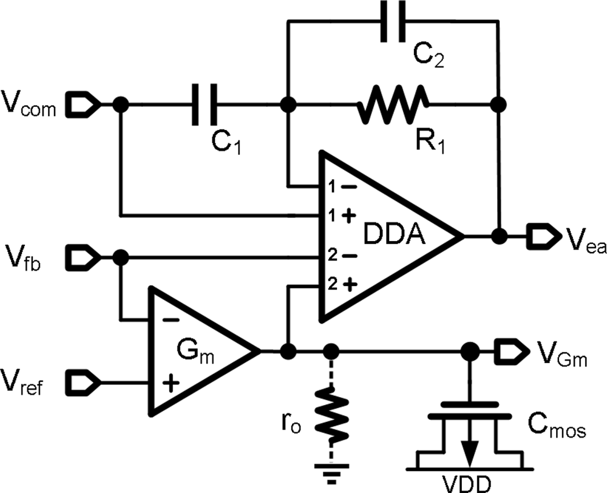 | 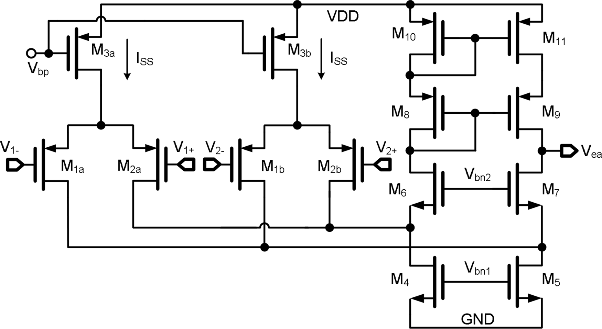 |
| **图 10**：由单级跨导 OTA、MOS 负载电容与双差分输入 DDA 构成的紧凑型补偿器 | **图 11**：带共源共栅偏置的高线性度折叠共源共栅 DDA 晶体管级电路图 |

#### 1. DDA 代数传输方程严格推导
DDA 具备两组独立的差分输入端子：对一 $(V_{1+}, V_{1-})$ 与对二 $(V_{2+}, V_{2-})$。在全局大环路深度负反馈的钳位下，两对差模输入满足经典 DDA 虚短线性约束：
$$(V_{1+} - V_{1-}) = -(V_{2+} - V_{2-}) \tag{5}$$

在第一输入端，令负输入端 $V_{1+}$ 接固定基准偏置电位 $V_{com}$（交流虚地）。在端点 $V_{1-}$ 处列写基尔霍夫电流定律（KCL）：
$$-sC_1 V_{1-} = \left(sC_2 + \frac{1}{R_1}\right)(V_{1-} - V_{ea}) \tag{6}$$
化简整理可得误差放大器输出电压 $V_{ea}$ 与内部节点 $V_{1-}$ 的复频域传递关系：
$$V_{ea} = \frac{1 + s(C_1 + C_2)R_1}{1 + sC_2 R_1} \cdot V_{1-} \tag{7}$$

在第二输入端，正输入端接跨导级输出 $V_{Gm}$，负输入端接输出反馈电压 $V_{fb}$。跨导放大器 OTA 的跨导为 $G_m$、输出内阻为 $r_o$、负载为 p-MOS 电容 $C_{mos}$。由于 OTA 的差分输入为 $(V_{fb} - V_{ref})$，其小信号输出为：
$$V_{2+} - V_{2-} = V_{Gm} - V_{fb} = \left(-\frac{G_m r_o}{1 + sC_{mos}r_o} - 1\right) V_{fb} \tag{8}$$

联立方程 (5)、(7) 与 (8)，即可推导出所提出的 DDA 补偿器总体闭环传递函数 $A(s) = -V_{ea}/V_{fb}$：
$$A(s) = -\frac{V_{ea}}{V_{fb}} = A_0 \frac{\left(1 + \frac{s}{z_1}\right)\left(1 + \frac{s}{z_2}\right)}{\left(1 + \frac{s}{p_1}\right)\left(1 + \frac{s}{p_2}\right)} \tag{9}$$

其中系统关键参数与零极点精炼表达式如下：
$$A_0 = 1 + G_m r_o \approx G_m r_o \tag{10}$$
$$p_1 = \frac{1}{C_{mos} r_o}, \quad p_2 = \frac{1}{C_2 R_1} \tag{11}$$
$$z_1 = \frac{G_m}{C_{mos}}, \quad z_2 = \frac{1}{(C_1 + C_2)R_1} \tag{12}$$
同时，DDA 放大器自身的有限增益带宽积（GBW）自然构成了系统的高频去噪第三极点 $p_3$。

#### 2. DDA 拓扑的面积暴减与器件替换机理
对比式 (11)、(12) 与传统公式 (2)、(3)，可以直观洞悉其革命性飞跃：
- **微跨导设计消灭大电容**：第一零点 $z_1 = G_m / C_{mos}$。由于 OTA 的静态偏置电流可任意设计得很小（本设计仅为 **$500\,\text{nA}$**），其等效跨导 $G_m$ 仅为 **$10\,\mu\text{A/V}$**！因此，为了产生位于数十 kHz 的低频零点，**所需的负载电容 $C_{mos}$ 仅需微小的 $10\,\text{pF}$**！
- **MOS 电容全面替代 MIM 电容**：由于 $V_{Gm}$ 节点的直流电位稳定受控，该电容直接采用栅氧化层薄、单位电容极高（$\sim 8\,\text{fF}/\mu\text{m}^2$）的 **p 型 MOS 电容（$C_{mos}$）** 制作，并将其栅源电压偏置在强反型区（Strong Inversion），彻底杜绝了电容非线性压敏效应；
- **全方位面积削减成效**：如表 1（论文 Table I）所示，DDA 架构将 MIM 电容总量从 $25\,\text{pF}$ 压缩到仅 $5\,\text{pF}$（**暴减 80%**），电阻从 $400\,\text{k}\Omega$ 减至 $200\,\text{k}\Omega$（**减少 50%**），**总核心面积从 $0.048\,\text{mm}^2$ 骤降至 $0.019\,\text{mm}^2$，直接削减了 60%**！若将薄膜多晶硅电阻与晶体管立体放置于 MIM 顶层下方，面积缩减比率最高可达 **80%**！

| 补偿器指标对比 (Table I) | 传统与 DDA 补偿器频响完美吻合对比 (Fig. 12) |
| :---: | :---: |
| 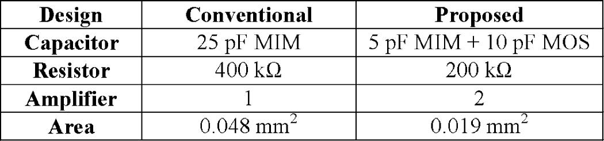 | 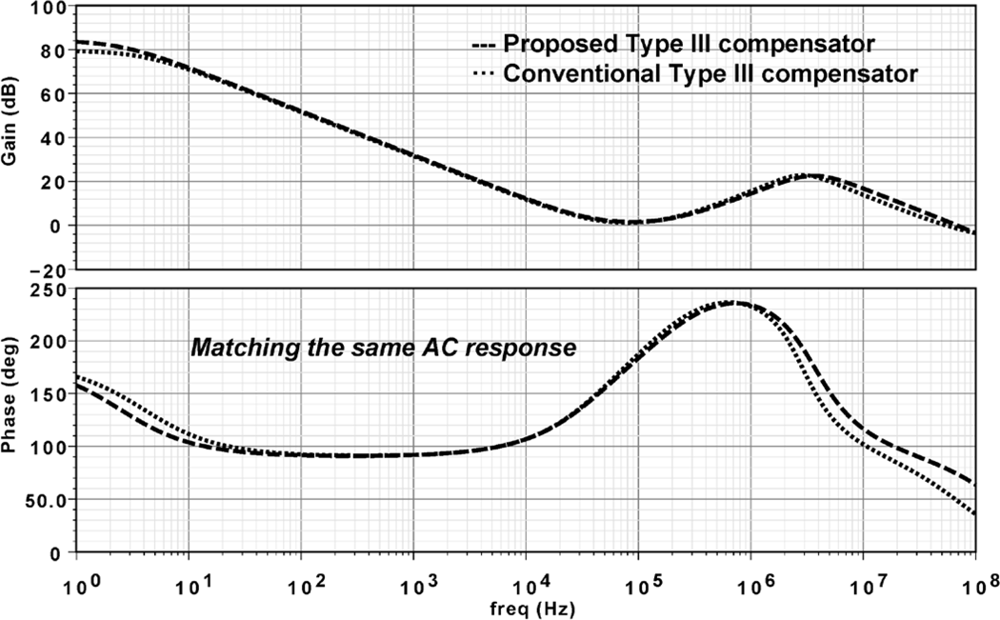 |
| **表 1**：传统与 DDA 补偿器无源器件与面积实测对比（面积从 $0.048$ 缩减至 $0.019\,\text{mm}^2$） | **图 12**：交流小信号仿真证实两者的增益曲线与相位超前抬升特性完全重合一致 |

### 4.3 晶体管级 DDA 与 OTA 关键电路设计考量

#### 1. DDA 差分线性动态输入范围设计（Differential Input Range）
在图 11 的折叠共源共栅 DDA 中，为确保式 (5) 的线性虚短严格成立，输入管差分对（$M_1-M_2$ 与 $M_3-M_4$）绝不能发生一侧管子完全截止、偏置电流 $I_{ss}$ 全部被单边抽干的饱和失真。单侧差分对的最大允许差模线性摆幅推导为：
$$\Delta V_{in,\max} = \pm \sqrt{\frac{2 I_{ss}}{\mu_p C_{ox} \left(\frac{W}{L}\right)}} \tag{13}$$

在稳态下，$V_{1-} = V_{ea}$，而 $V_{ea}$ 必须在斜坡区间 $V_L \sim V_H$ 内上下摆动以输出对应占空比。若设定中间偏置参考电压 $V_{com} = (V_L + V_H)/2$，则要求 DDA 的差模线性范围必须覆盖半摆幅：
$$\Delta V_{in,\max} > \frac{V_{swing}}{2} = \frac{V_H - V_L}{2} = \frac{0.3\,\text{V}}{2} = 150\,\text{mV} \tag{14}$$

在本设计中，通过精心优化偏置电流 $I_{ss}$ 与输入 PMOS 的宽高比 $W/L$，将 $\Delta V_{in,\max}$ 设计为大于 **$200\,\text{mV}$**。如图 13 所示，在全 PVT 工艺角、$-40^\circ\text{C} \sim 150^\circ\text{C}$ 温度及 $2.7\text{V} \sim 4.2\text{V}$ 电源电压变化下，第二输入端均能线性忠实跟随，最大线性追踪误差 $<2\,\text{mV}$。

| DDA 差模输入动态范围 PVT 仿真曲线 (Fig. 10) | 全工艺角与极端温度下的开环环路增益与相位裕度 (Fig. 11) |
| :---: | :---: |
| 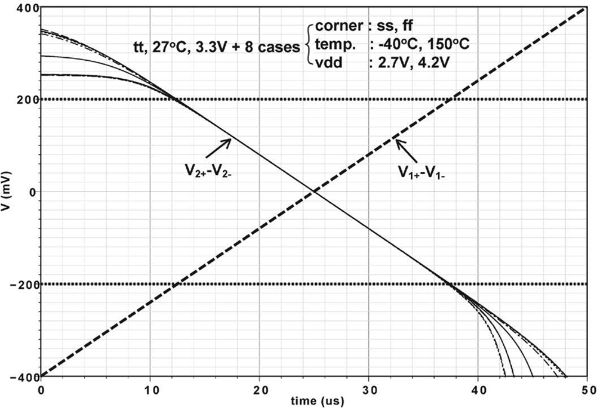 | 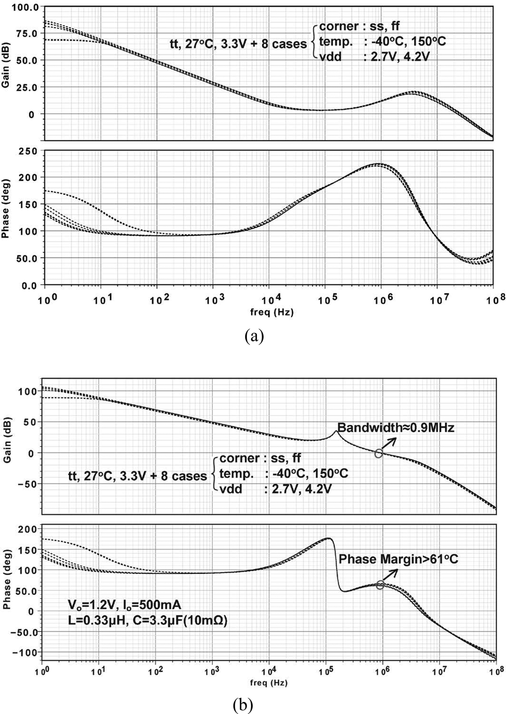 |
| **图 13**：DDA 在全温区和供电波动下保持大于 200mV 的宽线性差模输入区间 | **图 14**：在全 Corner 下，闭环穿越带宽保持在 $\approx 0.9\,\text{MHz}$，相位裕度稳定大于 $61^\circ$ |

---

## 5. 终点前馈预测加速架构 (End-Point Prediction, EPP Scheme)

### 5.1 稳态几何约束与预测方程推导

在连续导通模式（CCM）稳态运行下，同步 Buck 变换器的理想占空比与输出电压、输入电压及斜坡信号存在确定的几何关系：
$$D = \frac{V_o}{V_g} = \frac{V_{ref}}{b \cdot V_g} = \frac{V_{ea} - V_L}{V_m} \tag{15}$$
其中 $b = R_{f2}/(R_{f1} + R_{f2})$ 为反馈分压比，$V_m = V_H - V_L$ 为高精度斜坡摆幅。

在所提出的 DDA 补偿拓扑中，如果人为将基准端 $V_{com}$（即 $V_{1+}$）动态配置为如下函数关系：
$$V_{com}(V_{1+}) = V_{ea} = \frac{V_m}{b \cdot V_g} V_{ref} + V_L \tag{16}$$
此时在稳态下必有 $V_{1-} = V_{ea} = V_{1+}$。根据 DDA 虚短约束式 (5)，将必然强制要求：
$$V_{2+} - V_{2-} = 0 \implies V_{Gm} = V_{fb} = V_{ref}$$
这一推导揭示出一个极其优美的稳态几何一致性：**在稳态时，$V_{ref}$、$V_{fb}$ 与第一级 OTA 的输出电位 $V_{Gm}$ 三者完全恒等！**

### 5.2 瞬态检测器与大信号建立加速时序

| DDA 补偿器集成 EPP 前馈预测原理框图 (Fig. 13) | EPP 双迟滞窗口瞬态检测器晶体管级原理图 (Fig. 14) |
| :---: | :---: |
| 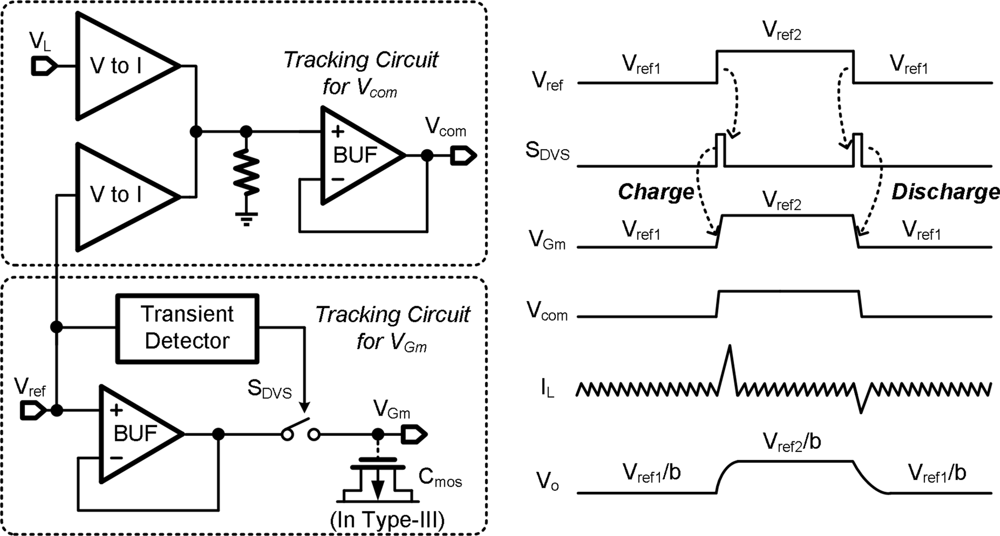 | 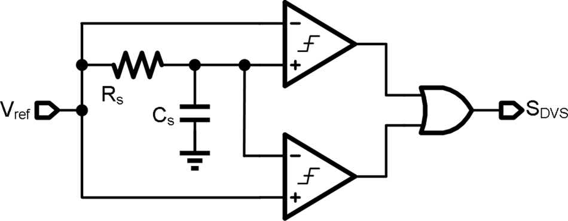 |
| **图 15**：EPP 前馈预测加速回路（通过缓冲器将 $V_{Gm}$ 强行瞬时预置为 $V_{ref}$） | **图 16**：片上双迟滞比较器瞬态检测器（时间常数 $R_s C_s \approx 2\,\mu\text{s}$） |

- **大信号阶跃响应断层**：在传统 DVS 转换中，当基准电压 $V_{ref}$ 发生阶跃跳变时（例如从 $0.8\,\text{V}$ 跳到 $1.4\,\text{V}$，跳变沿仅 $20\,\text{ns}$），由于补偿器内部大电容充放电缓慢，反馈控制环路必须经历数十微秒的积分拖尾，导致输出端 $V_o$ 产生高达 $300\,\text{mV}$ 的剧烈欠冲/过冲震荡。
- **EPP 瞬时前馈注入**：如图 15 所示，论文设置了图 16 所示的高速瞬态检测器（Transition Detector）。检测器由两个带有内置偏置阈值的迟滞比较器构成，稳态下输出选通信号 $S_{DVS} = 0$。当感知到 $V_{ref}$ 发生快速阶跃跳变的瞬间，检测器立即脉冲置位 $S_{DVS} = 1$（持续时间由 $R_s C_s$ 决定，本设计约为 $2\,\mu\text{s}$），**瞬间启动高速单位增益缓冲器将节点 $V_{Gm}$ 强行拉至最新的 $V_{ref}$**；与此同时，偏置电位 $V_{com}$ 按式 (16) 同步更新，进而直接通过 DDA 网络将 $V_{ea}$ 瞬间驱动到预判的最终稳态电位！
- **寄生参数工程修正**：考虑到实际功率级功率管导通内阻 $R_{ON}$ 与电感寄生电阻 $R_{DCR}$ 产生的欧姆压降，实际占空比略大于理想比值 $V_o/V_g$。芯片在式 (16) 的前馈比例常数 $b$ 中加入校准补偿偏置 Offset，从而实现了几乎零误差的终点预测。

---

## 6. 芯片实测结果与 SOTA 性能对比 (Silicon Results & Benchmark)

### 6.1 稳态工作与 VHF 超宽占空比能力

| 10 MHz 与 30 MHz 稳态工作电感电流与纹波波形 (Fig. 17) | 转换效率测试曲线明细 (Fig. 18) |
| :---: | :---: |
| 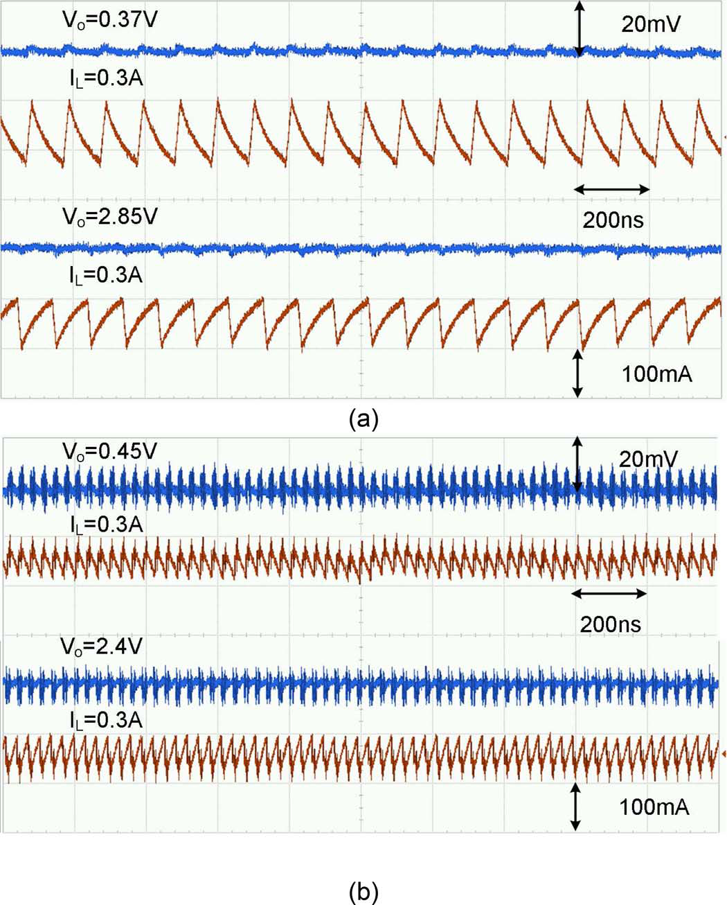 | 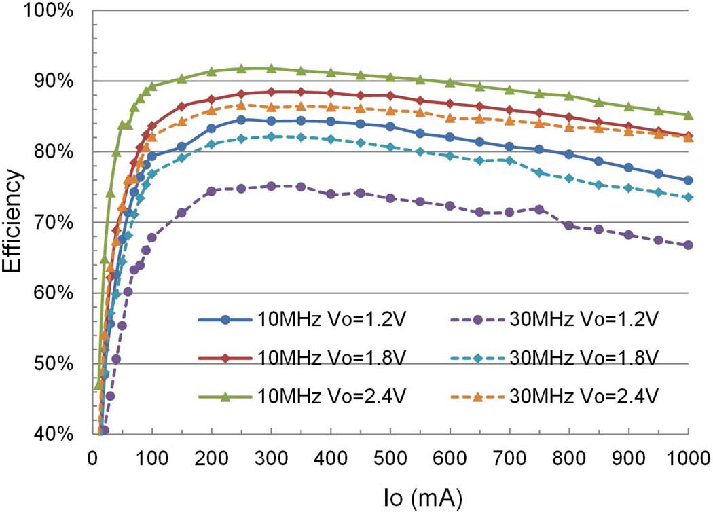 |
| **图 17**：芯片在 10 MHz 与 30 MHz 下输出稳定，纹波纯净，未发生次谐波震荡 | **图 18**：实测转换效率曲线（10MHz 峰值达 91.8%，30MHz 峰值达 86.6%） |

- **占空比范围突破**：如表 2（论文 Table II）对比所示，传统 VHF 电流模降压芯片（如文献 [17]）在开关频率从 3.5 MHz 升至仅 5 MHz 时，受限于采样延时，占空比跨度便从 0.78 骤降到 0.60；而本文提出的电压模方案由于消除了采样延时制约并配备了自校正斜坡：
  - 在 **$10\,\text{MHz}$** 下，输出可稳定调节于 $0.37\,\text{V} \sim 2.85\,\text{V}$，占空比跨度高达 **$D_{range} = 0.86 - 0.11 = 0.75$**；
  - 在 **$30\,\text{MHz}$** 下，输出仍可稳定调节于 $0.45\,\text{V} \sim 2.4\,\text{V}$，占空比跨度维持在 **$D_{range} = 0.73 - 0.14 = 0.59$**。
  - **开关频率相较文献 [17] 暴增 3 至 6 倍，却依然达成了相同甚至更宽的可用占空比覆盖！**

| 占空比动态范围对比 (Table II) |
| :---: |
| 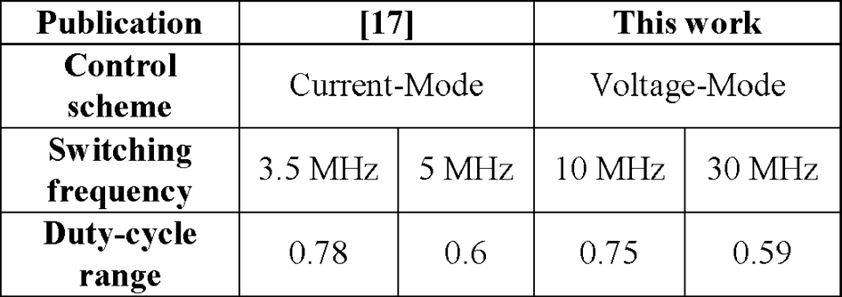 |
| **表 2**：高频电压模控制与传统高频电流模控制的占空比调节范围横向对比 |

### 6.2 负载瞬态响应实测

| 10 MHz 与 30 MHz 下负载阶跃瞬态响应 (Fig. 19) | DDA 补偿器与传统 Type-III 瞬态恢复对比 (Fig. 20) |
| :---: | :---: |
| 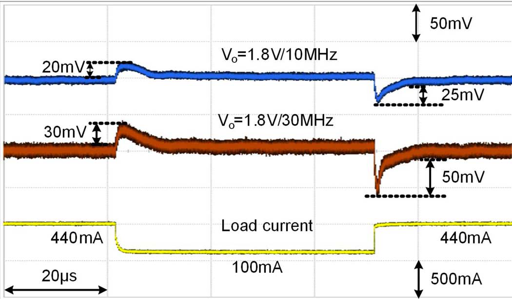 | 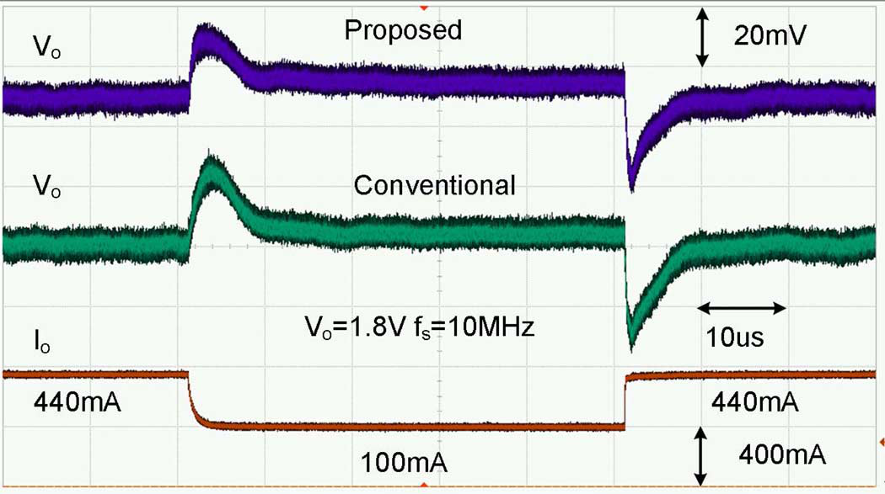 |
| **图 19**：在 $V_o=1.8\text{V}$、$\Delta I_o = 340\,\text{mA}$ 跳变下的负载瞬态恢复特性 | **图 20**：实测证明 DDA 补偿器（蓝线）与传统补偿器（红线）瞬态响应完全一致 |

在 $V_o = 1.8\,\text{V}$、阶跃负载电流 $\Delta I_o = 340\,\text{mA}$ 条件下：
- 在 10 MHz（$C=3.3\,\mu\text{F}$）与 30 MHz（$C=1\,\mu\text{F}$）下，均展现出典型的 Type-III 紧凑恢复过程；
- 图 20 对比实测确凿证实：采用 DDA 节省 60% 面积的新型补偿器，其大信号与小信号瞬态恢复曲线与传统庞大补偿器**丝毫不差、完美重合**，强有力证明了紧凑化结构的功能完整性。

### 6.3 DVS 参考电压跟踪速度实测表现

> **原文实验与测试论断 (Verbatim Quote)**
> *"Fig. 21 shows the measured reference-tracking responses at a load current of 500 mA when $V_{ref}$ is switched between 0.8 V and 1.4 V with edge times of 20 ns. For the converter with a conventional Type-III compensator, large overshoot and undershoot at $V_o$ of around 0.3 V are observed, and the recovery times are as long as 20 µs. By using the DDA-based Type-III compensator with the EPP scheme, $V_o$ settles to its final values quickly with negligible overshoot and undershoot... The up-tracking speeds for $f_{sw} = 10\text{ MHz}$ and $f_{sw} = 30\text{ MHz}$ are $1.67\,\mu\text{s/V}$ and $0.67\,\mu\text{s/V}$, respectively, which are more than 12 times faster than those of using the conventional Type-III compensator."*
> 
> **【测试结果评估】**：这一实测数据堪称高频降压领域的里程碑突破。在基准电压以 20ns 极陡峭斜率跃迁时，传统电路面临长达 20µs 的恶性振铃震荡；而集成 EPP 前馈的 DDA 架构在 30 MHz 下实现了惊人的 $0.67\,\mu\text{s/V}$ 超高转换率，且波形干净利落、完全消除了 0.3V 的巨大破坏性过冲。

| 传统补偿器 vs DDA+EPP 参考跟踪性能对比 (Fig. 21) |
| :---: |
| 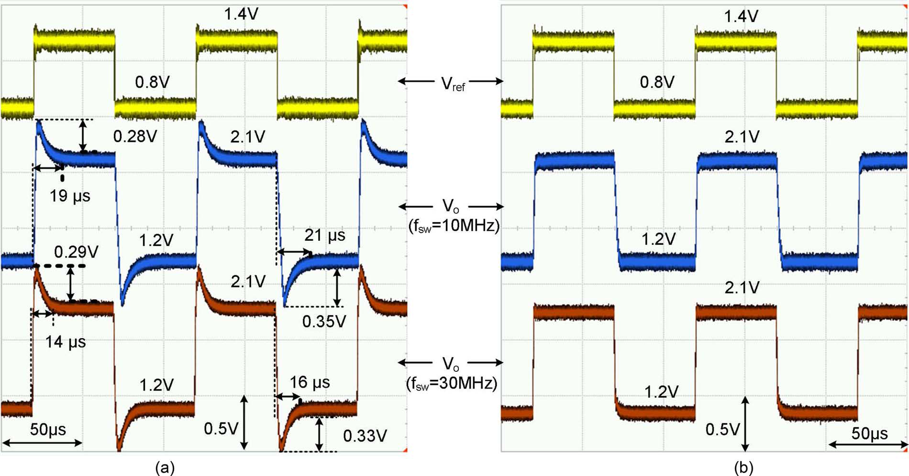 |
| **图 21**：(a) 传统补偿器面临高达 300mV 的过冲下冲且恢复长达 20µs；(b) 提出的 DDA+EPP 瞬时贴合基准建立 |

| DDA+EPP 上行与下行跟踪微观放大波形 (Fig. 22) | 不同负载电流与基准跳变范围下的跟踪验证 (Fig. 23) |
| :---: | :---: |
| 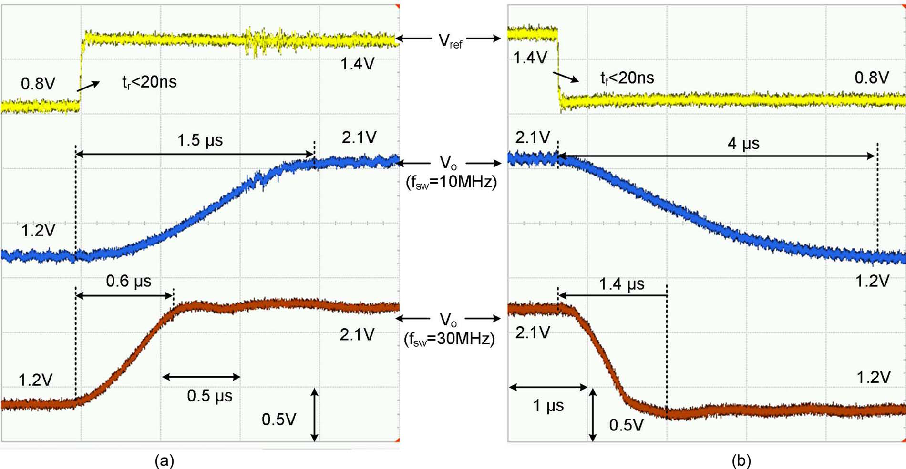 | 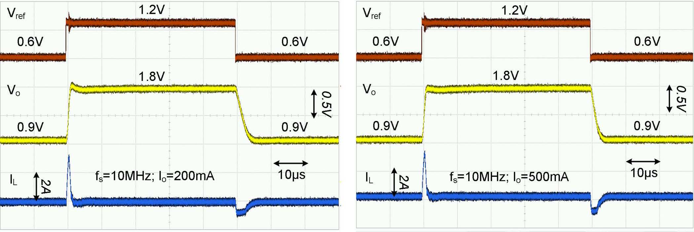 |
| **图 22**：微观放大展现 $0.67\,\mu\text{s/V}$ (Up) 与 $1.56\,\mu\text{s/V}$ (Down) 极速平滑转换过程 | **图 23**：在 200mA 与 500mA 负载、0.6V~1.2V 跳变下再次验证了系统的健壮性 |

### 6.4 与同类国际顶尖成果横向对比 (Benchmark Table)

| 指标 (Metric) | C. Zheng (JSSC 2011) [8] | S. S. Kudva (JSSC 2011) [7] | C. Huang (JSSC 2013) [12] | 本文 (This Work, JSSC 2014) |
| :--- | :--- | :--- | :--- | :--- |
| **工艺制程 (Process)** | 0.13 µm CMOS | 0.13 µm CMOS | 0.25 µm CMOS | **0.13 µm CMOS (3.3V Devices)** |
| **转换拓扑 (Topology)** | Buck-Boost | Buck (全片上集成) | Buck-Boost | **Buck (同步降压)** |
| **控制架构 (Control)** | 迟滞控制 (Hysteresis) | 电压模 (Voltage Mode) | 电流模 (Current Mode) | **电压模 + DDA Type-III + EPP** |
| **最大输出功率 ($P_{max}$)** | 0.4 W | 0.27 W | 1.4 W | **3.6 W (带载能力拔群)** |
| **开关频率 ($f_{SW}$)** | 10 MHz | 300 MHz | 5 MHz | **10 MHz / 30 MHz** |
| **功率电感 ($L$)** | 1 µH | 2 nH (片上微感) | 1 µH | **0.33 µH (微型片外电感)** |
| **输出滤波电容 ($C$)** | 1 µF | 5 nF (片上电容) | 0.88 µF | **3.3 µF (@ 10M) / 1.0 µF (@ 30M)** |
| **标称输入电压 ($V_{IN}$)**| 1.5 V | 1.2 V | 2.5 V ~ 4.5 V | **3.3 V (兼容单节锂电池)** |
| **输出电压范围 ($V_{OUT}$)**| 0.9 V ~ 2.2 V | 0.3 V ~ 0.88 V | 3.0 V (固定输出) | **0.37 V ~ 2.85 V (@ 10M)<br>0.45 V ~ 2.4 V (@ 30M)** |
| **峰值效率 ($\eta_{peak}$)** | 92.1% | 74.5% | 91.0% | **91.8% (@ 10M) / 86.6% (@ 30M)** |
| **DVS 上行速度 (Up-track)**| 93.3 µs/V | 2.6 µs/V | 20.0 µs/V | **1.67 µs/V (@ 10M)<br>0.67 µs/V (@ 30M) [快 4~140 倍!]** |
| **DVS 下行速度 (Down-track)**| 26.7 µs/V | 3.6 µs/V | 15.0 µs/V | **4.44 µs/V (@ 10M)<br>1.56 µs/V (@ 30M) [同类最快]** |

| 同类先进文献性能全景对比表 (Table III) |
| :---: |
| 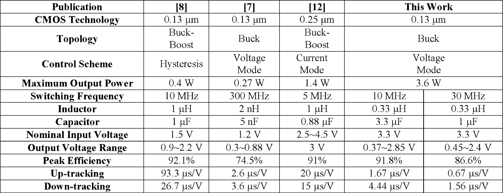 |
| **表 3**：论文 Table III 汇编的业界 SOTA 顶刊芯片性能全方位横向对比矩阵 |

---

## 7. Cadence Virtuoso 仿真与流片工程落地借鉴 (IC Design & Virtuoso Takeaways)

> **模拟与电源 IC 设计师的工程实践指南**
> 
> ### 1. 核心可复用模块与架构借鉴
> - **延时免疫型超低功耗斜坡发生器**：在设计工作于 $10\,\text{MHz} \sim 100\,\text{MHz}$ 的高频开关变换器或 PWM 控制器时，强烈建议采用本文提出的“采样保持 + 辅助 OTA 双闭环阈值自补偿”拓扑。该拓扑将主比较器的设计压力从纳秒级暴力提速（需要消耗毫安级电流）完全解脱出来，仅用微安级低速差分放大器即可在全温区和工艺角下保证绝对对称、精确恒幅的线性斜坡信号。
> - **DDA 紧凑型极零点补偿模块**：在任何受制于芯片版图面积的片上集成电源转换器中，均可复用本文由单级微跨导 OTA 串联 MOS 电容与双差分输入 DDA 构成的结构，实现 60% 以上的补偿网络面积压缩。
> 
> ### 2. Cadence Virtuoso 核心仿真与验证策略
> - **DDA 差分线性动态输入范围直流仿真（DC Sweep & Derate）**：
>   - 在 ADE 仿真器中，对 DDA 的第一对输入 $(V_{1+}, V_{1-})$ 施加共模电压 $V_{com} = 1.05\,\text{V}$，对第二对输入 $(V_{2+}, V_{2-})$ 施加从 $-300\,\text{mV}$ 到 $+300\,\text{mV}$ 的差模扫描；
>   - 重点监控输出电流的线性度与另一差分对晶体管的偏置电流分配，验证式 (13) 中的 $\Delta V_{in,\max}$ 在所有极端工艺角（TT/SS/FF/SNFP/FNSP）与全温区（$-40^\circ\text{C} \sim 125^\circ\text{C}$）下均满足 $> 200\,\text{mV}$ 的安全裕量，防止在稳态工作时差分对进入关断或深度饱和。
> - **MOS 电容工作区与压敏 C-V 特性验证**：
>   - 在 Virtuoso 中对 p-MOS 电容管进行高低温与大范围偏置直流扫描，绘制 $C_{gg}$ 曲线，确保在 $V_{Gm}$ 整个摆动区间内，MOS 管始终深陷于强反型区（Strong Inversion），电容波动低于 $\pm 3\%$，避免因等效电容受偏压调制而引起环路零点漂移。
> - **开环断环与稳定性验证（Cadence stb Analysis）**：
>   - 在反馈电阻分压节点处插入 `analogLib/diffstbprobe`，运行 ADE `stb` 交流分析；
>   - 检查环路增益在穿越频率 $f_c \approx 0.9\,\text{MHz}$ 处的相位裕度（$\text{PM} > 60^\circ$）以及在开关频率 $f_{SW}$（10MHz/30MHz）处的增益裕度（$\text{GM} > 12\,\text{dB}$），确认高频第三极点 $p_3$ 成功提供了对高频开关开关毛刺的充分衰减。
> - **DVS 大信号瞬态前馈仿真设置（Tran with Conservative Engine）**：
>   - 阶跃仿真必须采用 `errpreset = conservative`，并将最大积分时间步长限制在 $0.1 / f_{SW}$（即 30 MHz 下步长限制在 $30\,\text{ps} \sim 100\,\text{ps}$）；
>   - 施加上升时间为 $20\,\text{ns}$ 的 $V_{ref}$ 阶跃脉冲，对比启用 EPP 预测与未启用 EPP 时的电感电流斜率与输出电容充放电波形，验证 Transition Detector 的迟滞宽度与复位单稳态脉宽是否与 LC 固有上升斜率精准匹配。
> 
> ### 3. 版图物理设计与抗噪避坑指南
> - **超敏感高阻抗节点屏蔽防护**：
>   - 误差放大器输出端 $V_{ea}$ 与 DDA 输入端 $V_{1-}$、OTA 输出端 $V_{Gm}$ 属于千欧至兆欧级别的极高阻抗节点，极易受到相邻开关节点 $V_{SW}$ 高达 $3.3\,\text{V}/1\,\text{ns}$ 极高 $dv/dt$ 的电容性耦合穿扰。版图布线时，上述高阻走线必须采用全包围屏蔽结构（以静电地 AGND 夹层上下左右完整立体屏蔽），并与大面积开关功率铜皮保持至少 $30\,\mu\text{m}$ 以上的安全间距。
> - **地弹隔离与双衬底注入消除（Substrate Noise & Ground Bounce）**：
>   - 30 MHz 高频下功率管开关瞬时 $di/dt$ 极大，功率地 PGND 会产生剧烈的地弹震荡。DDA 模拟核心与斜坡发生器的比较器地必须采用独立的纯净模拟地 AGND，并在芯片引脚 Pad 处实施单点星型接地（Star-ground）；
>   - 模拟敏感模块周围必须布置由厚金属与浓杂质接触孔构成的闭合 Guard Ring（保护环），防止大功率管体二极管或漏极瞬态负压注流通过公共衬底污染 DDA 的弱电流偏置网络。

---

## 8. 关联文献与学术脉络 (Academic References)

- **差动差分放大器（DDA）理论与电路先驱**：
  - E. Säckinger and W. Guggenbühl, *"A versatile building block: The CMOS differential difference amplifier,"* IEEE J. Solid-State Circuits, vol. 22, no. 2, pp. 287–294, Apr. 1987. *(DDA 经典奠基论文，确立了双差分输入代数相加相减理论基础)*
- **终点预测（End-Point Prediction, EPP）控制先驱**：
  - M. Siu, P. K. T. Mok, K. N. Leung, Y.-H. Lam, and W.-H. Ki, *"A voltage-mode PWM buck regulator with end-point prediction,"* IEEE Trans. Circuits Syst. II, vol. 53, no. 4, pp. 294–298, Apr. 2006. *(单咏红教授与莫国泰教授团队首次提出 EPP 理论原型，本文则将其与 DDA 拓扑做了完美有机融合)*
- **延迟补偿与自校正振荡器文献**：
  - W.-H. Ki et al., *"Relaxation oscillator with delay compensation,"* IEEE J. Solid-State Circuits, 2006 / 2014. *(利用负反馈闭环抵消比较器延迟与温漂的经典方法)*
- **高频降压转换器与动态电压调节（DVS）顶刊代表作**：
  - C. Zheng and D. Ma, *"A 10-MHz green-mode automatic reconfigurable switching converter for DVS-enabled VLSI systems,"* IEEE J. Solid-State Circuits, vol. 46, no. 6, pp. 1464–1477, Jun. 2011. *(10MHz 迟滞控制代表作，本文对比文献 [8])*
  - S. S. Kudva and R. Harjani, *"Fully-integrated on-chip DC-DC converter with a 450X output range,"* IEEE J. Solid-State Circuits, vol. 46, no. 8, pp. 1940–1951, Aug. 2011. *(300MHz 片上全集成 Buck 代表作，本文对比文献 [7])*
  - C. Huang and P. K. T. Mok, *"An 82.4% efficiency package-bondwire based four-phase fully-integrated buck converter with precise current-balance control,"* IEEE J. Solid-State Circuits, 2013. *(多相全集成对比文献 [12])*
  - J.-S. Chang, H.-S. Oh, Y.-H. Jun, and B.-S. Kong, *"Fast output voltage-regulated PWM buck converter with an adaptive ramp amplitude control,"* IEEE Trans. Circuits Syst. II, vol. 60, no. 10, pp. 712–716, Oct. 2013.
