> **论文核心亮点与芯片定位**
> - **行业学术地位**：本文由**澳门大学（University of Macau）微电子研究院与模拟及混合信号超大规模集成电路国家重点实验室（SKL-AMSV）黄沫（Mo Huang）副教授、马许愿（Rui P. Martins）讲座教授团队**，联合**中国科学技术大学（USTC）程林（Lin Cheng）教授**与**电子科技大学（UESTC）王政（Zheng Wang）教授**于 2026 年发表在集成电路领域最高学术期刊 *IEEE Journal of Solid-State Circuits (JSSC)*。该工作的前期阶段性成果曾作为口头报告发表于芯片奥林匹克顶会 *IEEE ISSCC 2026*。
> - **攻克的学术痛点**：面向高性能计算（HPC、AI 加速卡、数据中心 CPU/GPU）供电中从 12V 母线直降至 1V 点负载（PoL）的极端高压降比与超大动态电流场景，传统多相（Multi-Phase, MP）混合开关电容（Hybrid SC）拓扑长久以来无法同时兼顾“**固有电感电流均流（Inherent $I_L$ Balancing）**”、“**大瞬态全部电感并发励磁（ALL-ON 瞬态加速）**”、“**宽电压转换比与相数解耦（Decoupled VCR）**”以及“**轻载相数动态伸缩裁剪（Flexible Phase-Count Scaling）**”四大关键特性的行业死结。
> - **五大核心技术突破**：
>   1. **线网连接 Q 采样器架构（Line-Connected Q-Sampler, LQS）**：打破传统环形闭合（Ring-connected）或星形交叉（Star-connected）拓扑的走线定式，创新性地在相邻相的内部直流节点 $V_Y$ 之间跨接电荷采样电容 $C_S$。如同“水杯连通器（Communicating Vessels）”效应，使相邻相通过电容无缝共享能量回路，省去传统单相混合拓扑中的大面积对地去耦电容 $C_{DC}$。
>   2. **零直流偏置（0V-DC Bias）与超高无源器件功率密度**：严格数学证明与芯片实测证实，Q 采样电容 $C_S$ 两端稳态直流压差严格恒等于 **$0\,\text{V}$**（$V_{CS} = 0\,\text{V}$）。彻底摆脱了片外高容值多层陶瓷电容（MLCC）在直流高偏压下的剧烈介电常数衰减（DC Bias Degradation）恶疾，**直接采用微型 0402 封装电容，仅占用 PCB 有源区 11% 面积**，实现整机高达 $81.5\,\text{mA/mm}^2$ 的超高电流密度！
>   3. **稳态绝对电荷守恒与抗容差固有均流（Inherent Charge Equalization）**：在 $N$ 相交错定频调制下，串联的 $C_S$ 网络在每个导通周期采样固定电荷包 $Q_S$，并在交错导通阶段均匀释放。严格电荷守恒约束（Charge Balance）强制每一相电感在各自导通期内吸纳的电荷总量恒等于 $2 Q_S$。**从器件物理与电荷拓扑上彻底消除了对复杂、易受噪声干扰的片上高频电流采样放大器与主动闭环均流环路的依赖**，实测最大电流不平衡率仅为 **$1.8\%$**，且对开关管寄生内阻 $R_S$ 与飞跨电容容差呈现出天然的极高鲁棒性。
>   4. **多源开关节点控制（Multi-Source-$V_X$ Control）与占空比解耦**：允许高电平开关节点 $V_X$ 同时由本相 $C_F$ 充电支路与相邻相 $C_F$ 放电支路供电，或独立由本相 $C_F$ 充电支路维持。突破了传统单源控制在 $N$ 相交错下占空比严禁交叠（$D < 1/N$）的物理枷锁，**实现了 $1/N < D < 1$ 的全占空比平滑过渡**，使输入输出电压转换比（VCR）与相数 $N$ 完全解耦！
>   5. **异步双阈值比较触发的超快 ALL-ON 瞬态加速机制**：集成同步迟滞电流模控制与异步瞬态快速路径。在大电流阶跃突加载（Step-up）瞬间，$V_{OUT}$ 下冲触发下限阈值 $V_{REFL}$，系统瞬间开启全部 6 相高边功率开关，电感总充电压摆率（Slew Rate）从常规的 $(V_{IN} - 6V_O)/L$ 跃升至 **$(3V_{IN} - 6V_O)/L$**。在 6A 阶跃（$20\,\text{ns}$ 上升沿，$300\,\text{A} \mu \text{s}$）下，**将电压跌落从 $182\,\text{mV}$ 骤降至 $65\,\text{mV}$，归一化下冲指标仅为 $0.41$（刷新业界 SOTA 最低纪录）**！
> - **芯片实测指标速记**：
>   - **工艺制程**：$0.18\,\mu\text{m}$ BCD 工艺，倒装焊（Flip-Chip）芯片封装；
>   - **电压与电流**：$V_{IN} = 12\,\text{V}$ 标称（支持 $10\,\text{V} \sim 12\,\text{V}$），稳压输出 $V_O = 1.0\,\text{V} \sim 1.8\,\text{V}$（支持快速动态电压调节 DVS），最大连续输出负载电流 **$8.0\,\text{A}$**；
>   - **工作频率与无源器件**：单相开关频率 $f_{SW} = 2.0\,\text{MHz}$，6 相电感 $L = 900\,\text{nH}$（$26\,\text{m}\Omega$ DCR），6 颗 $1.3\,\mu\text{F}$ $C_F$（0603 封装），5 颗 $1.0\,\mu\text{F}$ $C_S$（0402 封装），输出电容 $C_{OUT} = 2 \times 10\,\mu\text{F}$；
>   - **转换效率与均流度**：在 12V 至 1.0V 条件下峰值效率达 **$90.5\%$**，在 1.8V 输出下达 **$91.5\%$**；全负载范围内相数支持 2 相至 6 相动态裁剪与无缝切换；
>   - **物理尺寸**：裸片面积 $3.2\,\text{mm} \times 3.6\,\text{mm} = 11.52\,\text{mm}^2$，整板 PCB 占用面积仅 $8.6\,\text{mm} \times 10.7\,\text{mm} = 92.02\,\text{mm}^2$。

---

## 1. 芯片电气性能与设计指标 (Specs Table)

| 参数类别 | 参数项 (Parameter) | 论文数值 / 实测表现 | 测试条件与设计备注 (Conditions & Notes) |
| :--- | :--- | :--- | :--- |
| **工艺制程** | Process Technology | **0.18-µm BCD (Flip-Chip)** | 集成高压 LDMOS 功率管、自举驱动与模拟控制核心 |
| **裸片尺寸** | Die Dimensions / Active Area | **3.2 mm × 3.6 mm (11.52 mm²)** | 倒装焊铜柱凸点封装，显著降低寄生电感与走线压降 |
| **PCB 占板面积** | Total Footprint Area | **8.6 mm × 10.7 mm (92.02 mm²)** | 正面放置 6 电感与 5 个 0402 $C_S$，反面放置裸片、$C_F$ 及输入输出电容 |
| **输入电压** | Input Voltage Range ($V_{IN}$) | **10.0 V ~ 12.0 V (12 V 标称)** | 面向数据中心 12V 服务器机架配电与计算加速卡母线 |
| **输出电压** | Output Voltage Range ($V_{OUT}$)| **1.0 V ~ 1.8 V** | 覆盖超大规模 AI / CPU 核心供电轨，实测验证 1.0V、1.4V、1.8V |
| **最大负载电流** | Max Output Current ($I_{OUT}$)| **8.0 A** | 6 相全交错运行工况，单相持续均流 $1.33\,\text{A}$ |
| **单相开关频率** | Switching Frequency ($f_{SW}$) | **2.0 MHz** | 等效输出交错纹波频率高达 $12.0\,\text{MHz}$（$6 \times f_{SW}$） |
| **功率电感** | Power Inductors ($L_1 \sim L_6$)| **900 nH (0.9 µH), DCR = 26 mΩ** | 片外表贴功率功率电感（额定饱和电流裕量充分） |
| **飞跨电容** | Flying Capacitors ($C_{F1 \sim 6}$)| **6 × 1.3 µF (0603 封装)** | 稳态承受 $V_{IN}/2 = 6\,\text{V}$ 直流偏置，有效容值约 $1.0\,\mu\text{F}$ |
| **Q采样电容** | Q-Sample Capacitors ($C_{S1 \sim 5}$)| **5 × 1.0 µF (0402 封装)** | **稳态承受 0V 直流偏置**，零介电常数退化，PCB 面积仅占 $11\%$ |
| **输入/输出电容**| Decoupling Capacitors ($C_{IN}, C_{OUT}$)| $C_{IN} = 10\,\mu\text{F},\, C_{OUT} = 2 \times 10\,\mu\text{F}$ | 超高输出等效频率使得仅需 $20\,\mu\text{F}$ 片外电容即可抑制稳态纹波 |
| **峰值转换效率** | Peak Conversion Efficiency | **90.5% (@1.0V) / 91.5% (@1.8V)** | 12V 极端高降压比下取得，重载保持率显著超越纯电感 Buck |
| **电流密度** | Current Density (@85% eff.) | **81.5 mA/mm²** | 包含全部 6 电感、11 颗贴片电容、芯片及 PCB 全局走线 |
| **相间均流误差** | Max Current Imbalance ($IR_n$) | **< 1.5% (@1.0V) / < 1.8% (@1.8V)** | 纯无源电荷守恒实现固有自平衡，无需任何有源均流反馈环路 |
| **动态负载阶跃** | Step Load ($\Delta I_{LOAD} / T_{EDGE}$)| **0 A → 6.0 A in 20 ns (300 A/µs)** | FPGA 控制高速电子负载模拟现代 CPU/GPU 极速突加载工况 |
| **瞬态电压下冲** | Output Undershoot ($\Delta V_{OUT}$) | **65 mV (@ ALL-ON 开启)** | 对比 ALL-ON 关闭时的 $182\,\text{mV}$，下冲幅度削减达 **$64.3\%$** |
| **归一化瞬态指标**| Normalized Undershoot ($US/US_{MIN}$)| **0.41** | 优于所有已报道的多相混合转换器（业界普遍在 $0.77 \sim 6.4$） |
| **动态相数伸缩** | Phase Count Transition | **2 相 ↔ 3 相 ↔ 4 相 ↔ 6 相** | 根据负载电流大小阶梯式开闭相位，过渡过程 $V_{OUT}$ 扰动近乎为零 |

| 芯片与 PCB 紧凑布局显微照片 (Fig. 17) | 纳秒级极速突加载瞬态测试平台 (Fig. 22) |
| :---: | :---: |
| 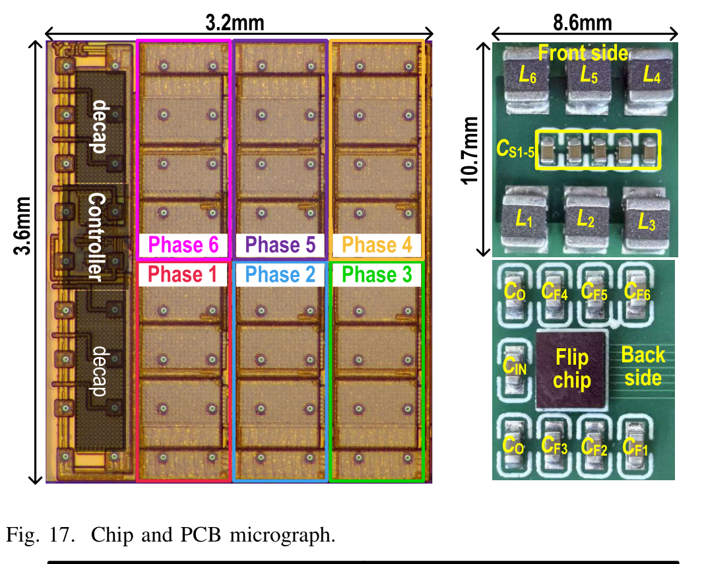 | 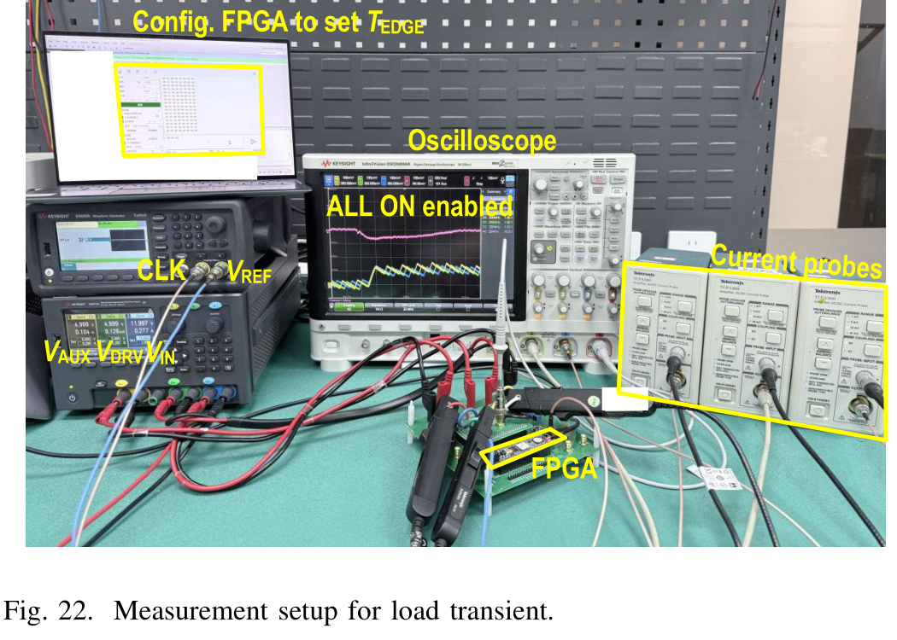 |
| **图 1**：$0.18\,\mu\text{m}$ BCD 倒装焊裸片显微图与 PCB 双面布局（正面放置 6 电感与 5 颗 0402 封装的 $C_S$，反面放置芯片、$C_F$ 及滤波电容，总面积仅 $92\,\text{mm}^2$） | **图 2**：高压降比大电流瞬态响应测试平台原理图（信号发生器提供基准与时钟，FPGA 控制板载高频电子负载实现 $20\,\text{ns}$ 极速电流阶跃） |

---

## 2. 研究背景与设计痛点 (Motivation & Bottlenecks)

### 2.1 高算力 PoL 供电对多相混合转换器的严苛要求

随着云计算、大语言模型（LLM）训练以及高能效边缘端 AI 计算芯片的爆发式演进，核心处理器（CPU / GPU / TPU）的峰值功耗已突破数百瓦乃至千瓦级，核心工作电压下探至 $0.8\,\text{V} \sim 1.8\,\text{V}$，而母线供电轨通常维持在 $12\,\text{V}$（甚至向 $48\,\text{V}$ 演化）。这种大跨度高降压比直接转换（Direct Conversion）对电源转换器提出了极其严苛的物理挑战：
- **占空比极度微缩与损耗激增**：在传统单级降压拓扑中，标称占空比仅为 $D = V_O / V_{IN} \approx 1/12 \approx 8.3\%$，高边功率管在极窄的脉冲时间内承受全输入电压 $V_{IN}$ 的硬开关应力，导致剧烈的开关损耗与栅极电荷损耗；
- **多相交错并联的必然性与均流瓶颈**：为了分摊数十至上百安培的巨大输出电流并抵消输入/输出纹波，必须采用多相交错并联架构。然而，**相间电感电流的失配不仅会产生局部的严重发热点（Hotspots），还会导致局部电感磁芯过早饱和，甚至诱发系统雪崩击穿**。在高开关频率（$\ge 2\,\text{MHz}$）下，传统的逐相片上高精度电流采样放大器不仅版图开销与静态功耗极其沉重，而且受到极高共模压摆率（$d V/dt$）干扰，闭环均流极易发生失稳与测量漂移。

为此，学术界与工业界高度关注**混合开关电容（Hybrid SC）降压转换器**。其通过在电感前端引入开关电容网络，先对输入电压进行两倍或多倍的分压预降压（使得开关节点摆幅降低至 $V_{IN}/2$ 或更低），大幅扩展有效占空比，并成倍降低开关管耐压与寄生电容充放电损耗。

为了评估一款面向 PoL 供电的“理想多相混合转换器”，学术界公认必须同时满足**六大黄金设计法则**：
1. **固有相间电感电流自平衡（Inherent $I_L$ Balancing）**：无源机制强制均流，免去庞大易受噪声干扰的有源检测环路；
2. **飞跨电容电压自平衡（Inherent $V_{CF}$ Balancing）**：防止功率管承受过压应力并抑制纹波；
3. **电压转换比与相数完全解耦（Decoupled VCR and Phase Count）**：最大占空比与可达转换比不受交错相数限制；
4. **大动态电感全并发励磁（Simultaneous ALL-ON Operation）**：在负载阶跃时瞬间齐开全部电感以达成极限电感电流上升率；
5. **全相均匀交错移相（All-Phase Interleaving）**：各相具有精准 $2\pi/N$ 移相角，最大限度消除输出电压高频纹波；
6. **相数灵活伸缩裁剪（Flexible Phase-Count Scaling）**：轻载时可随负载降低动态切除冗余相位以维持全负载高效率。

```
                    ┌────────────────────────────────────────────────────────┐
                    │      理想多相混合降压转换器的六大黄金设计准则 (Design Rules)       │
                    └───────────────────────────┬────────────────────────────┘
                                                │
         ┌──────────────────┬───────────────────┼───────────────────┬──────────────────┐
         ▼                  ▼                   ▼                   ▼                  ▼
  [1. 固有 IL 平衡]   [2. 固有 VCF 平衡]  [3. VCR/相数解耦]   [4. ALL-ON 并发]   [5. 全相位均匀交错]   [6. 灵活相数伸缩]
  (免除片上有源检测)   (杜绝管子过压击穿)   (打破 D<1/N 枷锁)   (极速阶跃电流爬升)   (极致压缩输出纹波)   (宽载轻载高效率保持)
```

### 2.2 现有四大多相混合拓扑瓶颈剖析

| 现有四种经典多相混合转换器架构缺陷剖析 (Fig. 1) | 前人多相混合方案关键局限性汇总 (Table I) |
| :---: | :---: |
| 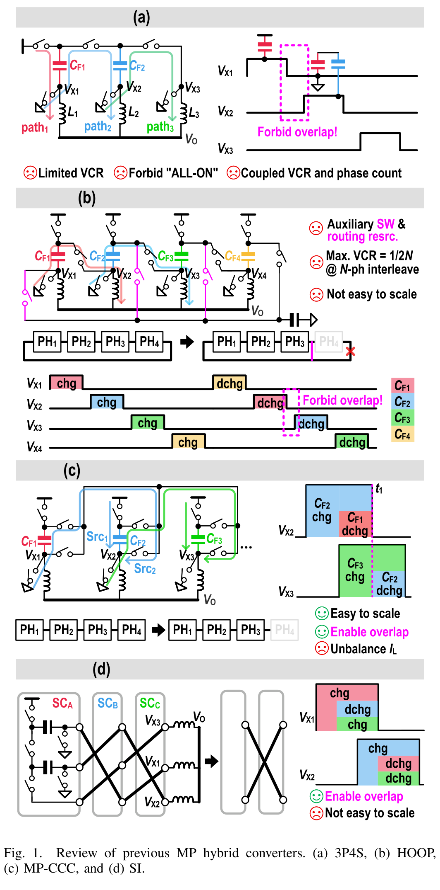 | 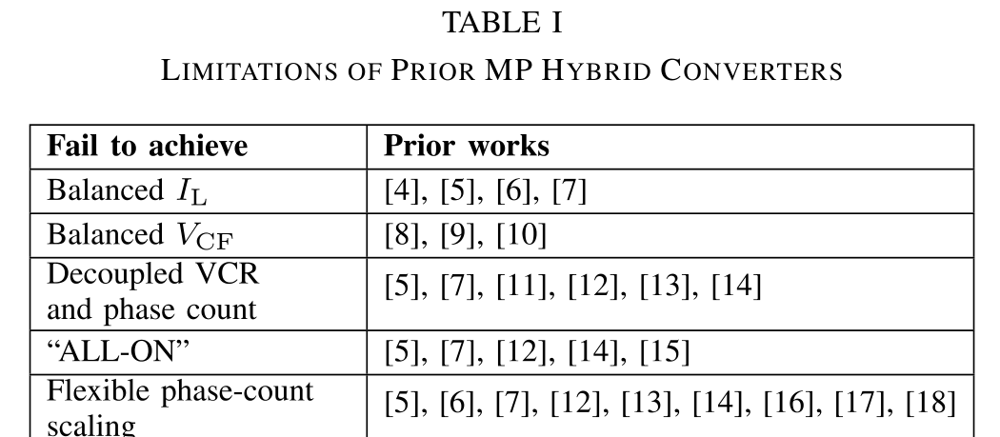 |
| **图 3**：前人多相混合转换器拓扑对比：(a) 3P4S 输入串联型；(b) HOOP 输入并联环形连接型；(c) MP-CCC 输入并联线形连接型；(d) SI 输入并联星形连接型 | **图 4**：文献中主流多相混合转换器核心功能缺失清单（没有任何一种先前工作能够同时兼顾六项黄金指标） |

#### 1. 输入串联 Dickson 拓扑：3P4S 转换器 (Fig. 1a, JSSC'24 [14])
- **拓扑特征**：采用 3:1 Dickson 型开关电容网络（输入串联、输出并联），包含两只飞跨电容 $C_{F1}$ 与 $C_{F2}$。
- **致命瓶颈**：
  - 各相励磁回路在输入端本质上是**串联耦合**的。例如 $L_2$ 的充电路径（Path 2）需要 $C_{F1}$ 与 $C_{F2}$ 串联，这物理上要求 $C_{F1}$ 的底板（即 $L_1$ 的开关节点 $V_{X1}$）必须牢牢接地！因此，各开关节点的导通区间严禁重叠（Forbid Overlap），**完全丧失了支持 ALL-ON 瞬态操作的能力**；
  - 导通不重叠使得在 3 相交错下单相最大占空比被焊死在 $1/3$ 以内，结合 3:1 预分压，理论最高转换比仅为 $VCR_{max} = 1/9$。推广至 $N$ 相系统，最高转换比以 **$1/N^2$** 恶性衰减，相数完全无法扩展。

#### 2. 输入并联环形连接拓扑：HOOP 转换器 (Fig. 1b, ISSCC'25 [11])
- **拓扑特征**：各相具有独立的并联输入充电路径，飞跨电容 $C_{Fi}$ 充电时驱动第 $i$ 相电感，放电时驱动第 $(i+1)$ 相电感，末相 $C_{F4}$ 放电回流至第 1 相，闭合成环形拓扑（Ring Connection）。
- **致命瓶颈**：
  - 为了在轻载下关闭冗余相位（Phase Shedding），必须引入大量高压辅助开关与极其复杂的绕线网络重新在剩余相之间强行闭合形成更小的新环；
  - 如图 1(b) 所示，在 $N$ 相均匀交错运行时，$C_{Fi}$ 放电驱动第 $i$ 相电感拉高 $V_{Xi}$ 时，必须强制前一相开关节点 $V_{X(i-1)}$ 接地！相邻节点严禁高电平重叠，导致全相交错下的最大转换比仅为 **$1/(2N)$**；尽管文献 [11] 妥协采用两相两相组团交错控制，但代价是输出纹波急剧恶化；
  - 拓扑中存在承受全输入电压 $V_{IN} = 12\,\text{V}$ 的高压复合开关 $M_{23}$（如 Table II 所示），限制了低压高性能器件的使用。

#### 3. 输入并联线形连接拓扑：MP-CCC 转换器 (Fig. 1c, JSSC'26 [4])
- **拓扑特征**：采用多源开关节点（Multi-Source-$V_X$）控制，实现了开关节点高电平重叠，打破了占空比与相数绑定的桎梏，且线形拓扑极易线性级联。
- **致命缺陷**：**拓扑本身完全丧失了电感电流的固有自平衡特性（Failure in Inherent $I_L$ Balancing）**！必须额外引入复杂的片上高频电流采样环路或数字校准算法进行强制牵引，极大地消耗了硅片面积与功耗。

#### 4. 输入并联星形交叉拓扑：SI 转换器 (Fig. 1d, JSSC'25 [16])
- **拓扑特征**：通过输入并联与星形交叉走线（Star-Connected Switching Nodes）实现电荷均分与固有均流。
- **致命缺陷**：其内部功率走线存在不可避免的多路立体交叉（Cross-Coupled Power Traces）。随着相数增加，走线寄生阻抗激增，版图极为臃肿，重新裁剪配置相数的复杂度呈指数级爆炸，相数伸缩扩展性极差。

### 2.3 本文切入点与创新动机

> **原文动机论述 (Verbatim Quote)**
> *"The above comparison yields three design rules for a desired MP hybrid topology. First, input-parallel SC stages enable concurrent inductor energizing during load transients. Second, multiple source paths per high-level switching node decouple VCR from phase count. Third, the inter-phase connection should be line-connected, rather than the complex ring- or star-connected, to preserve phase scalability. The remaining challenge is to introduce an inter-phase charge-equalization mechanism for inherent IL balancing without violating these three principles."*
> 
> **【核心要义解读】**：作者通过对现有技术的透彻批判，归纳出通向“理想多相混合转换器”的三大铁律：**输入级必须并联**（赋能大瞬态 ALL-ON 迸发）、**开关节点必须多源供电**（打破相数与占空比绑定）、**相间连接必须为线形单向级联**（保障相数无缝伸缩与版图整洁）。在此三大铁律之上，如何凭空构建一套绝不破坏拓扑对称性与扩展性的“无源电荷均衡机制”，正是本文的核心切入点。

---

## 3. 系统拓扑与控制架构 (Topology & Control Architecture)

### 3.1 连通器概念与 LQS 架构起源

| 连通器物理类比与 LQS 拓扑演化机理 (Fig. 2) | 单相功率级四种工作状态解析 (Fig. 3) |
| :---: | :---: |
| 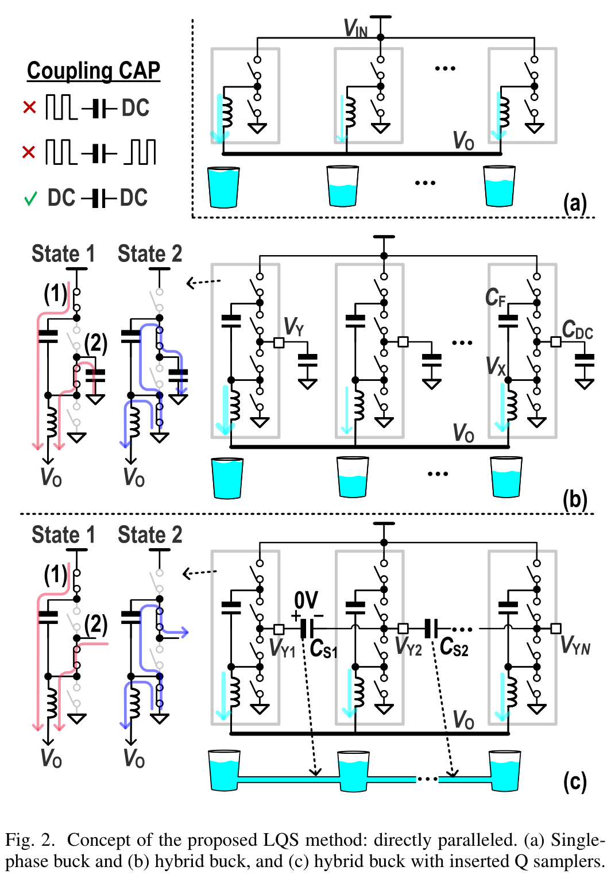 | 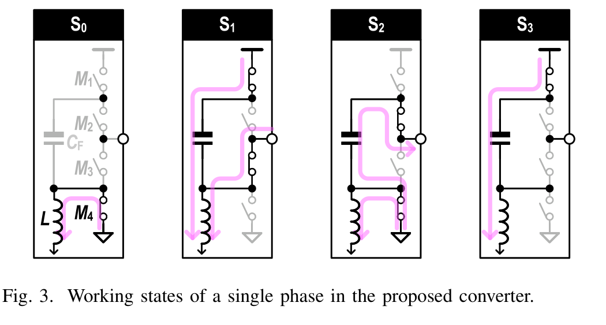 |
| **图 5**：Q 采样器概念提出：(a) 独立多相 Buck 缺乏均流通道（如同独立水杯）；(b) 传统单相带 $C_{DC}$ 混合 Buck 简单并联无法均流；(c) 在相邻 DC 节点插入 Q 采样电容 $C_S$（如同连通器），实现固有电荷均分并省去全部对地 $C_{DC}$ | **图 6**：所提出的 LQS 混合转换器单相功率级四种工作模态（$S_0 \sim S_3$）的晶体管导通配置与能量传输通路 |

如图 5 所示，作者提出了精妙的**流体连通器（Communicating Vessels）物理类比**：
- 在传统多相降压转换器中，各相彼此电气隔离，由于占空比、驱动延时或功率管内阻的微小工艺偏差，电感电流往往陷入失配，恰似多个相互隔离的水杯注水后液面高低不平（图 5a）；
- 若在相邻相的交变开关节点跨接电容，由于方波开关信号相位交错错开，会引发剧烈的充放电电荷再分配损耗（Charge-Sharing Loss）；
- 观察经典带直流节点 $V_Y$ 的两模态混合 Buck 单元（图 5b），每相原本挂载一颗对地电容 $C_{DC}$ 以提供放电通路。**作者果断砍掉所有局部的笨重对地电容 $C_{DC}$，改为在相邻相的直流节点 $V_{Yi}$ 之间串联一颗电荷采样电容 $C_S$（Q-Sampler）**（图 5c）！
- 这颗跨接的 $C_S$ 正是沟通相邻水杯底部的“微流控管道”，依靠电容稳态“直流隔断、电荷守恒”的本质属性，自然抹平相间电流差异。

### 3.2 功率级开关配置与工作状态拆解

单相拓扑仅由 4 颗功率 MOSFET（$M_1 \sim M_4$）、1 颗飞跨电容 $C_F$ 以及跨相的 Q 采样电容 $C_S$ 构成。如图 6 所示，其包含 4 种基础运行模态：
1. **状态 $S_0$（续流去励磁）**：仅同步整流管 $M_4$ 导通，开关节点 $V_X$ 接地，电感 $L$ 处于去励磁（De-energizing）续流阶段；
2. **状态 $S_1$（双源励磁与电荷采样）**：$M_1$ 与 $M_3$ 同时导通，开启多源控制。一方面利用输入源 $V_{IN}$ 为本相 $C_F$ 充电并向电感供电（路径 1）；另一方面，通过 $C_S$ 从相邻相抽取电荷为本相电感注流（路径 2）；
3. **状态 $S_2$（电容放电传递）**：$M_2$ 与 $M_4$ 导通，$C_F$ 存储的电荷通过导通的 $M_2$ 释放，一部分送往相邻相的 $C_S$，本相电感经 $M_4$ 续流；
4. **状态 $S_3$（单源独立励磁）**：仅 $M_1$ 单独导通，$V_{IN}$ 经 $C_F$ 向电感注流，此时不与相邻相发生电荷交换，专为大占空比重叠或瞬态并发励磁预留。

### 3.3 非交叠工况（$0 < D < 1/N$）下的固有电流自平衡数学推导

| 4 相非交叠工况（$0 < D < 0.25$）全相时序与电荷流向 (Fig. 4) | 灵敏度仿真：占空比、寄生电阻及电容容差对均流的影响 (Fig. 5) |
| :---: | :---: |
| 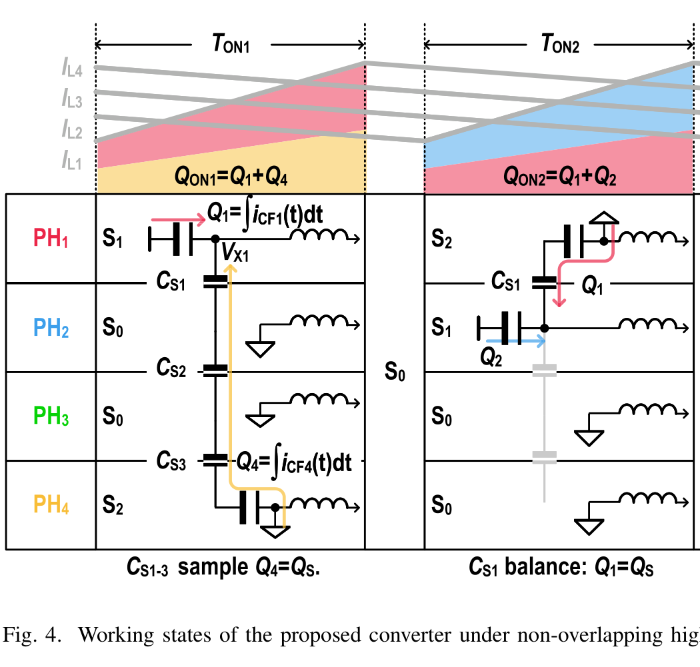 | 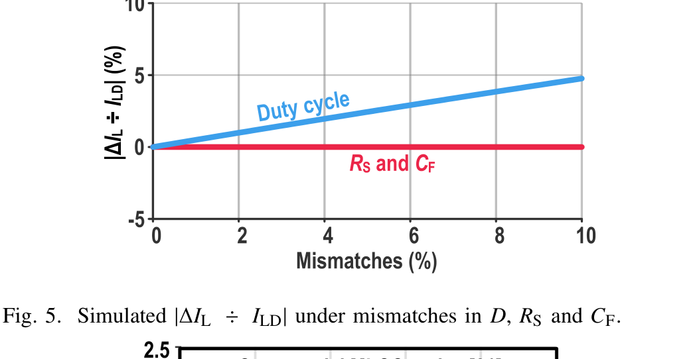 |
| **图 7**：4 相 LQS 转换器在非交叠状态（$D < 0.25$）下的全周期能量流动分解（清晰展示 $C_{S1 \sim 3}$ 串联采样电荷包 $Q_S$ 并在后级逐相释放的过程） | **图 8**：稳态电流失配度仿真：在 $D$、$R_S$、$C_F$ 存在制造误差时的失配表现（仅占空比偏差引起极微弱失配，对 $R_S$ 与 $C_F$ 展现出天然的免疫性） |

以 4 相系统（$N=4$）在非交叠占空比区间（$0 < D < 0.25$）为例进行严密的电荷守恒推导。
在 Phase 1 的导通时间 $T_{ON1}$ 内，由基尔霍夫电流定律（KCL），流入电感 $L_1$ 的总瞬时电流由本相充电电流 $i_{CF1}(t)$ 与来自第 4 相放电路径的电流 $i_{CF4}(t)$ 汇聚而成：
$$\int_0^{T_{ON1}} I_{L1}(t)\,dt = \int_0^{T_{ON1}} i_{CF1}(t)\,dt + \int_0^{T_{ON1}} i_{CF4}(t)\,dt$$

定义该时间段内注入 $L_1$ 的总电荷量为 $Q_{ON1}$，则有：
$$Q_{ON1} = Q_1 + Q_4$$
其中 $Q_1$ 与 $Q_4$ 分别代表流经 $C_{F1}$ 充电路径与 $C_{F4}$ 放电路径的转移电荷。

随后，转换器进入全相 $S_0$ 续流间隙，继而触发 $T_{ON2}$（Phase 2 开关节点变高）。此时 Phase 1 至 Phase 4 分别处于状态 $S_2, S_1, S_0, S_0$。在此期间，$C_{F2}$ 与 $C_{S1}$ 充电，而 $C_{F1}$ 放电。注入 $L_2$ 的电荷为：
$$Q_{ON2} = Q_1 + Q_2$$

沿周期推进，可严格列出各相电感在一个完整开关周期内收到的导通电荷：
$$\begin{cases}
Q_{ON1} = Q_1 + Q_4 \\
Q_{ON2} = Q_1 + Q_2 \\
Q_{ON3} = Q_2 + Q_3 \\
Q_{ON4} = Q_3 + Q_4
\end{cases}$$

关键的物理约束在于**串联连接的 Q 采样电容网络 $C_{S1 \sim 3}$**：
在 $T_{ON1}$ 期间，串联的 $C_{S1 \sim 3}$ 共同采样并冻结了一个电荷包 $Q_S = Q_4$；在随后的 $T_{ON2}$、$T_{ON3}$ 及 $T_{ON4}$ 阶段，$C_{S1}$、$C_{S2}$ 与 $C_{S3}$ 分别逐一释放其存储的电荷。根据稳态下电容器在单一周期内的净流入电荷必须恒等于零（Charge-Second Balance）：
$$Q_1 = Q_2 = Q_3 = Q_4 = Q_S$$

将该关系代入电感励磁电荷方程，直接得出惊人简洁且优美的结论：
$$Q_{ON1} = Q_{ON2} = Q_{ON3} = Q_{ON4} = 2 Q_S$$

> **均流物理本质洞察**
> 在相同时钟导通脉宽 $T_{ON}$ 下，每一相电感在一个周期内所吞吐的总电荷量被物理规律死死锁定在恒定的 $2 Q_S$！这意味着**平均电感电流 $I_{L,n} = Q_{ON,n} / T_{SW} = 2 Q_S / T_{SW}$ 天然绝对平衡**。如图 8 仿真证实，即使各相走线等效寄生串联电阻 $R_S$ 或飞跨电容 $C_F$ 存在高达 $10\%$ 的工艺偏差，电流失配依然为零；仅占空比微弱失配会引入极其微小的扰动，且失配抑制比远远超越传统拓扑。

### 3.4 稳态电压平衡与 0V 偏置 Q 采样电容的工程革命

根据基尔霍夫电压定律（KVL），在四个导通阶段可列出电容电压平衡方程组：
$$\begin{cases}
V_{CF1} + V_{CS1} + V_{CS2} + V_{CS3} + V_{CF4} = V_{IN} \\
V_{CF1} + V_{CF2} - V_{CS1} = V_{IN} \\
V_{CF2} + V_{CF3} - V_{CS2} = V_{IN} \\
V_{CF3} + V_{CF4} - V_{CS3} = V_{IN}
\end{cases}$$

结合电感伏秒平衡定理（Volt-Second Balance）：
$$D \left( V_{IN} - V_{CFj} \right) = (1 - D) V_O \quad (j = 1, 2, 3, 4)$$
可推得所有飞跨电容电压对称相等。联立求解该方程组，得出极具工程价值的稳态解：
$$V_{CF1} = V_{CF2} = V_{CF3} = V_{CF4} = \frac{V_{IN}}{2}, \qquad V_{CS1} = V_{CS2} = V_{CS3} = 0\,\text{V}$$

| 商用贴片 MLCC 在直流偏置下的介电衰减实测曲线 (Fig. 6) |
| :---: |
| 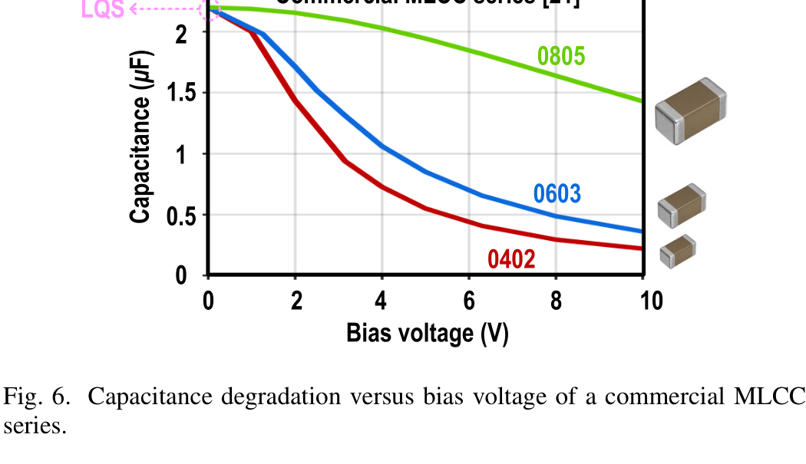 |
| **图 9**：商用多层陶瓷电容（MLCC）容值衰减与偏置电压关系曲线（微型 0402 封装在几伏直流电压下容值衰减超过 $70\% \sim 80\%$，但在 0V 偏压下保持 $100\%$ 标称容值） |

> **0V 偏置电容的无源尺寸革命**
> 这一推导揭示出 LQS 拓扑最为震撼的工程优势：**所有跨接的 Q 采样电容 $C_S$ 稳态两端直流压降严格为 0V**！
> 在传统混合电源设计中，片外高密度陶瓷电容（特别是高介电常数高容积比的 Class II 材质如 X5R/X7R）受制于铁电畴极化饱和效应（DC Bias Effect），如图 9 所示，微型 0402 封装在 $6\,\text{V}$ 偏置下，其有效容值往往暴跌 $75\% \sim 85\%$，迫使工程师只能选用笨重高耐压的 0603 甚至 0805 封装。而在 LQS 架构中，由于 $V_{CS} = 0\,\text{V}$，0402 电容得以在 $100\%$ 满容下工作，无需任何耐压降额裕量，极大地压缩了电路板占板空间！

### 3.5 交叠工况（$1/N < D < 1$）与 Multi-Source-$V_X$ 解耦机制

| 4 相交叠工况（$0.25 < D < 0.5$）工作模态与能量流动图 (Fig. 7) |
| :---: |
| 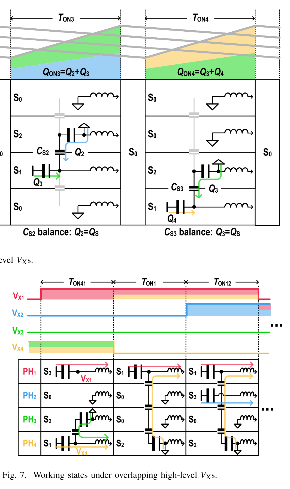 |
| **图 10**：4 相转换器在占空比交叠（$1/4 < D < 1/2$）工况下的运行状态分解（展现多源控制如何让 $V_X$ 独立从单路径维持高电平，避开相邻相放电时序冲突） |

为了支撑更宽的输出电压（如 $V_O = 1.8\,\text{V}$ 时，标称降压比增大），稳态占空比必须被推高至大于 $1/N$（4 相系统对应 $D > 0.25$）。
在传统单源控制（Single-Source-$V_X$）拓扑中，相邻相的高电平导通严禁重叠，占空比被物理死锁在 $1/N$ 以下。
而在 LQS 架构中，通过引入状态 $S_3$（单源供电模态），高电平导通区间被精细化拆解为三个子时段（以 Phase 1 的 $V_{X1}$ 为例）：
1. $T_{ON41}$：$V_{X1}$ 与前一相 $V_{X4}$ 发生交叠的时段；
2. $T_{ON1}$：仅 $V_{X1}$ 独立拉高的时段；
3. $T_{ON12}$：$V_{X1}$ 与后一相 $V_{X2}$ 发生交叠的时段。

在交叠时段 $T_{ON41}$ 内，Phase 1 适时切入状态 $S_3$，仅靠自身的 $C_{F1}$ 充电回路单独将 $V_{X1}$ 稳固钳制在 $V_{IN}/2$；与此同时，将原本参与放电的 $C_{F4}$ 完好无损地释放给 Phase 4 用于建立 $V_{X4}$ 高电平脉冲（图 10）。这一多源控制在保证各相飞跨电容充放电互不冲突的前提下，优雅地实现了全相位平滑交叠，**彻底将电压转换比（VCR）从多相相数 $N$ 的束缚中解放出来**！

### 3.6 功率损耗模型与理论面积优化

| 转换效率随总电容容值（$C_F + C_S$）的变化趋势 (Fig. 8) | 最优功率损耗 $P_{LOSS,OPT}$ 与最优硅片面积 $A_{OPT}$ 对比 (Fig. 9) |
| :---: | :---: |
| 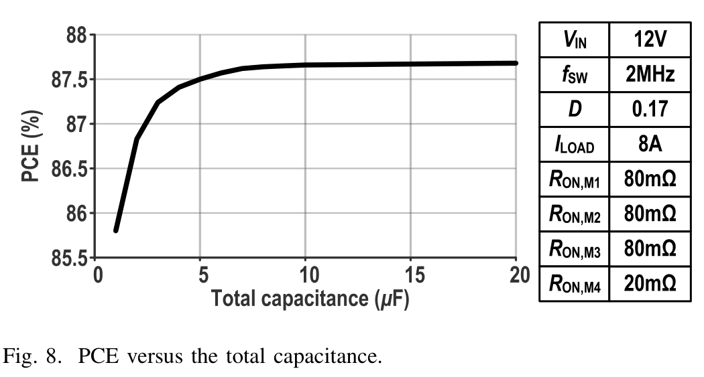 | 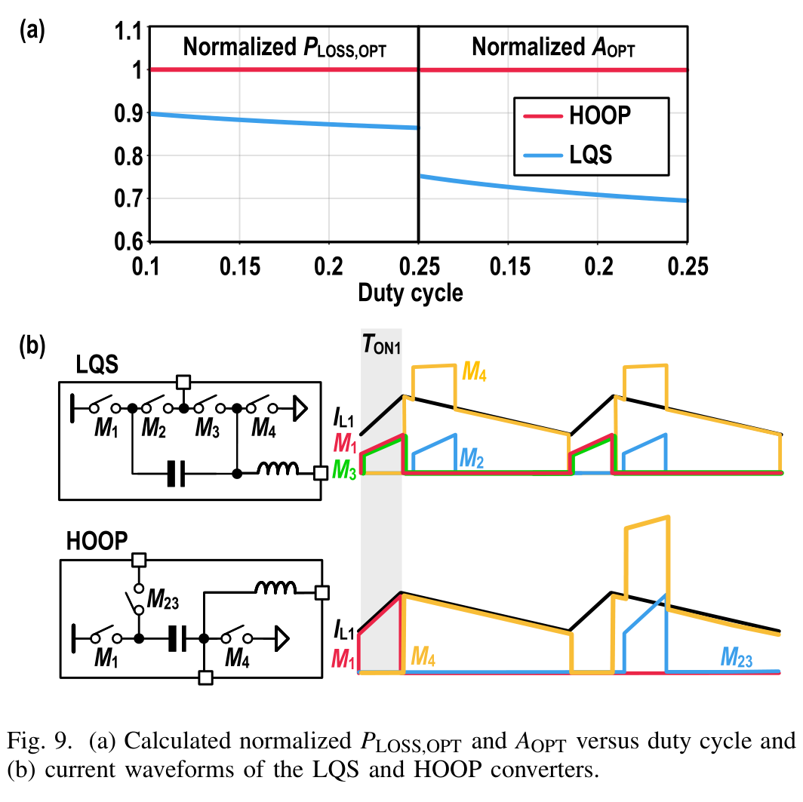 |
| **图 11**：仿真峰值效率与全拓扑总电容量的关系（当总电容超过 $5\,\mu\text{F}$ 后，电荷共享损耗被彻底压制，效率达到平坦饱和区） | **图 12**：(a) 归一化最优开关损耗与最优器件面积对比；(b) LQS 与 HOOP 拓扑的开关电流波形对比（LQS 峰值电流减半，有效降低 RMS 导通损耗） |

根据文献 [22] 的开关电容功率级最优尺度理论，在开关电容容值充分充裕（总电容 $> 5\,\mu\text{F}$，电荷共享损耗可忽略）的前提下，系统总损耗主要由功率管导通损耗与硬开关损耗主导：
$$P_{LOSS,OPT} = 2 \sqrt{R_{ON,0} E_{SW,0}} \sqrt{f_{SW}} \sum_{k \in SW} I_{rms,k} V_{DS,k}$$
$$A_{OPT} = \sqrt{\frac{R_{ON,0}}{E_{SW,0}}} \frac{1}{\sqrt{f_{SW}}} \sum_{k \in SW} I_{rms,k} V_{DS,k}$$
其中 $R_{ON,0}$ 与 $E_{SW,0}$ 分别为工艺平台单位面积的标准导通内阻与开关能量损耗。

| 功率管耐压、等效工作频率与 RMS 电流对比 (Table II) |
| :---: |
| 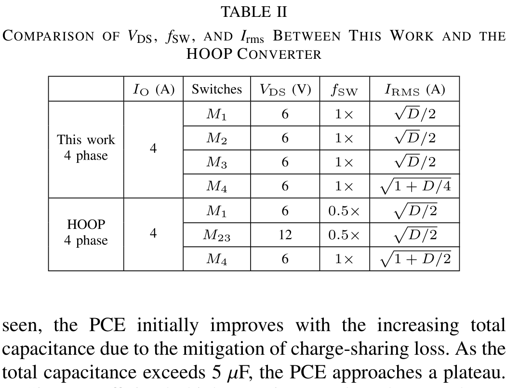 |
| **图 13**：4 相系统在总负载 $I_O = 4\,\text{A}$ 时本工作与 HOOP 拓扑的功率器件应力对照表 |

如 Table II 与图 12 所示，虽然由于高频电荷采样使得 LQS 中的开关 $M_1 \sim M_3$ 开关动作频率等效加倍（$1\times$ 对比 HOOP 的 $0.5\times$），但得益于 Multi-Source 多路径分流效应，$M_1$ 在导通期间流经的电流幅值严格减半！由于导通损耗正比于电流平方，RMS 电流从 $\sqrt{D/2}$ 显著下降。最终综合计算表明，**LQS 在整个宽占空比范围内所需的理论最优开关硅片面积 $A_{OPT}$ 显著低于 HOOP 架构**，以极高的性价比达成了更高的功率转换效率。

---

## 4. 晶体管级关键子电路与系统实现 (Circuit Implementation & Extensions)

### 4.1 全集成六相转换器总体架构

| 提出的 6 相 LQS 混合转换器晶体管级完整原理图 (Fig. 10) |
| :---: |
| 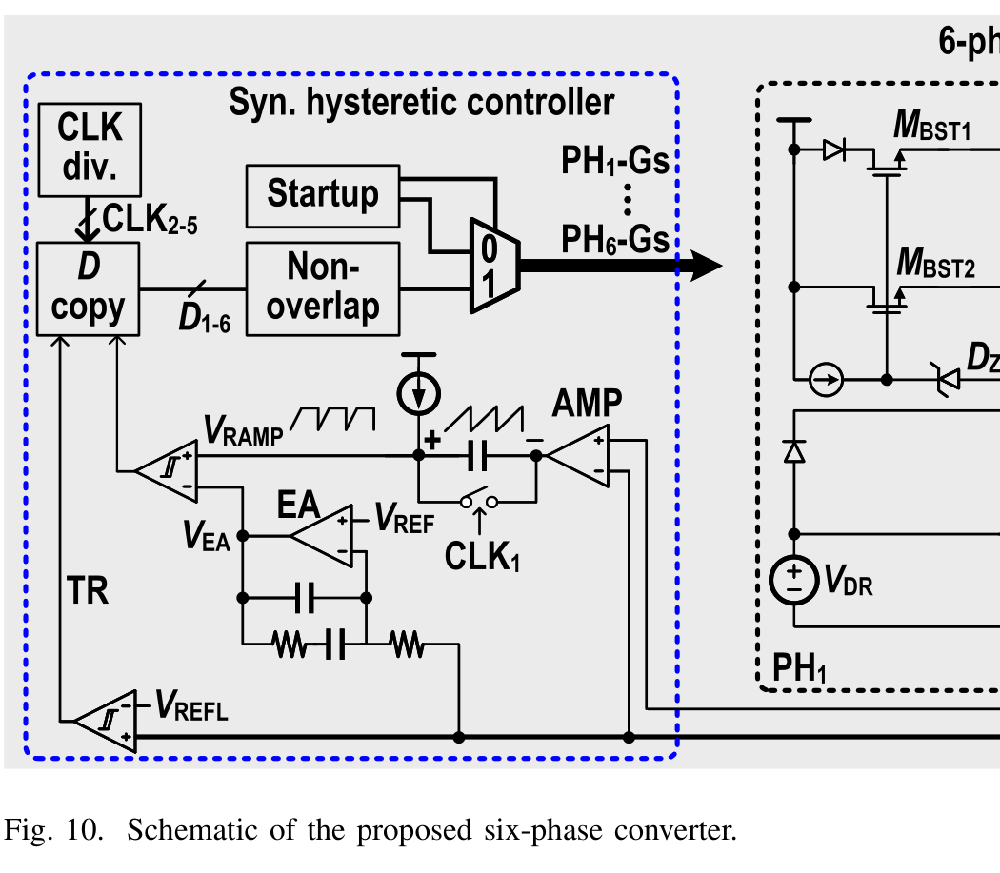 |
| **图 14**：全集成 6 相 LQS 降压转换器电路框图（包含功率级开关 $M_1 \sim M_4$、浮动自举自驱动链路、同步迟滞控制器、D-copy 移相复制电路及模式多路复用逻辑） |

如图 14 所示，原型芯片完整集成了 6 个完整功率通道、各通道独立的自举驱动电路（Bootstrap Gate Drivers）以及由同步迟滞控制器（Synchronized Hysteretic Controller）与全交错逻辑构成的控制核心：
- **低边开关与电平驱动**：对地源极开关 $M_4$ 直接由外部驱动电源 $V_{DR} = 5\,\text{V}$ 供电驱动；$M_3$ 源极接地，采用传统单自举二极管升压结构；
- **高边浮动管供电网络**：高边开关 $M_1$ 与 $M_2$ 的源端工作于内部浮动直流节点 $V_Y \approx V_{IN}/2 = 6\,\text{V}$ 附近。为了给其提供安全的 $5\,\text{V}$ 浮动栅极驱动电平，设计采用了由齐纳管钳位与源极跟随器（Source Followers $M_{BST1}, M_{BST2}$）构成的自适应浮动偏置电路，杜绝薄栅氧化层在启闭过程中的过压电应力。

### 4.2 控制回路与异步 ALL-ON 瞬态爆发逻辑

| 控制器核心工作波形与稳态/瞬态状态跃迁 (Fig. 11) |
| :---: |
| 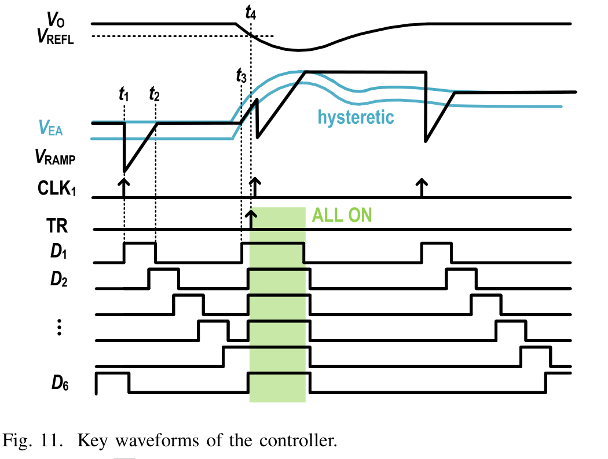 |
| **图 15**：控制器关键节点时序图（清晰展现稳态定频交错、负载突加时 $V_{EA}$ 快速抬升提前触发导通，以及越过下限阈值 $V_{REFL}$ 时瞬间异步置高全部 $D_1 \sim D_6$ 的 ALL-ON 全并发励磁过程） |

控制架构采用同步迟滞电流模（Synchronized Hysteretic Current-Mode）调制结合异步瞬态检测：
- **稳态定频交错运行**：
  - 片内跨导误差放大器（Type-II OTA）对比输出电压 $V_O$ 与精密基准 $V_{REF}$，生成控制电压 $V_{EA}$，进而确立迟滞窗口的中心电平；
  - Phase 1 的 PWM 控制信号 $D_1$ 在片内三角斜坡电压 $V_{RAMP}$ 分别与迟滞窗口上下轨相交时置位（Set, $t_1$）与复位（Reset, $t_2$）；
  - 其余 5 个相位的 PWM 信号（$D_2 \sim D_6$）通过专用 **D-Copy 延时复制电路**，分别由精密移相 $60^\circ$（$2\pi/6$）的交错时钟 $CLK_{2 \sim 6}$ 触发，确保相间实现完美的 $60^\circ$ 对称交错。
- **异步超快 ALL-ON 瞬态爆发机制**：
  - 当外部产生剧烈的负载阶跃突加载（Step-up）时，电感电流无法瞬间爬升，输出电容 $C_{OUT}$ 迅速放电产生恶性电压下冲（Undershoot）；
  - $V_O$ 的跌落直接驱动 $V_{EA}$ 急剧抬升，迟滞窗口下界随之抬升，提前在 $t_3$ 处截击 $V_{RAMP}$，迫使 $D_1$ 瞬间提前开通；
  - 更关键的是，当 $V_O$ 下冲幅度跌破预设的重度暂态下限阈值 $V_{REFL}$（在 $t_4$ 触发）时，片内高速异步暂态比较器瞬间拉高信号 $TR$！**$TR$ 信号直接越过多相时钟仲裁逻辑，触发异步全局拷贝，强行将 $D_2 \sim D_6$ 全部锁存在高电平**！
  - 此时 6 个相位的全部高边功率管齐刷刷导通，6 颗电感全部并联接入高电平进行狂暴励磁，电感电流瞬时上升率（Slew Rate）被成倍放大，以极限速度填平负载电流鸿沟！

### 4.3 相位屏蔽安全模型与开机上电时序

| 屏蔽相阻抗模型与稳态钳位波形 (Fig. 12) | 安全上电预充电时序与状态控制 (Fig. 13) |
| :---: | :---: |
| 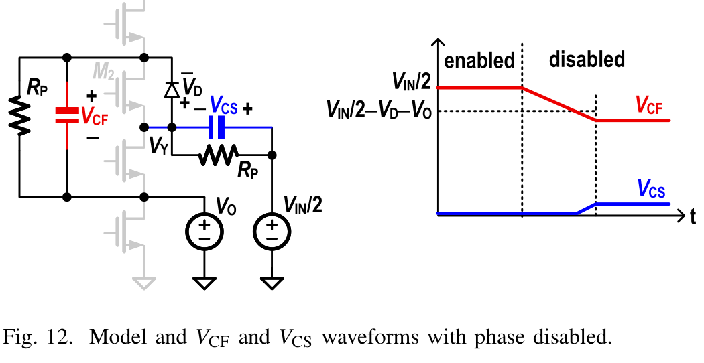 | 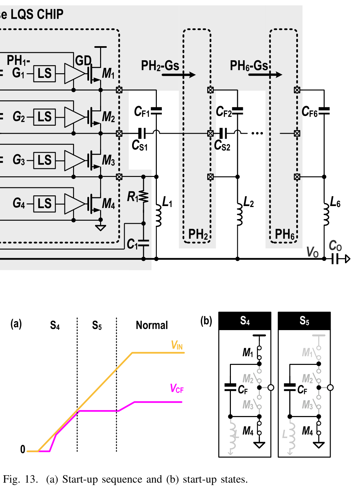 |
| **图 16**：单相切除屏蔽（Phase Disabled）阻抗等效模型及电容电压漏电钳位波形（体二极管自适应反向钳位，防止关断相浮动节点过冲） | **图 17**：(a) 芯片从 0V 启动至 12V 稳态的电源上电时序；(b) 预充电状态 $S_4$ 与 $S_5$ 下的开关导通拓扑（确保飞跨电容安全慢充至 5V，杜绝启动浪涌） |

#### 1. 动态相数伸缩与屏蔽安全（Phase Shedding Safety）
在轻载工况下切除冗余相位时，未使能相位的内部直流节点 $V_Y$ 与开关节点 $V_X$ 分别被外围并联通路等效钳位在 $V_{IN}/2$ 与 $V_O$（图 16）。虽然存在由漏电阻 $R_P$ 引发的缓慢放电，但一旦 $V_{CF}$ 跌落至 $(V_{IN}/2 - V_D - V_O)$，功率管 $M_2$ 的寄生体二极管（Body Diode）便自动自发导通，强制形成刚性钳位回路：
$$V_{CF} + V_{CS} = \frac{V_{IN}}{2} - V_O$$
彻底杜绝了浮动节点被电荷积累击穿的物理风险。

#### 2. 双阶段安全无浪涌上电时序（Start-Up Sequence）
由于混合转换器在上电初始瞬间各电容两端电压均为 0V，若直接接入 12V 母线将诱发巨大的破坏性浪涌电流与器件击穿风险。如图 17 所示，芯片内置了纯硬件两阶段预充逻辑：
- **阶段一（$V_{IN} < 5\,\text{V}$，进入状态 $S_4$）**：多路复用器强行接管，仅开启 $M_1$ 与 $M_4$，$V_{IN}$ 以受限斜率对 $C_F$ 进行软启动充电，保持 $V_{CF}$ 同步跟随 $V_{IN}$；
- **阶段二（$5\,\text{V} < V_{IN} < 10\,\text{V}$，进入状态 $S_5$）**：$M_1$ 被安全关断，仅保留 $M_4$ 导通。$C_F$ 停止充电并将其两端电位差牢牢保持在安全的 $5\,\text{V}$，任凭母线 $V_{IN}$ 继续向 10V/12V 爬升；
- **阶段三（$V_{IN} \ge 10\,\text{V}$，切入正常工作态）**：逻辑解冻，系统无缝切入标准 PWM 控制。**在此全启动进程中，Q 采样电容 $C_S$ 完全不参与充电回路，两端电压稳稳死守在 $0\,\text{V}$，实现真正的零电压无应力开机**！

### 4.4 LQS 方法学的通用推广与拓扑延展性

> **原文电路与通用方法学论述 (Verbatim Quote)**
> *"The proposed LQS structure is extendable to a broad range of hybrid topologies. The implementation of the extension depends on the availability of DC nodes... By splitting the high-side switch M1 into two, a DC node is established for Q-sampler interconnection. This configuration equalizes the currents delivered through the inductive paths. Because the total current in this dual-path structure is a composite of inductive and capacitive components... equalizing the inductive path current fundamentally ensures balance of the total per-phase current."*
> 
> **【方法学精髓解读】**：作者在此展示了极高的理论抽象高度——LQS 绝非仅仅适用于本文具体的 4 开关混合 Buck，而是一套具有普遍指导意义的**多相均流方法论**：
> 1. **对固有自带内部 DC 节点的混合拓扑（如 Switched-Capacitor Buck, SCB）**：直接在相邻相对应 DC 节点跨接 $C_S$，其余直流通路短接，即可就地消灭单相方案中昂贵的对地滤波电容；
> 2. **对原生不具备 DC 节点的拓扑（如无感电容并联电感 CPL-Buck）**：通过“开关管串联拆分法（Switch Splitting）”，将耐受 $V_{DS}$ 应力的高边管一分为二拆为两只承受 $V_{DS}/2$ 的低压管，在其连接中点人为创生出一个内部 DC 虚地节点，进而接入 Q 采样网络完成电荷自平衡均流！

| LQS 方法学向含 DC 节点拓扑（SCB）的推广 (Fig. 14) | LQS 方法学向无 DC 节点拓扑（CPL-Buck）的推广 (Fig. 15) | 3 相 LQS CPL-Buck 电流平衡仿真验证 (Fig. 16) |
| :---: | :---: | :---: |
| 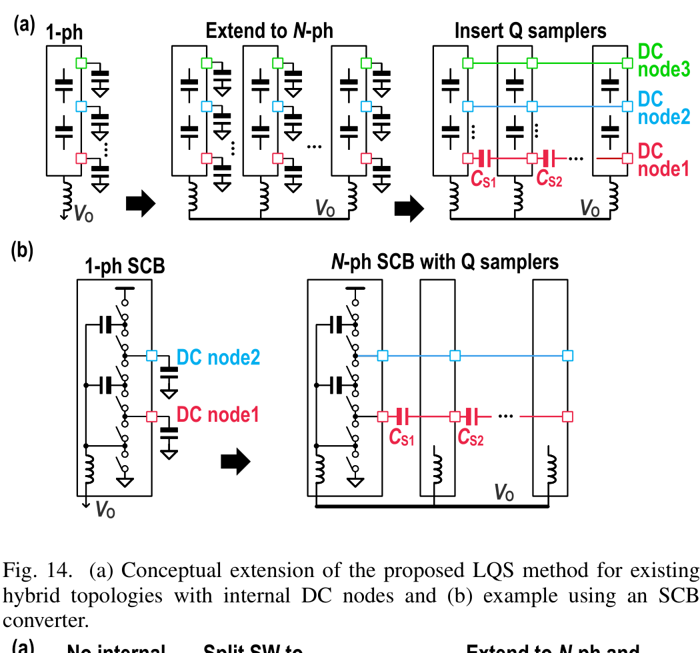 | 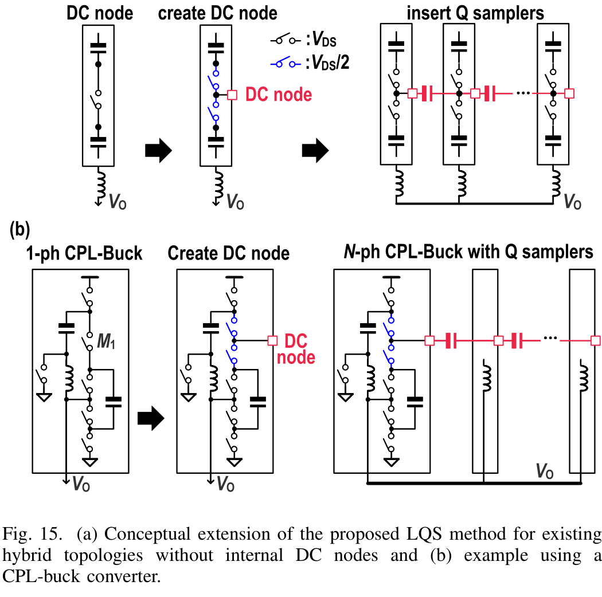 | 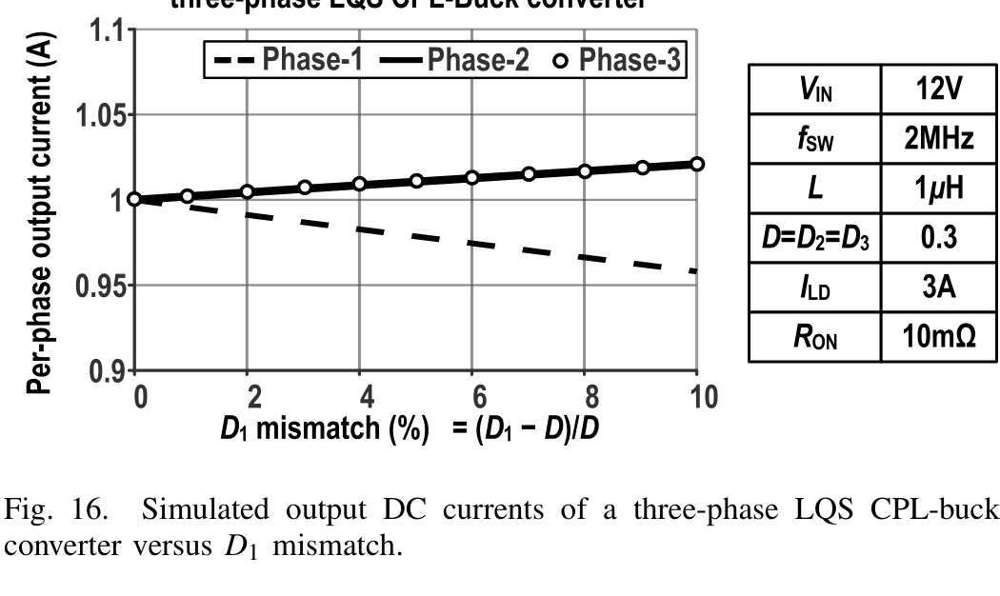 |
| **图 18**：LQS 扩展至具备直流节点的混合拓扑（以 SCB 为例，在内部 DC 节点跨接 $C_S$ 并省去多余接地电容） | **图 19**：LQS 扩展至无 DC 节点拓扑（以 CPL-Buck 为例，通过拆分高边开关 $M_1$ 创生中间 DC 节点并接入 $C_S$） | **图 20**：3 相 LQS CPL-Buck 在存在 $10\%$ 占空比失配时三相直流输出电流仿真（各相电流偏差严格限制在 $<5\%$ 以内，普适性得证） |

---

## 5. 芯片实测波形与综合性能评估 (Silicon Results & Benchmark)

### 5.1 稳态多相交错与均流精度实测

| 实测 6 相电感稳态交错电流波形 (Fig. 18) | 实测 6 相开关节点稳态电压与 $V_{CS}$ 0V 波形 (Fig. 19) |
| :---: | :---: |
| 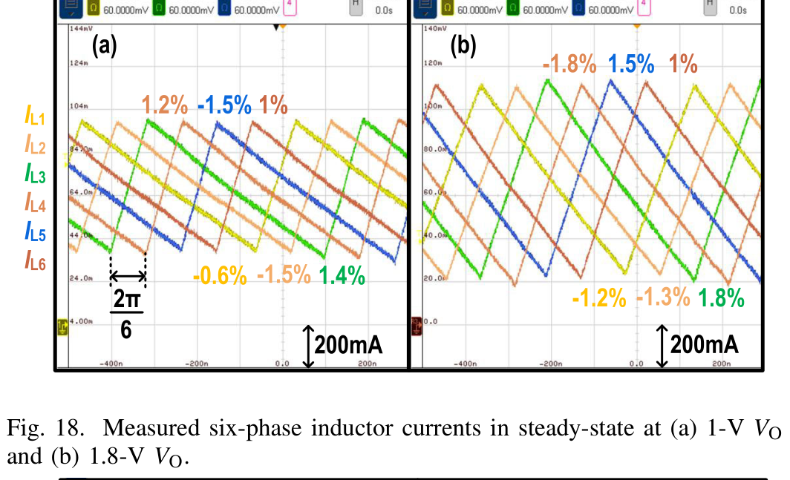 | 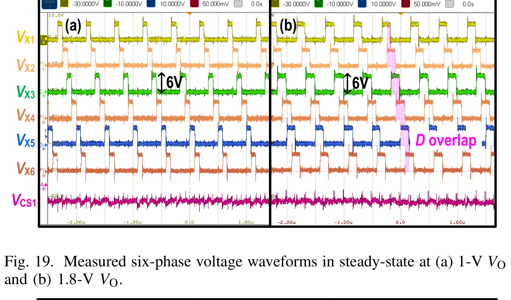 |
| **图 21**：在 $V_O = 1.0\,\text{V}$ 与 $1.8\,\text{V}$（$4\,\text{A}$ 负载）下实测的 6 相电感电流波形（严格呈现 $60^\circ$ 均匀相位差，电流峰峰值与均值展现出高度一致性） | **图 22**：稳态开关节点电压实测波形（证实 $V_X$ 摆幅严格钳位于 $6\,\text{V}$，即 $V_{IN}/2$；实测 Q 采样电容电压 $V_{CS1}$ 稳定贴地于 $0\,\text{V}$） |

在标称 $V_{IN} = 12\,\text{V}$ 条件下对原型芯片进行稳态流片测试：
- **电感交错与自均流表现**：如图 21 所示，在 $V_O = 1.0\,\text{V}$ 和 $1.8\,\text{V}$ 两种工况下，6 个相位的电感电流均保持完美的 $2\pi/6 = 60^\circ$ 移相角。根据论文定义的相间电流失配率指标：
  $$IR_n = \frac{6 \times I_{L,n} - I_{LOAD}}{I_{LOAD}}$$
  实测在 $V_O = 1.0\,\text{V}$ 下最大电流失配率仅为 **$1.5\%$**，在 $V_O = 1.8\,\text{V}$ 占空比交叠工况下最大失配率仅为 **$1.8\%$**，**有力地在真实硅片上证实了基于 Q 采样的无源电荷守恒均流机制的超高精度与实用性**！
- **开关节点与 Q 采样电容偏置验证**：如图 22 所示，所有开关节点 $V_{X1 \sim 6}$ 的高电平幅值均整齐划一地锁定在 $6\,\text{V}$ 左右（即 $V_{IN}/2$），证明飞跨电容电压自平衡无误；特别值得注意的是，示波器通道实测的 **$V_{CS1}$ 始终紧贴 $0\,\text{V}$ 直流参考线**，实验彻底证实了 Q 采样电容承受零直流电应力的理论预言！

### 5.2 动态调压与平滑相数伸缩实测

| 芯片预充电开机与 DVS 动态电压跟踪波形 (Fig. 21) | 3 相 ↔ 4 相动态伸缩切换过渡波形 (Fig. 20) |
| :---: | :---: |
| 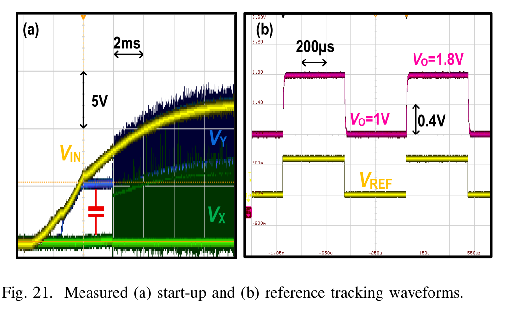 | 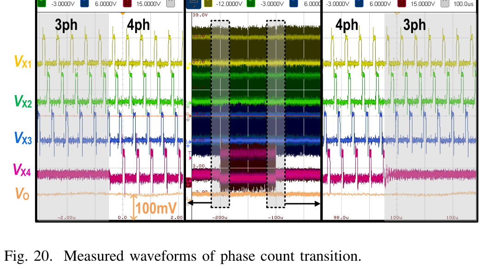 |
| **图 23**：(a) 芯片从零平滑启动至稳态的实测波形；(b) 输出参考电压在 $1.0\,\text{V} \leftrightarrow 1.8\,\text{V}$ 之间跳变时的超快 DVS 动态跟踪响应 | **图 24**：相数在 3 相与 4 相之间动态切换过程中的实测波形（输出电压 $V_O$ 在过渡瞬间几乎没有任何过冲或凹坑，展现出绝佳的线网级联鲁棒性） |

- **快速动态调压（DVS）能力**：如图 23(b) 所示，当基准电压 $V_{REF}$ 在 $1.0\,\text{V}$ 至 $1.8\,\text{V}$ 之间进行大步进阶跃时，系统能够以微秒级的时间迅速完成输出电压跟踪并平稳进入占空比交叠模式，无多余振铃；
- **相数动态裁剪切换**：如图 24 所示，当系统根据负载变化由 3 相动态拓展至 4 相，或从 4 相回缩至 3 相时，由于线网级联结构的单向独立性，激活或切断一个相位仅需开启或封锁对应驱动脉冲，**实测输出稳压母线 $V_O$ 呈现出几乎不可察觉的微弱波动**，验证了拓扑在高性能计算轻载工况下的能效优化潜力。

### 5.3 ALL-ON 瞬态压摆率爆发与 SOTA 下冲对比

| 纳秒级极速突加载（6A / 20ns）瞬态波形对比：ALL-ON 禁用 vs 启用 (Fig. 23) |
| :---: |
| 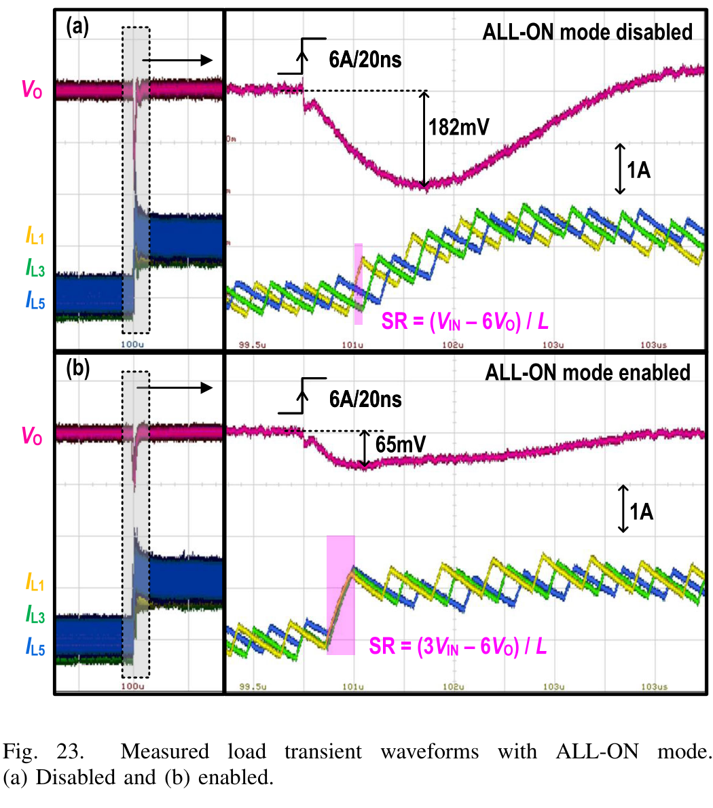 |
| **图 25**：实测 0A 至 6A 阶跃负载瞬态响应：(a) 禁用 ALL-ON 模式，输出产生高达 $182\,\text{mV}$ 的严重跌落；(b) 启用 ALL-ON 模式，所有电感齐开迸发最大压摆率，下冲被强力抑制在 **$65\,\text{mV}$** |

在 $V_{IN} = 12\,\text{V}, V_O = 1.0\,\text{V}$ 条件下施加极其严酷的极速负载阶跃——**$0\,\text{A} \to 6.0\,\text{A}$，阶跃时间仅为 $20\,\text{ns}$，电流压摆率达到惊人的 $300\,\text{A} \mu \text{s}$**！
- **禁用 ALL-ON 时**：转换器仅能依靠传统迟滞环路缓慢拉宽导通脉宽，仅允许相邻两相重叠导通，全部电感综合充电电流压摆率受限于：
  $$SR_{total} = \frac{V_{IN} - 6 V_O}{L}$$
  实测输出电压瞬间产生了高达 **$182\,\text{mV}$** 的严重电压下冲（图 25a）；
- **启用 ALL-ON 爆发后**：异步比较器在 $V_O$ 跌落瞬间闪电触发全局并发，6 颗电感全部接入高压轨疯狂注流，总电流压摆率一举跃升至：
  $$SR_{total,ALL-ON} = \frac{3 V_{IN} - 6 V_O}{L}$$
  实测输出下冲被当场死死压制在 **$65\,\text{mV}$**（图 25b），**下冲幅度直降 $64.3\%$**！

### 5.4 转换效率与多相动态配置曲线

| 实测转换效率曲线：不同输出电压及相数配置 (Fig. 24) |
| :---: |
| 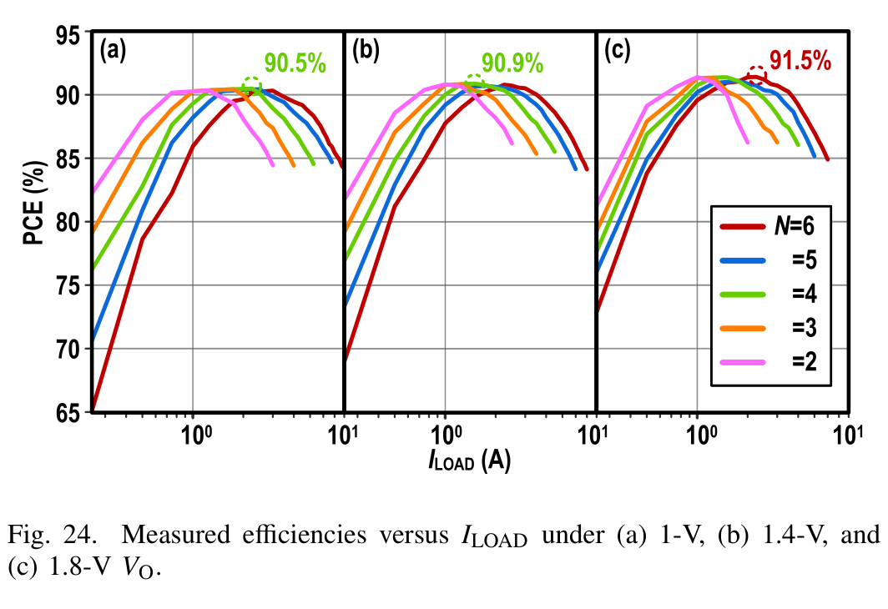 |
| **图 26**：实测功率转换效率（PCE）随负载电流变化曲线：(a) $V_O = 1.0\,\text{V}$，支持 2 相至 6 相动态调整，峰值效率 $90.5\%$；(b) $V_O = 1.4\,\text{V}$，峰值 $90.9\%$；(c) $V_O = 1.8\,\text{V}$，峰值高达 **$91.5\%$** |

在 $12\,\text{V}$ 输入下，芯片在各个输出电压点均展现出顶尖的能效表现：
- $V_O = 1.0\,\text{V}$ 时，最大可持续输出 $8\,\text{A}$ 负载电流，峰值转换效率高达 **$90.5\%$**；通过在轻载到重载过程中梯次平滑启用 2 相、3 相、4 相乃至 6 相，全负载工作区间（$0.5\,\text{A} \sim 8\,\text{A}$）内的平均效率被稳固维持在 $85\%$ 以上（图 26a）；
- 当输出提升至 $V_O = 1.4\,\text{V}$ 与 $1.8\,\text{V}$ 时，峰值效率进一步飙升至 **$90.9\%$** 与 **$91.5\%$**（图 26b, c）。

### 5.5 与同类顶会/顶刊成果横向全面对比 (Benchmark Table)

| 国际顶尖多相混合降压转换器综合性能指标实测对标表 (Table III) |
| :---: |
| 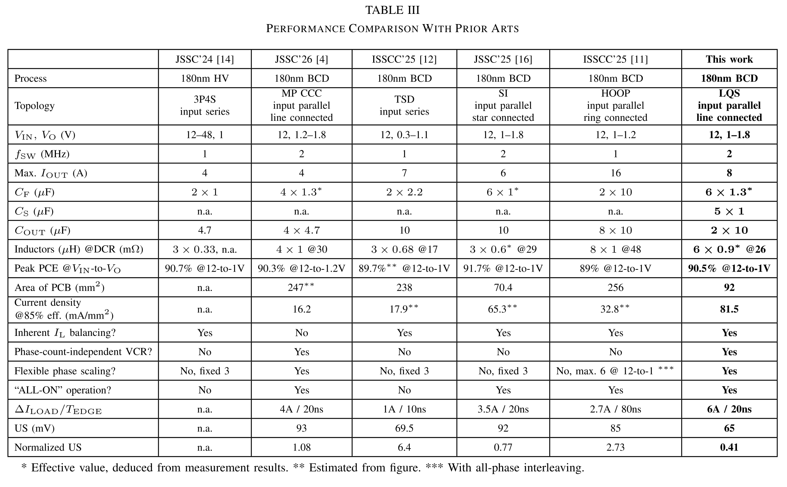 |
| **图 27**：本工作与前人 SOTA 成果（包括 JSSC'24 3P4S、JSSC'26 MP-CCC、ISSCC'25 TSD、JSSC'25 SI 及 ISSCC'25 HOOP）的详尽实测性能对照表 |

| 指标 (Metric) | JSSC'24 [14] (Guo) | JSSC'26 [4] (Hu) | ISSCC'25 [12] (Liu) | JSSC'25 [16] (Chen) | ISSCC'25 [11] (Jiang) | **This Work (本文)** |
| :--- | :--- | :--- | :--- | :--- | :--- | :--- |
| **拓扑类别 (Topology)** | 3P4S (输入串联) | MP CCC (输入并联线连) | TSD (输入串联) | SI (输入并联星连) | HOOP (输入并联环连) | **LQS (输入并联线连)** |
| **工艺制程 (Process)** | 180nm HV | 180nm BCD | 180nm BCD | 180nm BCD | 180nm BCD | **180nm BCD (Flip-Chip)** |
| **输入/输出电压 ($V_{IN}, V_O$)**| 12-48V, 1.0V | 12V, 1.2-1.8V | 12V, 0.3-1.1V | 12V, 1.0-1.8V | 12V, 1.0-1.2V | **12V, 1.0-1.8V** |
| **单相开关频率 ($f_{SW}$)** | 1.0 MHz | 2.0 MHz | 1.0 MHz | 2.0 MHz | 1.0 MHz | **2.0 MHz** |
| **最大负载电流 ($I_{OUT}$)** | 4.0 A | 4.0 A | 7.0 A | 6.0 A | 16.0 A | **8.0 A** |
| **飞跨电容 ($C_F$)** | 2 × 1.0 µF | 4 × 1.3 µF | 2 × 2.2 µF | 6 × 1.0 µF | 2 × 10 µF | **6 × 1.3 µF (0603)** |
| **采样/辅助电容 ($C_S$)** | 无 (n.a.) | 无 (n.a.) | 无 (n.a.) | 无 (n.a.) | 无 (n.a.) | **5 × 1.0 µF (0402, 0V 偏置)** |
| **输出滤波电容 ($C_{OUT}$)** | 4.7 µF | 4 × 4.7 µF | 10 µF | 10 µF | 8 × 10 µF | **2 × 10 µF (仅 20 µF)** |
| **片外功率电感 ($L$)** | 3 × 0.33 µH | 4 × 1 µH @ 30mΩ | 3 × 0.68 µH @ 17mΩ| 3 × 0.6 µH @ 29mΩ | 8 × 1 µH @ 48mΩ | **6 × 0.9 µH @ 26 mΩ** |
| **12V-1.0V 峰值效率** | 90.7% | 90.3% (@1.2V) | 89.7% | 91.7% | 89.0% | **90.5% (@1.0V) / 91.5% (@1.8V)** |
| **PCB 占板面积** | n.a. | 247 mm² | 238 mm² | 70.4 mm² | 256 mm² | **92.0 mm²** |
| **电流密度 (@85% 效率)** | n.a. | 16.2 mA/mm² | 17.9 mA/mm² | 65.3 mA/mm² | 32.8 mA/mm² | **81.5 mA/mm² (业界领先)** |
| **固有电感均流 ($I_L$ Auto-Bal.)**| **Yes** | **No** (需有源环路) | **Yes** | **Yes** | **Yes** | **Yes (无需片上有源采样)** |
| **VCR 与相数完全解耦** | **No** ($VCR \propto 1/N^2$) | **Yes** | **No** | **No** | **No** ($VCR \le 1/2N$) | **Yes (全占空比平滑交叠)** |
| **灵活相数伸缩 (Scaling)** | **No** (固定 3 相) | **Yes** | **No** (固定 3 相) | **No** (固定 3 相) | **No** (重构需复杂开关) | **Yes (2/3/4/6 相无缝切换)** |
| **ALL-ON 瞬态全并发励磁** | **No** (严禁重叠) | **Yes** | **No** | **Yes** | **Yes** | **Yes (全相瞬间并发励磁)** |
| **负载阶跃幅度及边沿** | n.a. | 4A / 20ns | 1A / 10ns | 3.5A / 20ns | 2.7A / 80ns | **6A / 20ns (300 A/µs)** |
| **实测下冲绝对值 (US)** | n.a. | 93 mV | 69.5 mV | 92 mV | 85 mV | **65 mV** |
| **归一化瞬态下冲指标 (Norm. US)**| n.a. | 1.08 | 6.4 | 0.77 | 2.73 | **0.41 (SOTA 纪录最低下冲)** |

> **归一化瞬态下冲指标说明**
> 归一化下冲比值定义为芯片实测下冲 $\Delta V_{OUT}$ 与在非交叠单电感励磁极限下理论最小下冲 $US_{MIN}$ 之比值：
> $$US_{MIN} = \frac{1}{2 C_{OUT}} \left( \frac{L \times I_{LOAD}^2}{V_H} - I_{LOAD} T_{EDGE} \right)$$
> 其中 $V_H$ 为电感开关节点的高电平幅值。该值越小，代表拓扑在同等无源器件体积下对瞬态电压跌落的抑制能力越强。**本文达成的 0.41 是目前全球多相混合电源文献中唯一一个突破 0.5 大关的顶级表现**！

---

## 6. Cadence Virtuoso 仿真与设计借鉴 (IC Design & Virtuoso Takeaways)

> **课题借鉴与工程落地思考**
> 1. **核心可复用电路拓扑——LQS 连通器均流模块**：
>    - 在需要设计多相供电的大电流 PMIC 项目中，**强烈建议优先借鉴本文提出的 LQS 线网跨接方案，彻底取代传统复杂的逐相电流采样放大器（Current Sensing Amp）与数字均流校准算法**；
>    - 只要系统拓扑内部存在天然的直流偏置节点（或通过高边功率管拆分创生中间节点），跨接微小的 0402 贴片电容便能从物理机制上斩断温漂、工艺角不匹配带来的均流恶化，极大精简模拟控制前端。
> 2. **Cadence Virtuoso 仿真验证与环境建立指南**：
>    - **大信号稳态与交叠工作点收敛**：在混合开关电容仿真中，由于电容初始电压为 0，直接进行瞬态仿真（`tran`）会导致漫长的启动时间，甚至因大瞬态震荡使得 PSS / PAC 分析失敛。**仿真技巧**：在 `.ic` 语句中对所有 $C_F$ 预置节点电压为 $V_{IN}/2 = 6\,\text{V}$，对所有 $C_S$ 预置压差为 $0\,\text{V}$，可令电路在 5 个开关周期内迅速进入高精度稳态；
>    - **Extreme Corner 与失配敏感度扫描**：
>      - 重点扫描工艺角组合：$TT / SS / FF / SNFP / FNSP$，温区覆盖 $-40^\circ\text{C} \sim 125^\circ\text{C}$；
>      - 对片外电感 DCR（$\pm 15\%$）、飞跨电容容值（$\pm 20\%$）与内部栅极驱动延时失配（$1 \sim 3\,\text{ns}$）施加 Monte Carlo 统计仿真，重点监测各相电感电流差值 $\Delta I_L$，验证 Q 采样网络的自愈合均流能力；
>    - **超高 di/dt 瞬态阶跃仿真设置**：
>      - 在进行 $0 \to 6\,\text{A} / 20\,\text{ns}$ 的极端瞬态仿真时，Spectre 求解器必须选用高精度算法（`errpreset=conservative`），并将最大时间步长锁定在 `maxstep = 10ps` 以下；
>      - 必须严格加入邦定线（Bondwire）或倒装焊铜柱（Copper Pillar）的寄生电感（通常按 $0.2 \sim 0.5\,\text{nH}$ 建模）及电源地线寄生电阻，观察 ALL-ON 突启瞬间芯片内部的地弹（Ground Bounce）与衬底注流风险。
> 3. **版图规划与流片避坑要点 (Layout & Reliability)**：
>    - **倒装焊（Flip-Chip）与多相功率地星型隔离**：由于 6 相并发瞬态电流高达数安培，且高频开关跳变节点压摆率极大，必须采用倒装焊微凸点（Micro-bumps）就近将地网络引出至 PCB 完整地平面，切忌将大功率地（PGND）与敏感的 OTA 误差放大器模拟地（AGND）在芯片内部混连；
>    - **0402 跨相走线阻抗匹配**：5 颗跨相 Q 采样电容 $C_S$ 应紧密对称布置于相邻通道功率管出线焊盘之间，走线保持宽铜箔且走线阻抗严格对称，防止引线寄生电感不对称引入微小的非预期相位失配；
>    - **自举驱动浮动供电的过压嵌位**：高边 $M_1, M_2$ 的自举浮动源极跟随器（$M_{BST1}, M_{BST2}$）必须在版图上紧靠齐纳二极管钳位管布局，在芯片内部留出足够深的防浪涌 N 阱防护环（Guard Rings），彻底隔离高压瞬变引起的衬底寄生晶体管闩锁（Latch-up）。

---

## 7. 关联文献与学术网络 (Academic References)

- **前序会议先驱工作 (Conference Origin)**：
  - J. Yang, Z. Tang, M. Huang et al., ISSCC 2026: 本文的基础会议版本，首次提出 Q 采样器物理概念并完成初步硅验证
- **同团队混合开关电容电源演进脉络 (University of Macau Mo Huang Group)**：
  - T. Hu, M. Huang, R. P. Martins, Y. Lu, JSSC 2023: 经典 MP-CCC / 插入式占空比拓展技术的源头，率先奠定了利用多源开关节点打破占空比枷锁的理论基础
  - T. Hu, M. Huang, R. P. Martins, Y. Lu, JSSC 2023: 提出了内部共享 DC 节点概念，为本文 LQS 向 SCB 拓扑的拓展铺平了道路
  - M. Huang and R. P. Martins, 2025: 系统阐释混合拓扑分析、开关电容演化及开关应力理论的权威学术专著
- **同领域顶会顶刊多相混合转换器横向对比文献**：
  - X. Guo et al., JSSC 2024: 经典输入串联型代表作（因串联限制无法支持 ALL-ON 且相数受限）
  - X. Jiang et al., ISSCC 2025: 经典输入并联环形拓扑代表作（受制于环形重构困难与 $1/(2N)$ 占空比约束）
  - S. Chen et al., JSSC 2025: 经典输入并联星形拓扑代表作（固有均流但交叉走线复杂度极高）
  - G. Cai, Y. Lu, R. P. Martins, JSSC 2023: 经典双路径 CPL-Buck 架构，本文第 4.4 节将其作为无 DC 节点拓扑扩展 LQS 的范例
