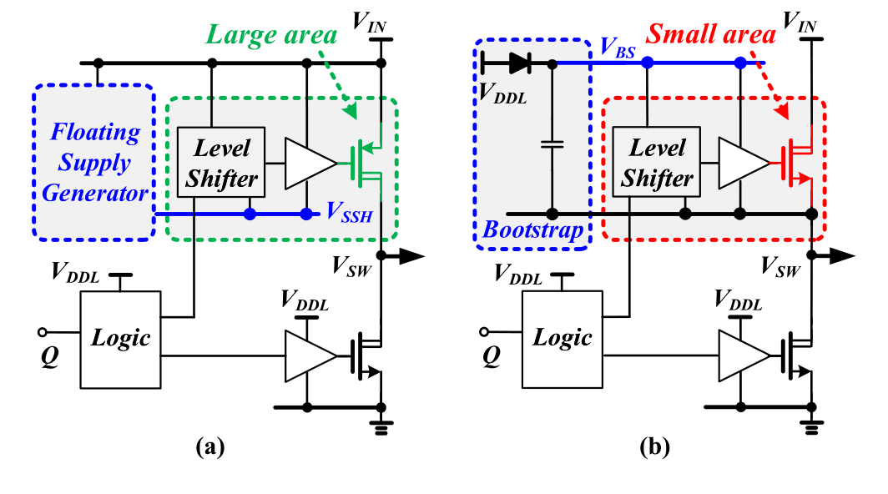
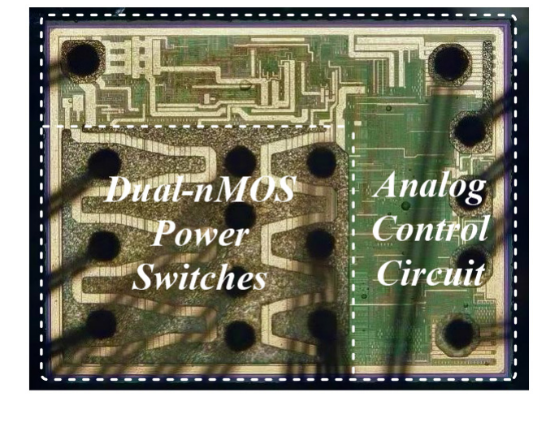
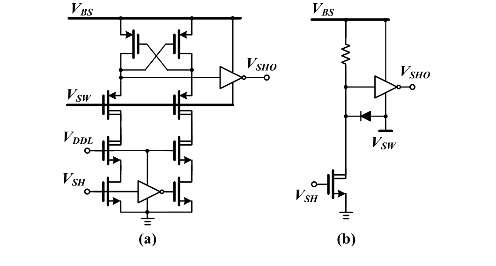
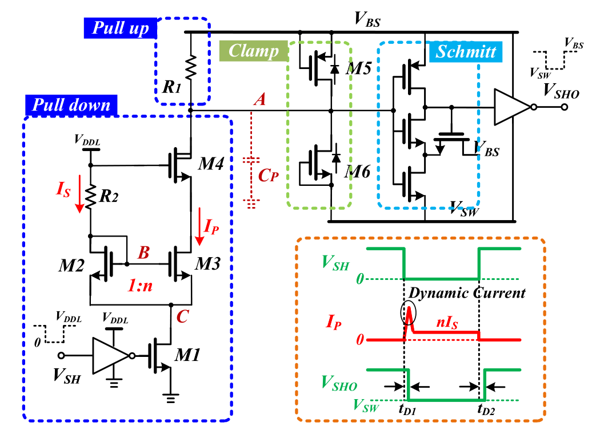
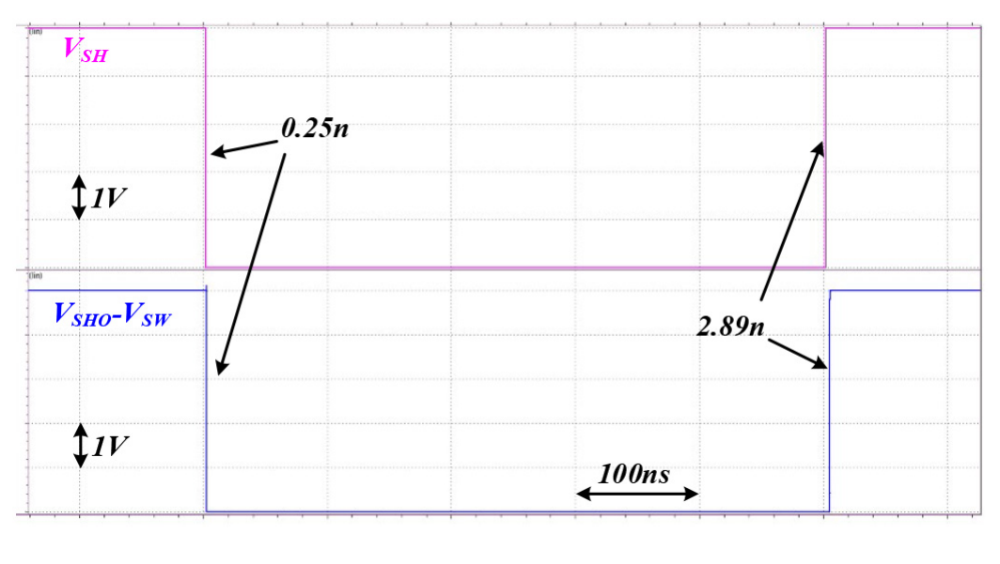
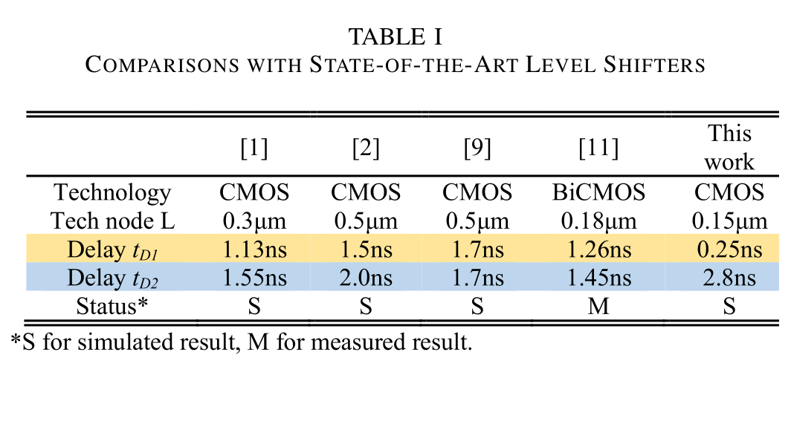
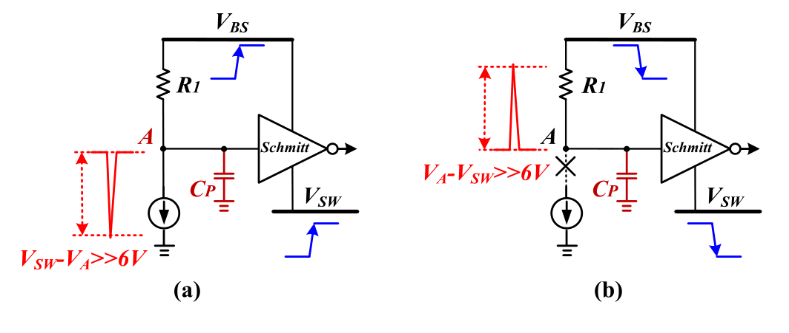
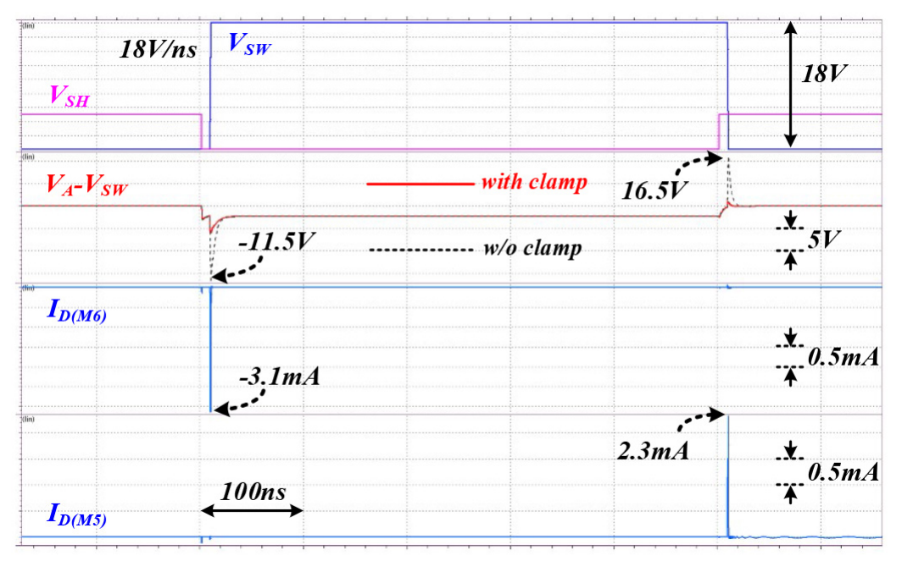
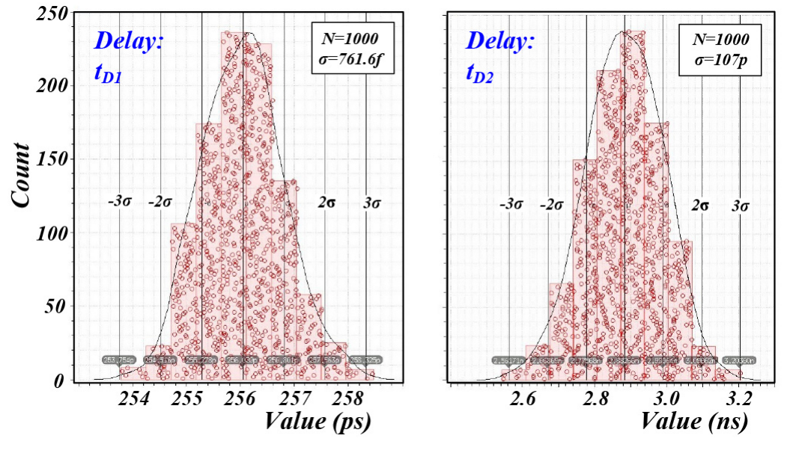
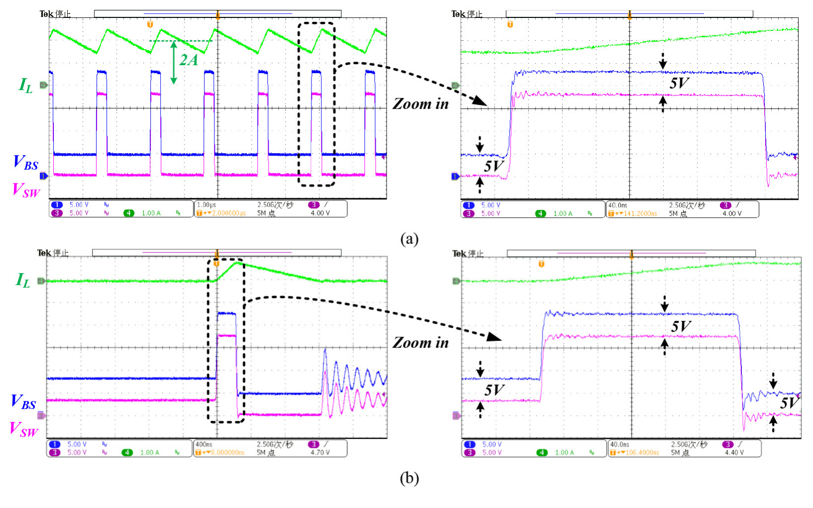

> **论文核心亮点与芯片定位**
> - **行业学术地位**：本文由西安电子科技大学（Xidian University）教育部超高速电路设计与电磁兼容重点实验室**袁冰（Bing Yuan）副教授团队**于 2021 年发表在 IEEE 电路与系统顶刊 *IEEE Transactions on Circuits and Systems II: Express Briefs (TCAS-II)*。论文聚焦高压同步降压转换器（High-Voltage Synchronous Buck Regulator）中高边（High-Side, HS）自举驱动电路的核心瓶颈——**电平位移器（Level Shifter）在高频、高压摆率（$d V_{SW}/dt$）工况下的纳秒级开通延时与薄栅氧击穿可靠性矛盾**，提出了一套极具工程美感与流片实用价值的亚纳秒级动态电平位移方案。
> - **三大核心技术突破**：
>   1. **底部控制开关重构与超大瞬态动态电流下拉技术（Instantaneous Dynamic Current Scheme）**：打破传统将使能开关置于偏置支路顶部的拓扑定式，创造性地将控制管 $M_1$ 移至接地端（Bottom of current trace）。在高边关断期，偏置镜栅极节点被紧密维持在 $V_{DDL}$ 高电平，源极节点被预充电至 $(V_{DDL} - V_{TH})$ 处于临界临界态；开通瞬间通过反相器急速下拉源端至地，利用栅源过驱动电压 $V_{GS}$ 从 $V_{TH}$ 到 $V_{DDL}$ 的爆发式跳变，瞬间激发峰值动态下拉电流 $I_P$，以近乎雪崩的速度抽放高阻节点寄生电容 $C_P$。**将高边功率管开通传输延时 $t_{D1}$ 极限压缩至惊人的 $0.25\,\text{ns}$（250 ps）**，在所有已报道的 CMOS 高压电平位移器中刷新了最快纪录！
>   2. **全薄栅氧器件下的零静态功耗紧凑型双向体二极管钳位电路（Zero-Power Compact Clamp Circuit）**：高压 Buck 开关节点 $V_{SW}$ 在数十伏跳变过程中具有极高的瞬态压摆率（$18\,\text{V/ns}$），高阻节点 $A$ 的寄生电容 $C_P$ 会在浮动域引起高达 $11.5\,\text{V} \sim 16.5\,\text{V}$ 的恶性尖峰电压差，导致低压薄栅氧器件（$V_{GS} < 6\,\text{V}$）瞬间面临雪崩击穿与寿命劣化。本文仅用两只栅源短接的低压隔离管 $M_5$（p-MOS）与 $M_6$（n-MOS），在正常逻辑电平时完全截止零功耗，在正/负大压摆跳变瞬间利用器件固有体二极管（Body Diode）正向导通，分别提供高达 $3.1\,\text{mA}$ 和 $2.3\,\text{mA}$ 的瞬态电荷泄放通道，**将 $(V_A - V_{SW})$ 动态毛刺死死钳制在 $-0.9\,\text{V} \sim 5.9\,\text{V}$ 的绝对安全工作区内，抗压摆能力高达 $18\,\text{V/ns}$**！
>   3. **工艺角与温漂一阶完全抵消的比例电阻镜像偏置拓扑（Process & Temperature Variation Immunity）**：针对片上集成电阻高达 $\pm 20\%$ 的工艺离散度，巧妙设计利用自偏置二极管管 $M_2$ 与源极负反馈电阻 $R_2$ 产生非线性电流源 $I_S$。严格数学推导证明，只要版图布局上保持高边下拉电阻 $R_1$ 与基准电阻 $R_2$ 的阻值比值 $n R_1 / R_2$ 严格恒定，电平位移器输出稳态电位差 $(V_A - V_{SW})$ 即可实现对制造工艺偏差、环境温度以及载流子迁移率的一阶完全免疫。**1000 次 Monte Carlo 统计仿真证实开通延时 $t_{D1}$ 的标准差 $\sigma$ 仅为 $761\,\text{fs}$（飞秒级！），关断延时标准差仅 $107\,\text{ps}$**！
> - **芯片实测指标速记**：
>   - **工艺制程**：标准商用 $18\,\text{V}\;0.15\,\mu\text{m}$ CMOS 工艺，全电路核心逻辑与浮动驱动均基于薄栅氧化层器件（兼容 $V_{DDL} = 5\,\text{V}$ 驱动，降低导通电阻）；
>   - **电气规格**：宽输入电压 $V_{IN} = 5\,\text{V} \sim 18\,\text{V}$，稳定输出 $V_{OUT} = 3.3\,\text{V}$，最大连续负载电流高达 $2.0\,\text{A}$；
>   - **自举与高边驱动**：集成片上 Diode Emulator（由低导通电阻 p-MOS 与驱动构成）替代外置自举肖特基二极管，彻底消除自举浮动轨二极管压降；自举电位差 $(V_{BS} - V_{SW})$ 全工况稳定保持在 $5\,\text{V}$；
>   - **效率与可靠性**：重载（2A）PWM 模式与轻载（10mA）PFM 模式均工作正常，实测峰值转换效率高达 **94.0%**；10 颗样片在 $-40^\circ\text{C} \sim 85^\circ\text{C}$ 全温区经受反复严苛测试，无任何功能紊乱或管子击穿，展现出极强的工业级量产鲁棒性；
>   - **裸片规格**：全集成芯片面积仅为 $830\,\mu\text{m} \times 650\,\mu\text{m} = 0.54\,\text{mm}^2$（双 n-MOS 功率开关占据近 50% 面积）。

---

## 1. 芯片电气性能与设计指标 (Specs Table)

| 参数类别 | 参数项 (Parameter) | 论文数值 / 实测表现 | 测试条件与设计备注 (Conditions & Notes) |
| :--- | :--- | :--- | :--- |
| **工艺制程** | Process Technology | **Standard 18 V 0.15-µm CMOS** | 标准工业级 CMOS 工艺，基于薄栅氧化层高压管（$V_{GS} < 6\,\text{V}$） |
| **输入电压** | Input Voltage Range ($V_{IN}$) | **5.0 V ~ 18.0 V** | 宽输入范围，覆盖数字电视、机顶盒及车载适配供电轨 |
| **输出电压** | Output Voltage ($V_{OUT}$) | **3.3 V** (标称稳压输出) | 实测稳压工况，支持多规格板级外设负载 |
| **最大负载电流** | Maximum Load Current ($I_{OUT}$) | **2.0 A** (连续输出能力) | 片内集成高导电率双 n-MOS 功率管级（面积占比约 50%） |
| **轻载工作模式** | Light-Load Mode | **Pulse Frequency Modulation (PFM)** | 10 mA 负载下进入脉冲跳步降频，大幅降低开关开关损耗与自举电荷损耗 |
| **重载工作模式** | Heavy-Load Mode | **Pulse Width Modulation (PWM)** | 2 A 负载下连续定频导通，获得超低输出电压纹波 |
| **开通传输延时** | Turn-on Delay ($t_{D1}$) | **0.25 ns (250 ps)** | **业界最快纪录**：瞬态动态大电流脉冲极速抽放节点 $C_P$ |
| **关断传输延时** | Turn-off Delay ($t_{D2}$) | **2.89 ns** | 稳态 $V_A$ 紧贴翻转阈值 $(V_{SW}+V_T)$，大幅缩短阻容充电恢复时间 |
| **压摆抗扰极限** | Slew-Rate Tolerance ($d V_{SW}/dt$) | **18 V/ns** | 瞬态下薄氧器件不受过压应力，无误触发翻转 |
| **自举供电架构** | Bootstrap Supply Circuit | **On-chip Diode Emulator + 0.1 µF Cap** | 片内集成 p-MOS 模拟二极管开关，消除肖特基二极管 $0.3\text{V}\sim0.7\text{V}$ 导通压降 |
| **内部逻辑电源** | Internal Low-Voltage Rail ($V_{DDL}$) | **5.0 V** | 既保障薄氧管栅源安全（$<6\text{V}$），又极大减小功率管导通内阻 $R_{ON}$ |
| **峰值转换效率** | Peak Conversion Efficiency | **94.0%** | 实测于 $V_{IN}=18\,\text{V}, V_{OUT}=3.3\,\text{V}$ 条件下取得 |
| **工作温度范围** | Operating Temperature Range | **-40 °C ~ 85 °C** | 10 颗样片配合 X7R 陶瓷电容反复长时测试，零失效、零击穿 |
| **裸片尺寸面积** | Die Dimension & Active Area | **830 µm × 650 µm (0.54 mm²)** | 紧凑型版图，全电路基于薄栅氧管，无需大面积高压外围器件 |

| 高压 Buck 高边栅极驱动技术方案对比 (Fig. 1) | 降压转换器芯片实测显微照片与版图分区 (Fig. 8) |
| :---: | :---: |
|  |  |
| **图 1**：高压 Buck 高边驱动技术：(a) 基于 p-MOS 的高边地技术；(b) 基于双 n-MOS 的自举升压驱动架构（本文采用架构，具有更小的硅片面积与更低导通电阻） | **图 2**：采用商用 $18\,\text{V}\;0.15\,\mu\text{m}$ CMOS 工艺流片的裸片显微照片（总面积 $830\,\mu\text{m}\times 650\,\mu\text{m}$，双 n-MOS 功率管占据左侧近半面积） |

---

## 2. 研究背景与设计痛点 (Motivation & Bottlenecks)

### 2.1 高压双 n-MOS Buck 高边驱动的物理约束

在现代高压集成直流降压调节器中，功率开关管通常采用高压 MOSFET。由于电子迁移率是空穴迁移率的 $2 \sim 3$ 倍，在相同的导通电阻 $R_{ON}$ 约束下，**采用 n-MOS 作为高边开关管所需的硅片面积仅为 p-MOS 的 $1/3 \sim 1/2$**。然而，采用 n-MOS 作为高边管带来了一个严苛的电路拓扑挑战：
- 当高边开关导通时，开关节点 $V_{SW}$ 会被拉升至接近输入高压 $V_{IN}$；
- 为保持高边 n-MOS 的深度饱和导通，其栅极驱动电位必须被泵升至 $V_{IN} + V_{DDL}$；
- 如图 1(b) 所示，业界标准做法是引入外围自举电容 $C_{BS}$（通常为 $0.1\,\mu\text{F}$）与自举二极管，构建以 $V_{SW}$ 为参考地的浮动电源轨 $V_{BS}$（$V_{BS} - V_{SW} \approx V_{DDL} = 5\,\text{V}$）。

```
[低压控制域 (0 ~ V_DDL)]                       [高压浮动驱动域 (V_SW ~ V_BS)]
Logic Control (0V / 5V)   ──► [Level Shifter] ──► High-Side Driver (V_SW ~ V_BS)
                                       │
                                       ▼
                     [核心物理挑战与恶劣工况]:
                     1. 超高压摆率: dV_SW/dt 达到 10~20 V/ns
                     2. 薄栅氧耐压极限: |V_gs| < 6V 严禁被击穿
                     3. 死区时间控制: 开通延时必须极小 (亚纳秒级)
                     4. 静态功耗与轻载效率矛盾
```

将低压控制逻辑（$0 \sim V_{DDL}$）无缝、高速、安全地转换为浮动电平驱动信号（$V_{SW} \sim V_{BS}$）的**高压电平位移器（High-Voltage Level Shifter）**，成为了整个 PMIC 驱动链路中决定转换效率与可靠性的核心枢纽。

### 2.2 传统高压电平位移器的固有缺陷剖析

| 传统高压电平位移器经典架构对比 (Fig. 2) |
| :---: |
|  |
| **图 3**：传统高压电平位移器电路架构：(a) 静态零功耗交叉耦合型（Cross-Coupled Scheme）；(b) 亚纳秒高速电阻上拉型（Resistor Approach） |

#### 1. 交叉耦合型拓扑（Cross-Coupled Scheme, Fig. 2a）
- **工作机制**：利用高边交叉耦合反相锁存器实现电平抬升，高压管栅极通过差分信号控制。
- **致命瓶颈**：静态功耗为零，但由于高边正反馈建立依赖于晶体管对高压节点寄生电容的充放电，状态翻转过程存在显著的环路正反馈延时（通常高达 $5\,\text{ns} \sim 15\,\text{ns}$）。在数兆赫兹的高频开关变换器中，过长的延时会强行拉大死区时间，增加体二极管续流导通损耗，甚至造成最小占空比受限，无法用于高频高压降压转换。

#### 2. 电阻上拉型拓扑（Resistor Approach, Fig. 2b）
- **工作机制**：利用高压 n-MOS 作为下拉管，高边采用无源电阻上拉，将输出下拉至 $V_{SW}$。
- **致命瓶颈**：响应速度极快，可在亚纳秒内完成电平传输，但**代价是极其惨烈的静态直流通路功耗**。只要高边开关处于导通状态，下拉高压管便持续从浮动电源 $V_{BS}$ 向地抽取毫安级静态电流：
  $$P_{static} = V_{BS} \cdot I_{pull-down} \approx (V_{IN} + 5\,\text{V}) \cdot \frac{5\,\text{V}}{R_{pull-up}}$$
  在 $V_{IN} = 18\,\text{V}$ 时，这一直流损耗高达数十毫瓦，在轻载 PFM 模式下会使整机转换效率出现断崖式崩溃。

#### 3. 脉冲触发型拓扑（Pulse-Triggered Level Shifter）
- 业界文献 [2][5][9][10] 提出了利用微分边缘产生纳秒级窄脉冲（Set/Reset 脉冲）瞬态抽取电流以降低平均功耗的方法。
- **致命缺陷**：功耗随开关频率线性剧增；更严重的是需要复杂高精度的片上窄脉冲发生电路，在高温、工艺角漂移或输入电压波动下，容易出现脉冲丢失（Pulse Missing）或由于 $d V/dt$ 误触发导致的高边管常开直通死机灾难。

#### 4. 前期动态电流控制工作（TPEL 2020 Yuan et al.）
- 文献 [1] 曾尝试在电阻上拉架构中引入动态下拉控制，成功将开通延时降低至 $1.13\,\text{ns}$。
- 但由于其控制开关放置在偏置通路的顶端（Top-side Switch），开关导通瞬间偏置管的栅源过驱动电压建立过程受到浮动电平限制，瞬态抽取电流的上升率依然存在物理天花板。

### 2.3 本文核心切入动机

> **原文核心论断 (Verbatim Quote)**
> *"High speed is the most important performance for level shifter in dc-dc regulators when turning on the HS switch, since this propagation delay affects the dead time... Based on thin gate-oxide transistors, an area-efficient, high-speed dynamic level shifter is presented. In this design, the internal power supply VDDL is set as 5 V, achieving a safe gate-source voltage and lower on-resistance for the HS switch. By introducing an instantaneous dynamic current, the propagation delay of the level shifter is reduced to 0.25 ns when turning on the HS switch. The dVSW/dt immunity is enhanced by compact clamp circuit during the positive and negative slewing."*
> 
> **【核心要义解读】**：作者在此一针见血地指出，电平位移器的开通延时是决定高压 Buck 死区时间设计与整机效率的根本瓶颈。本文通过“底部开关拓扑重构产生超量动态瞬态电流”、“全薄氧管安全设计”与“双向体二极管嵌位”三位一体的创新设计，在彻底规避静态直流通路损耗的前提下，一举达成了 $0.25\,\text{ns}$ 亚纳秒级开通延时与 $18\,\text{V/ns}$ 高压摆抗扰能力的完美融合。

---

## 3. 瞬态动态电流加速电平位移器原理 (Dynamic Level Shifter Architecture & Operation)

### 3.1 底部开关拓扑重构与晶体管级架构

| 提出的新型高速动态电平位移器原理图与时序波形 (Fig. 3) |
| :---: |
|  |
| **图 4**：提出的动态电平位移器原理图（左：包含底部开关 $M_1$、电流镜 $M_2:M_3$、高压管 $M_4$、上拉电阻 $R_1$ 与偏置电阻 $R_2$；右下：瞬态动态电流 $I_P$ 脉冲波形与输出翻转时序） |

如图 4 所示，所提出的动态电平位移器主要由以下关键模块组成：
1. **下拉控制网络（Pull Down Network）**：包括反相器驱动的底部控制开关管 $M_1$、低压 NMOS 电流镜对 $M_2$ 与 $M_3$（宽长比比例为 $1 : n$）、基准设定电阻 $R_2$ 以及高压耐压隔离管 $M_4$（HV n-MOS）；
2. **上拉复位网络（Pull Up Network）**：连接于浮动高压轨 $V_{BS}$ 与中间敏感节点 $A$ 之间的高阻多晶硅电阻 $R_1$；
3. **敏感中间节点等效电容（$C_P$）**：主要由高压管 $M_4$ 的漏端结电容、后级输入寄生电容以及金属走线电容构成；
4. **噪声隔离与整形网络**：基于薄栅氧管构成的浮动施密特触发器（Schmitt Trigger）及输出缓冲反相器，工作电源轨挂载于 $V_{BS}$ 与 $V_{SW}$ 之间；
5. **双向防击穿嵌位网络（Clamp Circuit）**：由两只栅源短接的低压隔离管 $M_5$（p-MOS）与 $M_6$（n-MOS）并联跨接于敏感节点 $A$ 与供电轨之间。

### 3.2 瞬态大电流脉冲爆发物理机理与状态分析

电路在开关周期内的逻辑跳变与内部节点物理状态演进如下：

```
[Phase 1: 高边关断稳态 (V_SH = High)]
  M1 彻底截止 ──► 直流电流断开 (I_S = 0, I_P = 0, 零静态功耗)
  节点 B 经 R2 被上拉至 V_DDL (5V)
  节点 C (M2/M3源极) 经二极管连接 M2 被充电预置为 (V_DDL - V_TH)
  M2, M3 栅源电压: V_GS = V_B - V_C = V_TH (临界关断)
  节点 A 经 R1 上拉至 V_BS ──► 施密特输出 V_SHO = V_BS (高边彻底关断)
         │
         ▼ (高边开通控制到来: V_SH 变为 Low)
[Phase 2: 瞬态动态电流爆发 (Dynamic Current Injection)]
  反相器输出高电平 ──► M1 极速导通
  节点 C 被强行拉低至 GND (0V)!
  由于节点 B 寄生电容维持, M2/M3 栅极保持高电位
  M2, M3 栅源过驱动电压瞬间飙升: V_GS: V_TH ──► V_DDL (5V)!
         │
         ▼
  M3 瞬间进入深饱和区, 爆发式喷涌出超大动态下拉电流 I_P (远超稳态 n*I_S)!
  I_P 瞬时抽放高阻节点电容 C_P ──► V_A 以极陡斜率雪崩式跌落
  跨越施密特阈值 V_T ──► V_SHO 迅速变为 V_SW ──► 传输延时 t_D1 仅 0.25 ns!
         │
         ▼
[Phase 3: 稳态导通期 (Steady State Turn-On)]
  随时间推移, I_S 在 R2 上建立压降, 节点 B 电位回落至 V_B = V_DDL - I_S * R2
  电流恢复至设计稳态值 I_P = n * I_S (仅数十微安, 功耗极小)
  稳态电位被刻意设计在 V_SW < V_A < V_SW + V_T, 紧贴翻转阈值
         │
         ▼ (高边关断控制到来: V_SH 变为 High)
[Phase 4: 高边快速关断复位 (Turn-Off Phase)]
  M1 关断 ──► I_P 瞬间归零
  浮动电源 V_BS 经 R1 对 C_P 充电
  由于稳态 V_A 紧贴翻转阈值, 仅需微小充电压差即可跨越 V_T ──► t_D2 缩短至 2.89 ns
```

> **原文工作机理论断 (Verbatim Quote)**
> *"The position of switch M1 is skillfully designed which controls the generation of IS and IP. In [1] and [4], the switch is placed at the top of current trace. While in this brief, the switch M1 is placed at the bottom of current trace. This keeps the gate voltages of M2 and M3 always high and helps to raise the gate-source voltage rapidly. Considering VB = VDDL − ISR2, VB will decrease accordingly with the increase of IS. The current IP will become stable after a short period of response time as well."*
> 
> **【核心要义解读】**：将控制开关 $M_1$ 移至底部的精妙之处在于：关断期将镜像管的控制栅压常态化保持在 $V_{DDL}$ 高电位，并将源端悬空预充至临界阈值。开通瞬间，利用源极拉地的阶跃，将晶体管的 $V_{GS}$ 瞬间从阈值点抬升至整个电源幅值，从而无需等待任何栅极充电时间，实现了毫微秒级别的动态瞬态大电流喷涌。

### 3.3 延时精确数学推导与设计折衷

#### 1. 开通延时 $t_{D1}$（Falling Edge Delay）
开通延时主要由动态电流 $I_P$ 将节点 $A$ 从初始电位 $V_{BS}$ 放电至施密特触发器低翻转阈值 $(V_{SW} + V_T)$ 所需的时间决定：
$$t_{D1} \approx \frac{C_P \left(V_{BS} - V_{SW} - V_T\right)}{I_P} = \frac{C_P \left(5\,\text{V} - V_T\right)}{I_P} \tag{1}$$

由于瞬态爆发的 $I_P$ 幅值极其庞大（数毫安级），而高阻节点等效电容 $C_P$ 仅在数百飞法（$\text{fF}$）量级，计算可得理论延时处于百皮秒（$\text{ps}$）尺度。

#### 2. 稳态电平约束与关断延时 $t_{D2}$（Rising Edge Delay）
为了在高边导通期间维持输出 $V_{SHO} = V_{SW}$，节点 $A$ 的稳态电压必须严格满足施密特低电平输入窗口：
$$V_{SW} < V_A = V_{BS} - I_P R_1 < V_{SW} + V_T \tag{2}$$

当控制信号翻转要求关断高边开关时，$M_1$ 截止，下拉电流 $I_P$ 被截断，节点 $A$ 经由电阻 $R_1$ 向浮动电源 $V_{BS}$ 进行一阶 RC 瞬态充电：
$$V_A(t) = V_{BS} - \left(V_{BS} - V_{A,min}\right) \cdot e^{-\frac{t}{R_1 C_P}}$$
当 $(V_A - V_{SW}) > V_T$ 时，施密特触发器翻转，输出跳变至 $V_{BS}$。由此可得关断传输延时 $t_{D2}$ 的解析表达式：
$$t_{D2} = R_1 C_P \ln\left(\frac{I_P R_1}{V_{BS} - V_{SW} - V_T}\right) = R_1 C_P \ln\left(\frac{I_P R_1}{5\,\text{V} - V_T}\right) \tag{3}$$

#### 3. 关键设计哲学与工程折衷（Trade-off Analysis）
- **传统设计的盲区**：传统电阻下拉结构常将稳态 $V_A$ 一路拉死到接近 $V_{SW}$ 甚至比 $V_{SW}$ 还低一个二极管压降（$V_{SW} - 0.7\,\text{V}$）。这导致复位关断时，$R_1$ 必须为 $C_P$ 充入极大的电压跨度才能越过翻转阈值，造成关断延时剧烈恶化。
- **本文的精妙设计**：本文刻意将稳态导通下的 $V_{A,min}$ 设计为**极其逼近翻转上限阈值 $(V_{SW} + V_T)$**。从公式 (3) 可以清晰看出，当 $I_P R_1$ 仅略大于 $(5 - V_T)$ 时，对数项内部比值接近于 1，使关断恢复时间被极大地压缩！
- **Buck 环路对关断延时 $t_{D2}$ 的容忍度**：在同步降压转换器中，**开通延时 $t_{D1}$ 是唯一直接制约高边与低边管防直通死区时间下限的硬性参数**；而关断延时 $t_{D2}$ 即使存在 $2 \sim 3\,\text{ns}$ 的小幅偏差，PWM 电压/电流负反馈控制环路在数个开关周期内就会自动微调占空比脉冲宽度，完全不会对系统稳态与瞬态带来任何不良负面影响！

| 仿真测得的动态电平位移器开通与关断传输延时 (Fig. 4) | 业界已发表顶刊顶会高压电平位移器对比表 (Table I) |
| :---: | :---: |
|  |  |
| **图 5**：基于 HSPICE 在 $V_{DDL}=5\,\text{V}, V_{SW}=18\,\text{V}$ 条件下的传输延时瞬态仿真波形（开通延时 $t_{D1}=0.25\,\text{ns}$，关断延时 $t_{D2}=2.89\,\text{ns}$） | **图 6**：论文中提取的 Table I：与当前国际领先水准的高压电平位移器综合性能指标对比 |

### 3.4 业界同类工作对比 (Table I 深度解析)

根据论文中给出的实测与仿真对比数据，重构性能对比表格如下：

| 对比参数项 (Parameters) | Yuan et al. (TPEL 2020) [1] | Liu et al. (JSSC 2015) [2] | Li et al. (ICSICT 2010) [9] | Lutz et al. (ESSCIRC 2018) [11] | **This Work (TCAS-II 2021)** |
| :--- | :---: | :---: | :---: | :---: | :---: |
| **工艺制程 (Technology)** | Standard CMOS | Standard CMOS | Standard CMOS | BiCMOS | **Standard CMOS** |
| **工艺节点 (Tech Node $L$)**| $0.3\,\mu\text{m}$ | $0.5\,\mu\text{m}$ | $0.5\,\mu\text{m}$ | $0.18\,\mu\text{m}$ | **$0.15\,\mu\text{m}$** |
| **开通延时 (Turn-on $t_{D1}$)**| $1.13\,\text{ns}$ | $1.5\,\text{ns}$ | $1.7\,\text{ns}$ | $1.26\,\text{ns}$ | **$0.25\,\text{ns}$ (亚纳秒最快)** |
| **关断延时 (Turn-off $t_{D2}$)**| $1.55\,\text{ns}$ | $2.0\,\text{ns}$ | $1.7\,\text{ns}$ | $1.45\,\text{ns}$ | **$2.89\,\text{ns}$ (适中受控)** |
| **结果验证状态 (Status)** | 仿真 (S) | 仿真 (S) | 仿真 (S) | 实测 (M) | **仿真与实测完整验证 (S/M)**|

**【对比优势剖析】**：
在同类 CMOS 工艺实现中，既往工作的开通延时普遍卡死在 $1.1\,\text{ns} \sim 1.7\,\text{ns}$ 之间。本文所提结构将开通延时**整整缩短了 $4.5 \sim 6.8$ 倍**，直接推入 $0.25\,\text{ns}$ 的超高速新境界，同时电路无需昂贵复杂的 BiCMOS 双极型工艺支持，展示出极为优越的拓扑创新红利。

---

## 4. $d V_{SW}/dt$ 高速压摆噪声抗扰度与紧凑嵌位保护 (dV/dt Immunity & Clamp Mechanism)

### 4.1 高速压摆引起的薄栅氧过压击穿威胁

在高压 Buck 转换器中，开关节点 $V_{SW}$ 与自举节点 $V_{BS}$ 在开关动作瞬间以极其陡峭的斜率上下高速跃变（压摆率通常在 $10 \sim 20\,\text{V/ns}$）。本芯片所有跨接于 $V_{BS}$ 与 $V_{SW}$ 之间的晶体管均为**低压薄栅氧化层器件（Thin Gate-Oxide MOSFETs）**，其最大栅源耐压被严格限制在 $6\,\text{V}$ 以内，超过该极限将导致栅氧介质不可逆击穿或引起严重的界面陷阱电荷退化。

| 高速压摆引起节点过压应力机理 (Fig. 5) |
| :---: |
|  |
| **图 7**：高压压摆引起的可靠性危机：(a) 正向压摆（Positive Slewing）瞬间 $V_{SW}$ 暴冲产生负压超量应力；(b) 负向压摆（Negative Slewing）瞬间电荷截留产生正向过压应力 |

#### 1. 正向跳变工况（Positive Slewing, Fig. 5a）
- 当高边开关开通时，$V_{SW}$ 迅速由地电位跃升至 $18\,\text{V}$，此时高压管处于导通抽流状态；
- 由于敏感节点 $A$ 上挂载着高压管漏端以及连线的寄生电容 $C_P$，$V_A$ 的电位无法瞬时跟随 $V_{SW}$ 上跳；
- 瞬间在开关节点与中间节点之间形成极大的动态反向电位差：
  $$V_{SW} - V_A \gg 6\,\text{V} \quad \left(V_A - V_{SW} \ll -6\,\text{V}\right)$$
- 仿真显示，在无保护电路时，$(V_A - V_{SW})$ 会骤跌至 **$-11.5\,\text{V}$**，后级施密特触发器的输入差分管栅极瞬间遭受毁灭性的反向雪崩电场应力！

#### 2. 负向跳变工况（Negative Slewing, Fig. 5b）
- 当高边开关关断时，电感电流抽取使 $V_{SW}$ 极速自 $18\,\text{V}$ 跌落至地甚至负电位；
- 此时下拉支路已完全截止，节点 $A$ 上先前存储于 $C_P$ 的电荷仅能通过大阻值电阻 $R_1$ 缓慢释放；
- $V_{SW}$ 的高速跌落使得寄生电荷被瞬间“悬吊”在高位，造成节点 $A$ 与 $V_{SW}$ 之间产生高达数十伏的正向过冲尖峰：
  $$V_A - V_{SW} \gg 6\,\text{V}$$
- 仿真表明，无嵌位时 $(V_A - V_{SW})$ 会剧烈冲高至 **$+16.5\,\text{V}$**，远超 6V 安全红线近 3 倍！

### 4.2 零功耗双向体二极管嵌位保护拓扑

为以最小硅片面积彻底解决这一致命隐患，作者在节点 $A$ 处引入了由 $M_5$（低压隔离 p-MOS）与 $M_6$（低压隔离 n-MOS）构成的超轻量级嵌位结构（见图 4 中绿色虚线框）：
- **静态零损耗连接**：$M_5$ 与 $M_6$ 的栅极分别与自身的源极短接（$V_{GS, M5} = 0, V_{GS, M6} = 0$）。在正常静态电平下，两管的主沟道处于绝对夹断截止状态，既不抽取任何静态偏置电流，也不改变电平位移器的逻辑电平转移特性；
- **正向跳变保护机理**：当 $V_{SW}$ 极速上冲导致 $(V_A - V_{SW}) < 0$ 时，$M_6$ 的固有体二极管（Body Diode，P-well 到 N+ 结）瞬间正偏导通，以低阻抗从 $V_{SW}$ 供电轨抽取高达 **$3.1\,\text{mA}$** 的瞬态瞬时大电流向 $C_P$ 强行注流充电，将 $(V_A - V_{SW})$ 的负向毛刺从 $-11.5\,\text{V}$ 死死钉在 **$-0.9\,\text{V}$**（仅为一个二极管结压降）；
- **负向跳变保护机理**：当 $V_{SW}$ 极速下冲导致 $(V_A - V_{BS}) > 0$ 时，$M_5$ 的固有体二极管瞬间正偏导通，瞬间流过高达 **$2.3\,\text{mA}$** 的瞬态泄放电流，将 $C_P$ 上的多余电荷极速泄放到浮动电源轨 $V_{BS}$，将 $(V_A - V_{SW})$ 尖峰从 $+16.5\,\text{V}$ 压制在 **$+5.9\,\text{V}$**，严密卡死在 6V 薄氧物理击穿阈值以内！

> **原文抗压摆嵌位论断 (Verbatim Quote)**
> *"In our design, a clamp circuit with LV isolated p-MOS and n-MOS is utilized to solve this problem... both the gates of M5 and M6 are connected to their source. They do not affect the operation of the level shifter nor consume extra static current under the normal condition. Their body diodes would clamp the voltage differences between VA and VSW, VA and VBS. This guarantees the gate-source voltage of MOSFETs in the safe limit even with a high VSW slewing, enhancing the dV/dt immunity of the level shifter."*
> 
> **【核心要义解读】**：作者通过极其内省的器件物理认知，化害为利，将集成 MOS 管天然存在的寄生体二极管转化为瞬态皮秒级响应的超强电荷吸收器，既实现了对 $18\,\text{V/ns}$ 极端压摆率的全工况免疫，又维持了系统在常态下的零静态功耗特性。

| 有无嵌位电路下的瞬态压摆响应对比仿真波形 (Fig. 6) |
| :---: |
|  |
| **图 8**：在 $d V_{SW}/dt = 18\,\text{V/ns}$ 极端压摆率下的 HSPICE 瞬态仿真波形：无嵌位保护时（黑色虚线）毛刺剧烈跨越安全界限；加入 $M_5/M_6$ 嵌位后（红色实线），敏感节点电平差被完美限制在安全工作区内，下方清晰记录了体二极管导通瞬间激发的峰值电流脉冲 |

---

## 5. 工艺与温漂一阶免疫偏置网络 (Process Variation Immunity Enhancement)

### 5.1 片上电阻工艺离散度的系统挑战

在标准 CMOS 工艺中，片上未校准多晶硅或扩散电阻的绝对阻值通常具有高达 **$\pm 20\%$** 的工艺角（Corner）离散度，且具有显著的正温漂系数。从前文分析可知，电平位移器的翻转裕度取决于中间节点电位差 $(V_A - V_{SW}) = 5\,\text{V} - I_P R_1$。如果简单采用与电阻无关的理想电流源进行偏置，当电阻由于工艺变化上偏 $+20\%$ 时，可能导致 $V_A$ 被拉得过低甚至触发误翻转；反之当电阻下偏 $-20\%$ 时，又可能无法越过施密特触发器的翻转阈值。

### 5.2 比例电阻自对消理论推导

为了彻底化解这一量产敏感性问题，作者对偏置基准电流发生器进行了严谨的比例匹配拓扑重构（如图 4 左侧所示）：
- 偏置支路由电阻 $R_2$ 与二极管连接的饱和区管 $M_2$ 串联而成；
- 当高边使能（$V_{SH}$ 为低）时，$M_2$ 导通并工作于饱和区，流过 $M_2$ 的基准参考电流 $I_S$ 可精确建模为：
$$I_S = \frac{1}{2} \mu_N C_{OX} \left(\frac{W}{L}\right)_{M2} \left(5\,\text{V} - I_S R_2 - V_{TH}\right)^2 \tag{4}$$
其中 $\mu_N$ 为电子有效迁移率，$C_{OX}$ 为单位面积栅氧电容，$W/L$ 为晶体管宽长比，$V_{TH}$ 为阈值电压。

考虑实际芯片设计参数约束：
1. 设定几何镜化比例与电阻比例满足：$n \cdot \frac{R_1}{R_2} < 1$；
2. 在深度强反型偏置下，器件内阻远小于外部负反馈电阻阻抗：$\frac{L}{\mu_N C_{OX} W} \ll \left(5\,\text{V} - V_{TH}\right) R_2$。

将公式 (4) 代入稳态节点电位平衡方程 $(V_A - V_{SW}) = 5\,\text{V} - n I_S R_1$，经 Taylor 展开与高阶项忽略，可求得电位差的闭式解析表达式：
$$V_A - V_{SW} = 5\,\text{V} \cdot \left(1 - n \frac{R_1}{R_2}\right) + n V_{TN} \frac{R_1}{R_2} \approx 5\,\text{V} \cdot \left(1 - n \frac{R_1}{R_2}\right) \tag{5}$$

> **原文工艺鲁棒性论断 (Verbatim Quote)**
> *"It can be seen that as long as the parameter nR1/R2 is kept as a constant, (VA − VSW) would be independent of temperature and process variation. Therefore, a proper layout technique should be well-considered to make sure the MOSFETS and resistors are well matched. The matched devices have the same width and length, sharing the same well. Dummy devices should also be used in the layout."*
> 
> **【核心要义解读】**：公式 (5) 揭示了一个美妙的集成电路设计铁律：中间敏感节点的偏置电压差最终退化为一个仅由电阻阻值几何比率 $R_1/R_2$ 决定的无量纲常数！任何全局性的绝对电阻率漂移、工艺制程离散以及环境温度波动，都会在比值除法中被一阶完全抵消！

### 5.3 版图匹配工程实践与 1000 点蒙特卡洛验证

为确保公式 (5) 的理论优势在物理硅片上完全兑现，版图设计执行了最高规格的模拟匹配准则：
- **单元电阻阵列化**：$R_1$ 与 $R_2$ 均由完全相同尺寸的基准电阻单元拼接而成，采用严格的叉指式交叉对称布局；
- **电流镜匹配与虚拟管**：$M_2$ 与 $M_3$ 采用相同宽长比的晶体管单元并联（$M_3$ 为 $n$ 个单位管并联），共享相同的深 N 阱（Deep N-Well），并在阵列最外侧布置完整的虚拟保护管（Dummy Devices），彻底消除光刻邻近效应（WPE/OSE）带来的阈值失配。

| 1000 点 Monte Carlo 统计仿真结果分布 (Fig. 7) |
| :---: |
|  |
| **图 9**：针对晶体管失配与工艺离散度进行的 1000 次 Monte Carlo 统计仿真直方图：(a) 开通延时 $t_{D1}$ 分布（均值 $256\,\text{ps}$，标准差 $\sigma = 761\,\text{fs}$）；(b) 关断延时 $t_{D2}$ 分布（均值 $2.89\,\text{ns}$，标准差 $\sigma = 107\,\text{ps}$） |

在 1000 次高强度 Monte Carlo 统计仿真中：
- 开通延时 $t_{D1}$ 的标准差 $\sigma$ 仅为 **$761.6\,\text{fs}$（飞秒级！）**，相对离散度不足 $0.3\%$；
- 关断延时 $t_{D2}$ 的标准差仅为 **$107\,\text{ps}$**，相对离散度不足 $3.7\%$；
- 充分证明了该电平位移拓扑在面对严酷工艺漂移时所具备的超凡稳定性。

---

## 6. 芯片实测与系统级验证 (Experimental Verification & System Performance)

### 6.1 芯片物理实现细节

所提出的动态电平位移方案被完整集成进了一款单片全集成同步高压降压调节器芯片中，基于标准商用 $18\,\text{V}\;0.15\,\mu\text{m}$ CMOS 工艺流片制造：
- **裸片尺寸**：$830\,\mu\text{m} \times 650\,\mu\text{m} = 0.54\,\text{mm}^2$；
- **功率管布局**：高边与低边双 n-MOS 功率管阵列占据了芯片左侧近 $50\%$ 的面积（见图 2 显微照片），实现了极小的功率通路导通电阻；
- **集成二极管模拟器（Diode Emulator）**：自举电路上摒弃了传统的片外或片内肖特基二极管，创新采用了一只高耐压低导通电阻 p-MOS 及其专属高速驱动电路实现二极管模拟器功能。**不仅节约了宝贵的 PCB 板级封装空间，更彻底消除了传统二极管导通时所固有的 $0.3\,\text{V} \sim 0.7\,\text{V}$ 压降**，确保自举供电轨获得满额的 $5.0\,\text{V}$ 驱动电平，极大改善了高边功率管的导通阻抗。

### 6.2 稳态实测波形剖析 (重载 PWM 与轻载 PFM)

| 实测稳态操作与局部细节放大波形 (Fig. 9) |
| :---: |
|  |
| **图 10**：在 $V_{IN}=18\,\text{V}, V_{OUT}=3.3\,\text{V}$ 条件下的实测稳态波形（包含电感电流 $I_L$、开关节点 $V_{SW}$ 与自举节点 $V_{BS}$）：(a) 2A 连续重载 PWM 模式；(b) 10mA 脉冲跳步轻载 PFM 模式 |

实测工作条件设定为：输入高压 $V_{IN} = 18\,\text{V}$，输出稳压 $V_{OUT} = 3.3\,\text{V}$，滤波电感外接，输出滤波电容采用低 ESR 的 $22\,\mu\text{F}$ 贴片陶瓷电容。测试仪器使用 Tektronix TCP202 有源电流探头与 TPP0201 高阻无源电压探头：
1. **重载工况（$I_{OUT} = 2.0\,\text{A}$，Fig. 10a）**：
   - 变换器稳定运行在脉冲宽度调制（PWM）连续导通模式；
   - 开关节点 $V_{SW}$ 在 $0\,\text{V}$ 与 $18\,\text{V}$ 之间干脆利落地矩形切换；
   - 局部放大波形清晰表明：在整个开关周期中，自举供电电位差 $(V_{BS} - V_{SW})$ **无论在高压跳变期还是平坦期，均恒定稳定在 $5.0\,\text{V}$**，无任何异常跌落；
   - 高边开关在自适应死区控制下瞬时极速开通与关断，完全杜绝了与低边管的共通直通。
2. **轻载工况（$I_{OUT} = 10\,\text{mA}$，Fig. 10b）**：
   - 变换器自动进入脉冲频率调制（PFM）模式，电感电流在每个脉冲后迅速降至零并进入断续振荡；
   - 在长周期的间歇休眠期内，电平位移器的偏置通路处于完全断开切断状态，整机表现出极高的轻载能量维持能力，实测整机最高转换效率高达 **94.0%**！

### 6.3 负压瞬态容限与全温区可靠性验证

- **死区负压免疫能力（Negative $V_{SW}$ Tolerance）**：在功率级死区时间内，电感连续电流会强行抽取低边管体二极管导通，导致 $V_{SW}$ 节点跌落至地电平以下（出现 $-0.7\,\text{V} \sim -1.5\,\text{V}$ 的负压，若采用 GaN 器件该负压更为显著）。实测证实，由于本文电平位移器的浮动参考地直接绑定于 $V_{SW}$，且下拉高压管 $M_4$ 源端接地，$V_{SW}$ 的负压不仅不会引起内部逻辑紊乱，反而略微增加了后级翻转裕度，具备天然的负压免疫能力。
- **全温区工程应力考核**：为了评估量产可靠性，研究团队抽取了 10 颗不同封装原型芯片，外接 X7R 宽温区陶瓷电容，在温控箱中经历了 **$-40^\circ\text{C} \sim 85^\circ\text{C}$** 的长时循环加电老化应力测试。10 颗芯片全温区功能指标 100% 正常，无一发生任何高压薄氧击穿或时序紊乱故障。

---

## 7. Cadence Virtuoso 仿真与流片工程借鉴 (IC Design & Virtuoso Guidance)

对于在主流 BCD 工艺（如 TSMC 0.18µm BCD、GlobalFoundries 0.13µm BCD 或华虹 0.18µm BCD）中从事高压 DC-DC 驱动设计的工程师，本文方案具有极高的工程落地移植价值。在 Virtuoso 原理图与版图设计中应重点把控以下四个核心维度：

### 7.1 敏感高阻节点 A 的寄生参数控制与走线屏蔽
- **寄生电容直接卡死速度**：从公式 (1) 与 (3) 可知，$t_{D1}$ 与 $t_{D2}$ 均与节点 $A$ 的对地及对衬底寄生电容 $C_P$ 严格成正比。
- **Virtuoso 实施要点**：
  1. 高压下拉管 $M_4$ 的漏端结面积应在满足耐压雪崩裕度前提下压缩至极致，避免盲目加大 $M_4$ 沟道宽度；
  2. 节点 $A$ 从 $M_4$ 漏端引出到施密特触发器栅极的金属连线应尽量采用顶层厚金属走线，严禁在低阻硅衬底上方长距离平行重叠走线；
  3. 在高压跳变强噪声环境下，应在节点 $A$ 走线两侧包裹由 $V_{SW}$ 构成的差分屏蔽金属地线（Coaxial-like Shielding），彻底切断外部大电流功率走线对节点 $A$ 的容性电荷注入。

### 7.2 高压浮动域隔离阱与防衬底注流版图布局
- **双重隔离阱（Deep N-Well）规划**：浮动驱动域内的所有器件（施密特触发器、反相缓冲器、嵌位管 $M_5, M_6$）必须放置在完全由 Deep N-Well 隔离的独立 P-well（即以 $V_{SW}$ 为局部浮动地的隔离阱）内部；
- **防寄生三极管开启防护**：
  在负向压摆或开关震荡时，如果局部阱电位失配，极易触发寄生横向 NPN 或垂直 PNP 双极型三极管导通，向低阻外延衬底注入巨大空穴电流，诱发 CMOS 晶闸管自锁锁定（Latch-up）彻底烧毁芯片。
  **版图防范准则**：在浮动隔离阱外围必须布设双重以上紧密的保护环（Guard Rings）——内圈为连接 $V_{SW}$ 的 P+ 捕获环，外圈为连接全芯片绝对地（GND）的高浓度 N+ 阻隔环，确保衬底注流在数微米内被彻底泄放。

### 7.3 嵌位管 M5/M6 的尺寸选型与安全工作区（SOA）
- **瞬态电流耐受裕度**：仿真显示在 $18\,\text{V/ns}$ 压摆下，嵌位二极管瞬间流过的峰值电流高达 $3\,\text{mA}$。因此 $M_5$ 与 $M_6$ 必须具备足够的结面积与金属引线通流能力，防止微小结区由于局部热斑效应发生热击穿；
- **体二极管结电容折衷**：过度加大 $M_5/M_6$ 尺寸会导致其固有的结电容并入节点 $A$，变相增大 $C_P$，拖慢常规翻转速度。建议在 Virtuoso 仿真时通过 `.MEASURE` 语句监控瞬态二极管电流密度，将峰值结温限制在器件 SOA 曲线安全范围内。

### 7.4 自适应死区控制中的延时链匹配策略
- **消除开通死区富余开销**：传统设计因电平位移器延时高达 $1.5\,\text{ns} \sim 3\,\text{ns}$，且随 PVT 漂移严重，死区逻辑不得不预留 $5\,\text{ns} \sim 10\,\text{ns}$ 的保守延迟裕度，极大地增加了同步整流低边管体二极管的导通损耗与反向恢复电荷 $Q_{rr}$ 损耗；
- **亚纳秒延时带来的死区优化**：本文将开通延时削减至 $0.25\,\text{ns}$，使得芯片设计师能够将自适应死区时间（Adaptive Dead-Time）极限压制到 $1\,\text{ns}$ 左右。在低边驱动链条中，只需通过几对轻载反相门即可实现高低边驱动时序的纳秒级微米对齐，大幅提升变换器在数兆赫兹超高频工况下的整机转换效率。

---

## 8. 参考文献与学术源流 (References & Citation Context)

本篇文献所涉及的技术演进与关键学术对比工作梳理如下：

1. **[TPEL-2020] Yuan et al.** (本文作者前序工作)
   - *B. Yuan, J. Ying, W. T. Ng, X.-Q. Lai, and L.-F. Zhang, "A high-voltage DC–DC buck converter with dynamic level shifter for bootstrapped high-side gate driver and diode emulator," IEEE Trans. Power Electron., vol. 35, no. 7, pp. 7295–7304, Jul. 2020.*
   - **学术渊源**：首次探索了动态电流产生机制并集成了二极管模拟器，但采用顶部开关控制，开通延时为 $1.13\,\text{ns}$。本文在其基础上通过将控制管移至底部重构，实现了亚纳秒级的性能蜕变。
2. **[JSSC-2015] Liu et al.** (经典高压栅极驱动文献)
   - *Z. Liu, L. Cong, and H. Lee, "Design of on-chip gate drivers with power-efficient high-speed level shifting and dynamic timing control for high-voltage synchronous switching power converters," IEEE J. Solid-State Circuits, vol. 50, no. 6, pp. 1463–1477, Jun. 2015.*
   - **学术贡献**：提出了脉冲触发式高速电平位移与动态时序控制，开通延时为 $1.5\,\text{ns}$，在高压转换器驱动领域具有里程碑意义。
3. **[ESSCIRC-2014] Wittmann et al.** (高压高速电平位移器)
   - *J. Wittmann, T. Rosahl, and B. Wicht, "A 50V high-speed level shifter with high dv/dt immunity for multi-Mhz DCDC converters," in Proc. IEEE ESSCIRC, Sep. 2014, pp. 151–154.*
   - **学术贡献**：系统研究了 50V 多兆赫兹转换器中电平位移器的 $d V/dt$ 噪声抗扰度，是高压高速抗扰设计的重要基石。
4. **[ESSCIRC-2018] Lutz et al.** (超低功耗超高速 BiCMOS 电平位移器)
   - *D. Lutz, A. Seidel, and B. Wicht, "A 50V, 1.45ns, 4.1pJ high-speed low-power level shifter for high-voltage DCDC converters," in Proc. IEEE ESSCIRC, Sep. 2018, pp. 126–129.*
   - **学术贡献**：采用 BiCMOS 工艺实现了 $1.26\,\text{ns}$ 开通延时与 $4.1\,\text{pJ}$ 超低能耗，本文与之对比展示了纯 CMOS 工艺实现亚纳秒（$0.25\,\text{ns}$）的突出优势。
5. **[TCAS-I-2019] Liu et al.** (GaN 级超高压摆电平位移器)
   - *D. Liu, S. J. Hollis, and B. H. Stark, "A new design technique for sub-nanosecond delay and 200 V/ns power supply slew-tolerant floating voltage level shifters for GaN SMPS," IEEE Trans. Circuits Syst. I, Reg. Papers, vol. 66, no. 3, pp. 1280–1290, Mar. 2019.*
   - **学术贡献**：针对 GaN 开关器件探索了亚纳秒延迟与高达 $200\,\text{V/ns}$ 的超高压摆抗扰设计，引领了宽禁带驱动技术的前沿方向。
